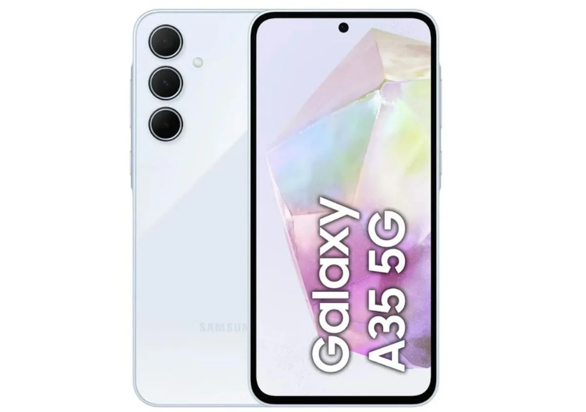
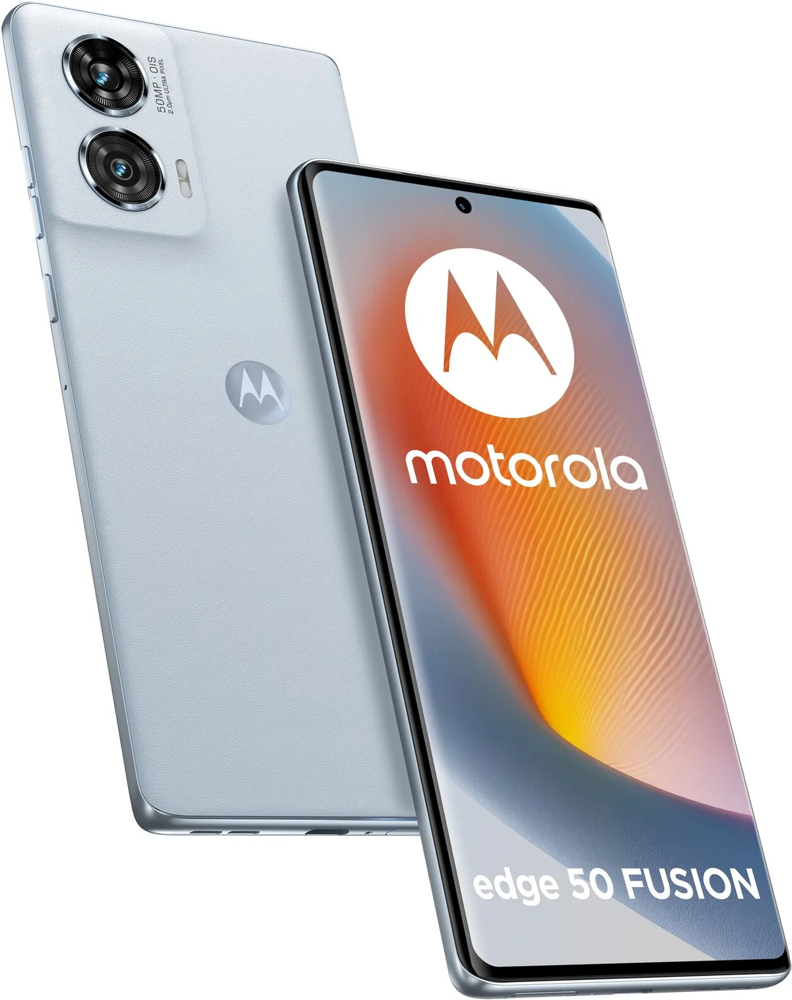

De nieuwe iPhones en Galaxy-telefoons kosten je al snel tegen de duizend euro, maar je hoeft niet zo diep in de buidel te tasten voor een nieuwe smartphone. De redactie van techsite Tweakers zet de beste modellen voor een zachte prijs op een rij.

> [!NOTE]
> Deze recensie verscheen eerder op [AD](https://www.ad.nl/tech/een-goede-smartphone-hoeft-echt-geen-1000-euro-te-kosten-deze-twee-zijn-een-goed-alternatief~ade97e93/).

Wie 300 euro te besteden heeft, kan alsnog een prima smartphone kopen. Vaak heb je dan een toestel met een mooi oledscherm, een prima camera en een chip die snel genoeg is voor alledaags gebruik. Daarbij moet je echter wel rekenen op een telefoon met vaak een plastic behuizing die niet altijd waterdicht is.

Onderstaande smartphones zijn geselecteerd door de redactie van techsite Tweakers, die het hele jaar door honderden apparaten test om de beste te selecteren. De volledige test vind je op [deze pagina](https://tweakers.net/best-buy-guide/smartphones/beste-goedkope-smartphone).

## De beste budgetsmartphone: Samsung Galaxy A35 5G

Samsung Galaxy A35. © RV

De 250 euro kostende Samsung **Galaxy A35** is een mooie middenklasser die zelfs wat lijkt op het duurdere vlaggenschipmodel dat Samsung verkoopt. De A35 heeft een waterdichte behuizing, iets dat je zelden ziet in deze prijsklasse. Daarnaast is het toestel voorzien van een oledscherm dat erg fel kan worden en met 120 beelden per seconde ververst. Dat zorgt voor vloeiende animaties.

De gebruikte processor is redelijk snel, maar niet de snelste die je voor dit bedrag kunt vinden. Ook over de camera’s zijn we te spreken: het toestel heeft onder meer een 50-megapixelhoofdcamera met optische stabilisatie. Dit zorgt voor scherpere foto’s en minder schokkerige video’s. De selfiecamera is ook van goede kwaliteit en kan zelfs 4K-video’s maken.

Ook fijn is dat Samsung dit toestel nog best lang wil ondersteunen met updates, namelijk nog tot het eerste kwartaal van 2029. Hierdoor is de smartphone bestand tegen recent ontdekte beveiligingsproblemen en hoef je hem pas jaren later te vervangen.

## Duurder alternatief: Motorola Edge 50 Fusion

Motorola Edge 50 Fusion. © RV

Met 300 euro is de **Edge 50 Fusion** van Motorola ietsje duurder. Voor dat geld krijg je een smartphone die net wat beter tegen water bestand is dan de Galaxy A35 en een scherm dat vloeiendere animaties kan tonen. Bij sommige varianten bestaat de achterkant van de smartphone uit een laag kunstleder. Achterop zit een 50-megapixelcamera van prima kwaliteit. Zowel de camera’s voor als achter zijn in staat video’s in een 4K-resolutie te filmen.

Groot voordeel van dit toestel is de software: waar andere fabrikanten Android volstoppen met onnodige extra’s, draait op de Edge 50 Fusion een vrij schone variant van het besturingssysteem. Hierdoor raakt het geheugen minder snel vol. Daarnaast heeft deze telefoon een zeer snelle processor voor zijn prijsklasse, die je niet snel elders geëvenaard ziet worden.

De softwareondersteuning is bij dit model dan wel weer iets korter dan bij Samsung. Motorola garandeert nog tot 2028 updates te bieden.

_Verantwoording_

_In deze rubriek schrijven we over technologische apparaten die door Tweakers zijn beoordeeld. Bij Tweakers wordt ieder apparaat onderzocht door het testlab op onder andere accuduur, snelheid en andere belangrijke aspecten._

_De redactie van Tweakers is volledig onafhankelijk. Bedrijven betalen op geen enkele manier om in deze artikelen behandeld te worden._

_Bekijk hieronder onze video’s op techgebied:_
