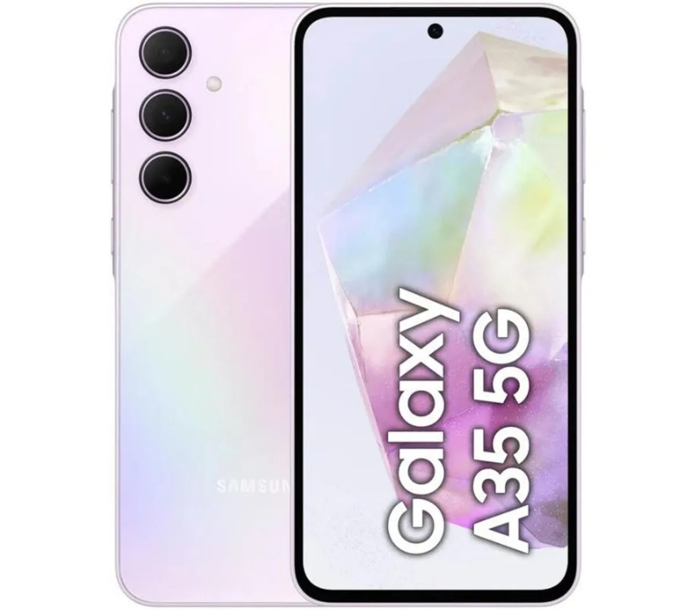
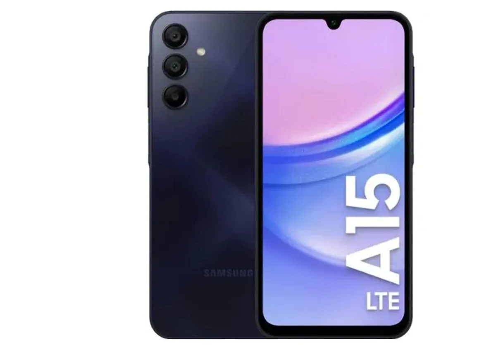
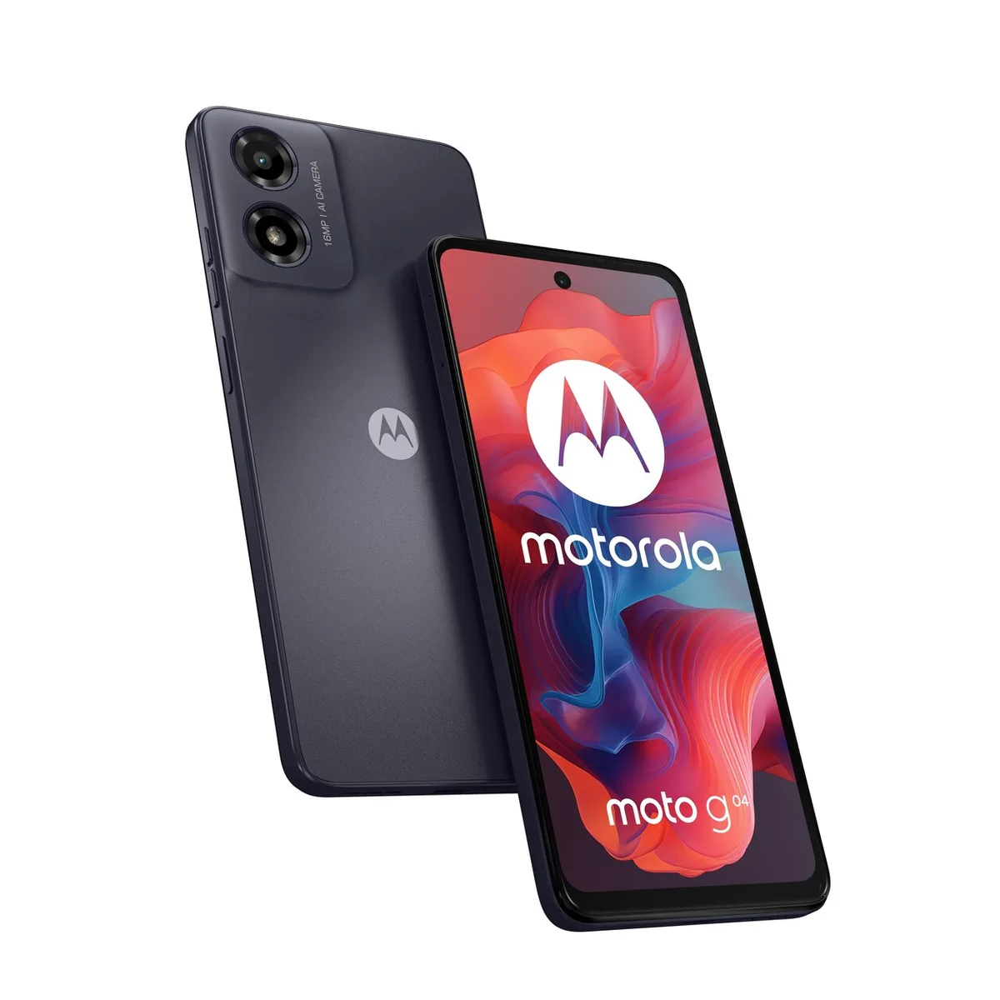

Techreuzen kondigen ieder jaar luxe nieuwe smartphones aan, waar ook flinke prijskaartjes aan kleven. Dat terwijl je voor een goede telefoon echt niet de hoofdprijs hoeft te betalen. We zetten de beste budgetmodellen van dit moment op een rij.

> [!NOTE]
> Deze recensie verscheen eerder op [AD](https://www.ad.nl/tech/een-smartphone-voor-een-prikkie-dit-zijn-de-beste-goedkope-modellen~a17958a1/).

De redactie van Tweakers heeft een aantal smartphones geselecteerd die gunstig geprijsd zijn. Tweakers test het hele jaar honderden apparaten om de beste te selecteren. De volledige test vind je op [deze pagina](https://tweakers.net/best-buy-guide/smartphones/beste-goedkope-smartphone).

## De beste koop: Samsung Galaxy A35

Samsung Galaxy A35. © RV

Bij een budget van maximaal 300 euro valt de keuze bij ons op een Samsung Galaxy A35 (verkrijgbaar vanaf 236 euro). Dat is een mooie middenklasser die zelfs een beetje lijkt op Samsungs reeks duurdere telefoons. Hij is waterdicht, een zeldzaamheid in deze prijsklasse. Daarnaast heeft hij een fel scherm met prima resolutie en hoge ververs snelheid. Het scherm wordt beschermd door extra stevig glas.

Ook is het toestel bovengemiddeld snel en voorzien van een stel goede camera’s, waarvan de hoofdcamera een resolutie van maar liefst 50 megapixel heeft. De selfiecamera kan video’s in een best hoge 4K-resolutie schieten. Ook fijn: Samsung belooft nog software-updates tot aan 2029, waardoor het toestel nog jarenlang relevant blijft.

## Goedkoper alternatief: Samsung Galaxy A15

Samsung A15. © RV

Wie hooguit 150 euro wil spenderen kan ook kiezen voor de Galaxy A15 (verkrijgbaar vanaf 138 euro). Dat is de goedkoopste telefoon die Samsung op het moment te bieden heeft. Let wel op: er zijn modellen voor 4G- en 5G-internet, dus je moet degene kopen die bij jouw gewilde internetsnelheid past. Voor 5G betaal je ietsje meer.

Het scherm is helder en ververst met negentig beeldjes per seconde en is daarmee beter dan veel andere beeldschermen in deze prijsklasse. Waterdicht is deze telefoon helaas niet, daarvoor zul je het bovenstaande, duurdere toestel moeten kopen. De camera’s zijn mooi voor zijn klasse, maar kunnen niet opwegen tegen de duurdere telefoons van dit moment.

Deze smartphone krijgt nog tot aan 2028 software-updates en zal komende jaren dus nog wel even mee gaan. Een prima deal voor zo’n lage prijs.

## Nóg goedkoper: Motorola Moto G04

Motorola Moto G04. © RV

De absolute bodemprijs in dit overzicht vind je bij de Motorola Moto G04, een smartphone die je voor minder dan 90 euro op de kop tikt. Bij zo’n lage prijs moet je niet al te hoge verwachtingen hebben, maar in zijn prijssegment is het een oké toestel.

De telefoon draait op Android 14 en zal vermoedelijk geen grote functie-updates krijgen - maar wordt tot 2026 wel voorzien van beveiligingsupdates. Met zijn vier gigabyte werkgeheugen is hij beter uitgerust dan andere toestellen voor bodemprijzen, maar onthoud dat de ingebouwde processor stokoud en traag is. Dat maakt de telefoon veel langzamer dan bovenstaande twee opties.

Waterdicht is hij niet, maar tegen een spetter of twee kan hij wel. Veel leuke extraatjes hoef je niet te verwachten, maar hij heeft wel een kaartlezer voor extra geheugen en een vingerafdrukscanner om snel te ontgrendelen. De camera achterop heeft een schamele 16 megapixel. Genoeg om snel iets vast te leggen, maar je wordt er geen Instagramster mee.

_Verantwoording_

_In deze rubriek schrijven we over technologische apparaten die door Tweakers zijn beoordeeld. Bij Tweakers wordt ieder apparaat onderzocht door het testlab, waar onder andere accuduur, snelheid en andere belangrijke aspecten worden getoetst._

_De redactie van Tweakers is volledig onafhankelijk. Bedrijven betalen op geen enkele manier om in deze artikelen behandeld te worden._
