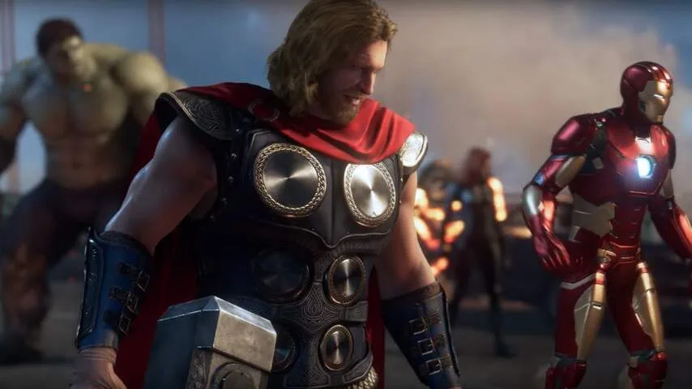

Op het eerste gezicht lijkt _Avengers_ een vrij typische actiegame. In een eerste missie die NU.nl te zien kreeg op de gamebeurs E3 speel je een voor een met de grote Marvel-helden, zoals Hulk, Iron Man en Thor, terwijl ze een aanval van een mysterieuze tegenstander proberen af te slaan.

> [!NOTE]
> Deze recensie verscheen eerder op [NU.nl](https://www.nu.nl/reviews/5936187/eerste-indruk-avengers-game-moet-jarenlang-speelbaar-blijven.html).

In de meeste gevallen vecht je met je vuisten. Je schakelt de ene na de andere horde vijanden uit, terwijl je gaandeweg energie verzamelt om speciale superaanvallen te ontketenen.

Explosies en filmpjes leiden je van scène naar scène, waardoor het lijkt alsof je een actiefilm speelt. In de missie die wij te zien kregen, was weinig diepgang te bespeuren, maar dat is ook geen wonder; we zagen slechts het begin van de game, waarin spelers de basisbeginselen nog onder de knie moeten krijgen.

Wie de Avengers vooral kent uit de films, zal wellicht raar opkijken bij deze game. De gebruikelijke acteurs zijn namelijk omgeruild voor nieuwe stemacteurs, die personages vertolken die ook net wat andere gezichten hebben. Op het acteerwerk is weinig aan te merken, maar het is duidelijk dat bijvoorbeeld acteur Nolan North een heel ander soort Iron Man neerzet dan Robert Downey jr.

De game is ook niet bedoeld als een vervolg op de films. Volgens de ontwikkelaars waren die films een op zichzelf staande reeks en laat de game nu een totaal ander soort Avengers zien.

_Avengers — Beeld: Square Enix_

## Een jarenlang speelbare game

_Avengers_ moet een dienstgerichte game worden. Het spel is ontworpen om met vrienden te spelen en krijgt de komende jaren continu updates, die spelers moeten motiveren om continu terug te blijven komen. Daarmee lijkt _Avengers_ op games als _Destiny_ en _Anthem_, die gemaakt zijn om spelers langere tijd geïnteresseerd te houden.

De demo die wij zagen, heeft echter weinig gemeen met dat soort online dienstgames. Het level voelde als een filmisch éénspeleravontuur, waarbij het perspectief continu wisselde tussen verschillende helden in andere situaties.

Volgens Scot Amos, topman van _Avengers_\-ontwikkelaar Crystal Dynamics, bestaat de game in feite uit twee segmenten. De 'ruggengraat' van het spel bevat alle belangrijke verhaalmissies, die je per se met specifieke superhelden moet uitspelen. Daarnaast zijn er de losse missies, die je coöperatief samen met vrienden kunt tackelen.

Die coöperatieve missies vormen een steeds belangrijker onderdeel van het spel naarmate je verder komt. Heb je het verhaal eenmaal uitgespeeld, dan kun je je richten op alleen deze missies om sterker te worden en je personages te verbeteren.

Je kunt de Avengers-superhelden namelijk blijven upgraden en aanpassen. Het Hulk-personage van één speler heeft bijvoorbeeld totaal andere krachten dan die van een ander. Hoe dat zich precies zal ontwikkelen, wilde Amos nog niet zeggen.

[Bekijk ingesloten media](https://content.jwplatform.com/players/y6lm6EVB-whqXCOFb.html)

## Geld verdienen met de verkoop van outfits

_Avengers_ moet in de loop der jaren updates blijven krijgen. Amos zegt dat het spel "vele jaren voorzien zal worden van nieuwe inhoud". Nieuwe superhelden en verkenbare gebieden worden gratis toegevoegd. De ontwikkelaar hoopt geld te verdienen aan de verkoop van cosmetische upgrades voor superhelden, zoals nieuwe pakjes.

Crystal Dynamics belooft een hoop met _Avengers_, maar de game moet zich nog op veel fronten bewijzen. Wat we hebben gezien, ziet er wel gelikt uit. Hopelijk zien we snel ook de diepgang die nodig is om spelers jarenlang te blijven boeien.
