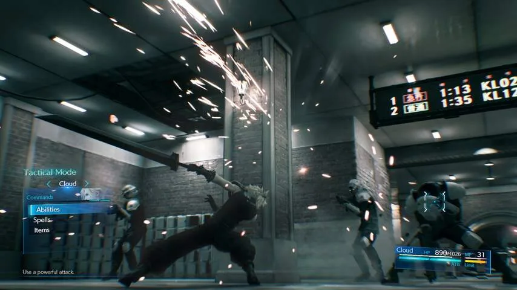
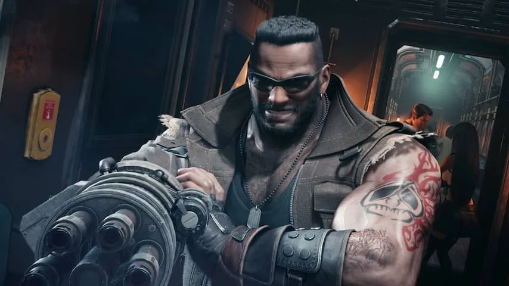

_Final Fantasy VII_ was voor veel gamers het eerste 3D-rollenspel dat ze speelden. De ontwikkelaar had zijn gepixeleerde spelfiguren omgeruild voor driedimensionale modellen, waarmee meteen ook een filmischer verhaal werd verteld.

> [!NOTE]
> Deze recensie verscheen eerder op [NU.nl](https://www.nu.nl/reviews/5957485/eerste-indruk-final-fantasy-vii-remake-voelt-heel-anders-dan-origineel.html).

Het maakte _Final Fantasy VII_ een van de meest indrukwekkende games in 1997, toen cinematische, meeslepende 3D-games nog niet zo vanzelfsprekend waren. De Japanse ontwikkelaar zag dat ook en maakte meerdere spin-offs en zelfs films om het speluniversum verder uit te bouwen.

Nu probeert de studio het originele spel opnieuw te ontwikkelen. Een ambitieus project, waarbij het origineel wordt opgesplitst in meerdere delen, die als losse games worden uitgebracht. Volgens Square Enix zal ieder deel een uitgebreider verhaal krijgen, waardoor ze genoeg inhoud bevatten als losse game.

Het eerste deel heet _Final Fantasy VII Remake_, dat zich volledig richt op de gebeurtenissen in de stad Midgar. Deze stad is in de greep van het bedrijf Shinra, dat met zijn reactoren de levensenergie van de aarde opzuigt.

[Bekijk ingesloten media](https://content.jwplatform.com/players/TwTYhIkY-whqXCOFb.html)

## Rebellenaanslag op een reactor

In een korte demo op gamebeurs E3 speelden we het begin van de game. Hoofdpersoon Cloud is als huurling ingezet door de rebellenorganisatie AVALANCHE, die op weg is om een reactor van Shinra op te blazen. Met zulke aanslagen hopen de rebellen de planeet te redden.

Het originele _Final Fantasy VII_ was een traditioneel Japans rollenspel. Tijdens je wandeltochten door de spelwereld werd je af en toe naar een ander speelscherm getransporteerd, om in beurtelingse gevechten vijanden uit te schakelen.

In de remake is daar weinig van over. Het beurtelingse gevechtssysteem is omgewisseld voor een actiegerichter alternatief, waarbij je op vijanden inhakt door op knoppen te drukken. Hierdoor lijkt _Final Fantasy VII_ ineens verrassend veel op games zoals _God of War_.

Je vecht nu ook in dezelfde wereld die je verkent, waardoor je niet steeds naar andere schermen wordt getransporteerd zoals in het origineel. Dat zorgt ervoor dat de game een fijn hoog tempo heeft. Tijdens het spelen wordt subtiel gewisseld naar speciale gevechtsmuziek.

_Final Fantasy VII Remake — Beeld: Square Enix_

## Balkjes vullen voor speciale aanvallen

Systemen van de oude game zijn op slimme wijze geïntegreerd in het nieuwe gevechtssysteem. Door op vijanden in te hakken, vullen balken onder in het scherm sneller. Het was essentieel om laadbalken te vullen voor speciale aanvallen, waardoor de game toch een beetje aanvoelde als het origineel, waarin je ook moest wachten tot je bepaalde vaardigheden mocht gebruiken.

Vroege gevechten in de game voelden vrij simpel. Door alleen op de aanvalsknop te drukken was het mogelijk om de meeste tegenstanders uit te schakelen.

Pas bij het baasgevecht tegen een grote robotspin aan het einde van de demo, voelden we ons gedwongen het spel vaker te pauzeren om speciale vaardigheden te gebruiken om bijvoorbeeld te genezen.

In die situaties voelde _Final Fantasy VII_ als een hectisch strategiespel, dat verrassend vergelijkbaar met het origineel aanvoelde. Het vullen van balken voor speciale aanvallen was van essentieel belang - waardoor het tussendoor hakken voelde als het wachten op een beurt in de oude games.

_Final Fantasy VII Remake — Beeld: Square Enix_

## Personage klinkt als overdreven versie van B.A. Baracus

De personages in _Final Fantasy VII Remake_ hebben nu stemmen. Hierdoor voelen ze menselijker en karaktervoller dan de helden uit het origineel, maar niet ieder spelfiguur komt goed uit de verf. Het speelbare personage Barret, een grote man met een machinegeweer aan zijn arm, klinkt bijvoorbeeld als een overdreven versie van B.A. Baracus uit _The A-Team_.

De spelwereld is prachtig in beeld gebracht, maar bevat nog wat kleine knulligheden. Het haar van hoofdrolspeler Cloud is bijvoorbeeld zo gedetailleerd, dat er op onze televisie een raar soort textuur overheen werd getoond. Het lijkt hierdoor alsof er een bewegend bijennest op zijn hoofd zit. Hopelijk wordt dit aangepast in de uiteindelijke versie van de game.

Het is nog de vraag of het verhaal in Midgar, dat een vrij klein deel van het originele spel is, genoeg bevat om een geheel spel van tientallen uren interessant te houden. Square Enix heeft goede hoop: dit eerste deel wordt op maar liefst twee Blu-ray-discs geleverd.

We weten in elk geval dat het gevechtssysteem solide aanvoelt en bij baasgevechten zelfs een strategische onderlaag met zich meebrengt. Daarnaast zit een groot deel van het originele team ook op dit spel. Dat biedt goede hoop voor deze remake.

Final Fantasy VII Remake verschijnt op 3 maart 2020 voor PlayStation 4.
