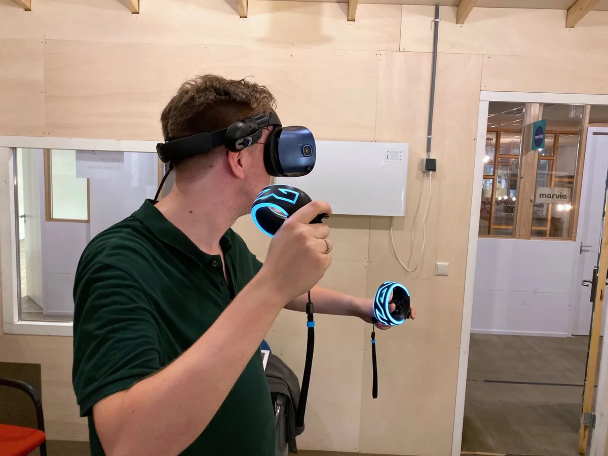

**Hands-on met VR**

> [!NOTE]
> Deze recensie verscheen eerder op [Bright](https://www.bright.nl/nieuws/1123941/eerste-indruk-htc-vive-cosmos-een-tamme-upgrade.html).

De eerste [HTC Vive](https://youtu.be/Dx79JUQ9N4Y) heeft virtual reality mede op de kaart gezet. Het was samen met de [Oculus Rift](https://www.youtube.com/watch?v=EG40N-EsLLk) één van de eerste 'echte' VR-brillen, die de positie van je hoofd en handen in een kamer nauwlettend kan doorgeven aan grootse, indrukwekkende games.

Sindsdien heeft HTC meerdere variaties uitgebracht, zoals de [Vive Pro](https://www.bright.nl/nieuws/artikel/4543816/nieuwe-vr-bril-htc-vive-trackt-waar-je-naar-kijkt) voor de zakelijke markt. De Vive Cosmos is de eerste volwaardige opvolger voor gamers. Deze nieuwe bril bevat een beter scherm en vereist niet langer dat je sensoren in hoeken van je kamer neerzet.

## Buitengewoon scherp

Dat nieuwe scherm is buitengewoon scherp. Voor ieder oog hangt een beeldscherm met een resolutie van 1440 bij 1700 pixels, wat scherper is dan bij concurrenten zoals de [Oculus Rift S](https://www.bright.nl/nieuws/artikel/4649086/oculus-kondigt-nieuwe-vr-bril-rift-s-aan) en de [Valve Index](https://www.bright.nl/nieuws/artikel/4695931/valve-maakt-prijs-vr-bril-bekend). Dat merk je vooral bij het lezen van teksten in VR: die zijn ineens ook goed te bekijken als je verder weg staat.

Je ziet bij het gebruik van de bril wel nog steeds een soort hordeureffect. Omdat je zo dicht op het scherm zit, is de kleine ruimte tussen de pixels zichtbaar. Gelukkig valt dat alleen op als er actief naar op zoek gaat en valt niet meer op zodra je begint met gamen. Door de overstap van OLED naar LCD zijn kleuren wel iets minder sprankelend - volgens HTC een noodzaak om de hogere scherpte te kunnen bieden.

Hoewel het scherm indrukwekkend is, loopt de Vive Cosmos niet voor op alle concurrentie. HP onthulde eerder dit jaar een virtualrealitybril met een resolutie van 2160 bij 2160 pixels per oog, terwijl de Pimax 4K en 8K op nog hogere resoluties mikken. Die laatste twee vereisen echter een buitengewoon krachtige pc en zijn daarmee vooral bedoeld voor de zakelijke markt.

[Bekijk ingesloten media](https://www.youtube.com/embed/56dyCNgqaok?autoplay=1&modestbranding=1)

## Trailer: Vive Cosmos

## Nieuwe sensoren

De Vive Cosmos volgt het voorbeeld van andere recente virtualrealitybrillen door te kiezen voor 'inside-out tracking'. De sensoren die de positie van je hoofd en handen volgen staan niet langer in hoeken van de kamer, maar zitten in de bril zelf. Hierdoor hoef je niet langer een wirwar aan kabels door je kamer te trekken.

De vijf camera's voorop de bril zien waar jij je bevindt ten opzichte van de kamer. Door vooraf in te stellen waar de hoeken van je speelveld zijn, krijg je een virtueel grid te zien als je dreigt tegen een muur op te botsen. Dat werkt precies zoals bij de oude trackingmethode van de Vive: we konden vrij door de kamer bewegen en zijn geen enkele keer per ongeluk ergens tegenop gebotst.

De nieuwe trackingmethode zorgt er wel voor dat de bijgeleverde gamecontrollers minder goed gevolgd kunnen worden. Houd je handen vlak voor je gezicht en de bril raakt ze kwijt, simpelweg omdat de camera ze niet van zo dichtbij kan bekijken. Hetzelfde gebeurt als je een hand achter je rug houdt. Alle camera's zitten voorop, waardoor de Cosmos niet ziet wat er achter je gebeurt. Een probleem waar de Microsoft Mixed Reality-brillen en de Oculus Rift S ook last van hebben.

Bovenstaande beperkingen zorgen in de praktijk gelukkig niet voor veel problemen, omdat games ontworpen zijn om je nooit te vragen zulke dingen met je handen te doen. Vind je het toch een pijnpunt, dan kun je het frontje van je Cosmos omwisselen met eentje die werkt met de oude VR-sensoren van de Vive - maar dan moet je die wel kopen en in je kamer neerzetten, of nog in huis hebben van je oude Vive.

## Vive Touch

De oude toverstokcontrollers van de Vive zijn vervangen met een alternatief dat er verdacht bekend uitziet. Laten we bot zijn: dit zijn regelrechte kopieën van de [Touch-controllers](https://www.bright.nl/nieuws/artikel/4431076/oculus-quest-vr-virtual-reality-rift-go) die Oculus inmiddels al een tijdje verkoopt.

De controllers voelen als twee helften van een ouderwetse gamepad, met op iedere helft een analoge stick en twee knoppen. Aan de achterkant zitten twee trekkers en een gripknop bij je middelvinger. Daarmee kun je bijvoorbeeld een pistool uit zijn holster pakken, waarna je met de trekkers schiet.

Bovenop de controller zit een grote ring met een lichtstreep. Deze streep wordt door de camera's op de bril gevolgd om de positie van je handen ten opzichte van je hoofd te volgen. Dat doen de Oculus Touch-controllers ook, maar met infraroodlicht dat je niet met het blote oog ziet. De controllers van de Cosmos hebben een fel pulserende lichtstreep, in een motief vergelijkbaar met de ontwerpen van hardcore gamingmuizen en -toetsenborden. Je moet er maar net van houden.

De verschillen zitten in de details. De Cosmos-controllers hebben bijvoorbeeld twee trekkers per controller, terwijl die van [Oculus](https://www.bright.nl/nieuws/artikel/4719576/redding-van-vr-headset-oculus-quest-nu-te-koop) er eentje heeft. Maar Oculus heeft de gehele bovenkant capacitief gemaakt, waardoor de gamepads weten wanneer je vingers op de knoppen rusten - om te zien of je bijvoorbeeld een duim omhoog steekt. Dat kan niet bij de HTC-kloon.

Misschien wel het grootste verschil zit in het gewicht. De controllers van de Cosmos voelen zwaar en lomp aan, vermoedelijk omdat er dubbel zoveel batterijen in zitten. Je hebt hierdoor continu het gevoel iets vast te hebben, terwijl de Oculus Touch-controllers na een tijdje als een verlengde van je handen gaan voelen. Jammer, want hierdoor weten de Cosmos-controllers zijn concurrent net niet te evenaren.

## Modulair

Er zijn nog wel een paar kleine punten waarop de Cosmos zich hoopt te onderscheiden. De bril is volgens HTC bijvoorbeeld volledig modulair: aan de binnenkant zit een usb-c-poort verborgen waar accessoiremakers apparaten voor kunnen maken.

We hadden het er eerder al over dat je het frontje van de bril kunt omwisselen. Je kan de Vive Cosmos hierdoor laten werken met de trackingapparatuur van eerdere Vive-brillen, maar op termijn zouden bedrijven ook andere alternatieven kunnen bedenken. Dat klinkt op papier allemaal indrukwekkend, maar bij navraag wilde HTC ons niet vertellen wat voor nieuwe, modulaire apparaten er allemaal voor de Cosmos gemaakt gaan worden. Die modulaire belofte moet zich dus nog bewijzen.

## Een beetje laf

De Vive Cosmos zal door alleen al zijn hogere resolutie al interessant zijn voor sommige gamers. Maar verder voelt dit aan als een wat tamme upgrade voor de Vive. Vergelijk bovenstaande vernieuwingen maar eens met de concurrentie: HTC's oud-zakenpartner Valve maakt nu de Index, een bril van ruim duizend euro vol met experimentele snufjes. En Facebook pompt miljoenen euro's in [Oculus](https://www.bright.nl/nieuws/artikel/4719576/redding-van-vr-headset-oculus-quest-nu-te-koop), dat meerdere brillen voor haast de helft van de Cosmos zijn prijs verkoopt.

Dan voelt de nieuwe Cosmos, die naast zijn hogere resolutie niet echt iets vernieuwends te bieden heeft, toch een beetje als een laffe upgrade. En dat is toch jammer voor één van de grondleggers van het moderne virtual reality.

_De Vive Cosmos wordt vanaf 3 oktober verkocht voor 799 euro._

[Bekijk ingesloten media](https://www.youtube.com/embed/s5vAMhJsPfc?autoplay=1&modestbranding=1)

## Is deze bril de redding van VR?

**[Volg Bright op YouTube](https://bit.ly/brighttv) voor meer tech-video's**
