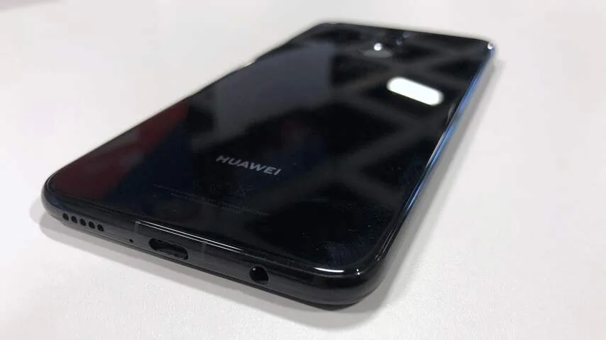
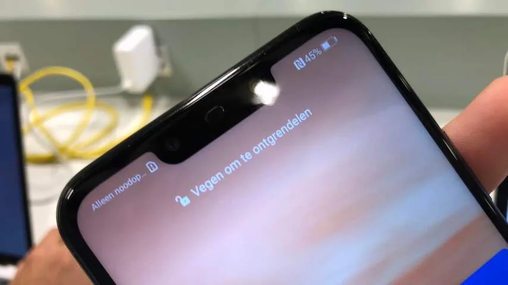
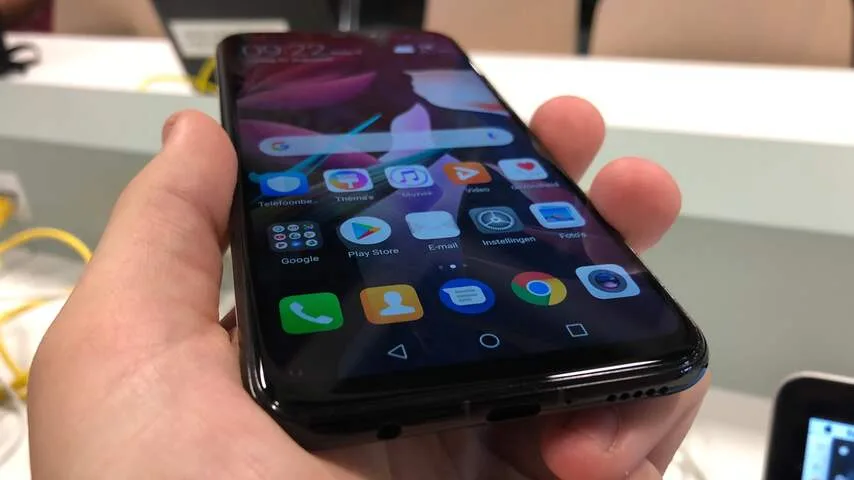
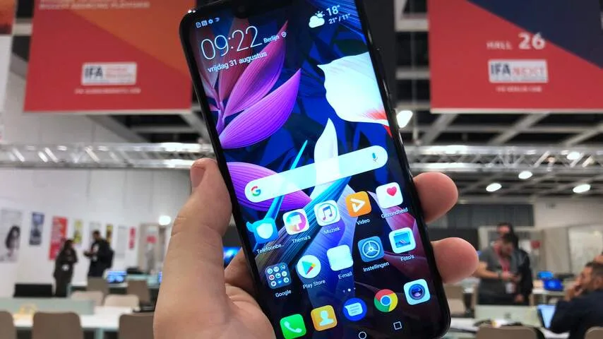

De Mate 20 Lite ziet er uit als menig andere smartphone. De achterkant is glad en glanzend, met camera's en een vingerafdrukscanner. De voorkant heeft een groot scherm, dat alleen wordt onderbroken aan de bovenkant met een inkeping. Daarin zitten de camera en andere sensoren. Het is wel jammer dat de onderkant van het scherm nog een kleine 'kin' heeft, waar de rand iets dikker is dan aan de andere zijden.

> [!NOTE]
> Deze recensie verscheen eerder op [NU.nl](https://www.nu.nl/reviews/5440601/eerste-indruk-huawei-mate-20-lite-is-een-nieuwe-telefoon-die-al-bestond.html).

Het toestel ligt op zich prima in de hand, maar is wel wat glad en vingerafdrukgevoelig. Hij onderscheidt zich daarnaast niet bepaald van zijn concurrentie: eigenlijk aapt Huawei hier zo'n beetje iedere andere smartphone van het moment na. Ook concurrenten zitten immers vol in op het gladde, glanzende ontwerp.

De telefoon draait op Android 8.1, met daarbovenop de EMUI-skin van Huawei. Hierbij staan appiconen prominenter in beeld dan bij andere Android-skins, waardoor de interface meer lijkt op die van bijvoorbeeld de iPhone.

Huawei heeft in de Mate 20 Lite de zelfgemaakte Kirin 710-chip gestopt, die over het algemeen sneller is dan de processor van de P20 Lite die het bedrijf eerder dit jaar op de markt bracht. Het is wat je ongeveer kunt verwachten voor een telefoon in dit prijssegment. Hij wordt immers verkocht voor 399 euro.

_Huawei Mate 20 Lite — Beeld: NU.nl/Bastiaan Vroegop_

_Huawei Mate 20 Lite — Beeld: NU.nl/Bastiaan Vroegop_

_Huawei Mate 20 Lite — Beeld: NU.nl/Bastiaan Vroegop_

_Huawei Mate 20 Lite — Beeld: NU.nl/Bastiaan Vroegop_

## De Mate 20 Lite bestaat al in een andere vorm

Er is echter één groot kritiekpunt dat centraal staat in de Mate 20 Lite. De telefoon lijkt qua specificaties verdacht veel op de P Smart+, die de telefoonmaker eerder deze maand op de markt bracht. Het toestel heeft dezelfde Kirin 710-chip, draait ook op 4GB werkgeheugen en biedt net als zijn iets oudere broer 64GB opslag.

De verschillen zitten in de kleinste details. Een van de camera's achter op de telefoon heeft een resolutie van 20 megapixel, terwijl zijn voorloper 16 megapixel tot zijn beschikking had. Een kleine upgrade, maar we zagen het verschil amper toen we de telefoon uitprobeerden.

De accu is met 3.750mAh iets groter, maar het verschil is vrij klein vergeleken met de oudere 3.340mAh. We hebben geen duurtest kunnen uitvoeren, maar vermoeden dat dit je maximaal een half uur meer gebruikstijd zal opleveren.

En dan is er de prijs van 399 euro. Daarmee is de telefoon duurder dan de P Smart+, maar met een verschil van 50 euro is dat een kleine nuance.

Het is een wat kwalijke ontwikkeling binnen Huawei: het bedrijf wil smartphones maken die slechts een héél klein beetje van elkaar afwijken. Bij alleen de Mate 20 Lite en P Smart+ is dat geen ramp, maar als deze lijn doorzet moeten kopers straks kiezen tussen gigantisch veel toestellen waarbij het verschil niet voor iedereen duidelijk zal zijn. We zien Huawei bij nieuwe telefoons liever grote stappen maken, zodat er een duidelijke reden is om te upgraden van het ene toestel naar het ander.

## Voorlopige conclusie

De gelijkwaardige specificaties zouden te excuseren zijn als de Mate 20 Lite zich op een punt wist te onderscheiden, maar de telefoon is verder een vrij standaard smartphone. De specificaties schieten niet met kop en schouders boven de concurrenten binnen dit prijssegment, en het scherm met inkeping lijkt op dat in zo'n beetje iedere smartphone van dit moment.

De Mate 20 Lite voelt vooral lui. Het is een smartphone die in iets andere vorm al is uitgebracht, die nu nog eens snel is herzien om hem op gadgetbeurs IFA te kunnen tonen. Het is te hopen dat de 'echte' Mate 20-telefoons die later dit jaar worden aangekondigd serieuzere stappen maken.
