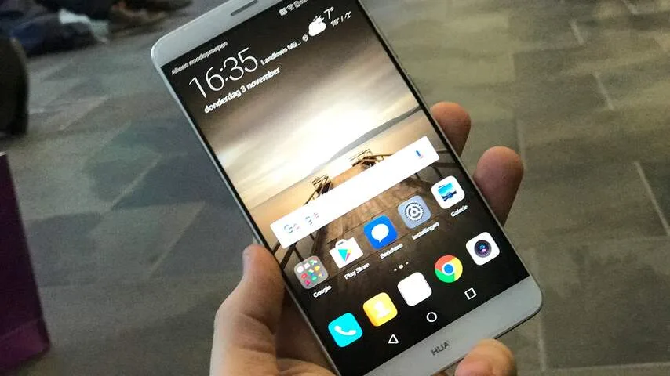
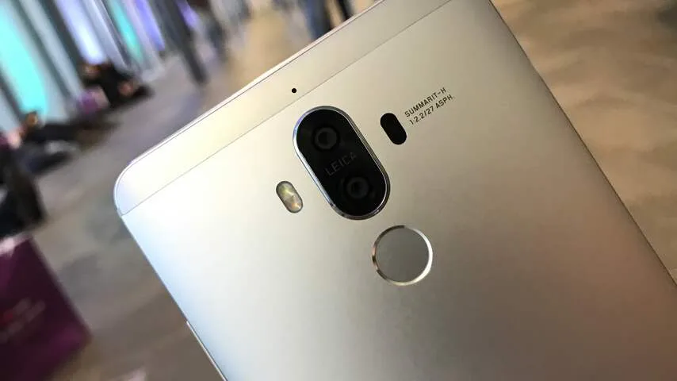

Het is tegenwoordig soms lastig om de unieke facetten van een smartphone te onderscheiden. Fabrikanten beloven snellere processoren, maar dure toestellen zijn doorgaans snel genoeg om daar bij gewoon gebruik veel van te merken.

> [!NOTE]
> Deze recensie verscheen eerder op [NU.nl](https://www.nu.nl/mobiel/4345588/eerste-indruk-huawei-mate-9-is-vooral-een-technische-verbetering.html).

[Bekijk ingesloten media](https://content.jwplatform.com/players/Vs4mHCg8-whqXCOFb.html)

Zo ook bij de nieuwste van Huawei: toen we de Mate 9 gebruikten, merkten we weinig van haperingen of langzame software. Apps wisten binnen een seconde te starten, waardoor we zelden op een scherm hoefden te wachten.

Dat lijkt echter een luxekwestie, gezien veel moderne smartphones binnen het budget van de Mate 9 (699 euro) amper laadtijden of haperingen hebben. Het toestel werkt vooral naar verwachting.

## Software

De Mate 9 lijkt zich voornamelijk te onderscheiden door zijn software. De Android-skin EMUI heeft een grote 5.0-update op het toestel gekregen, waarbij het design licht is aangepast en functies makkelijker bereikbaar moeten zijn.

Volgens Huawei is 90 procent van de opties binnen drie schermtikken te bereiken. Bij het gebruik van de telefoon, zien we dat vooral terug in de instellingen. Bij veel opties staat bovenin een tandwiel of onderin een rij iconen, waarmee je de wat obscuurdere instellingen kunt aanpassen.

Hoewel de fabrikant spreekt over een designvernieuwing, voelen de veranderingen op dit gebied wat conservatief. De telefoon heeft wat rondere iconen en meer witte interfaceschermen, maar de basis is hetzelfde. We hadden niet het gevoel naar een totaal andere interface te kijken ten opzichte van de vorige editie.

_Huawei Mate 9 — Beeld: NU.nl_

EMUI lijkt ook nog verdacht veel op Apple’s iOS. Het iconenscherm is voor een deel gelijk, waardoor bijvoorbeeld mappen er precies uitzien als op een iPhone. Het notificatiescherm voelt wel uitgebreider en beter ingestoken, waardoor veel snelle knoppen makkelijk bereikbaar zijn.

Huawei belooft dat het toestel door een slim algoritme langer snel blijft, door veelgebruikte apps prioriteit te geven. Een mooie belofte, die bij onze hands-on helaas lastig te testen is. De smartphone leert immers pas op termijn welke apps het vaakst worden gestart.

## Camera

De Mate 9 heeft net als de P9 twee cameralenzen achterop, die samen een enkele foto van hoge kwaliteit maken. Betere sensoren moeten de camera beter maken, maar bij onze eerste korte tests lijken de verschillen niet gigantisch groot.

Fanatieke fotografen hebben vanuit de ingebouwde app toegang tot veel geavanceerde opties, om bijvoorbeeld de sluitertijd, het diafragma en de ISO-waarde aan te passen. Het zijn functies die sommige apps van derden ook aanbieden, maar Huawei richt zich duidelijk op de wat fanatiekere fotograaf door dit standaard aan te bieden.

Het verschil met de camera’s in de P9 lijkt niet bijster groot, maar vergeleken met oudere toestellen is het verschil indrukwekkend. Het vrij grote diafragma zorgt ervoor dat foto’s met kleine scherptediepte gemaakt kunnen worden. Het zorgt voor een indrukwekkend effect in portretfoto’s, dat achteraf softwarematig nog verder versterkt kan worden.

_Huawei Mate 9 — Beeld: NU.nl_

## Batterij

Eén onderdeel waar Huawei bij de presentatie veel nadruk op legde was de batterij. De 4.000mAh-accu moet het lang volhouden, terwijl toevoeging van SuperCharge ervoor zorgt dat de batterij snel wordt opgeladen.

In 20 minuten heeft de telefoon 40% van zijn accu terug, of in 90 minuten de volledige 100 procent. Hoe dat in de praktijk is, moeten we echter nog zien. We hebben het toestel nog maar korte periode kunnen testen, wat batterijtests nagenoeg onmogelijk maakt.

## Voorlopige conclusie

De Mate 9 belooft sneller te zijn dan voorgaande toestellen, en we zien tot nu toe weinig reden om daaraan te twijfelen. Bij onze eerste impressie van het toestel, lijkt er echter een kenmerkende factor te ontbreken.

De dubbele camera is bijzonder, maar zat eigenlijk al in de P9 die dit voorjaar werd aangekondigd. De beloofde snelheidsverbeteringen vanuit de software zijn veelbelovend, maar kunnen zich pas na veelvuldig testen kenmerken.

De Mate 9 is een fraai afgewerkt toestel, maar mist op het moment nog wat karakter. Wellicht dat de verfijndere nuances duidelijker worden bij een langere testperiode.
