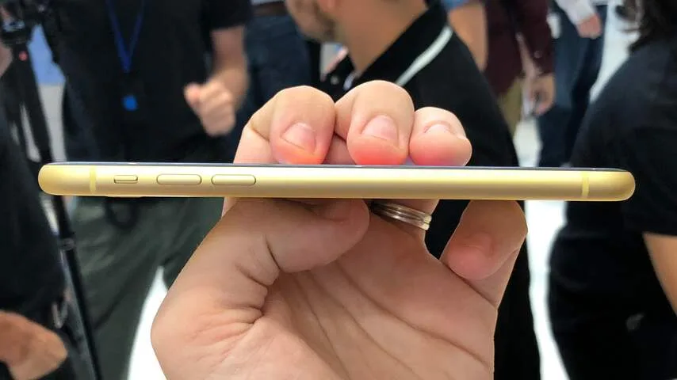
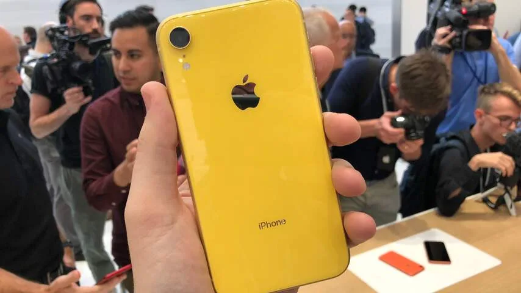
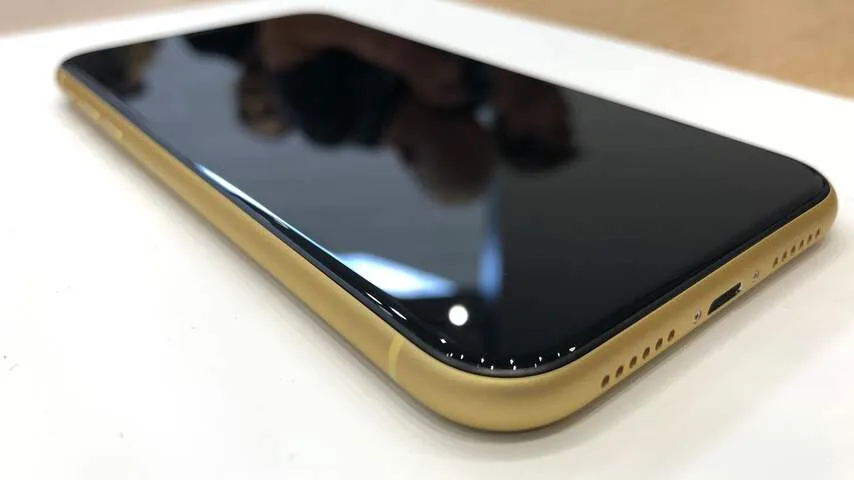
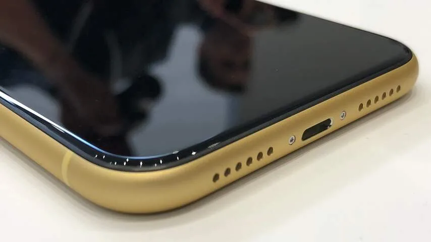
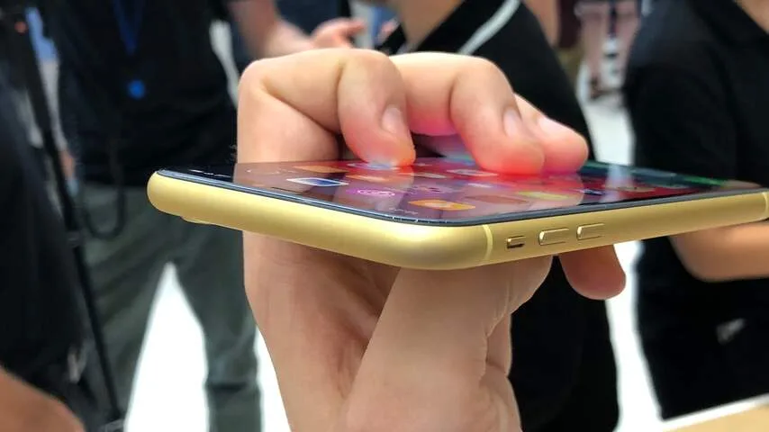
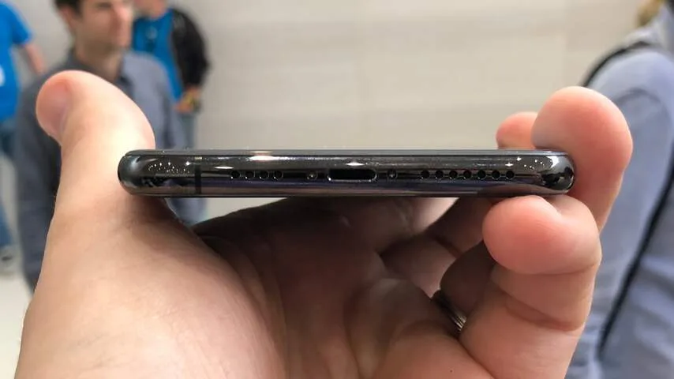
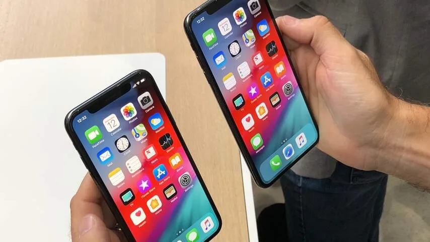
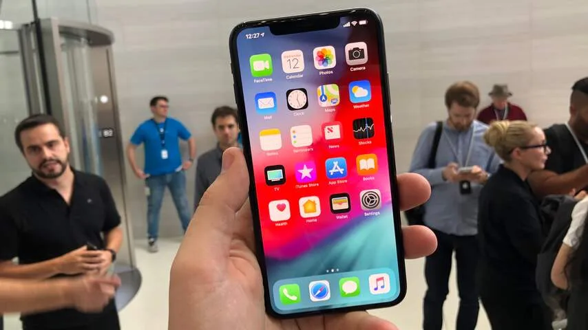
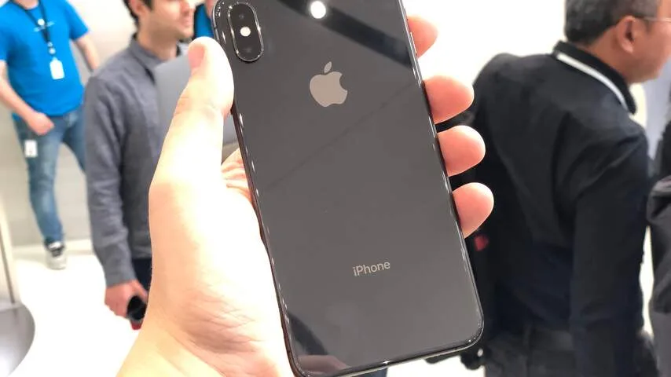

Tijdens een evenement op het hoofdkantoor van Apple konden we de iPhone XS, de XS Max en de XR alvast testen. De drie telefoons zien er aan de voorkant eigenlijk grotendeels hetzelfde uit.

> [!NOTE]
> Deze recensie verscheen eerder op [NU.nl](https://www.nu.nl/reviews/5459636/eerste-indruk-opvolgers-van-iphone-x-zijn-niet-heel-spannend.html).

Het scherm dekt haast het volledige toestel, met alleen aan de bovenkant een inkeping voor gezichtsherkenning. Bij de iPhone XS is het scherm 5,8 inch groot, net als bij de vorig jaar verschenen iPhone X. De XS Max heeft een scherm van maar liefst 6,5 inch. De XR zit daar tussenin met 6,1 inch.

Bij onze tests voelde die 6,1 inch als de '_sweet spot_'. De 6,5 inch van de XS Max was daarentegen wat log bij onze vroege tests. Het toestel is even groot als de iPhone 8 Plus van vorig jaar, maar omdat het scherm de volledige voorkant dekt, kun je een groot deel van de bovenkant moeilijk met je duim bereiken.

Het is wel jammer dat de iPhone XR geen ondersteuning voor 3D Touch heeft, waardoor je niet langer 'hard' op het scherm kunt drukken om bijvoorbeeld de camera op het beginscherm te openen. In plaats daarvan moet je het scherm lange tijd ingedrukt houden.

[Bekijk ingesloten media](https://content.jwplatform.com/players/pMlMFyJP-whqXCOFb.html)

## Andere kleuren en materialen

Wie goed kijkt, zal meer verschillen tussen de telefoons zien. De inkeping en randen van de goedkopere iPhone XR zijn iets groter, terwijl de iPhone XS en XS Max zijn voorzien van een mooier oledscherm. Het LCD-scherm van de XR zag er bij onze tests op zich prima uit, maar het kwaliteitsverschil was wel duidelijk. Zwarte vlakken waren op de XS heel donker, terwijl ze op de XR toch wat grijzig leken.

De zijkanten van de iPhone XS en XS Max bestaan uit roestvrij staal, terwijl de XR het met aluminium moet doen. Dat staal oogt hoogwaardiger, maar lijkt ook iets gevoeliger voor vlekken. Het matte aluminium van de goedkopere telefoon is daarentegen een stuk neutraler en wordt minder snel vies.

En dan is er de achterkant, die het meeste afwijkt van de XS-modellen. Apple heeft bij de XS gekozen voor de traditionele kleuren grijs, zilver en goud, maar biedt bij de XR een zestal kleuren, waaronder rood, geel en blauw. Dat deed Apple bij de iPhone 5C ook, maar ditmaal hebben de gekleurde toestellen een hoogwaardige glazen achterkant. Hierdoor voelen ze minder goedkoop dan die eerdere gekleurde telefoons.

_iPhone XR — Beeld: NU.nl/Bastiaan Vroegop_

_iPhone XR — Beeld: NU.nl/Bastiaan Vroegop_

_iPhone XR — Beeld: NU.nl/Bastiaan Vroegop_

_iPhone XR — Beeld: NU.nl/Bastiaan Vroegop_

_iPhone XR — Beeld: NU.nl/Bastiaan Vroegop_

## Iets sneller en gelikter

In gebruik is er vrijwel niets veranderd vergeleken met de iPhone X van vorig jaar. De telefoons hebben betere processoren waardoor apps sneller moeten opstarten, maar in de praktijk is dat geen grote winst; de iPhone X van vorig jaar voelde al razendsnel, en we hadden niet het idee dat de XS en XR heel veel rapper waren.

Apple zegt dat de processor beter met kunstmatige intelligentie kan omgaan, maar die snelheidsverbetering is lastig te testen. Dat zal waarschijnlijk pas blijken zodra meer apps hier efficiënt gebruik van maken. Momenteel wordt kunstmatige intelligentie gebruikt om te voorspellen wat je precies wil doen, zodat foto's bijvoorbeeld verbeterd worden of Siri suggesties kan sturen. Dat is alleen een wat onzichtbaar proces.

Gezichtsherkenning op de iPhone XS is volgens Apple veel sneller geworden, maar juist die functie mochten we tijdens onze probeersessie niet testen. We weten daarom niet of dat een echt wezenlijk verschil maakt. Bij de iPhone X moet je vaak een halve seconde wachten totdat de telefoon ontgrendeld is, en we hopen dat die wachttijd op de XS verdwenen is.

## Accu houdt het wat langer vol

En dan zijn er de accu's, die volgens Apple iets langer mee kunnen. De XS houdt het een half uur langer vol dan de X, terwijl de XS Max het maar liefst anderhalf uur extra volhoudt. De XR zou anderhalf uur langer gebruikt kunnen worden dan de iPhone 8 Plus van vorig jaar.

Maar ook hierbij geldt: we hebben die gebruiksduur niet kunnen testen, omdat we de iPhones slechts korte tijd in onze handen konden houden.

We hebben de camera's korte tijd kunnen uitproberen, al was dat onder vrij algemene lichtomstandigheden. De resultaten van deze tests waren prima. De iPhones schieten alle drie prima foto's, en zelfs de iPhone XR kan met zijn enkele lens portretfoto's met scherptediepte maken. Voor het eerst kan de intensiteit van die diepte worden aangepast bij de nabewerking.

## In de details

Dat zijn details die de iPhones niet écht weten te onderscheiden. Heb je een 5,8-inchversie van de iPhone XS, dan zou je zelfs zomaar kunnen denken dat je de oudere iPhone X in handen hebt.

Het voelt wat raar na vorig jaar, toen Apple met de iPhone X een gigantische stap ten opzichte van zijn voorgangers zette. Toen stapte het bedrijf over op gezichtsherkenning en het toesteldekkende scherm dat we nu weer terugzien. De XS en XR zijn vooral ietsje sneller - en met grotere of uitgeklede schermopties.

_iPhone XS — Beeld: NU.nl/Bastiaan Vroegop_

_iPhone XS — Beeld: NU.nl/Bastiaan Vroegop_

_iPhone XS — Beeld: NU.nl/Bastiaan Vroegop_

_iPhone XS — Beeld: NU.nl/Bastiaan Vroegop_

## Goedkopere iPhone, maar toch iets duurder

Er is echter één punt waarop de iPhones wel interessante stappen zetten: de prijs. Toen de iPhone X vorig jaar aangekondigd werd, kostte de telefoon maar liefst 1.159 euro. Met de goedkopere iPhone XR wordt de prijs van veel functies die vorig jaar gepresenteerd werden significant naar beneden gehaald. Die telefoon wordt namelijk vanaf 859 euro aangeboden.

Het is zeker geen race naar de bodem te noemen. De prijs van de goedkoopste iPhone ligt alsnog vrij hoog vergeleken met Android-concurrenten en hij is ook iets duurder dan de iPhone 8 van vorig jaar, die voor 809 euro geïntroduceerd werd.

Maar de exclusiviteit van gezichtsherkenning en een dekkend scherm begint bij de iPhone wel te verdwijnen, waardoor meer mensen zich deze technologieën kunnen veroorloven. De meeste kopers zullen vermoedelijk genoeg hebben aan een telefoon zonder de pro-functies van de XS.

## Voorlopige conclusie

Apple probeert hier het wiel niet opnieuw uit te vinden. De iPhone XS, XS Max en XR zijn kleine stappen ten opzichte van de X vorig jaar, vooral bedoeld om de toen grote vernieuwingen tegen een lager bedrag te verkopen. Dat is commercieel een belangrijke stap voor het bedrijf, en anno 2018 zijn deze iPhones alsnog prima toestellen. Maar het zijn niet de spannendste innovaties, wat dit slechts een klein stapje voor de iPhone maakt.
