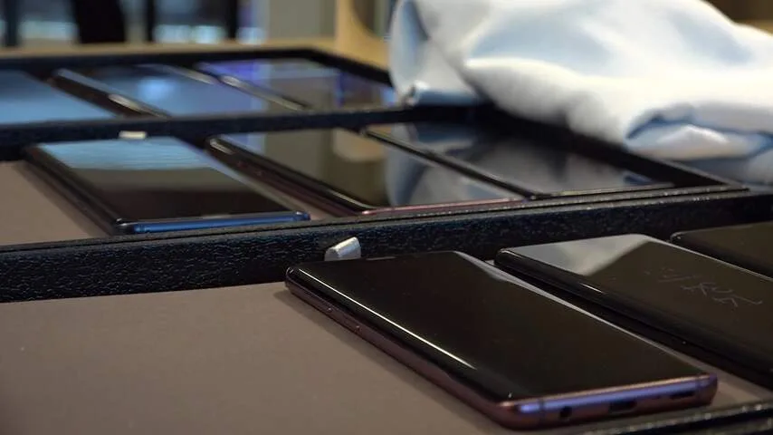
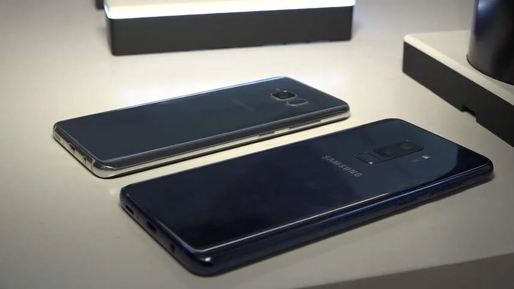
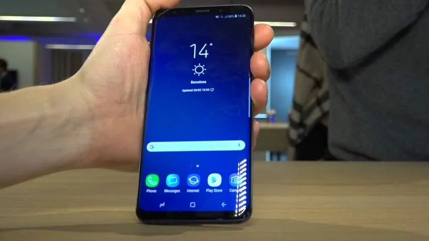
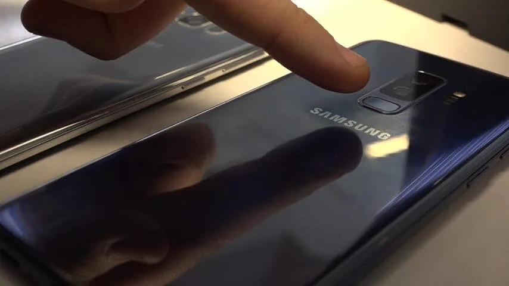
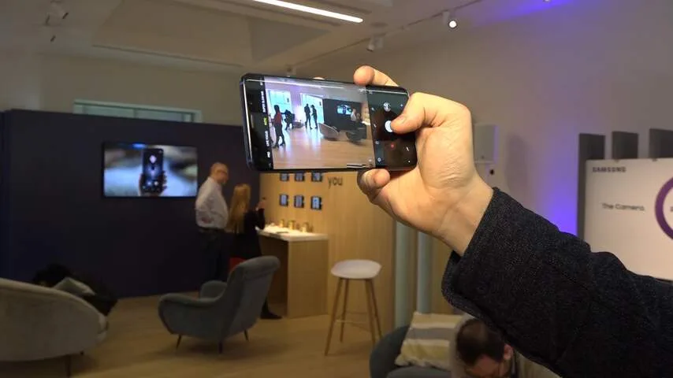
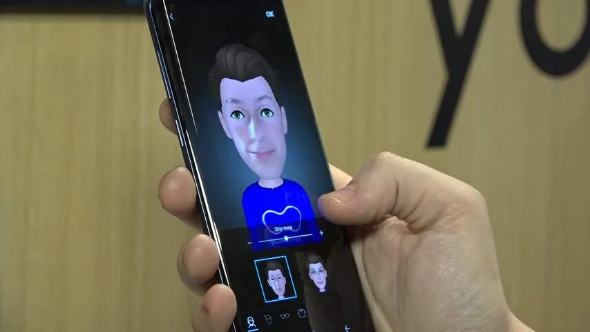

De S8 en S9 zijn gemakkelijk met elkaar te verwarren. Beide telefoons hebben aan de voorkant vrij dunne schermranden. Die van de S9 zijn iets dunner, maar het verschil wordt pas echt duidelijk als je beide telefoons naast elkaar legt.

> [!NOTE]
> Deze recensie verscheen eerder op [NU.nl](https://www.nu.nl/reviews/5150123/eerste-indruk-samsung-galaxy-s9-verfijnt-een-al-goede-telefoon.html).

Net zoals de S8 worden ook van de S9 twee modellen uitgebracht: het standaardtoestel met een 5,8 inch-scherm en een prijskaart van 849 euro, en een groter plusmodel van 100 euro duurder, met een 6,2 inch-display.

Ook de achterkant is haast ongewijzigd gebleven. Samsung heeft gekozen voor hetzelfde glanzende design met afgeronde hoeken, al wordt de telefoon ditmaal ook in het paars aangeboden. Naast die nieuwe kleur is het toestel vooral te onderscheiden door de vingerafdrukscanner - die zit nu onder de camera's in plaats van ernaast.

Het verplaatsen van de vingerafdrukscanner op de S9 is goed nieuws. Hij is makkelijker te bereiken dan op het toestel van afgelopen jaar, wat vooral een pluspunt is op de grotere Galaxy S9+. Je zult hierdoor de vingerafdrukscanner ook minder snel op de tast verwarren met de camera's. Daarmee pakt Samsung één van onze pijnpunten uit de [review van de Galaxy S8](https://www.nu.nl/reviews/4628370/review-galaxy-s8-voelt-als-sciencefiction.html) van vorig jaar aan.

[Bekijk ingesloten media](https://content.jwplatform.com/players/NlS3M16A-whqXCOFb.html)

## Camera's

De nadruk bij de S9 ligt volgens Samsung op de camera's achterop de telefoon. Het betreft wederom camera's van 12 en 8 megapixels, maar ditmaal wijken de diafragma's sterk van elkaar af. De ene camera heeft een diafragma van F2.4, terwijl de tweede F1.5 biedt. Beide camera's kunnen ook het diafragma aanpassen op basis van de belichting.

De S9 wisselt tussen de twee camera's op basis van de benodigde belichting. Hierdoor wordt een kleiner cameragat gebruikt bij optimaal licht, terwijl de camera met de grotere opening bij foto's in het donker wordt ingezet. Bij korte tests is het verschil indrukwekkend: er is weinig sprake van ruis in vrij barre lichtsituaties.

Ingebouwd DRAM-geheugen in de camerasensor wordt gebruikt om meerdere beelden tegelijk te maken, die worden gebruikt om de beste foto uit de reeks te verbeteren. Het is ook deze geheugentoevoeging die een nieuwe slowmotionfunctie mogelijk maakt. De telefoon kan met 960 frames per seconde filmen voor een korte periode, waardoor het mogelijk is om bijvoorbeeld een waterdruppel in detail uit elkaar te zien spatten.

We zagen een vergelijkbare functie eerder in de [Sony Xperia XZ Premium](https://www.nu.nl/reviews/4652517/eerste-indruk-xperia-xz-premium-filmt-in-superslowmotion.html). Leuke toevoeging in de S9 is de bewegingsdetector, die zorgt dat de camera pas begint te filmen als het onderwerp in beeld schiet. Dat is bij de superslowmotionfunctie een must, want het is voor slechts 0,2 seconde mogelijk om beeld vast te leggen.

De vastgelegde beelden bij onze tests waren zeer indrukwekkend, maar het is de vraag hoe vaak deze functie in de praktijk gebruikt zal worden. Voor het maken van een goed slowmotionbeeld is namelijk een zeer specifieke situatie nodig, die niet zo snel zal voorbijkomen in het dagelijks leven.

_Eerste indruk: Samsung Galaxy S9 verfijnt een al goede telefoon_

_Samsung Galaxy S9 — Beeld: NU.nl/Robbert Jacobs_

_Samsung Galaxy S9 — Beeld: NU.nl/Robbert Jacobs_

_Samsung Galaxy S9 — Beeld: NU.nl/Robbert Jacobs_

_Galaxy S9 — Beeld: NU.nl/Robbert Jacobs_

_Samsung Galaxy S9 — Beeld: NU.nl/Robbert Jacobs_

## Augmented reality

De S9 biedt een aantal nieuwe opties voor augmented reality. Zo is het mogelijk de camera op een appel te richten om de voedingswaarden in beeld te zien, of om een tekst te vertalen door er een foto van te maken.

Samsung heeft daarnaast met een schuin oog gekeken naar de iPhone X, die het afgelopen jaar met Animoji mogelijk maakte om emoji's te animeren met gezichtsbewegingen in de echte wereld. De AR Emoji van Samsung beloven hetzelfde, maar gebruiken een zelfgemaakte emoji die lijkt op de gebruiker van het toestel.

De gezichtsdetectie voor deze smileys viel bij onze tests wel wat tegen. Grote bewegingen werden naar de emoji vertaald, maar het simpele optrekken van een wenkbrauw wordt vaak niet goed gezien. Daarnaast worden mondbewegingen zelden goed vertaald.

Dat is ook geen wonder, want de S9 gebruikt alleen de camera aan de voorkant om het gezicht af te lezen. Dat terwijl de Apple-concurrent meerdere sensoren in een inkeping boven het scherm heeft.

De AR Emoji van Samsung zijn wel makkelijker te delen via een toetsenbord, terwijl die van Apple veel omwegen via iMessage vereisen om ze in bijvoorbeeld WhatsApp te zetten.

[Bekijk ingesloten media](https://content.jwplatform.com/players/peGRKSCh-whqXCOFb.html)

## Snelheid

Het is lastig om een peil te trekken op de snelheid van de Galaxy S9. Bij onze tests voelde de telefoon 'gewoon' snel. maar dat is inmiddels ook wel de norm bij toestellen in deze prijscategorie. Een heel erg groot verschil met de S8 was niet merkbaar.

De telefoons bevatten 64-bits octacoreprocessors, waarvan we de praktische snelheid nog niet meteen konden testen. Het was tijdens de testperiode namelijk niet toegestaan om benchmarks uit te voeren via externe apps.

De S9 en S9+ zijn qua specificaties grotendeels gelijk, maar er zijn een paar kleine verschillen. Zo heeft de S9 in totaal 4GB werkgeheugen, terwijl de S9+ maar lieft 6GB heeft. De accu van de S9 van 3.000mAh is ook iets kleiner dan die in de S9+, die 3.500 biedt. We kunnen pas bij de volledige review testen wat voor verschillen die accucapaciteiten oplevert.

## Voorlopige conclusie

De nieuwe functies in de Galaxy S9 zijn leuk, maar geen gigantische revolutie vergeleken met de Galaxy S8 van vorig jaar. Daarmee voelt deze telefoon vooral als een verfijning van wat we vorig jaar hebben gezien. Daarbij neemt de verplaatste vingerafdrukscanner één van onze kleine frustraties met de S8 afgelopen jaar weg.

De S8 viel ons afgelopen jaar echter uitermate goed in de smaak - en veel van de toen benoemde pluspunten lijken nog van toepassing om de S9. De verschillen tussen beide telefoons zijn wellicht wat te klein om nu alweer te upgraden, maar voor iedereen met een oudere telefoon lijkt dit een interessante optie.

De Galaxy S9 en S9+ worden vanaf 16 maart verkocht in Nederland.
