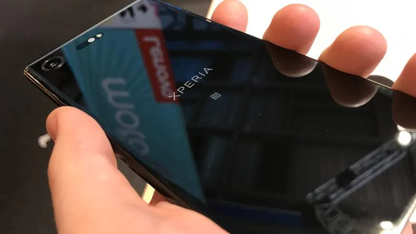
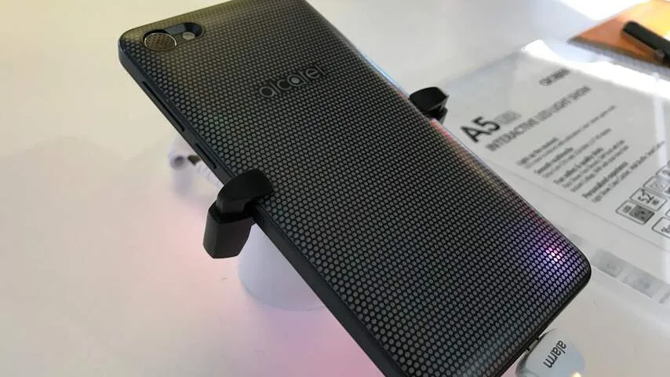
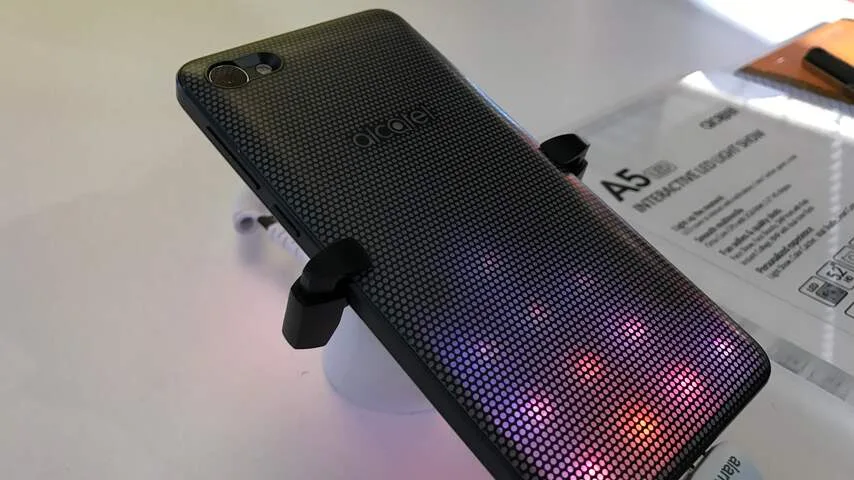
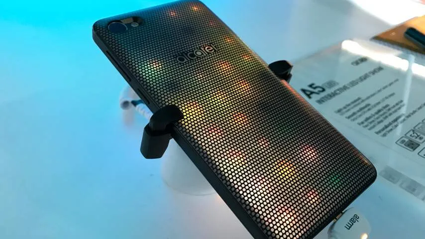
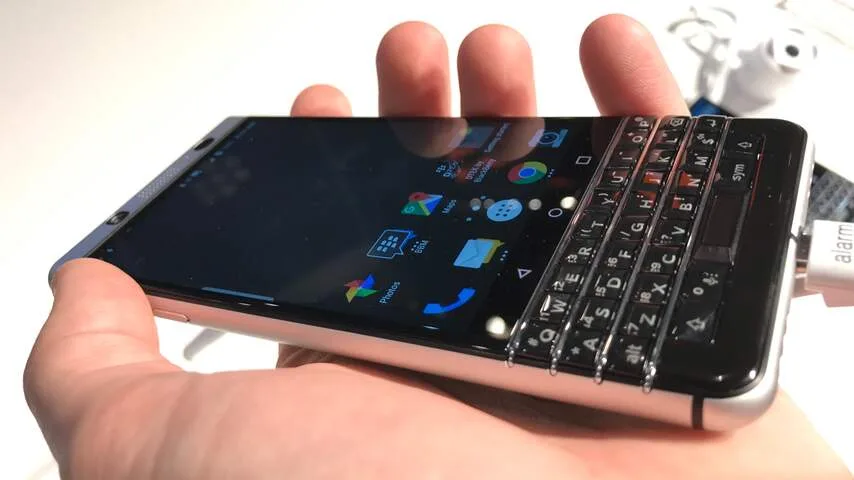

## Xperia XZ Premium

De voornaamste nieuwe functionaliteit in de Xperia XZ Premium is de slow-motioncamera. Deze legt video's vast met maar liefst 960 beeldjes per seconde, waardoor alles extreem langzaam afgespeeld kan worden.

> [!NOTE]
> Deze recensie verscheen eerder op [NU.nl](https://www.nu.nl/mobile-world-congress/4502493/eerste-indruk-smartphones-met-4k-fysiek-toetsenbord-en-led-lampjes.html).

Op Mobile World Congress werd de slow-motion met meerdere opstellingen gedemonstreerd. Zo was te zien hoe een waterbak vol met ronddraaiende ballen er vertraagd uitziet, of hoe een waterdruppel langzaam op de grond uiteenspat.

[Bekijk ingesloten media](https://content.jwplatform.com/players/Z324jamt-whqXCOFb.html)

Hoewel eerdere smartphones ook slow-motion gebruiken, is dit bij de XZ Premium aanzienlijk indrukwekkender. Bij de waterdruppel was bijvoorbeeld in detail te zien hoe deze haarscherp een kroon vormde. De beelden doen denken aan wat je normaal gesproken in een hoogwaardige natuurdocumentaire ziet.

De telefoon is voorzien van een 4K-scherm. Nieuw voor Sony is dat echter niet: de Xperia Z5 Premium ondersteunde ook een 4K-resolutie. Wel nieuw is ondersteuning voor HDR, waardoor het kleurbereik bij bepaalde video’s veel groter is. Dat valt op: bij beelden is het contrast vrij hoog, waardoor subtiele verschillen in bijvoorbeeld de kleuren van een wolk beter te zien zijn.

_sony Xperia XZ Premium — Beeld: NU.nl_

De 4K-resolutie voelt wel wat overdreven. Video’s zijn scherp, maar bij een smartphonescherm van een andere resolutie is dat ook het geval. Een smartphone van 5,5 inch heeft immers relatief kleine pixels, waarbij een superhoge resolutie geen must is. We kregen niet het idee dat video aanzienlijk mooier was dan op een toestel met lagere resolutie.

De XZ Premium wordt aan het einde van het voorjaar uitgebracht voor 749 euro.

## Alcatel A5 LED

De Alcatel A5 LED ziet er van voren uit als een typische budgettelefoon. Het 5,2 inch-scherm met een resolutie van 1280 bij 720 pixels oogt wat onscherp en de knoppen onderop zijn door hun formaat vrij lomp.

Wat de A5 LED onderscheidt zit achterop het toestel. Daar zit een verwisselbare LED-achterkant waarvan de lampjes met de smartphone communiceren. Bij een binnenkomend WhatsApp-bericht kunnen de lichten bijvoorbeeld groen kleuren en de letter 'W' laten zien, terwijl ze bij Facebook in het blauw pulseren met de letter 'F'.

[Bekijk ingesloten media](https://content.jwplatform.com/players/cBwZZIT0-whqXCOFb.html)

Die LED-achterkant klinkt als een gimmick, maar het is wel leuk dat je de lampjes kunt personaliseren. Je kunt zelfs per app een eigen LED-notificatie maken.

De A5 LED is door zijn achterkant wel iets zwaarder. Hierdoor ligt hij niet zo licht in de hand als andere smartphones met een vergelijkbare schermgrootte, maar een groot bezwaar is dat niet. De telefoon is alsnog prima met één hand vast te houden.

Bij het afspelen van muziek probeert de achterkant het geluid te visualiseren. Door het toestel te schudden worden de hiervoor gebruikte kleuren en patronen veranderd. Een eerste keer leuk, maar het moet nog blijken hoe vaak deze functie gebruikt zal worden.

_Alcatel A5 LED — Beeld: NU.nl_

_Alcatel A5 LED — Beeld: NU.nl_

_Alcatel A5 LED — Beeld: NU.nl_

Dat geldt eigenlijk voor alle LED-functies achterop de telefoon. Hoewel de uitwerking van de behuizing prima in elkaar zit, kunnen we weinig situaties bedenken waarin dit echt van pas komt. De notificaties zijn handig als een toestel met het scherm naar beneden op een tafel ligt. Zodra hij in een broekzak zit of wordt gebruikt, zijn de lichtjes niet meer te zien.

Met een prijskaartje van 200 euro is de A5 LED geen dure telefoon, maar in deze prijsklasse zijn ook toestellen te vinden met een betere specificaties. Wat dat betreft vraagt Alcatel klanten om een hogere schermresolutie om te ruilen voor een wat twijfelachtig foefje.

## BlackBerry KeyOne

De KeyOne is een BlackBerry-telefoon die op Android draait én is voorzien van een fysiek toetsenbord. Dat toetsenbord zit onder een 4,5 inch-scherm, met een resolutie van 1.080 bij 1.620 pixels. De telefoon wordt gemaakt door TCL, dat een licentie heeft op het merk BlackBerry.

Vergeleken met veel andere smartphones op MWC heeft de KeyOne een vrij klein scherm. Groter had dit BlackBerry-display echter niet moeten zijn. Omdat er een toetsenbord onder het scherm is geplakt, is de gehele smartphone hierdoor even groot als een Android-telefoon met groter beeld.

[Bekijk ingesloten media](https://content.jwplatform.com/players/F99DZkkO-whqXCOFb.html)

De achterkant van het toestel heeft een subtiel ribbelige textuur, waardoor hij hoogwaardig aanvoelt. Hoewel de bovenkant harde hoeken heeft, zijn de randen onderop afgerond waardoor de telefoon goed in de hand valt.

Het toetsenbord is wat je van BlackBerry kunt verwachten. Nieuwkomers zullen even de positie van de backspace-knop en andere toetsen moeten leren. Iedereen die eerder een BlackBerry heeft gehad, kan vermoedelijk vrij snel leren om goed te tikken op deze telefoon.

Bij het vergrendelen van de telefoon ontstond soms wat verwarring. De knop hiervoor zit aan de linkerzijde van het toestel, terwijl de knop aan de rechterkant Google Now activeert. Omdat de meeste smartphones rechts de ontgrendelknop hebben, is het makkelijk om per ongeluk de stemassistent van Google te activeren.

_BlackBerry KeyOne — Beeld: NU.nl_

De BlackBerry KeyOne heeft een vingerafdrukscanner die in de spatiebalk verwerkt zit. Deze knop werkt naar behoren: door een duim op de toets te leggen, wordt het toestel snel ontgrendeld.

Het fysieke toetsenbord zal fanatieke BlackBerry-gebruikers mogelijk weten te overtuigen om hun toestel te upgraden. Dat is een kleine overwinning voor het krimpende bedrijf. Voor smartphonegebruikers die net zo graag op een scherm typen wordt de KeyOne vermoedelijk geen must-have.

De BlackBerry KeyOne zal vanaf april worden verkocht voor 599 euro.
