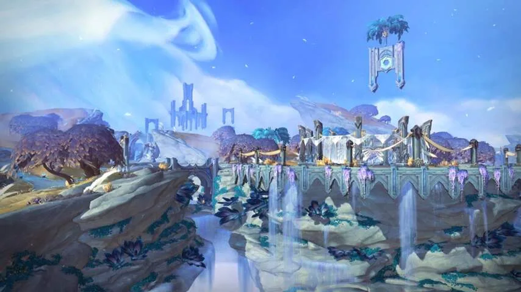
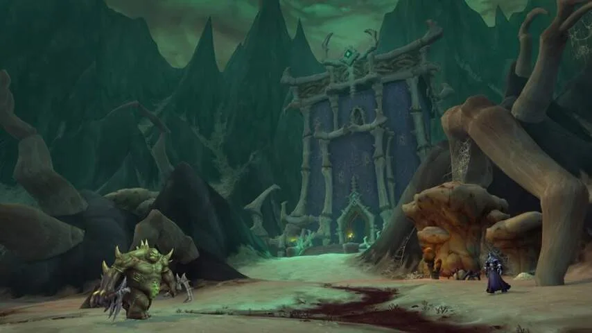
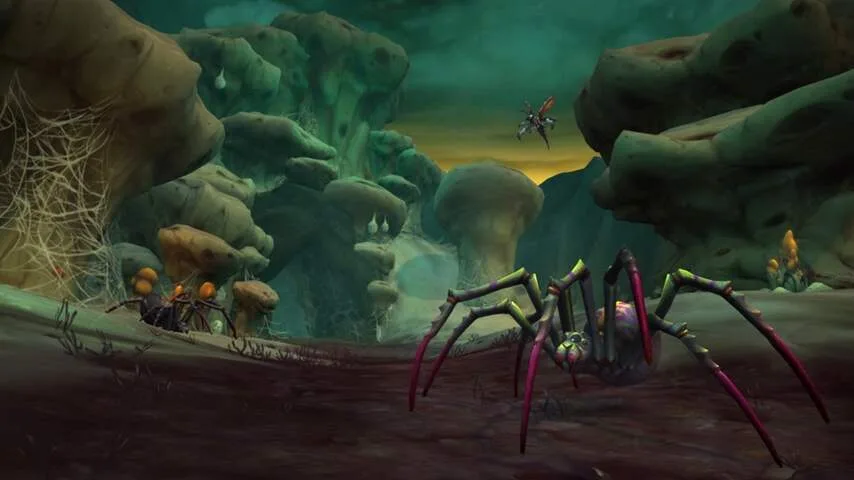

_World of Warcraft_ kan een intimiderende game zijn om nu nog aan te beginnen. Het online rollenspel werd vijftien jaar geleden voor het eerst uitgebracht en heeft sindsdien maar liefst zeven nieuwe uitbreidingen gekregen. Iedere uitbreiding voegde weer een nieuw gebied toe, plus een hoger level om te bereiken.

> [!NOTE]
> Deze recensie verscheen eerder op [NU.nl](https://www.nu.nl/reviews/6008508/eerste-indruk-world-of-warcraft-shadowlands-is-ideaal-voor-nieuwkomers.html).

## Drempels

Die nieuwe inhoud is leuk voor spelers van het eerste uur, maar voor nieuwkomers werken ze drempelverhogend. Ineens moest je niet level 60 bereiken om met vrienden te spelen, maar level 120. En ineens moest je al die gebieden door waar je vrienden jaren geleden al geweest waren.

Ontwikkelaar Blizzard probeert dit proces al jarenlang te vergemakkelijken. Je level stijgt bijvoorbeeld sneller dan vroeger, en bij de aanschaf van nieuwe uitbreidingspakketten krijg je een eenmalige optie om een personage meteen een hoog level te maken.

Dat zijn echter geen elegante oplossingen, omdat je weinig van de gamewereld meekrijgt en ineens moet leren om een complex personage van een hoog niveau te spelen.

## Levelverlaging

Blizzard kiest bij het nieuwste uitbreidingspakket _Shadowlands_ daarom voor een controversiële oplossing: het maximumlevel van personages wordt verlaagd, van level 120 naar level 60. Je bereikt level 50 door slechts een van de oude uitbreidingen te spelen, waarna je meteen de nieuwe _Shadowlands_\-gebieden in kunt duiken.

Die levelverlaging brengt een hoop veranderingen met zich mee. Een personage leert ineens in zestig sprongen de spreuken en aanvallen die hij of zij normaal in 120 levels kreeg, waardoor je bij ieder nieuw niveau iets nieuws hebt om uit te proberen. Het stijgen in level moet altijd als een beloning aanvoelen, beloven de makers.

_World of Warcraft — Beeld: Blizzard_

## Leven en dood

Daarbovenop ligt nog alle nieuwe inhoud in _Shadowlands_. De scheiding tussen leven en dood is opengerukt, waardoor spelers voor het eerst naar het hiernamaals afreizen. Die plek is opgedeeld in vier verschillende plekken, waar verschillende soorten geesten naartoe worden geleid om de eeuwigheid te besteden.

Dat nieuwe gebied is voor Blizzard een uitstekende smoes om eerder gedode gamehelden een comeback te laten maken. Tijdens een korte demo konden wij rondlopen in Bastion, een op Griekenland geïnspireerd graslandschap. Daar was ook Uther the Lightbringer te vinden, een held die stierf in de in 2002 verschenen strategiegame _Warcraft III_.

## Traditioneel

Hoewel veel van de onderliggende systemen in _Shadowlands_ worden veranderd, voelde Bastion wel zeer traditioneel aan. Net als in eerdere _World of Warcraft_\-uitbreidingen accepteerden we queesten, die we voltooiden door voorwerpen te zoeken of monsters te doden. Ben je klaar, dan krijg je nieuwe missies of zoek je iets verderop naar nieuwe opdrachtgevers.

Het doden van monsters was tijdens onze speelperiode ook vrij makkelijk. _Shadowlands_ is duidelijk een toegankelijke game, waarin je met gemak meerdere vijanden tegelijkertijd te lijf kunt gaan. Dat staat in schril contrast met de recente heruitgave van de allereerste _World of Warcraft_, waarin vijanden een uitdaging vormen en de wereld gevaarlijk is.

_World of Warcraft — Beeld: Blizzard_

## Geen nieuwe rassen of klassen

Blizzard heeft geen nieuwe klassen of rassen toegevoegd, waardoor je vooral aangewezen bent op bestaande personages. Wel kun je bestaande personagetypes vrijer naar eigen smaak aanpassen. Dat is vooral te merken bij menselijke spelfiguren, die nu meer opties voor meerdere huidskleuren hebben.

Daarnaast belooft de gamestudio dat je jouw bestaande personage op termijn meer naar eigen smaak kunt aanpassen. Zodra je level 60 bereikt, kun je je aansluiten bij een van de vier facties van de doden, die ieder unieke vaardigheden en pantsers bieden. Een magiër die lid is van de duistere Necrolords ziet er hierdoor totaal anders uit dan iemand die werkt voor de natuurbewuste Night Fae, en speelt zelfs iets anders.

Het maken van een tweede personage moet daarnaast gemakkelijker worden. Ziet de game dat je het einde van _Shadowlands_ al eens heeft bereikt, dan mag je volgende held al veel eerder een Covenant kiezen, en op een andere manier het maximumlevel bereiken.

Het is een slimme manier om het trainen van een nieuw personage fris te houden, die ook hand in hand samenwerkt met de nieuwe levelverlaging. Omdat je voor de eerste vijftig levels slechts een van de zeven eerder uitbreidingen hoeft te verkennen, kun je zeven personages in level omhoog brengen, zonder ooit hetzelfde te doen. Het maakt de game langer leuk voor spelers die niet per se moeilijke raids op het maximumlevel willen doen, maar vooral de wereld rustig willen verkennen.

_World of Warcraft — Beeld: Blizzard_

## Voorlopige conclusie

_World of Warcraft: Shadowlands_ probeert de drempel te verlagen voor spelers die na vijftien jaar ook eens _World of Warcraft_ willen spelen. Een commercieel slimme zet en goed nieuws voor nieuwkomers, maar het is nog de vraag hoeveel nieuwe dingen er zijn voor fans van het eerste uur. Er zijn geen nieuwe rassen of klassen, waardoor de vernieuwingen ditmaal slechts subtiel zijn. En de impact van die kleine veranderingen worden pas in de definitieve game duidelijk.

_World of Warcraft: Shadowlands verschijnt in 2020 voor pc._
