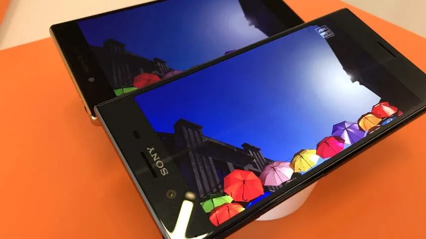
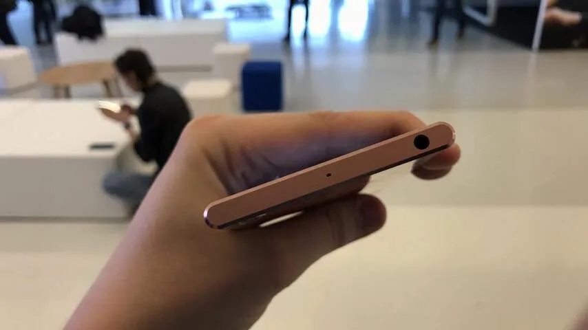
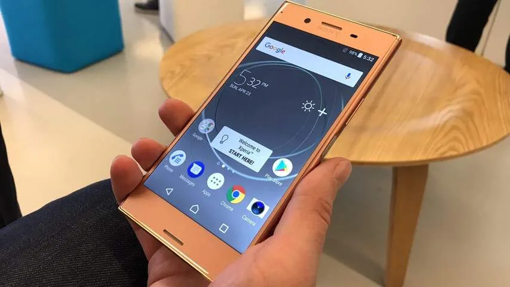
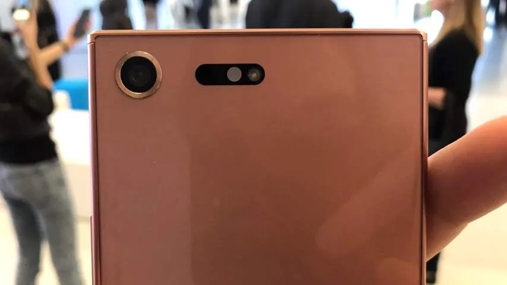
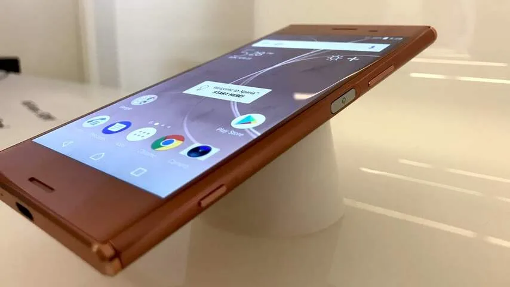

Slowmotion is voor smartphonecamera’s niks nieuws: bij veel telefoons is het mogelijk om met 120 of 240 frames per seconde te filmen, zodat de video’s flink wat trager afgespeeld kunnen worden.

> [!NOTE]
> Deze recensie verscheen eerder op [NU.nl](https://www.nu.nl/reviews/4652517/eerste-indruk-xperia-xz-premium-filmt-in-superslowmotion.html).

Video’s opgenomen met de XZ Premium kunnen een stuk trager worden afgespeeld. De slowmotionfunctie neemt op met 960 frames per seconde, waardoor het beeld vier tot acht keer langzamer is dan bij andere smartphones.

De camera filmt niet continu in slowmotion, maar kan slechts voor ongeveer een seconde video’s met 960 frames opnemen. Bij een demonstratie van Sony hadden we de gelegenheid om video’s te maken waarin een model ramen inslaat of door piepschuimmuren heenrent, maar het was een uitdaging om met de juiste timing op de slowmotionknop te drukken.

De camera start de slowmo-functie niet bij het indrukken van de knop, maar lijkt beeld vast te leggen rond de knopdruk. Zo tikten we op het scherm als een model net een glas insloeg, maar legde de camera hierbij het moment kort daarvoor vast. Het gebruik van de slowmotion vergt dus wat gewenning.

[Bekijk ingesloten media](https://content.jwplatform.com/players/Z324jamt-whqXCOFb.html)

De slowmotion-video’s worden met een resolutie van 720p vastgelegd. Daarbij wordt de camera ook flink ingezoomd, wat betekent dat je ver van je doelwit af moet staan.

Het is nog wel de vraag hoe vaak je in de praktijk in slowmotion zult filmen. Bij onze tests had Sony bombastische demonstraties opgesteld, maar in de echte wereld zul je zelden mensen door muren heen zien rennen of ramen kapottikken. In het begin zul je vermoedelijk alledaagse activiteiten in slowmotion filmen om het effect te zien, maar daarna zal deze functie hooguit een paar keer per maand voor bijvoorbeeld Instagram leuk zijn.

## Camera

Slowmotion is niet het enige bijzondere aan de camera in de XZ Premium. Met 19 megapixels weet de smartphone indrukwekkende foto’s te schieten - zelfs in matige lichtomstandigheden. Een foto in een donkere kamer van een brandende kaars was bijvoorbeeld alsnog scherp, met amper sprake van ruis in het beeld.

Video’s kunnen worden gefilmd in een 4K-resolutie, waarbij de camera 30 frames per seconde vastlegt. Daarbij mistten we wel een optische beeldstabilisator, die in andere premiumtoestellen vaker voorkomt. Er waren bij het maken van filmpjes best wat trillingen te bespeuren in het beeld.

## HDR

Sony gebruikte al eens eerder een 4K-scherm in een smartphone, maar bij de XZ Premium is ook HDR-ondersteuning aan het toestel gevoegd. HDR-video’s hebben hierdoor een hoger kleurbereik en contrast, waardoor je bijvoorbeeld beter onderscheid kunt maken tussen wittinten in wolken.

Leg een HDR-video op de XZ Premium naast een gewone video en het verschil is meteen duidelijk. Op het moment is het echter wel een wat specifieke technologie die nog niet in superveel video’s wordt benut. Netflix en Amazon Prime Video hebben een aantal films en series in HDR, maar het aanbod is nog relatief beperkt.

_XZ Premium — Beeld: NU.nl/Bastiaan Vroegop_

_XZ Premium — Beeld: NU.nl/Bastiaan Vroegop_

_XZ Premium — Beeld: NU.nl/Bastiaan Vroegop_

_XZ Premium — Beeld: NU.nl/Bastiaan Vroegop_

_XZ Premium — Beeld: NU.nl/Bastiaan Vroegop_

Het gebruik van 4K is op papier indrukwekkend, maar in de praktijk merkten we er in alle eerlijkheid weinig van. Op een 'gewoon' beeldscherm van een andere telefoon binnen deze prijsklasse zijn pixels ook niet op een gewone afstand van elkaar te onderscheiden.

Het gebruik van 4K zou voor virtual reality indrukwekkend kunnen zijn, maar daar zijn vooralsnog geen plannen voor aangekondigd.

## Ontwerp

Hoewel de camera en het beeldscherm van de XZ Premium bijzonder modern aanvoelen, doet het algehele ontwerp van de smartphone een beetje denken aan 2015.

Dat is niet helemaal aan Sony te wijten. Concurrenten LG en Samsung hebben net telefoons met zeer dunne schermranden uitgebracht, waarmee de standaard voor een smartphone-ontwerp begint te veranderen. Het zorgt ervoor dat de randen rond de XZ Premium echter gigantisch dik lijken. Logisch ook, want deze telefoon werd ontworpen voor bedrijen de stap naar dunne randen maakten. Sony heeft er vrij lang over gedaan om de XZ Premium op de markt te krijgen.

Dat bezwaar geldt niet alleen voor de boven- en onderkant, maar ook voor de zijkanten. Daar zit nog een dunne rand rond het scherm, terwijl we bij premiumtelefoons juist graag een scherm willen dat in de rand opgaat. Vooral bij de lichte versies van het toestel valt dat bijzonder veel op.

## Conclusie

Wie het wat lompe ontwerp met dikke schermranden kan accepteren, vindt in de XZ Premium een verder imposant premiumtoestel. Eentje waarbij in elk geval de camera en de beeldschermkwaliteit een goede goede indruk achterlaten - wat misschien wel de belangrijkste onderdelen zijn voor een smartphone, nu snelheidsverhogingen in dit hoge prijssegment steeds minder voelbaar worden.

De slowmotionfunctie, hoewel indrukwekkend, voelt een beetje als een gimmick, die je overigens ook kunt vinden in de goedkopere XZs. Het is echter wel een vrij leuke gimmick.

De XZ Premium is vanaf 1 mei te bestellen in Nederland vanaf 750 euro. Een verkoopdatum is nog niet bekendgemaakt, maar volgens een provider start de verkoop in 1 juni in Duitsland.
