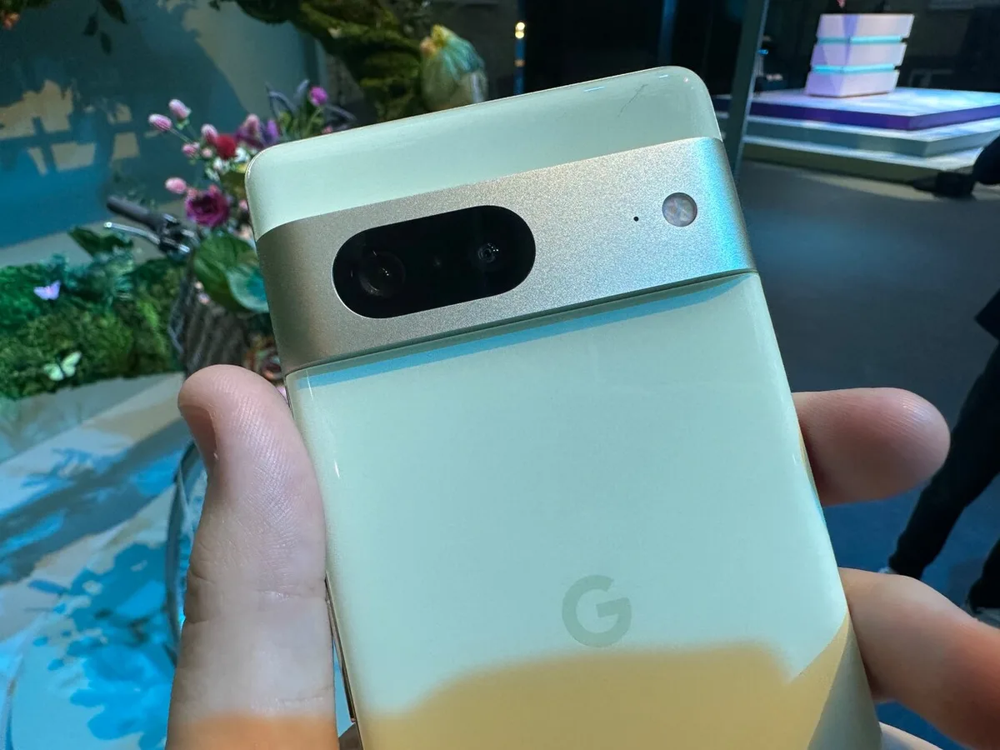
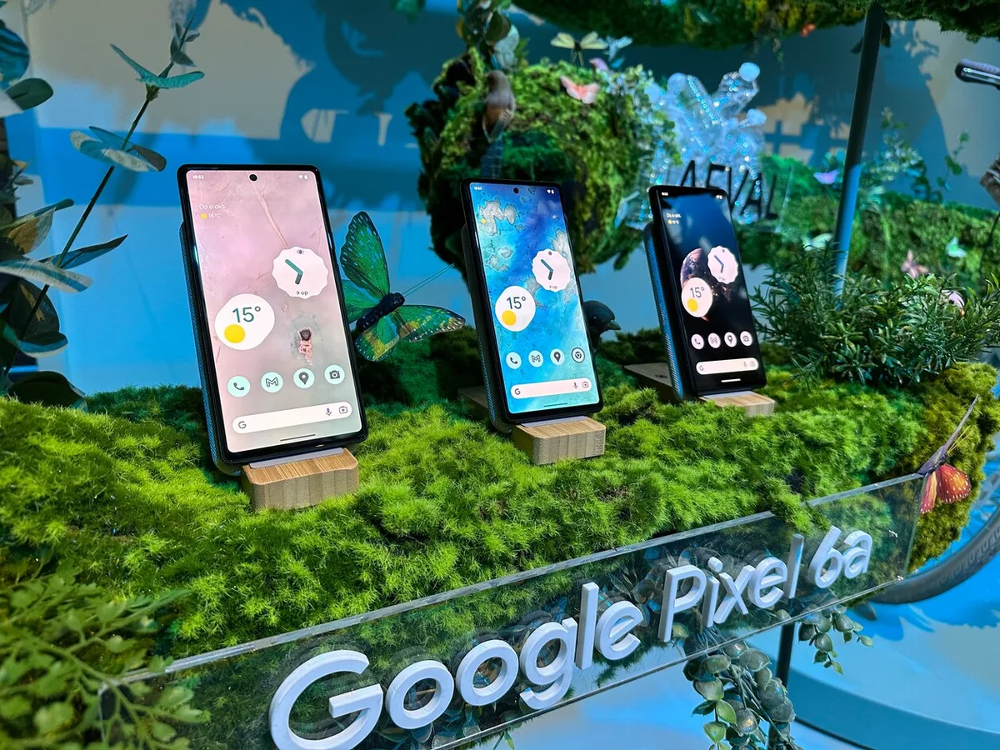

We hebben lang op Googles smartphones moeten wachten: zes jaar na de introductie van de eerste Pixel, verkoopt Google nu de Pixel 6a in Nederland, met daarnaast ook de net aangekondigde Pixel 7 en 7 Pro. Bij die aankondiging ging het eventjes over de betere specificaties, maar stond vooral de software centraal. Na een korte tests is duidelijk waarom.

> [!NOTE]
> Deze recensie verscheen eerder op [AD](https://www.ad.nl/tech/eindelijk-in-nederland-wij-hebben-de-nieuwe-google-pixel-telefoons-al-getest~a0c1b06c/).

Googles Pixel-telefoons zijn al jarenlang een soort schoolvoorbeeld van wat met Android mogelijk is. Ze hebben een ‘schone versie van’ het besturingssysteem, zonder extra opsmuk die de fabrikant heeft toegevoegd. Met daarnaast ook allerlei handige softwaretrucs waardoor je de telefoon in meer situaties kunt gebruiken.

Voordat we het over die software hebben, nog even snel de hardware. De Pixel 7 en 7 Pro hebben allebei Googles zelfontworpen chip, de G2. Daarnaast vind je in de gewone 7 een scherm dat met 90 beeldjes per seconde ververst, terwijl de 7 Pro dit met 120 beelden kan.

## Gewoon snel, maar dat is niet het belangrijkst

Bij een korte test voelen beide telefoons gewoonweg snel. Apps openen soepel, browsen verloopt vloeiend en video speelt snel af. Het is een verhaal dat je inmiddels bij veel smartphones kunt vertellen, want de meeste processoren in deze prijsklassen zijn gewoon prima.

Maar het is de ingebouwde ‘TPU’ die de Google-chip bijzonder moet maken. Deze wordt gebruik om de kunstmatige intelligentie van het bedrijf rechtstreeks op de telefoon te gebruiken, waardoor de telefoon complexe handelingen uitvoert zonder steeds met het internet te verbinden.

## Lekker ver zoomen

Dat zie je bijvoorbeeld in de camera: die heeft van zichzelf al zware specificaties met een 50 megapixel-camera, maar bij het vastleggen van beeld vindt ook flink wat nabewerking plaats. Dit zorgt bijvoorbeeld ervoor dat op veel verschillende niveaus gezoomd kan worden. In dat geval pakt de telefoon foto’s van alle camera’s achterop, die door de kunstmatige intelligentie worden gecombineerd tot één scherper, beter uitziend beeld.

_Zoek je een telefoon met goede camera? De redactie van BestGetest zet [de beste cameratelefoons](https://bestgetest.nl/de-beste-smartphone-cameras-van-2022?utm_source=ad&utm_medium=tekstlink&utm_term=byo&utm_campaign=redactioneel&utm_content=0c1b06c) op een rij._

Foto’s die we tijdens het Google-evenement maakten kwamen prima uit de verf. Zoom je twee of vijf keer, dan blijft het beeld zelfs best scherp - scherper dan je vooraf in de viewfinder ziet. Hoe verder je zoomt, hoe meer je de kwaliteit wel ziet afnemen. Het is duidelijk beter dan bij oudere telefoons die simpelweg een deel van een foto wegknippen als je inzoomt, maar we moeten nog zien of het een volwaardig alternatief is voor een grote zoomlens op een spiegelreflexcamera.

Achterop deze Pixel 7 zitten twee camera's, de 7 Pro heeft er drie. © Bastiaan Vroegop

## Ongewenste dingen ‘weggummen’ uit je foto

Bijzonderder is wat je na het maken van een foto kunt doen. Je kunt met de ‘Magische Gum’ bijvoorbeeld ongewilde objecten uit je beeld wegknippen, zoals willekeurige passanten op kinderfoto’s. Dat werkte bij onze tests goed, mits je een niet al te gekke achtergrond had. Een textuurtje op de achterzijde is prima, maar zodra er bijvoorbeeld grote palen staan kan het beeld ietwat vervormd raken. Het is een functie die daardoor in specifieke situaties werkt - en als hij werkt, is hij verbluffend simpel.

Ook kun je onscherpe foto’s achteraf scherper maken. Dat verschil zie je vooral bij extreem bewogen beeld, waarbij je ineens een duidelijk onderwerp in beeld krijgt. Tests bij licht scherpe foto’s vonden we minder schokkend - vermoedelijk omdat de software van Google al in de achtergrond het nodige heeft gedaan om het beeld in die situatie scherper te maken.

## Telefoon schrijft foutloos op wat je zegt, in het Engels

Buiten fotografie heeft de telefoon nog een paar handigheidjes, zoals de mogelijkheid om alle audio van een gesprek automatisch uit te schrijven. Dat werkt op het moment alleen in het Engels - maar doet het in die situaties wel erg goed. We namen een kort audiofragment op in een kamer waarin extreem harde muziek werd afgespeeld, waarbij ieder woord nog steeds foutloos werd opgeschreven.

Diezelfde transcriptiefunctie zit ook in de live-ondertiteling die de telefoon kan laten zien. Op die manier wordt bijvoorbeeld het geluid van een video automatisch ondertiteld, zodat je bijvoorbeeld zonder geluid kunt kijken en je partner niet meer wakker maakt. Ook dit werkt op dit moment helaas alleen in het Engels - maar bij die Engelse video’s was het bij onze korte testsessie naadloos.

Google Pixel. © Bastiaan Vroegop

## Nog geen vlekkeloze gezichtsherkenning

Minder situatiebestendig is de nieuwe gezichtsherkenning, die naast de al bestaande vingerafdrukscanner is toegevoegd. Deze wist de telefoon snel te ontgrendelen bij goed licht, maar zodra er een gekleurde lamp in beeld was werd ons gezicht in één keer onherkenbaar.

Dat is vermoedelijk ook waarom Google zowel op je gezicht als je vinger vertrouwt: hopelijk wordt één van de twee snel geregistreerd, zodat je de telefoon vloeiend kunt ontgrendelen.

## Voorlopige conclusie

Er is nog een hoop dat we bij de Pixels willen testen, maar de eerste indruk is goed. Handigheidjes zoals de Magische Gum en bovengemiddelde zoom zitten slim in elkaar, en laten duidelijk Googles strategie zien: in een wereld waarin veel Android-fabrikanten vooral telefoons maken met snellere processoren, heeft Google een telefoon die simpelweg nieuwe dingen doet. En die functies zullen voor velen interessanter zijn dan de wetenschap dat hun toestel supersnel is of veel werkgeheugen heeft.
