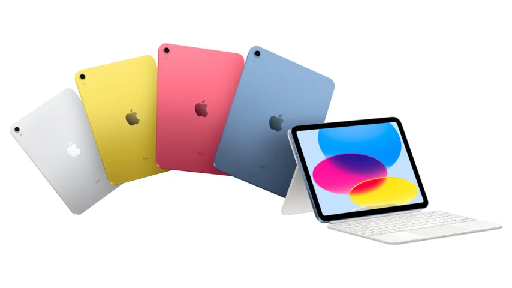

Apple heeft al jaren een vaste strategie: naast de luxere iPads verkopen ze ook een model dat simpelweg iPad heet, met het klassieke ontwerp en een lagere prijs. Die tablet heeft nu een upgrade gekregen, maar verliest daarmee ook meteen die lagere prijs; die is gegaan van 389 euro naar 589 euro.

> [!NOTE]
> Deze recensie verscheen eerder op [NU.nl](https://www.nu.nl/reviews/6231901/getest-de-hogere-prijs-valt-op-bij-de-nieuwe-ipad.html).

Voor dat hogere bedrag krijg je wel veel nieuws: de iPad heeft een herontwerp met dunnere randen, net als bij andere, nog duurdere iPads. Daarnaast draait het apparaat nu op dezelfde processor als de iPhone 12, wat het een snelle, soepele gadget maakt.

Het bijbehorende toetsenbord (299 euro) is ook beter dan wat we eerder bij iPads zagen: een standaard op de achterzijde laat je de tablet in ieder denkbare hoek zetten en op de bovenste rij zitten nu knoppen om onder meer het volume en de helderheid aan te passen. Dat zijn beide dingen die we missen op het toetsenbord dat voor de iPad Air en Pro wordt verkocht.

De selfiecamera zit nu ook in de lange zijde van de tablet, zodat deze in het midden hangt wanneer je de iPad in landschapsmodus vasthoudt. Het zorgt dat je mooi in het midden staat tijdens videogesprekken. Bij andere iPads hang je dan altijd ongemakkelijk aan de zijkant.

_Getest: De hogere prijs valt op bij de nieuwe iPad — Beeld: Apple_

## Te duur in zijn klasse

Het zijn leuke bijkomstigheden voor een eerder al goede tablet, maar ze doen uiteindelijk te weinig om het hogere prijskaartje te rechtvaardigen. De goedkope iPad was jarenlang Apples beste optie voor bijvoorbeeld scholen die tablets gebruiken, maar met een prijs van 589 euro zijn er veel goedkopere alternatieven die ook hartstikke goed zijn, waaronder veel Chromebooks.

Sterker nog: Apple verkoopt nog steeds de vorige iPad, die ondanks een prijsverhoging van 50 euro nog steeds goedkoper en aantrekkelijker is. Bij andere winkels koop je die op het moment van schrijven zelfs voor 360 euro.

## iPad Mini en Air betere opties

Wil je een nieuwer ontwerp, dan zouden we eerder kiezen voor bijvoorbeeld de iPad Mini. Die is een slag kleiner, maar werkt wel met Apples nieuwere pen met ingebouwde magneetlader. Deze iPad Mini kost bij externe webwinkels zelfs minder dan de nieuwste iPad.

De stap naar de duurdere iPad Air is zelfs best klein. Je betaalt 100 euro extra, maar dan heb je naast een betere stylus ook een snellere M1-processor.

Het maakt het lastig om de nieuwe iPad aan te raden. Er zijn simpelweg te veel betere keuzes die minder, ongeveer hetzelfde of net ietsje meer kosten. En voor al die iPads is een beter argument te maken dan voor dit nieuwe, wat rare tussenmodel.

## Conclusie

Dat maakt de nieuwe iPad geen slecht apparaat, slechts eentje waar geen logische markt voor is. Wellicht dat deze tablet over een jaar of twee ineens de aanschaf waard is, als er weer een nieuw model op de markt is en deze goedkoper is geworden. Maar tot dan: koop vooral het model van vorig jaar als je een goedkope iPad zoekt.
