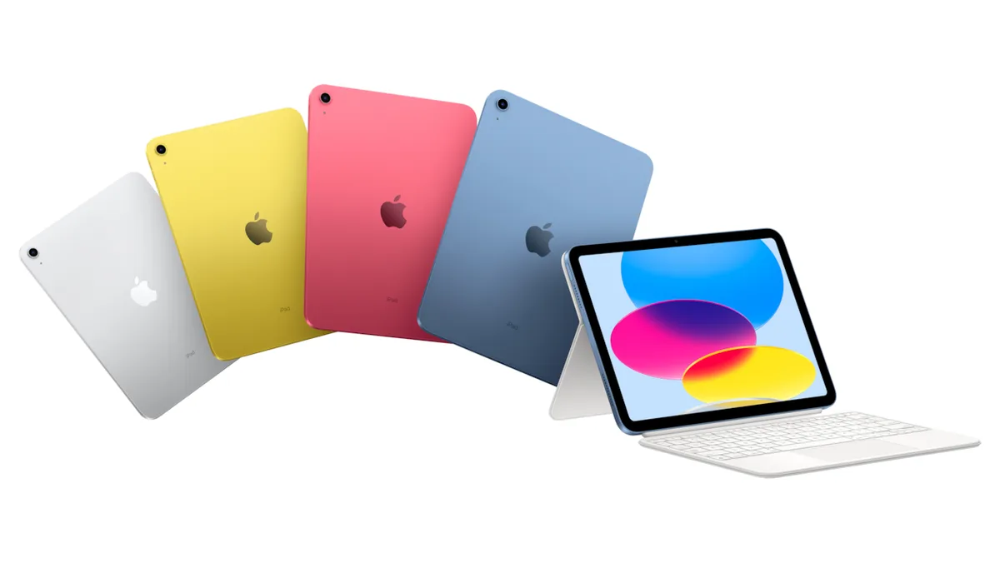

Met de komst van weer een nieuwe iPad, kun je bij Apple kiezen uit maar liefst vijf soorten tablets. Dat lijken er te veel, want het blijkt lastig te bedenken waarom je deze nieuwe zou kopen in plaats van een van de oudere modellen.

> [!NOTE]
> Deze recensie verscheen eerder op [AD](https://www.ad.nl/tech/het-is-lastig-om-de-nieuwe-ipad-aan-te-raden~a5f72b1c/).

Naast een Pro, Air en Mini verkocht Apple jarenlang ook een ‘gewone’ iPad. Dat was de goedkoopste optie in het assortiment, en daarmee de tablet die je het vaakst ziet op bijvoorbeeld scholen. Het model dat vorig jaar werd aangekondigd ging voor 389 euro over de toonbank.

## Opvolger in vier kleuren

De nieuwe iPad is de opvolger van dat budgetmodel, met een compleet vernieuwd ontwerp gebaseerd op eerdere, duurdere iPads. Zo is de thuisknop op de tablet verdwenen en zijn de randen dunner. Daarnaast wordt het apparaat voortaan verkocht in de kleuren blauw, roze, geel en wit.

De tablet heeft een snellere 14 Bionic-chip gekregen, dezelfde processor die eerder in de iPhone 12 zat. Bij onze tests was die chip lekker snel - weinig verrassend, gezien de twee jaar oude iPhone 12 ook nog soepel in gebruik is. Apps starten snel en games draaien vloeiend.

Aan de onderkant zit nu een USB-C-poort in plaats van Apples eigen Lightning-aansluiting; dit was de laatste iPad die de sprong naar USB-C nog moest maken. Handig, voor wie nog maar één kabel voor al zijn apparaten wil gebruiken, maar er is een keerzijde. De nieuwe iPad gebruikt namelijk nog steeds het oude pennetje, en moet je met een Lightning-poort opladen. En die heeft de iPad niet meer, waardoor je extra kabels en dongels moet gebruiken om hem van stroom te voorzien.

## Fijn nieuw toetsenbord

Apple heeft zijn nieuwste iPad ook voorzien van een vernieuwde toetsenbordhoes. Die bestaat ditmaal uit twee delen: het toetsenbord dat je aan de zijkant bevestigt met magneten, en een tevens magnetische achterkant met een standaard om hem rechtop te zetten.

Het is misschien wel ons favoriete iPad-toetsenbord tot nu toe. Door de standaard is de iPad in allerlei hoeken te plaatsen, iets dat niet eens kan met het toetsenbord bij de veel duurdere iPad Pro. En omdat het twee onderdelen zijn, kun je de standaard gebruiken terwijl de iPad is losgekoppeld. Het maakt het apparaat flexibeler dan eerdere iPads.

Maar er is één belangrijk punt dat de iPad tegenzit: de prijs. Waar de voorganger ooit voor 389 euro op de markt kwam, kost dit nieuwe model maar liefst 589 euro. Dat terwijl het vorige model ook nog wordt verkocht - al is de prijs hiervan omhooggeduwd naar 439 euro. Daarmee komt de tablet in een prijsklasse waarin hij moet concurreren met bijvoorbeeld veel Android-concurrenten en Chromebooks, wat het lastiger maakt om hem blind aan te raden.

De nieuwe iPads hebben een bijbehorend toetsenbord. © Apple

## Tegen de 900 euro aan

Sterker nog: wil je het nieuwe toetsenbord van Apple erbij, dan moet je nog eens 299 euro betalen. De prijs schurkt daarmee tegen de 900 euro aan, waarvoor je bij sommige fabrikanten ook een capabele laptop kunt kopen. De concurrentie voor de iPad wordt daarmee ineens wel heel groot.

En als je bereid bent zulke bedragen te betalen, dan zouden we zelfs adviseren om dan maar te upgraden naar de iPad Mini of iPad Air. Die zijn met respectievelijk 659 en 789 euro weer een beetje duurder, maar werken allebei wel met de nieuwste Apple-stylus. Bovendien zijn ze bij externe winkels vaak in de aanbieding, waardoor de prijs amper afwijkt van Apples nieuwste telg.

_Op zoek naar nieuwe tablet? [BestGetest zet de beste tablets van 2022 op een rij](https://bestgetest.nl/de-beste-tablets-van-2022?utm_source=ad&utm_medium=tekstlink&utm_term=byo&utm_campaign=redactioneel&utm_content=5f72b1c)._

## Betere opties voor meer en minder geld

Daardoor ontstaat een situatie waarin de nieuwe iPad net buiten de boot valt. Want wil je een zo goedkoop mogelijke iPad? Dan is het basismodel van vorig jaar met 439 euro nog steeds de beste optie. Wil je een tablet die wat meer kan, met een randloos ontwerp? Dan zouden we zelf iets meer investeren voor de iPad Mini of Air. Apples nieuwste tablet probeert daartussen te zitten, maar zelf kunnen we niet voorstellen voor wie dit apparaat dan echt interessant is.

Wel hopen we dat de nieuwe iPad een voorbode is van wat later ook naar andere modellen zal komen. Nieuwigheden zoals het tweedelige toetsenbord zijn fijn, en we zijn ook blij met kleine aanpassingen zoals de selfiecamera, die nu aan de lange kant van het scherm zit. Het zijn functies waar we niet de nieuwe iPad voor zouden kopen, maar die we wel erg graag in andere, logischere modellen terugzien.

## Conclusie

Een slechte iPad is dit niet, maar Apple heeft stomweg alternatieven die aantrekkelijker zijn. Wellicht kun je een héél specifieke reden bedenken waarom je Apples nieuwe, duurdere iPad met een wat onhandig op te laden stylus wil hebben, maar waarschijnlijk zijn de meeste mensen beter af met de goedkopere iPad of duurdere iPad Mini en iPad Air.
