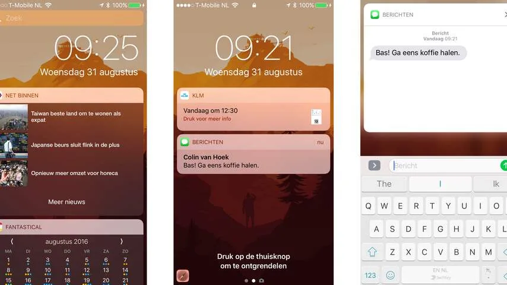
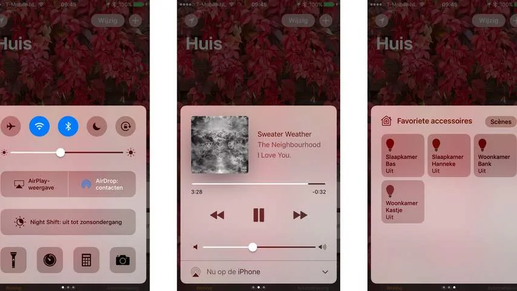
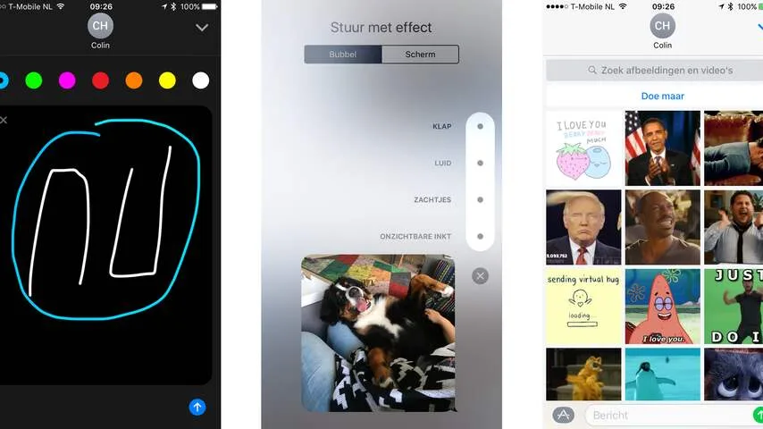

**In iOS 10, de nieuwste versie van het besturingssysteem voor iPhones en iPads, gaat vooral het ontgrendelscherm op de schop. Daarmee neemt Apple het meest vanzelfsprekende onderdeel van zijn smartphone onder handen.**

> [!NOTE]
> Deze recensie verscheen eerder op [NU.nl](https://www.nu.nl/reviews/4314710/review-ios-10-haalt-ontgrendelscherm-van-iphone-overhoop.html).

In het nieuwe systeem kan een iPhone niet langer worden ontgrendeld met een veeg opzij. In plaats daarvan moet de thuisknop worden ingedrukt. De vingerafdruk wordt hierbij automatisch gescand, waarna de telefoon naar het iconenscherm gaat. Op oudere toestellen moet een pincode worden ingevoerd.

Een veeg van rechts naar links opent voortaan de camera, die hierdoor makkelijker te starten is dan in voorgaande updates. Gebruikers hoeven immers niet langer het kleine cameraknop in de schermhoek vast te grijpen.

Beweeg de vinger van links naar rechts en iOS 10 toont een nieuw widgetscherm. Daarmee probeert Apple simpele informatie makkelijker toegankelijk te maken dan in voorgaande updates. Met een swipe opzij is het bijvoorbeeld mogelijk om snel de laatste nieuwskoppen of de weersverwachting te bekijken, zonder dat er een app geopend hoeft te worden.

Het is binnen iOS al langer mogelijk om widgets via het ontgrendelscherm te controlen, maar daarvoor waren vaak meerdere swipes nodig. Nu is deze optie één veeg van het beginscherm verwijderd.

Door het toestel op te tillen wordt het scherm al direct geactiveerd, net als bij de smartwatch van Apple. Een knop indrukken om berichten te bekijken is dus niet langer nodig. In het begin is dat even wennen, maar met de snelle vingerafdrukscanner van de iPhone 6s is het ideaal. De kans dat je met een homeknopdruk de telefoon ontgrendelt terwijl je alleen berichten wil lezen, is hiermee verdwenen.

## Slimmere notificaties

Misschien wel de grootste verandering op het ontgrendelscherm is de manier waarop notificaties worden getoond. Dit zijn vanaf iOS 10 grote, witte bubbels, die ingedrukt kunnen worden om ze groter te maken.

Ondersteunt een app iOS 10, dan kan hij in de notificaties een soort mini-applicatie laten zien. Zo is het in iMessage mogelijk om binnen een bericht de geschiedenis van een chat te bekijken, of toont een bericht van een taxi-app een kaart met de locatie van het voertuig.

_iOS 10 notificatiescherm — Beeld: NU.nl_

Daarmee zijn notificaties veel informatiever dan voorheen. Ze zijn niet langer beperkt tot een paar tekstregels, maar kunnen complexe informatie tonen. Het zorgt ervoor dat veel gewilde informatie vanaf het beginscherm gevonden kan worden, waardoor apps niet langer opgestart hoeven te worden. Een verandering die de omgang met de telefoon kan veranderen.

Apps moeten nog wel ondersteuning inbouwen voor de nieuwe mogelijkheden. Bij onze tests hadden veel apps nog geen iOS 10-update gekregen, waardoor de update slechts een nieuw jasje biedt voor oude informatie. In zo'n situatie zijn de nieuwe berichten wat lomp. Notificaties in iOS 10 nemen namelijk meer ruimte in beslag dan in iOS 9.

## Huisbediening

Het bedieningspaneel van iOS, dat nog altijd met een veeg omhoog verschijnt, is in de nieuwste versie een stuk ruimer geworden. De functies hiervan zijn onderverdeeld in meerdere 'tabbladen', waartussen de gebruiker kan vegen om te wisselen. Zo heeft de muziekspeler een eigen pagina met meer informatie.

Het Woning-tabblad is gekoppeld aan een nieuwe, gelijknamige app van Apple. Hierin is het mogelijk om slimme huisapparatuur op één plek te koppelen. Hierdoor zijn bijvoorbeeld de Hue-lampen van Philips en het slimme huisslot van August vanuit één plek te bedienen.

Door de huisapparatuur in het Bedieningspaneel te zetten, is de bediening van bijvoorbeeld verlichting sneller toegankelijk dan bij enkel een zelfstandige app. De swipe omhoog werkt immers ook op het beginscherm, waardoor een toestel niet ontgrendeld hoeft te worden om het licht uit te zetten. Makers van Smart Home-apps hoeven hierdoor ook geen widgets voor iOS meer te bouwen.

_Bedieningspaneel iOS 10 — Beeld: NU.nl_

## Een hippere chatapp

Apple geeft de chatdienst iMessage in iedere update wel een nieuwe lik verf, maar ditmaal zijn de veranderingen groter dan normaal. Ten eerste heeft Apple veel Apple Watch-functies aan de chatapp voor iPhone en iPad toegevoegd. Hierdoor is het mogelijk om een tekening of een trilling te versturen.

Bij foto's kan de verzender aangeven wanneer ze verschijnen, zodat de ontvanger ze bijvoorbeeld eerst moet indrukken. Daarnaast krijgt iMessage een eigen appwinkel. Apps die daar worden gedownload kunnen bijvoorbeeld snel GIF-animaties verzenden. Woorden in chats kunnen snel door emojivarianten worden vervangen, waardoor het woord 'auto' in één keer een rode auto-emoticon wordt.

De veranderingen moeten iMessage op het niveau krijgen van concurrerende chatapplicaties zoals WhatsApp, Messenger en Telegram. Ze bieden leuke manieren om beeld te verzenden, maar hiermee verandert Apple niet de manier waarop we gaan communiceren. De nieuwe opties voelen af en toe aan als gimmicks.

_iMessage iOS 10 — Beeld: NU.nl_

## Siri

De virtuele assistent van Apple is in iOS 10 op één fundamenteel vlak vernieuwd. Het is voor ontwikkelaars voortaan mogelijk om ondersteuning voor Siri in hun apps te bouwen. Het wordt hierdoor in theorie mogelijk om bijvoorbeeld WhatsApp-berichten via Siri te dicteren en versturen.

Het gebrek aan appondersteuning was al jarenlang een kritiekpunt voor Siri. De virtuele assistent maakte het makkelijk om via iMessage te chatten of een route te plannen via de Apple-kaartendienst, maar gebruikers van andere applicaties hadden weinig aan de stembediening. Het gebruik hiervan was daarom beperkt tot mensen die exclusief de diensten van Apple gebruiken.

Gaat de ondersteuning van apps ervoor zorgen dat we Siri daadwerkelijk gaan gebruiken? Dat moet nog blijken. Maar de aankondiging maakt de dienst in elk geval toegankelijker dan ooit.

## Klein grut

iOS 10 maakt het mogelijk om een appicoon langer in te drukken op een iPhone met 3D Touch-scherm, waarna er uitgebreide informatie verschijnt. Deze functie is wellicht wat overbodig, omdat deze informatie doorgaans ook al op het vernieuwde vergrendelscherm te vinden is.

De nieuwe ontwerpen van de Muziek- en Foto's-app zien er fraai uit, maar hebben verder weinig invloed op hoe je ze gebruikt. Wel fijn is de nieuwe zoekfunctie in de Foto's-app, die met beeldherkenning je naar objecten laat zoeken. Dat is een functie die Google ook in zijn fotodienst biedt.

Sommige veranderingen zijn subtieler, maar kunnen een groot effect hebben. Belapps kunnen voortaan bijvoorbeeld een volwaardig telefoonscherm laten zien, waardoor bijvoorbeeld de belfunctie van WhatsApp niet langer trucs met constante notificaties hoeft uit te halen. Het gebruik van diensten zoals Viber en Skype wordt hierdoor iets vanzelfsprekender.

## Nieuwe omgangsvormen

Het nieuwe ontgrendelscherm blijft echter de 'game changer' in iOS 10. Je hebt voortaan meer informatie onder de vingers zonder het toestel te ontgrendelen. Daardoor hoeven apps minder vaak te worden geopend. Hierdoor is snel reageren op een chat of het checken van het weer een stuk gemakkelijker.

De functie vereist echter wel enige gewenning. Apple heeft voor het eerst in negen jaar veranderd hoe hun smartphone wordt ontgrendeld. Vermoedelijk zullen mensen nog wekenlang hun toestel proberen te openen met een swipe, waarna de camera per ongeluk wordt gestart. Pas zodra we dat hebben afgeleerd, zullen de wijzigingen wellicht als een verbetering gaan aanvoelen.

_Deze review is gebaseerd op de laatste testversie van iOS 10. De uiteindelijke versie verschijnt dinsdagavond voor iPhone 5 en nieuwer, iPad 4 en iPad Mini 2 en nieuwer en de zesde generatie iPod Touch._
