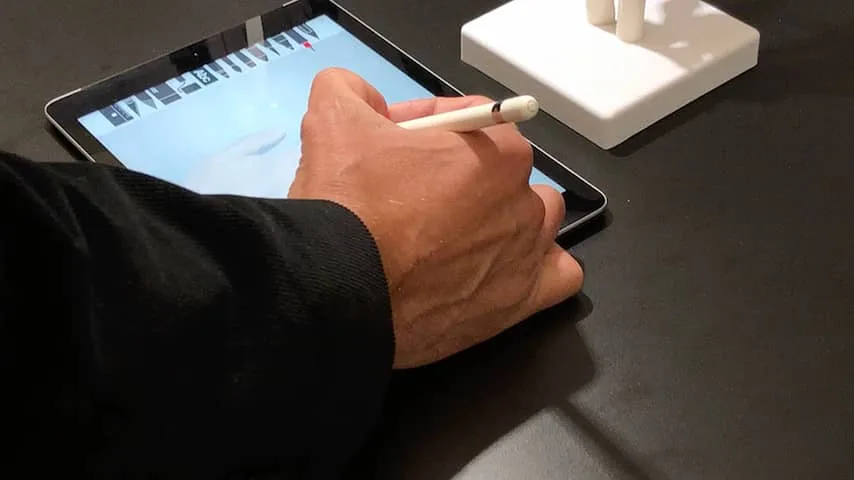
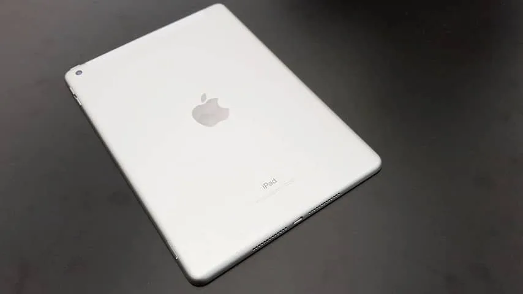
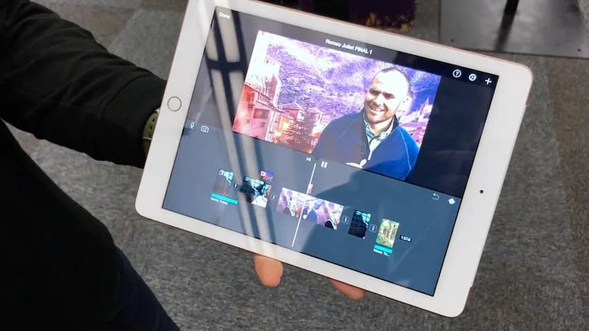
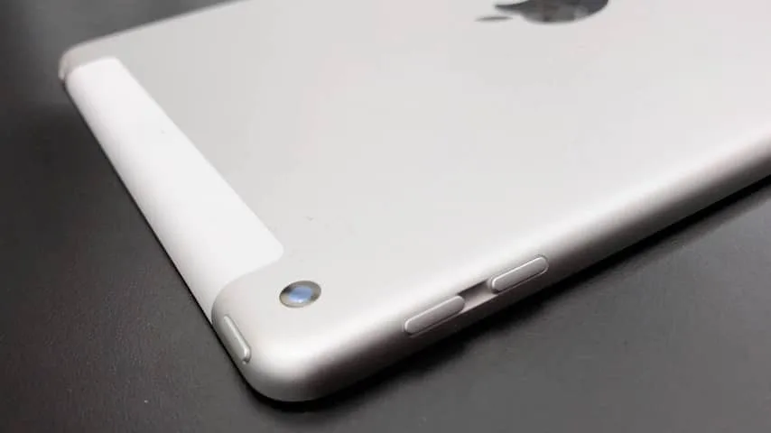

**Apple opent met zijn nieuwe iPad de aanval op Chromebooks in het onderwijs. Is dat genoeg, en biedt de iPad genoeg vernieuwingen voor mensen buiten het onderwijs?**

> [!NOTE]
> Deze recensie verscheen eerder op [NU.nl](https://www.nu.nl/gadgets/5196725/eerste-indruk-de-nieuwe-ipad-maakt-dure-functies-toegankelijker.html).

De nieuwe iPads zijn duidelijk bedoeld om de onderwijsmarkt te veroveren. Apple-directeur Tim Cook presenteerde de nieuwe tablets dinsdag in een klein theaterzaaltje aan de Lane Tech High School in Chicago, waar de tabletonthulling gepaard ging met praatjes over nieuwe onderwijs-apps en speciale schoolfuncties voor het iPad-besturingssysteem.

Apple spreekt van de "meest betaalbare iPad tot nu toe". In de Verenigde Staten wordt de tablet verkocht voor 329 dollar, hetzelfde bedrag waarvoor de eerste iPad Mini ooit op de markt werd gebracht. Studenten krijgen 30 euro korting bij de aanschaf van de iPad, wat het strikt gezien de goedkoopste nieuwe iPad maakt. In Nederland zal de iPad voor 359 euro in winkels liggen - net zo duur als de voorganger uit 2017.

[Bekijk ingesloten media](https://content.jwplatform.com/players/qBmXYFYa-whqXCOFb.html)

## Dikke randen

De iPad bevindt zich met die prijs in een relatief laag segment voor Apple, al voelt de tablet niet per se 'goedkoop'. Je zou het ontwerp van de nieuwe tablet haast traditioneel kunnen noemen, want hij ziet er nagenoeg hetzelfde als eerdere iPads uit. De achterkant voelt dankzij de aluminium behuizing nog steeds hoogwaardig en de tablet is nog steeds best licht.

De voorkant begint wel ouderwets te voelen. Aan alle vier de zijkanten van het scherm bevinden zich nogal brede randen, waardoor de uitstraling van de tablet wat lomp lijkt. Dat was voorgaande jaren ook al het geval, maar is extra merkbaar nu de iPhone X een nagenoeg randloos ontwerp heeft.

Ook qua basisfuncties bewandelt Apple met deze iPad bekend terrein. Onder het scherm zit weer een Touch ID-vingerafdrukscanner. Het 9,7 inch-scherm heeft wederom een retinascherm, dat er bij een eerste impressie haast identiek uitziet aan het display van een jaar eerder.

Aan de binnenkant van de iPad zit een A10 Fusion-chip, die Apple eerder ook gebruikte in de iPhone 7 en 7 Plus. We konden die chip nog niet aan hevige tests onderwerpen bij onze probeersessie, maar apps starten snel en iOS reageert vloeiend.

## Stylus

Daarnaast is er de Apple Pencil - een stylus die voorheen alleen werkte bij de iPad Pro. Palmdetectie en een druksensor zorgen ervoor dat je hiermee op de tablet kunt tekenen en schrijven zoals op echt papier. Voor tablets is dat niks nieuws onder de zon, maar het is voor het eerst dat Apple die functie in een relatief goedkope tablet beschikbaar stelt. Al is het jammer dat je 100 euro moet bijbetalen om zo'n stylus bij je iPad te krijgen.

Apple demonstreerde meerdere onderwijs-apps die door leraren gebruikt kunnen worden om iPads op grote schaal aan te sturen. Bij een demonstratie kon een docent bijvoorbeeld in één keer alle iPads ontgrendelen, het geluid uitschakelen en een bepaalde app opstarten. De resultaten van die app waren meteen voor de leraar inzichtelijk.

_iPad 2018 — Beeld: NU.nl/Bastiaan Vroegop_

_iPad 2018 — Beeld: NU.nl/Bastiaan Vroegop_

_iPad 2018 — Beeld: NU.nl/Bastiaan Vroegop_

_iPad 2018 — Beeld: NU.nl/Bastiaan Vroegop_

## Herhaaloefening

Eigenlijk is de iPad op veel fronten een herhaaloefening. De chip komt uit een telefoon die in 2016 verscheen, de behuizing is gebaseerd op een design van vijf jaar terug en de stylus kennen we van de iPad Pro uit 2015.

Zelfs de camera achterop is met zijn 8 megapixel ongeveer gelijk aan wat we vorig jaar zagen. De augmentedrealityfuncties die hiermee mogelijk zijn, werden vorig jaar voor meer iOS-apparaten beschikbaar gesteld in iOS 11.

Apple lijkt er echter niet op gebrand te zijn om bij deze nieuwe iPad nieuwe functies te introduceren. In plaats daarvan wordt oude technologie gepakt en in een betaalbaarder product gegoten, in een poging om de onderwijsmarkt te betreden. De nieuwe iPad zal vanaf 360 euro worden verkocht, terwijl bijvoorbeeld de iPhone met dezelfde processorchip een vanafprijs van 640 euro heeft.

## Race naar de bodem

Een totale race naar de bodem is dit uiteraard niet. Op het moment zijn er nog genoeg goedkopere budgettablets met Android te koop. Apple heeft veel van deze functies echter nog nooit voor zo'n relatief laag bedrag verkocht.

De meest fervente Apple-fans zullen wellicht worden teleurgesteld door een gebrek aan innovatie of verandering. Maar wie op zoek is naar een goedkopere iPad met relatief goede interne hardware, heeft hier vermoedelijk een prima product mee.
