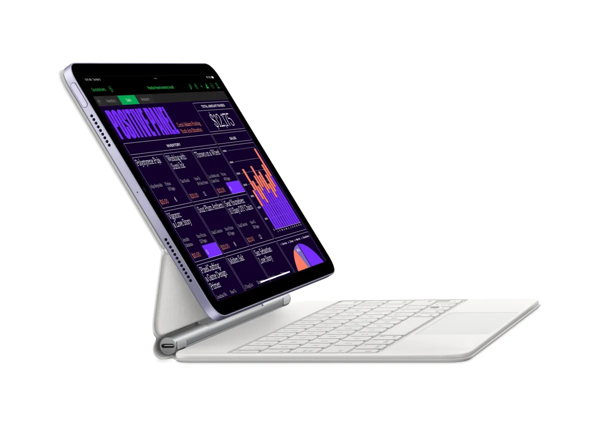

Apple heeft een nieuwe iPad geïntroduceerd, maar de verschillen met een vorig model zijn nogal klein. Waarom brengen ze zo’n simpele update uit?

> [!NOTE]
> Deze recensie verscheen eerder op [AD](https://www.ad.nl/tech/de-nieuwe-ipad-is-als-een-toyota-aygo~a749b468/).

Naast een goedkopere iPhone en nieuw soort Mac presenteerde Apple recent ook een nieuwe versie van de iPad Air. Ook deze tablet is voorzien van de snellere M1-chip, die sinds eind 2020 in alle nieuwe Macs en iPads Pro is gestopt.

Naast de toevoeging van die nieuwe chip is echter weinig aan de tablet veranderd. Hij heeft nog steeds het recente herontwerp met dunnere randen, achterop zit wederom een 12 megapixel-camera en de tablet is net als het vorige model met een vingerafdrukscanner beveiligd.

## Een budgetversie van de iPad Pro

Door de snellere M1-chip toe te voegen heeft de tablet ook veel gemeen met de kleinste iPad Pro. Die draait op dezelfde processor, heeft hetzelfde ontwerp en wijkt op slechts wat kleine punten af. Zo heeft de bijvoorbeeld Pro meer camera’s, gebruikt hij gezichtsherkenning en heeft de Pro een helderder, vloeiender ogend scherm. Het maakt de iPad Air eigenlijk een budgetversie van de iPad Pro, met een prijs die 200 euro lager ligt.

Het lijkt een race naar de ‘bodem’: al sinds 2020 brengt de techreus producten uit met zijn nieuwe, razendsnelle M1-chip, die met de nieuwe iPad Air in het goedkoopste apparaat tot nu toe zit. Voor het techbedrijf hartstikke handig, want op termijn zullen alle apparaten - Macs en iPads - op dezelfde interne apparatuur werken en kan software efficiënter worden geschreven.

De Air werkt ook met Apples toetsenbordhoezen. © Apple

## Te snel voor zo’n simpele iPad

Dat kunnen we alleen maar toejuichen, want sinds zijn introductie in 2020 is de M1 nog steeds razendsnel. De tablet draait altijd soepel, zonder dat je last hebt van stotters of andere problemen. Zware apps laden binnen een seconde of twee. De snelle processor voelt haast overdreven voor iets simpels als een tablet, die nu ineens zware, grafische software zonder moeite de baas lijkt te zijn.

Dat maakt de nieuwe iPad Air een geweldige, krachtige tablet - maar dat was de iPad Pro met een M1-chip in 2021 ook. En hoewel de oude iPad Air uit 2020 strikt gezien langzamer is, voelt die in alledaags gebruik ook nog steeds hartstikke snel.

## Doet verder weinig nieuws

De nieuwe iPad Air is een update om de tablet te actualiseren, zonder dat er verder iets nieuws of bijzonders mee wordt gedaan. Want je vindt hier niks dat we bij eerdere Apple-producten niet al zagen: de M1-chip zit al in best veel apparaten, de gebruikte vingerscanner zat in 2013 al in een iPhone en de behuizing is identiek aan het ontwerp dat in 2018 met de Pro’s werd gepresenteerd.

Daar is op zich niks mee: als je een nieuwe gadget koopt, hoeft die niet altijd de wereld te veranderen. Zolang hij maar snel en veelzijdig is - wat bij de iPad Air absoluut het geval is. En het is hoopgevend dat Apple zijn snelle M1-chip nu ook in goedkope producten stopt - voor Apple-begrippen, dan.

Maar meer dan een prima, krachtige iPad Air is dit niet. Het is de fonkelnieuwe Toyota Aygo waar je jouw twintig jaar oude Twingo mee kunt vervangen. Prima en gedegen, maar niet bijster spannend.

## Conclusie

De nieuwe iPad Air is razendsnel en relatief betaalbaar vergeleken met vergelijkbare Apple-gadgets, maar doet tegelijkertijd niet superveel nieuws. Een uitstekende upgrade voor wie een nieuwe iPad nodig heeft, maar niet heel spannend voor de meest fanatieke techvolgers.

_De nieuwe iPad Air is vanaf vrijdag 18 maart verkrijgbaar._
