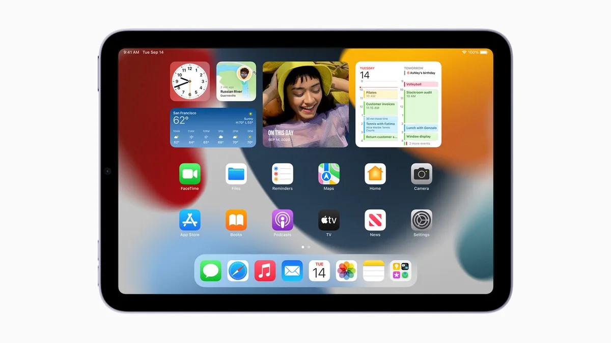

De kleinste iPad krijgt voor het eerst een écht nieuw ontwerp. Wij mochten het nieuwe model vooraf al even testen.

> [!NOTE]
> Deze recensie verscheen eerder op [AD](https://www.ad.nl/tech/dit-vinden-wij-van-de-nieuwe-ipad-mini~a393b968/).

Er is geen iPad die zo weinig liefde heeft gekregen als de iPad mini. In de afgelopen negen jaar kreeg de tablet slechts vijf keer een upgrade, waarbij alle eerdere modellen slechts een interne upgrade met betere processoren en schermen kregen.

Dat is bij de nieuwste iPad mini gelukkig anders. De tablet heeft nu dunnere schermranden en gebruikt niet langer een thuisknop, waardoor enkel een simpel scherm overblijft. De verkoop van de tablet begint op vrijdag 24 september, maar wij hebben hem al een kleine week mogen uitproberen. Hieronder vijf dingen die ons daarbij opvielen.

## 1\. Het is een kleinere iPad Air

Het nieuwe ontwerp van de iPad mini is niet vreemd: de tablet lijkt als twee druppels water op de eerder herontworpen iPad Pro, dat later nog eens dunnetjes werd overgedaan door de iPad Air.

De mini lijkt hierdoor verdraaid veel op vooral dat laatste model: beide hebben een retinascherm dat lcd gebruikt en de processoren ontlopen elkaar bijna niet. Hoewel de chip in de Air ietsje ouder is, merkten we bij gebruikstests bijna geen verschil op.

Als je bedenkt dat de iPad Air zo’n 100 euro duurder is dan de mini, maakt dat het een best aardige deal. Mits je het kleinere scherm voldoende vindt.

## 2\. Hij klemt perfect in een (grote) hand

De randen van de iPad mini zijn dunner, maar het scherm juist iets groter: 8,3 inch, in plaats van de 7,9 inch van voorgaande modellen. Het betekent dat de tablet in de praktijk exact even breed is als zijn voorganger.

Bij onze tests merkten we overigens dat de minitablet perfect in één hand vastgeklemd kan worden, om op die manier bijvoorbeeld een e-book te lezen. Iets wat bij de andere, grote iPads niet kan. Het hoekigere ontwerp zorgt dat hij ook makkelijker tussen je vingers blijft hangen.

Overigens één kleine kanttekening: dan moet je wel relatief grote handen hebben. Een iets kleinere collega lukt het net niet.

## 3\. De volgende FaceTime-camera zit slim in elkaar

Nieuw is een verbeterde selfiecamera voorop de iPad, met een veel bredere kijkhoek dan voorheen. Tijdens het videobellen zorgt bijbehorende software er vervolgens voor dat de persoon of personen in het gesprek goed in beeld worden uitgelijnd.

Bij onze eerste proefbelletjes werkt dat verbluffend goed. Het gaat uiteraard het makkelijkst bij één beller in beeld, maar ook bij meerdere personen wordt goed gezoomd en geschoven zodat iedereen goed te zien is. Zelfs heen en weer lopen tijdens het videobellen werkt prima - de camera blijft je dan volgen en omkaderen.

## 4\. De stylus past nét

Goed nieuws voor tekenaars: de nieuwe iPad mini maakt ook gebruik van de nieuwste stylus van het bedrijf, die met magneetjes aan de zijkant bevestigd kan worden en draadloos oplaadt.

Dat past allemaal nog maar net. De pen is bijna even lang als de tablet hoog is, en zelfs iets dikker dan de tablet zelf. Hij wiebelt hierdoor een beetje als je de tablet plat op tafel legt, maar blijft wel goed zitten.

Apple heeft zelfs de volumeknoppen op de tablet moeten verplaatsen om de relatief forse pen kwijt te kunnen. Die zitten voor het eerst bij een iPad niet aan de zijkant, maar bovenop de tablet.

De nieuwe iPad mini. © Apple

## 5\. Het slimme toetsenbord van Apple werkt niet

De iPad Air en Pro hebben achterop een speciale aansluiting, waar een toetsenbordhoes gemaakt door de techreus precies op aangesloten kan worden. Wel zo handig, want die toetsenborden hebben daardoor geen gedoe met bluetooth en extra oplaadbare batterijen.

Maar nu het slechte nieuws: bij de iPad mini is die aansluiting niet te vinden. Apple verwijst naar bluetooth-hoesjes met toetsenborden voor wie daar graag gebruik van maakt, maar die zijn dus net wat onhandiger. Een beetje jammer.
