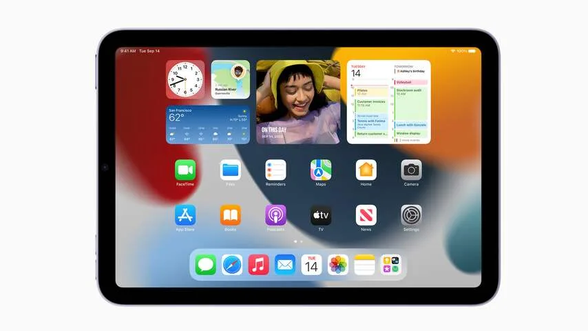

**Apples kleinste iPad is na jaren achterstand eindelijk naar het heden getrokken. Daarmee is de nieuwste iPad mini eigenlijk een iPad Air, maar dan met een kleiner scherm.**

> [!NOTE]
> Deze recensie verscheen eerder op [NU.nl](https://www.nu.nl/tech/6158230/review-de-nieuwe-ipad-mini-is-eigenlijk-een-kleinere-ipad-air.html).

De eerste iPad mini was een controversieel apparaat. De tablet verscheen een jaar na het overlijden van topman Steve Jobs, die in een eerder interview kritisch was over het idee van een kleinere iPad. "Gebruikers zouden hun vingers met schuurpapier driekwart kleiner moeten maken", zei hij.

De iPad mini kreeg in latere jaren meerdere opvolgers, maar de tablet stond daarbij minder in de schijnwerpers dan zijn grotere broers. Na 2015 deed Apple lange tijd niks met de iPad, waarna hij in 2019 slechts een kleine processorupgrade kreeg. Het ontwerp bleef sinds de eerste variant uit 2012 onveranderd.

Dat maakt de nieuwe upgrade voor het apparaat significant. De kleine tablet heeft voor het eerst een nieuw ontwerp gekregen, waarmee het uiterlijk aansluit bij de eerder uitgebrachte iPad Pro's en iPad Air.

De homeknop is verdwenen om ruimte te maken voor kleinere schermranden. Door het compactere formaat kun je hem ook in één hand klemmen, mits je grote handen hebt.

Net als bij de iPad Air zit de vingerafdrukscanner voortaan in de ontgrendelknop boven op de tablet. Daarnaast zitten ook de volumeknoppen. Die zitten niet meer aan de zijkant, omdat daar de Apple-stylus met een magneet vastgehouden kan worden.

_Review: De nieuwe iPad mini is eigenlijk een kleinere iPad Air — Beeld: Apple_

## Een kleinere iPad Air

Op papier is dit eigenlijk gewoon een kleinere iPad Air. De tablet heeft een iets nieuwere processor, maar van verschil in snelheid merken we bijna niets bij het starten van zware software en hoogwaardige games. Het apparaat kan bovendien worden gebruikt met dezelfde pen als bij zijn grotere broers.

Op één punt wijkt de mini wel af van de Air: hij heeft geen aansluiting voor de Smart Keyboard-reeks van Apple, waarvan de techreus ook geen mini-variant heeft uitgebracht. Voor toetsenborden ben je daarom aangewezen op bluetoothmodellen van andere fabrikanten.

## De camera volgt je

Nieuw voor iPad mini-gebruikers is de verbeterde selfiecamera, die beelden in een veel grotere kijkhoek vastlegt. Bijbehorende software in videobelapp FaceTime zorgt er vervolgens voor dat iedereen in beeld goed wordt uitgelijnd, zodat je met meerdere mensen in de kamer kunt bellen zonder dat iemand buiten beeld valt.

Die volgfunctie werkte bij onze tests goed. Beweegt iemand in beeld, dan volgt de camera die persoon automatisch door het beeld te kantelen of uit te zoomen, zodat iedereen goed te zien is. We kregen het op dit moment alleen nog werkend bij FaceTime, maar volgens de techreus mogen andere videobelapps de technologie ook integreren.

## Conclusie

Hoewel de nieuwe iPad mini een grote stap maakt vergeleken met zijn voorganger, is dit niet meteen een revolutionair apparaat. De nieuwigheden die we hier zien, zaten al in eerdere Apple-producten.

Apple trekt hier eigenlijk vooral zijn productlijn samen, waardoor klanten zich alleen hoeven af te vragen welke schermgrootte ze willen. Nu de mini eindelijk naar het heden is getrokken, heeft de tablet voor het eerst in jaren weinig echt grote nadelen.
