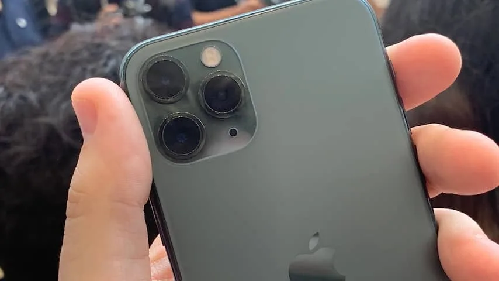
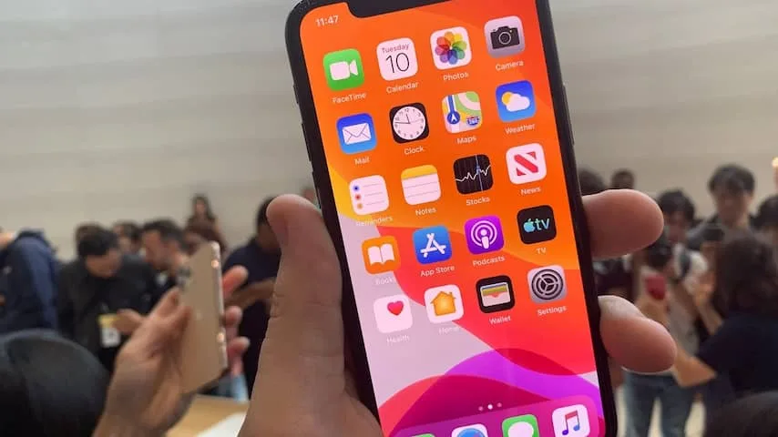
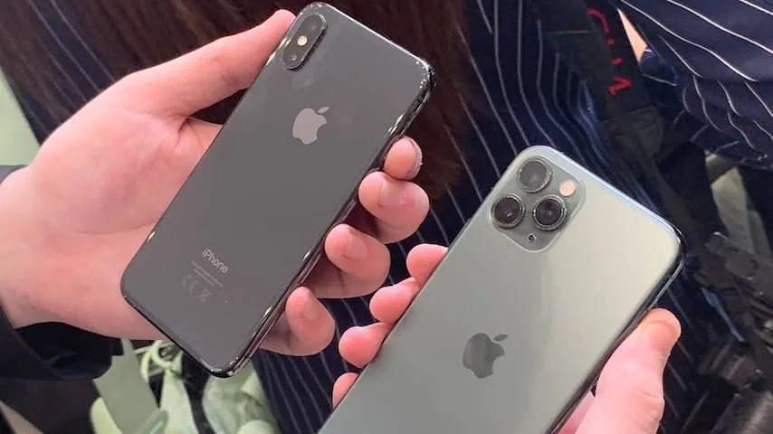
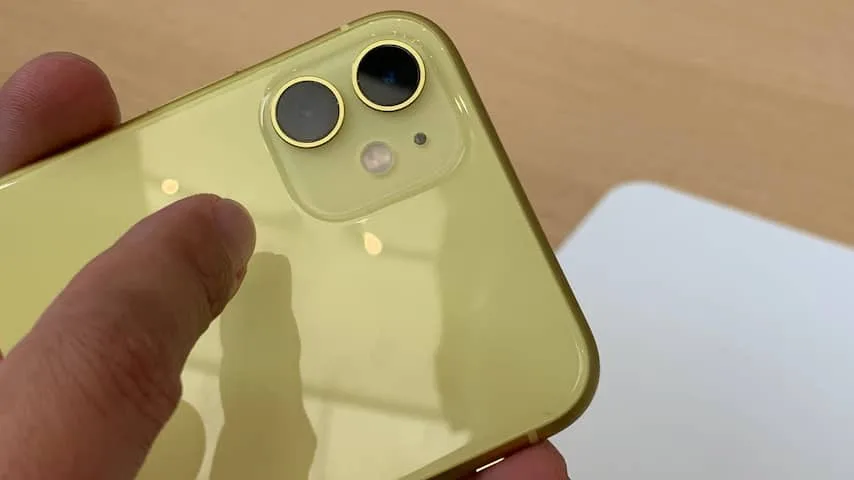
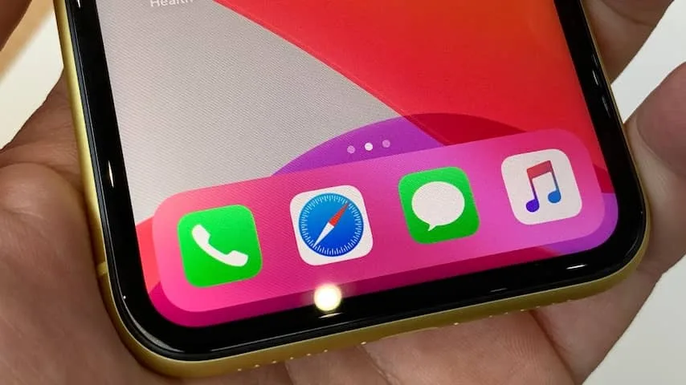
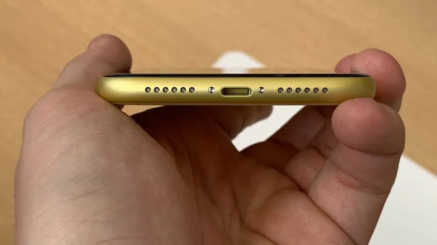

**Apple presenteerde op dinsdag niet alleen de iPhone 11, maar ook de 11 Pro. De telefoons lijken zich vooral met hun camera's te onderscheiden.**

> [!NOTE]
> Deze recensie verscheen eerder op [NU.nl](https://www.nu.nl/tech/5990894/eerste-indruk-nieuwe-iphones-moeten-het-vooral-van-de-cameras-hebben.html).

Bij de introductie van de iPhone X deed Apple iets nieuws door naast dit toestel ook de goedkopere iPhone 8 te verkopen. Die trend zette de techgigant vorig jaar voort met de verkoop van de iPhone XR en XS. Dit jaar doet Apple dat opnieuw met de introductie van de iPhone 11 en het Pro-model.

De iPhone 11 is het basismodel. Het toestel is met een prijskaartje van 809 euro geen budgetmodel. Apple hoopt dat koopjesjagers de inmiddels in prijs verlaagde iPhone 8 van 539 euro kopen. Het toestel wordt met 64 GB geleverd. Wil je meer opslagruimte, dan moet je honderden euro's meer betalen.

Op veel vlakken is het toestel gelijk gebleven aan de iPhone XR uit 2018. De glazen behuizing lijkt erg op die van de XR en wordt ook net zo snel vies door vette vingers. Ook de inkeping boven het scherm is even groot. Volgens Apple heeft de iPhone 11 exact hetzelfde scherm als de XR. Het betreft wederom een lcd-scherm, omdat oled alleen voor het Pro-model is weggelegd.

## Toestel onderscheidt zich met dubbele camera

Er zijn eigenlijk maar twee manieren waarop een iPhone 11 makkelijk onderscheiden kan worden van de XR. Ten eerste de kleuren, die allemaal net iets anders zijn dan bij het vorige toestel. Een belangrijker verschil is de camera achterop. De XR had slechts één lens, maar bij de iPhone 11 heeft Apple gekozen voor een dubbelelenscamera.

De ene lens heeft een wide-angleperspectief, terwijl met de tweede ultrawidefoto's gemaakt kunnen worden. Het betekent in de praktijk dat de ultrawidelens een wat uitgezoomder perspectief biedt, waarbij voorwerpen aan de zijkanten van het beeld ook in de foto betrokken worden.

Wisselen tussen die camera's is best makkelijk. Onder in beeld staat een knop waarmee je van de ene naar de andere camera springt. De knop zit op dezelfde plek waar de iPhone XS-camera je laat overschakelen op de telelens.

## Prima foto's bij prima belichting

De foto's die we kort na de presentatie konden maken, zagen er prima uit. De beelden waren scherp en grotendeels ruisvrij; wat je eigenlijk ook zou verwachten bij een toestel in deze prijsklasse. Daar moeten we wel bij zeggen dat de testruimte van Apple uitermate goed belicht was.

Het is nog de vraag hoe de telefoon het bij slecht licht doet. In die situaties zou de iPhone 11 automatisch moeten overschakelen op een nieuwe nachtmodus, waarbij software wordt ingezet om bij weinig licht ook heldere beelden te maken.

## Ontwerp iPhone 11 Pro meer onder handen genomen

Het nieuwe Pro-model neemt een paar extra stappen ten opzichte van zijn voorganger. Ten eerste is het ontwerp iets meer onder handen genomen. De glazen, glinsterende achterkant is omgeruild voor mat aluminium, waardoor de telefoon beter bestand is tegen vette vingerafdrukken. Dat is een voordeel ten opzichte van de iPhones van vorig jaar, maar ook ten opzichte van de iPhone 11 met glas.

De 11 Pro heeft de wide-angle- en ultrawidelenzen van de goedkopere iPhone met daarnaast ook een telefotolens. Dit betekent dat je optisch kunt inzoomen, maar het onderwerp dat je wil fotograferen ook vanaf een grotere afstand kunt bekijken.

Die driestapszoom werkt goed en voelt vanzelfsprekend. Je kunt vegen over een zoombalk onder het scherm, waarbij digitaal wordt gezoomd totdat je de zoomafstand van een nieuwe lens bereikt. Daarbij voelt eigenlijk vooral de ultrawidelens bijzonder, omdat die het gevoel geeft dat je veel verder in de ruimte staat dan werkelijk het geval is.

_iPhone 11 Pro — Beeld: NU.nl/Bastiaan Vroegop_

_iPhone 11 Pro — Beeld: NU.nl/Bastiaan Vroegop_

_iPhone 11 en iPhone 11 Pro — Beeld: NU.nl/Bastiaan Vroegop_

_iPhone 11 — Beeld: NU.nl/Bastiaan Vroegop_

_iPhone 11 — Beeld: NU.nl/Bastiaan Vroegop_

_iPhone 11 — Beeld: NU.nl/Bastiaan Vroegop_

## Beter oledscherm voor de iPhone 11 Pro

De 11 Pro heeft een oledscherm, wat betekent dat zwartwaarden er zwarter uitzien en kleuren beter uit de verf komen. De hogere pixeldichtheid zorgt ervoor dat beelden ook scherper zijn dan op de eerdere iPhone XS, al merkten we daar in de praktijk niet veel van. De kleurwaarden voelen min of meer hetzelfde op de nieuwe iPhone en op oude toestellen was het scherm al haarscherp, wat niet heel anders is op de 11 Pro.

Het verbeterde scherm moet het mogelijk maken om betere hdr-video's met Dolby Vision af te spelen op de iPhone, maar helaas waren dergelijke video's niet beschikbaar tijdens onze tests. Bij de uiteindelijke review van de 11 Pro moet blijken hoeveel je er dan wel van merkt.

Apple heeft nogal wat beloftes gedaan. De iPhone 11 zou maar liefst een uur langer per dag op een volle accu gebruikt kunnen worden, terwijl de 11 Pro het vier tot vijf uur langer volhoudt. Iets dat we tijdens onze korte tijd met de telefoon uiteraard ook nog niet konden uitproberen.

## Nog steeds snel

Tegelijkertijd moet de iPhone sneller zijn door de nieuwe A13-chip, maar dat verschil konden we in de praktijk eigenlijk niet opmerken. De 11 en 11 Pro openden apps eigenlijk haast net zo snel als de XS van vorig jaar. Het verschil zal pas merkbaar zijn als je van bijvoorbeeld een iPhone 7 overstapt op de modellen van dit jaar.

Beide iPhone 11-modellen werken nog steeds met een Lightning-aansluiting. Dit is opmerkelijk aangezien de eerder vernieuwde iPad Pro wel een USB-C-aansluiting kreeg en de EU er ook steeds meer op aandringt dat telefoons een universele oplaadpoort moeten hebben. Het voelt als een kwestie van tijd totdat ook de iPhone overgaat naar USB-C, maar we moeten nog minstens een jaartje wachten.

## Voorlopige conclusie

Apple doet leuke dingen met de camera's van de iPhone, die je het idee geven dat je zowel kunt in- als uitzoomen. Daarnaast is dit een vrij bescheiden update voor de telefoonreeks. De gewone 11 lijkt verdraaid veel op de XR van vorig jaar, terwijl de 11 Pro met zijn aluminium behuizing een kleine designupdate krijgt. Een revolutionaire stap als bij de iPhone X is dit niet, maar wel eentje om de telefoons weer een jaartje actueel te houden.

Wellicht zijn we enthousiaster als we de nieuwe nachtmodus voor de camera's hebben getest. Ook belooft Apple een speciale fotomodus die haarscherpe en perfect belichte foto's maakt met kunstmatige intelligentie, maar die komt pas later dit jaar. Maar daar kunnen we bij de huidige versie alleen nog maar over speculeren.
