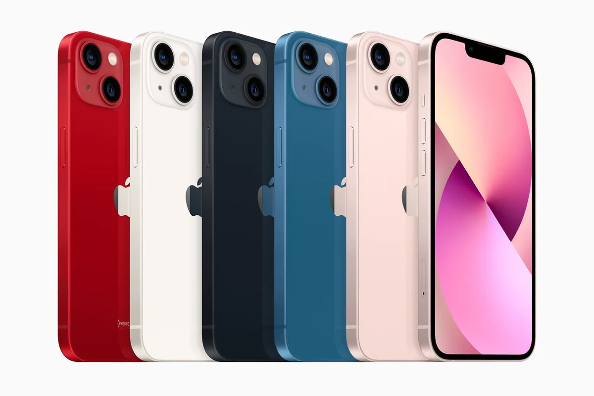

De iPhone 13 en 13 Pro zijn op smartphonegebied eigenlijk amper anders dan hun voorgangers van vorig jaar. Kijk je echter naar de camera’s, dan maakt Apple een paar forse stappen.

> [!NOTE]
> Deze recensie verscheen eerder op [AD](https://www.ad.nl/tech/de-iphone-13-lijkt-erg-op-de-12-maar-is-op-een-punt-flink-verbeterd~afc6ed69/).

De iPhone 13 en 13 Pro zijn vanaf vrijdag 24 september beschikbaar, maar deze site mocht vast als één van de eersten met de toestellen aan de slag. De techreus stuurde daarvoor alvast een exemplaar van de iPhone 13 Pro en de kleinere iPhone 13 mini op, die naast de gewone iPhone 13 en 13 Pro Max worden verkocht.

Telefoons die bijna niet van hun voorgangers te onderscheiden zijn. In grote lijnen is het ontwerp identiek aan de 12 en 12 Pro, met een glazen achterkant en metalen band rond het toestel. De verschillen zitten dit jaar in de kleine details: de camera’s zijn anders, met een diagonaal ontwerp op de gewone 13-toestellen en veel dikkere lenzen op beide varianten. De inkeping boven het scherm voor de gezichtsscanner en selfiecamera is ietsje smaller geworden en de telefoons zijn in nieuwe kleuren verkrijgbaar.

Het zijn veranderingen die eigenlijk alleen opvallen als je de oude en nieuwe telefoons naast elkaar houdt - een beetje als een autofabrikant die de zijspiegels van zijn nieuwste model heeft gewijzigd. Dat is overigens ook wat we hadden verwacht: Apple geeft zijn iPhones doorgaans iedere twee jaar een grote designupdate, wat vorig jaar bij de iPhone 12 gebeurde. De nieuwste telefoons zijn daar een revisie van, een soort iPhone 12S.

## Camera’s wel flink verbeterd

Waar de buitenkant van de nieuwe iPhone grotendeels ongewijzigd is gebleven, is er van binnen wel het één en ander veranderd. Laten we beginnen bij de camera’s: niet alleen zijn de lenzen achterop dikker dan bij vorige modellen (waardoor de telefoon een beetje wankel op tafel ligt), technisch is er het één en ander verbeterd.

De groothoeklens vangt volgens Apple meer licht op, iets dat we bij onze tests ook terugzien: foto’s met deze lens zijn over het algemeen helderder en scherper, ook als we op beide telefoons de speciale nachtmodus gebruiken.

Alle kleuren voor de nieuwe iPhone 13. © Apple

## Meer zoomen en macrofoto’s

Het grootste cameraverschil vind je in de Pro-telefoons, die voorzien zijn van een nieuwe telelens. Deze kan het beeld driemaal inzoomen in plaats van de dubbele zoom in de 12 Pro. Hoewel meer zoom ook grotere trillingen betekent, valt het ons bij de 13 Pro eigenlijk best mee: het ingezoomde beeld blijft stabiel dankzij de ingebouwde stabilisatie.

Ook kunnen de Pro-telefoons macrofoto’s maken, waarbij je een onderwerp van héél dichtbij ziet. Bij een foto van een aardbei zijn alle pitjes zichtbaar, en bij het vastleggen van je huid zie je iedere individuele porie scherp in beeld. Het is ontzettend leuk om mee te spelen, al is de vraag hoe lang macrofotografie leuk blijft. Hoe vaak maakt de gemiddelde telefoongebruiker zulke kiekjes?

Bij het maken van foto’s kun je voortaan wisselen tussen verschillende stijlen, met bijvoorbeeld een hoger contrast of warmere kleuren. Het lijken filters, maar ze zitten volgens Apple iets anders in elkaar: de camera berekent op basis van het huidige beeld wat moet worden aangepast. De voordelen daarvan zagen we vooral bij portretfoto’s: kleding en de achtergrond veranderen van kleur, terwijl de huid niet ineens grijs of oranje wordt.

## Speciale Filmmodus voor video’s

Voor videomakers is er een nieuwe Filmmodus, die opnames een cinematisch tintje geeft. De camera kijkt wat in het beeld gebeurt, zodat het belangrijkste onderwerp scherp in beeld blijft. Dat kan midden in het shot ook veranderen: bij een filmpje van twee personen was eerst de één duidelijk in beeld, waarna de scherptediepte verschoof naar de ander toen hij in de camera keek.

Het leukste aan Filmmodus: je kunt alles achteraf ook aanpassen. Met een paar tikken kun je het filmpje nog eens doorlopen en bepalen waar iets scherp moet zijn. Je maakt al snel een professioneel ogend filmpje zonder al te veel filmkennis.

## Apple wilde een betere camera maken

Het lijkt bijna of Apple dit jaar vooral een betere camera wilde maken. De iPhone 13 en 13 Pro zijn op andere vlakken namelijk niet zo significant verbeterd: de nieuwe processor is volgens Apple efficiënter en niet per se sneller, waar we in de praktijk nog niet superveel van merkten. Zware games starten ongeveer even snel op en apps werken net zo vloeiend als op de iPhone 12. Geen ramp, want de toestellen van vorig jaar waren ook al razendsnel.

Nieuw in de Pro-telefoons is een ProMotion-scherm dat met maximaal 120 beeldjes per seconde kan verversen. Animaties ogen hierdoor vloeiender, maar je moet een fijnproever zijn om dit te waarderen. Familieleden en collega’s die met ons meekeken zagen het verschil eigenlijk zelden. Het zal vooral interessant zijn voor de meest fanatieke gamers.

De accuduur van beide iPhones is vergroot - de iPhone 13 kan volgens Apple 1,5 uur langer op een volle accu worden gebruikt, wat bij de Pro-telefoons zelfs 2,5 uur is. In de halve week dat wij konden testen, is het lastig te zeggen of dat is waargemaakt. Wel kregen we het idee dat de telefoons inderdaad langer meegaan dan de 12 en 12 Pro.

## Conclusie

De iPhone 12 en 13 lijken verdraaid veel op elkaar: het zijn telefoons met nagenoeg hetzelfde ontwerp, die elkaar qua snelheid ook bijna niet ontlopen. Daar tegenover staat echter een camera die flinke stappen zet. Foto’s gemaakt door de iPhone 13 zijn bijna altijd mooier, terwijl toevoegingen zoals de Filmmodus, stijlen en macrofotografie het nodige nieuwe toevoegen.

Het lijkt alsof deze iPhones helemaal niet gemaakt zijn om met de smartphones van Samsung te concurreren, maar juist de strijd aangaan met de serieuzere camera’s van Nikon en Canon. Ieder jaar maakt Apple nieuwe stappen om de voordelen van een serieuze spiegelreflexcamera te vervangen door slimme softwaretrucs, waar we bij de nieuwste iPhones weer grote stappen van zien.

Daarmee is een duidelijke trend gaande: reken er op dat je toekomstige iPhones, zodra je gaat upgraden, het vooral van de cameralenzen moeten hebben.
