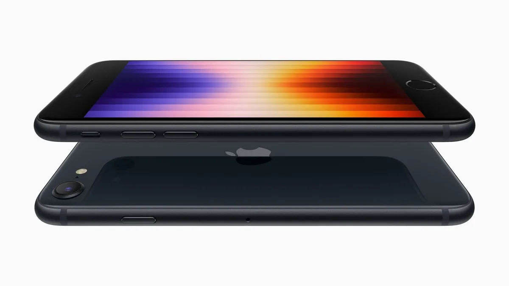

Met een prijs van ruim 500 euro is de nieuwe iPhone SE niet goedkoop te noemen, maar voor dat geld krijg je wel een buitengewoon krachtig toestel. Want hoewel hij er van buiten uitziet als de alweer acht jaar oude iPhone 6, is hij van binnen net zo snel als de iPhone 13.

> [!NOTE]
> Deze recensie verscheen eerder op [AD](https://www.ad.nl/tech/de-iphone-se-2022-is-een-iphone-13-in-oude-kleren~a9ef7013/).

Je zou de nieuwste iPhone zomaar met een exemplaar uit 2014 kunnen verwarren. Het scherm is wederom omhuld door twee dikke randen aan boven- en onderkant, terwijl aan de onderzijde ook een grote, ronde thuisknop prijkt. Het is een ontwerp dat jarenlang voldeed, maar dat veel techgiganten achter zich hebben gelaten. De iPhone ook: die heeft al vijf jaar lang een voorkantvullend scherm.

Een wat ouder ontwerp zie je vaker bij goedkopere smartphones, maar Apple lijkt op dit front af te wijken van zijn concurrenten: ook veel Android-telefoons van rond de 500 euro hebben inmiddels een moderner, randloos ontwerp, terwijl Apple bij zijn klassieke design zweert. De techreus lijkt overtuigd dat er nog een markt is voor telefoons met thuisknoppen. Wij vermoeden dat wat oudere telefoongebruikers er wellicht voor kiezen, die zijn dit gewend en willen wellicht niet iets nieuws leren.

## Zo snel als een iPhone 13

De behuizing is het enige dat ouderwets is aan deze nieuwe iPhone. Aan de binnenzijde zit een A15 Bionic-chip, dezelfde processor waar de iPhone 13 ook op draait. Het maakt de smartphone op papier net zo snel als zijn dubbel zo dure grote broer. Bij zware games moet hij zelfs iets sneller zijn, omdat op het kleinere scherm minder pixels verwerkt hoeven te worden.

Het maakt de telefoon bij alledaags gebruik in elk geval razendsnel. Bij onze tests merkten we amper verschil met de iPhone 13 Pro die we normaliter gebruiken en die een half jaar na introductie nog steeds hartstikke snel is. Het verschil met iets oudere iPhones is pas merkbaar als je zware games of bijvoorbeeld een videobewerker opstart.

Apple staat er om bekend zijn smartphones jarenlang van updates te voorzien: doorgaans krijgen telefoons zo’n vijf tot zes jaar alle grote nieuwe software-updates, met daarna soms ook nog beveiligingsfixes. Dat terwijl een toekomstbestendige concurrent die onze collega’s van [techsite BestGetest](https://bestgetest.nl/de-beste-midrange-smartphones-tot-500-euro-van-2022?utm_source=ad&utm_medium=tekstlink&utm_term=byo&utm_campaign=redactioneel&utm_content=iphonesereview) aanraden, de Galaxy a52s, hooguit vier jaar aan updates krijgt.

iPhone SE (2022). © Apple

## Over vijf jaar ook nog snel, maar wat claustrofobisch

Die snelle chip maakt de nieuwe iPhone SE meteen een goede investering. Het lijkt nu wellicht wat overkill, een telefoon die net zo snel is als het model van ruim duizend euro. En het kan verleidelijk zijn om voor half het geld dan een Android-model met een groter scherm te halen. Maar door die A15 Bionic-processor is de kans groot dat deze telefoon over vijf jaar ook nog de nieuwste apps goed draait.

Je moet dan wel genoegen nemen met een kleiner scherm dan bij de concurrentie. Door de dikke randen aan boven- en onderzijde is het display naar hedendaagse standaarden piepklein, zo’n 4,7 inch. Dat zal geen probleem zijn als je overstapt van een wat oudere iPhone 6, 7 of 8, maar het voelt wat claustrofobisch als je van een randloos Android-toestel komt.

## Matige camera

De camera van de iPhone SE is niet zo om over naar huis te schrijven. Achterop zit slechts één lens, die bij goed daglicht aardige foto’s maakt. Het is goed genoeg voor alledaagse kiekjes om met familie te delen, maar met 12 megapixel ligt de resolutie wat laag.

Het toestel kan wel gebruikmaken van wat softwaretrucs om je foto’s te verbeteren. Bij portretten kun je bijvoorbeeld kleuren verbeteren zonder dat iemands gezicht oranje meekleurt. Maar de door ons geliefde nachtmodus ontbreekt dan weer, waardoor foto’s bij weinig licht vaak korrelig en onscherp uit de verf komen.

## Conclusie

Wie een iPhone SE (2022) wil, moet op wat punten inleveren. De camera is niet heel spannend en het scherm is klein. Dat zijn punten waarop je bij Android-concurrenten vaak iets beters kunt vinden voor deze prijs, maar daar staat tegenover dat de iPhone SE de snelste iPhone-processor van dit moment bevat.

Het maakt het toestel razendsnel, waardoor het over vijf jaar ook nog goed meegaat. Dat durven we van veel concurrenten in deze prijsklasse niet te zeggen.

Persoonlijk hebben we liever een smartphone die vijf jaar lang supersnel blijft aanvoelen, dan dat we over twee of drie jaar moeten upgraden omdat een toestel met groot scherm alweer begint te haperen. Wat dat betreft is de iPhone SE dan een uitstekende investering, mits je bereid bent op een paar punten in te leveren.
