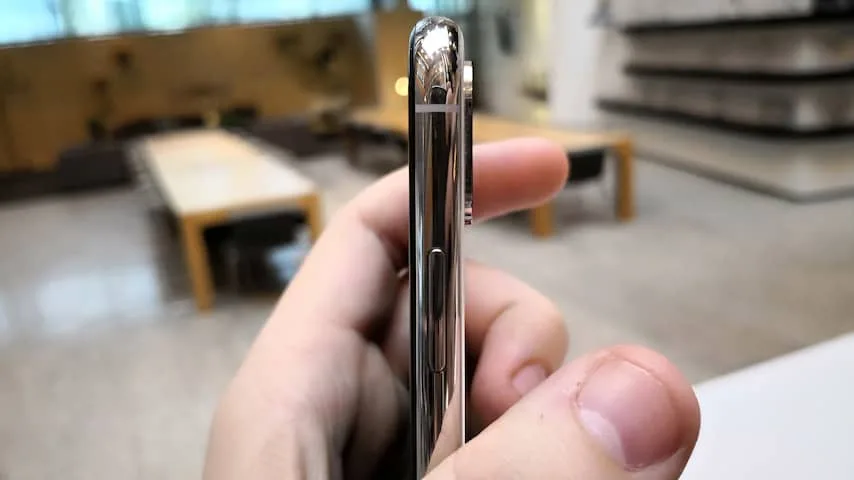
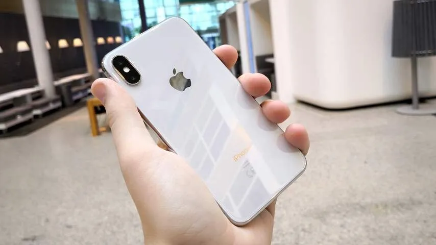
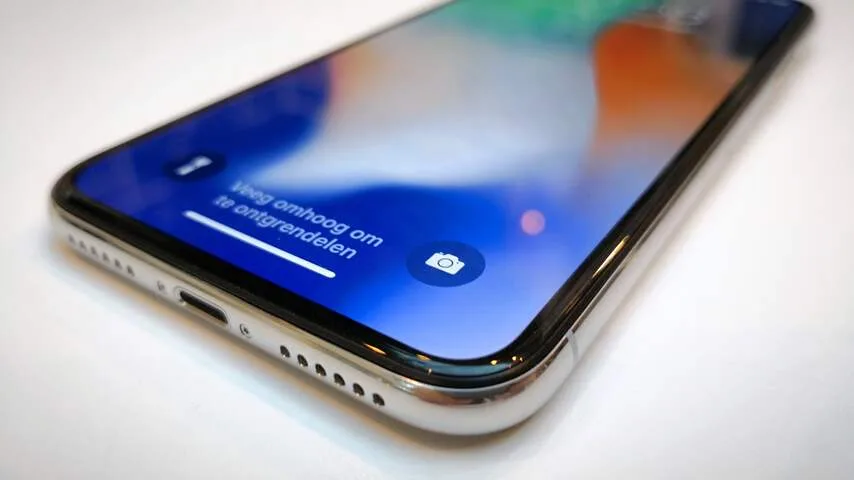
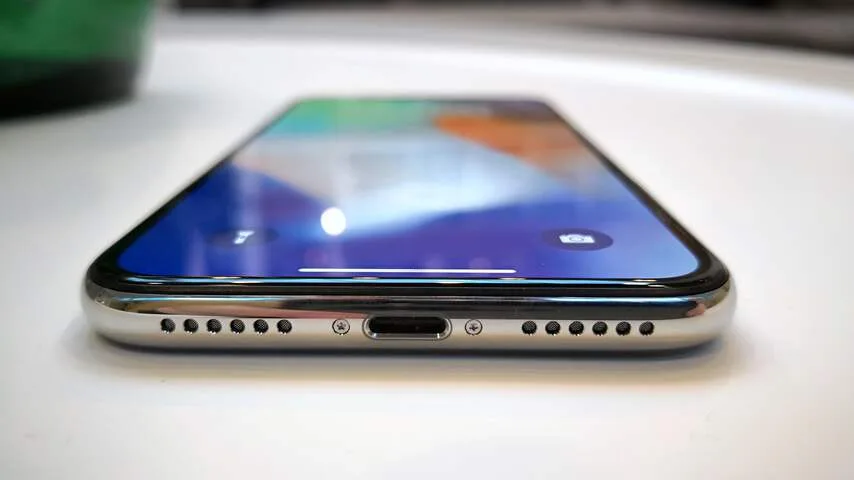
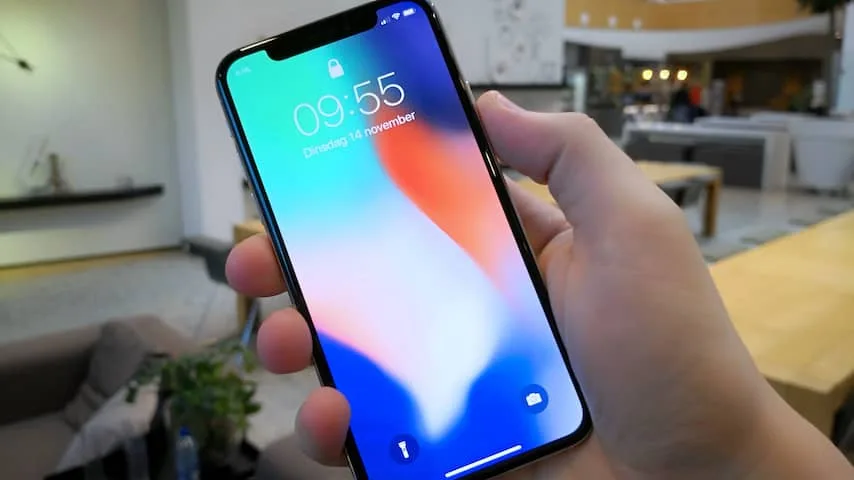

**De hoge prijs van 1159 euro en de ‘hap’ uit het scherm van de iPhone X waren de afgelopen maanden omstreden discussiepunten. Maar is de nieuwe iPhone nou ook een goede smartphone?**

> [!NOTE]
> Deze recensie verscheen eerder op [NU.nl](https://www.nu.nl/reviews/5006087/review-iphone-x-is-een-duur-voorproefje-van-de-toekomst.html).

We lijken middenin het jaar van de 'randloze' smartphones te zitten. Sinds Samsung en LG dit voorjaar telefoons met aanzienlijk dunnere schermranden presenteerden, heeft nagenoeg iedere telefoonfabrikant een telefoon uitgebracht waarbij de randen flink zijn verkleind.

Apples iPhone 8 eerder dit jaar had nog dikke randen, maar met de iPhone X kiest het bedrijf dan toch eindelijk voor een randloos ontwerp. De manier waarop Apple dit doet verschilt van de Android-concurrentie. De meeste Android-toestellen hebben aan de boven- en onderkant iets dunnere schermranden en zijn aan de zijkanten helemaal randloos, maar de iPhone heeft zijn dunne rand verspreid over alle zijkanten.

De rand is daarom aan alle kanten haast niet op te merken. Hierdoor bevat de telefoon een groter 5,8 inch-scherm, maar zit hij qua toestelgrootte tussen de iPhone 8 (4,7 inch) en 8 Plus (5,5 inch) in.

Er is één uitzondering: bovenop de telefoon zit een opmerkelijke hap uit het scherm, die ruimte biedt voor de nieuwe selfiecamera en -sensoren. Deze zijn vereist voor het gebruik van gezichtsherkenning, maar ze geven de iPhone X tegelijkertijd een wat vreemd ontwerp. Door de inham lijkt het iPhone-scherm haast op een klein klembord.

## Scherm

Sommigen zullen de inkeping van het scherm lelijk noemen, maar tot nu toe zijn er weinige praktische bezwaren tegen te verzinnen. Apps ontworpen voor de iPhone X tonen hun informatie er omheen, waardoor er nooit wat ontbreekt. Niet-geoptimaliseerde apps zien er wat lelijk uit omdat er zwarte balken aan de boven- en onderkant worden getoond, maar het aantal aangepaste apps viel ons in de eerste week nog wel mee.

Bij het afspelen van video is de inkeping ook geen bezwaar, omdat ook hierbij zwarte balken aanwezig zijn om een 16:9-beeldverhouding te kunnen hanteren. Een klein minpunt is dat het batterijpercentage niet langer in de statusbalk wordt getoond, maar deze is nog wel te zien door het bedieningspaneel te openen.

[Bekijk ingesloten media](https://content.jwplatform.com/players/IcpjBsmJ-whqXCOFb.html)

Apple gebruikt in de iPhone X voor het eerst een OLED-scherm. Dat is ook te zien: leg de iPhone naast een eerder model en het wordt duidelijk dat kleuren levendiger en zwartwaarden donkerder zijn. OLED-schermen hebben soms wat de neiging om kartelige vormen te tonen, maar bij de iPhone X is daar geen sprake van.

We merkten bij onze tests wel dat het scherm soms slecht reageert bij buitengebruik. Volgens Apple is dit een probleem dat kan opspelen bij grote temperatuurverschillen en wordt er gewerkt aan een oplossing in de vorm van een software-update. Het is een vervelende bug, maar zorgt slechts af en toe voor problemen.

Op het ontwerp van de telefoon is verder niet veel aan te merken. De roestvrijstalen zijkant is vergelijkbaar met die van eerdere iPhones en de behuizing doet denken aan de iPhone 8 die in september uitkwam. Net als veel concurrenten heeft Apple gekozen voor een glazen achterkant om de nieuwe draadloze oplader te laten werken. En net als bij die concurrenten raakt het glas wat snel bevlekt.

## Geen thuisknop

Door het randloze ontwerp ontbreekt de thuisknop op de iPhone. Wil je terug naar het thuisscherm, dan moet je voortaan vanaf de onderkant van het scherm omhoog vegen. Het bedieningspaneel met snelle instellingen voor bijvoorbeeld wifi en Bluetooth kan daarom niet langer met een veeg naar boven worden geopend, maar vereist een swipe vanaf de rechterbovenhoek van de telefoon.

Dat is in eerste instantie even wennen. Voor het eerst in jaren worden twee belangrijke functies op een totaal andere manier bediend. Wie al langere tijd iPhones gebruikt, zal daarom af en toe per ongeluk het verkeerde venster openen. Daarnaast zit het bedieningspaneel nu op een wat onhandige plek bovenin het scherm, die met een duim moeilijker te bereiken is dan voorheen het geval was.

Onderaan het scherm staat een balk, die er aan herinnert dat een veeg omhoog teruggaat naar het iconenscherm. Hierdoor hebben veel apps wat loze ruimte, waar geen plek is voor bijvoorbeeld extra knoppen.

## Face ID

De iPhone X heeft geen vingerafdrukscanner zoals voorgaande toestellen, maar gebruikt gezichtsherkenning. Kijk naar de telefoon om hem - mits de verificatie slaagt - te ontgrendelen met behulp van Face ID. De iPhone scant het gezicht met een dot-projector, infraroodcamera, infraroodlamp en een gewone camera. Je stelt Face ID in door simpelweg twee keer met het gezicht te draaien.

In de meeste gevallen werkt Face ID naar verwachting. De foutmarge ligt ongeveer even hoog als bij de Touch ID-vingerlezer op eerdere iPhones, die het in de meeste gevallen ook prima deed. Op gemiddeld een enkel moment per dag moet je alsnog een code invoeren, omdat de scanner je niet goed ziet.

Qua snelheid is Face ID vergelijkbaar met de eerste vingerafdrukscanner van de iPhone 5S. De Touch ID-lezer in de recentere iPhone 6S en iPhone 7 is naar ons idee wat sneller, maar daar staat tegenover dat Face ID geen actieve handeling vereist. Je hoeft alleen naar het toestel te kijken, waardoor hij vaak al is ontgrendeld op het moment dat je normaliter pas je vinger zou gaan scannen.

_iPhone X — Beeld: NU.nl/Bastiaan Vroegop_

_iPhone X — Beeld: NU.nl/Bastiaan Vroegop_

_iPhone X — Beeld: NU.nl/Bastiaan Vroegop_

_iPhone X — Beeld: NU.nl/Bastiaan Vroegop_

_iPhone X — Beeld: NU.nl/Bastiaan Vroegop_

Die gezichtsherkenning wordt daarnaast op een paar leuke manieren door Apple ingezet. De meest noemenswaardige zijn de Animoji. In iMessage is het mogelijk een emoji te animeren, waarbij iedere beweging van het gezicht naar het scherm wordt vertaald. Het is een duidelijke gimmick, maar wel eentje die demonstreert hoe goed de gezichtstracking werkt.

Daarnaast zitten er kleine dingen in de iPhone-software verborgen. Een wekker verlaagt zijn volume als er naar de iPhone wordt gekeken en het scherm blijft geactiveerd zo lang je ernaar blijft kijken. De gezichtsherkenner van de iPhone X werkt ook in donkere ruimtes, iets dat andere smartphonemakers nog niet is gelukt. Dat krijgt Apple voor elkaar met behulp van de infraroodlamp die het gezicht verlicht, zodat de infraroodcamera in het donker een scan maakt.

## Camera’s

De twee 12 megapixel-camera’s achterop de iPhone X zijn vergelijkbaar met die van de iPhone 8. Met een knop in de camera-app is het mogelijk om te schakelen tussen de twee lenzen, waardoor het ook mogelijk is om in te zoomen.

Uniek aan de iPhone X is dat allebei de lenzen gebruikmaken van optische beeldstabilisatie, terwijl dit bij de iPhone 8 alleen bij de uitgezoomde groothoeklens gebeurt. Een verademing, want juist bij de zoomlens hebben we graag een gestabiliseerd beeld om wazige beelden te voorkomen.

Verder is de beeldkwaliteit van de camera’s ongeveer gelijk. Vergelijk je de iPhone X met de eerdere iPhone 7, dan zien foto’s er bij lage lichtomstandigheden iets mooier uit. De hoeveelheid megapixels is gelijk gebleven, dus ook de resolutie is gelijk gebleven.

De portretmodus van de iPhone X is op softwareniveau verbeterd. Het was al mogelijk om een portretfoto met onscherpe achtergrond te maken, maar nu kan de functie ook de belichting van het onderwerp aanpassen. Een leuk idee dat niet heel goed uit de verf komt. Vaak wordt het onderwerp verkeerd uitgeknipt, wat zorgt voor een raar eindresultaat. Ook deze functie zat al op de iPhone 8.

De sensoren van Face ID zorgen ervoor dat de portretmodus voor het eerst ook werkt met de selfiecamera van de iPhone. Hierdoor is het makkelijker om een enigszins professioneel ogend zelfportret te schieten, al is de beeldkwaliteit alsnog een stuk slechter dan bij de camera’s achterop de telefoon.

## Conclusie

De iPhone 8 die eerder dit jaar verscheen, had al dezelfde chip en camera als de iPhone X. Maar het lijkt er op dat Apple de echt grote vernieuwingen had bewaard voor de iPhone X. Na het randloze scherm een week te hebben gebruikt, vinden we het nu al lastig om terug te gaan naar dikkere schermranden.

Maar het indrukwekkendst is misschien wel de Face ID-scanner. Dit is de eerste iPhone die op ieder moment weet of je er naar kijkt. Het ontgrendelen van je telefoon gebeurt hierdoor zonder dat je er iets voor hoeft te doen, zelfs in het donker. Dat voelt als een gigantische stap.

Is dat allemaal 1159 euro waard? Niet voor iedereen. De iPhone X voelt als een kijkje in de toekomst voor Apple, met functies die op termijn hopelijk in telefoons vanaf 800 euro zullen verschijnen. Early adopters en grote Apple-fans zullen bereid zijn om daar nu alvast de volle hoofdprijs voor betalen, maar de meer prijsbewuste kopers kunnen misschien beter kiezen voor een wat betaalbaarder toestel.
