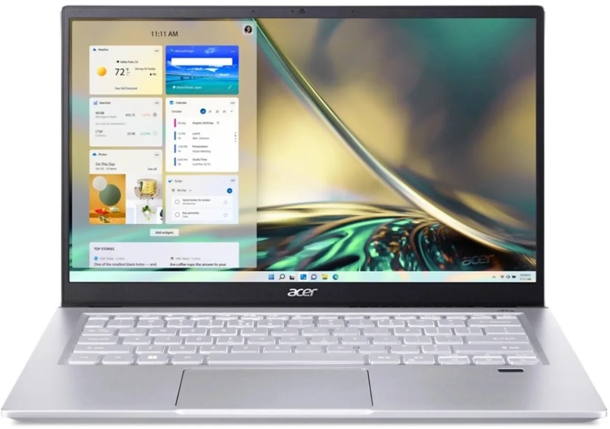
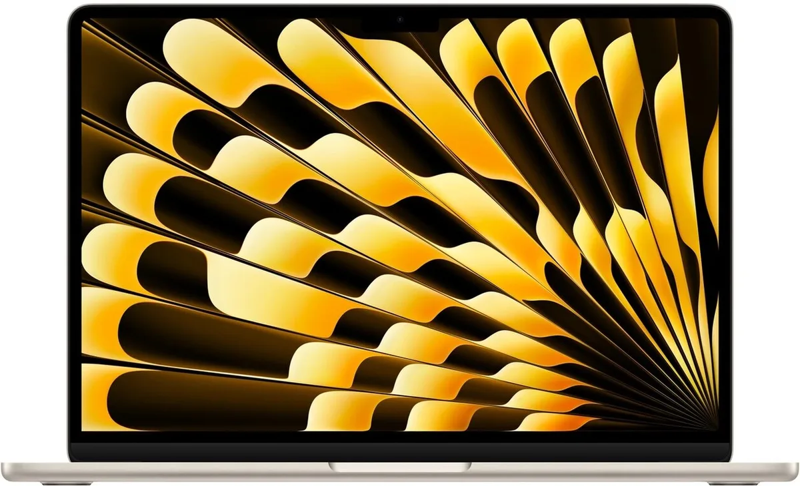

De tijd dat je al het schoolwerk deed met een oud notitieblok is voorbij - steeds meer opleidingen verwachten dat je een laptop gebruikt. We zetten de beste modellen in aanloop naar het nieuwe schooljaar daarom op een rij.

> [!NOTE]
> Deze recensie verscheen eerder op [AD](https://www.ad.nl/tech/in-aanloop-naar-het-nieuwe-schooljaar-deze-laptop-komt-als-buitenkansje-uit-de-test~a2c9ee1a/).

Onderstaande laptops zijn geselecteerd door de redactie van Tweakers, die het hele jaar door honderden apparaten test om de beste te selecteren. De volledige test vind je [op deze pagina](https://tweakers.net/best-buy-guide/laptops/).

## De beste laptop tot 700 euro: Acer Swift X SFX14-42G-R0KK

De Swift X. © Tweakers

Tweakers beschrijft de **Swift X** als een buitenkansje: de gebruikte hardware levert flink wat grafische prestaties voor een toch redelijke prijs van 699 euro. Daardoor zou je tussen de lessen door zelfs een beetje kunnen gamen op dit model.

Bovendien is het een vrij compact apparaat: het scherm is 14 inch groot, waardoor de laptop niet je hele bureau in beslag neemt. Met zijn gewicht van 1,5 kilo til je hem ook makkelijk mee zonder dat je tas al te zwaar wordt.

Het scherm is lekker helder en ondersteunt veel kleuren, al is het beeld wat Tweakers betreft wat te blauw afgesteld. De 16 gigabyte werkgeheugen en 512 gigabyte opslag zijn wel ruim voldoende. Heb je toch meer nodig, dan is het bij deze laptop vrij makkelijk om later extra opslag te installeren.

## Het beste van Apple: MacBook Air 2024

MacBook Air. © Tweakers

In maart 2024 bracht Apple een nieuwe versie van zijn **MacBook Air** uit, met daarin een betere chip dan voorheen. De laptop is hierdoor 20 procent sneller dan de vorige Air en kan nu twee externe beeldschermen tegelijkertijd gebruiken. Ook is er snellere wifi aan boord - maar dan moet je ook een vrij nieuwe router hebben.

Het is een laptop die, zoals we van Apple gewend zijn, goed is afgewerkt. De behuizing is gemaakt van stevig metaal en centraal staat een mooi scherm met een hoge resolutie. De kleuren hierop zijn strak gekalibreerd, wat het een goede laptop maakt voor bijvoorbeeld fotobewerking. Ook de accuduur is goed: bij licht gebruik houdt deze Mac het maar liefst 15,5 uur vol.

De Air is Apples goedkoopste laptopreeks, maar het instapmodel is niet te adviseren: verstandiger is om een iets duurder model met 16 gigabyte werkgeheugen te halen, zodat je ook iets zwaardere software goed kunt draaien. Daardoor ben je rond de 1.600 euro kwijt voor een nieuwe Mac.

## Verantwoording

_In deze rubriek schrijven we over technologische apparaten die door Tweakers zijn beoordeeld. Bij Tweakers wordt ieder apparaat onderzocht door het testlab, waar onder andere accuduur, snelheid en andere belangrijke aspecten worden getoetst._

_De redactie van Tweakers is volledig onafhankelijk. Bedrijven betalen op geen enkele manier om in deze artikelen behandeld te worden._
