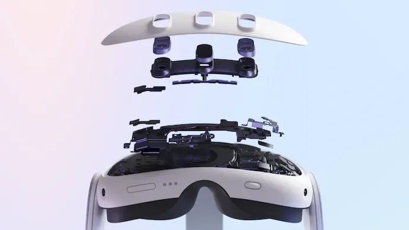
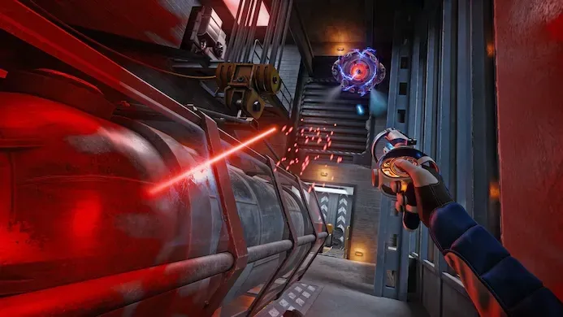
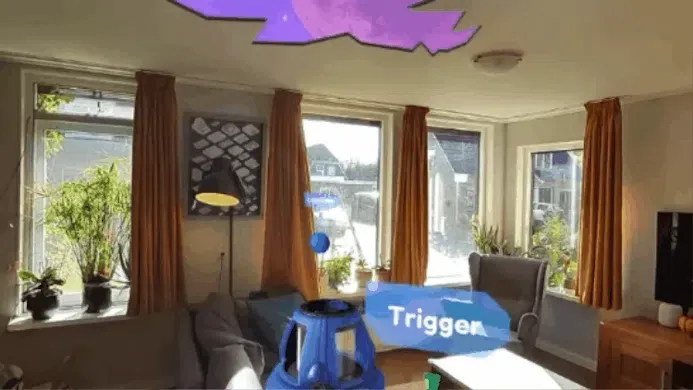
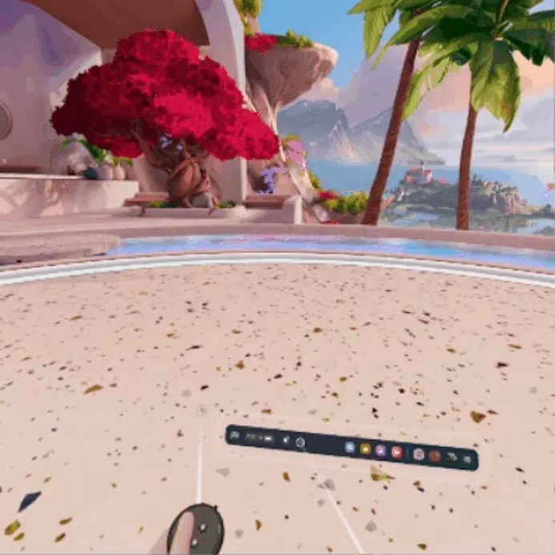
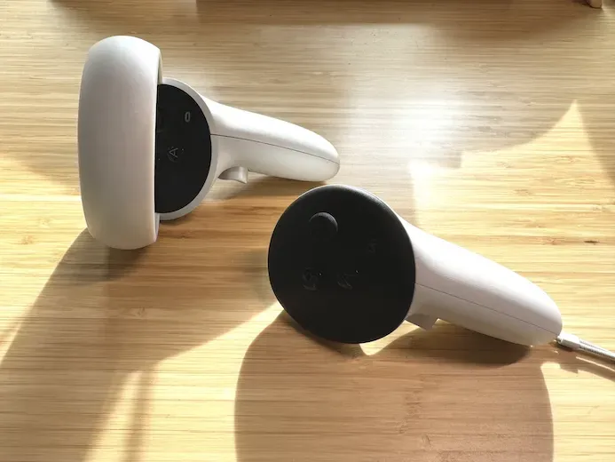
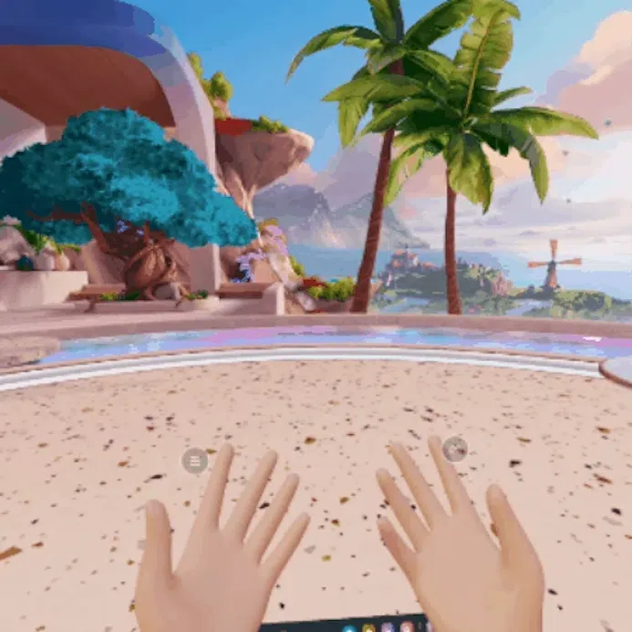

In 2020 kopten we bij de Meta Quest 2-review dat de headset "in bijna alles beter" was geworden. Eigenlijk zouden we die titel kunnen recyclen voor de Quest 3, al zijn er een paar dingen waar je goed op moet letten.

> [!NOTE]
>
> Deze recensie verscheen eerder op [Gamer.nl](https://gamer.nl/reviews/hardware/overige-pc/review-meta-quest-3-maakt-vr-comfortabeler-mooier-en-veel-toegankelijker/).

Het door Meta overgenomen Oculus trapte de huidige vr-generatie ooit af met de Rift, maar boekte pas echt succes met de Quest-brillen. Dankzij een ingebakken chip draaien ze apps en games zelfstandig, zonder dat je een game-pc of console nodig hebt.

De Quest 2 was een uitstekende bril, maar had een paar kleine mankementen. Door alle bijgevoegde hardware was hij bijvoorbeeld best zwaar aan de voorzijde, terwijl de standaard bijgeleverde hoofdband dat gewicht niet goed opving. Een alternatieve band was dan ook een must.

## Dunner is beter

De Quest 3 doet een hoop om dat probleem op te lossen, bijvoorbeeld door de bril compacter te maken. Hij is maar liefst veertig procent minder dik, waardoor hij dichter bij het formaat van een skibril komt. Hij weegt een paar gram meer dan zijn voorganger, maar door dit dunnere ontwerp zit al dat gewicht dichter op je gezicht, waardoor hij in de praktijk lichter aanvoelt.

De standaard bijgeleverde hoofdband is ook verbeterd en verspreidt het gewicht beter over je hele hoofd. Helaas is deze verbetering relatief: de Quest 3 zit met de standaard band comfortabeler dan de Quest 2, maar na een uur spelen begint de bril alsnog oncomfortabel tegen het gezicht te duwen. Het leidt tot hoofdpijn of een verdoofd voelende hoofdhuid. Net als bij de Quest 2 kun je ook voor de Quest 3 een alternatieve band kopen. Wij zouden dan kiezen voor één van BoboVR - het officiële model van Meta zelf is met 80 euro duur.

Bij de Quest 2 was de noodzaak voor een nieuwe hoofdband beter te rechtvaardigen, gezien de bril met 350 euro spotgoedkoop was. De Quest 3 ligt vanaf 550 euro in de winkel, wat dit lastiger te verantwoorden maakt. Een klein smetje op een verder uitstekende headset.

## Geen mist, mooi geluid

Wel fijn: het nieuwe ontwerp lijkt ervoor te zorgen dat de lenzen minder snel beslaan. De Quest 2 moesten we af en toe afzetten om de lenzen schoon te maken, maar bij de Quest 3 hoeft dat bijna nooit. Daarnaast is de headset prima te dragen in combinatie met een bril. Heb je een groot model, dan kun je de ring rond je gezicht met een knopje anders afstellen zodat hij beter past. Al wordt je kijkhoek dan wel iets kleiner.

In plaats van een koptelefoon heeft de Quest 3 twee kleine sleuven die geluid rechtstreeks naar je oren geleiden. Dat klinkt mooier en ruimtelijker dan bij de Quest 2, met ook een beter voelbare bas. Dit geluid is wel goed hoorbaar voor je omstanders, dus een koptelefoon is handig als je niemand tot last wil zijn. Die kun je aansluiten op de koptelefoonpoort: bluetooth had bij onze tests een vertraging van maar liefst een seconde, wat het onbruikbaar maakt in vr.

[Bekijk ingesloten media](https://www.youtube.com/embed/NVfRZL5ALC8?enablejsapi=1&origin=https%3A%2F%2Fgamer.nl&widgetid=1)

## Pannenkoeken voor je ogen

Het dunnere ontwerp van de Quest 3 is deels mogelijk door de nieuwe, zogeheten pancake-lenzen. Deze kunnen dichter op het scherm zitten dan de fresnel-lenzen die andere headsets gebruiken, zonder dat het beeld onscherper wordt. De lenzen die Meta bij de Quest 3 heeft gebruikt zijn de beste die we ooit in een headset hebben gezien. Het beeld is helder en heeft een onwijs grote 'sweet spot', waardoor je niet op zoek hoeft naar die ene positie om het beeld scherp te maken. Je zet 'm op en bent klaar.

Die scherpte wordt geaccentueerd door de terugkeer van een mechanische IPD-schakelaar. Deze laat je de afstand tussen beide schermen aanpassen, afhankelijk van de afstand tussen je eigen pupillen. Een groot gemis op de Quest 2, dus fijn dat dit weer is teruggekeerd.

Van zogeheten 'godrays' - lichtstrepen die ontstaan als je bijvoorbeeld een groot wit logo ziet op een zwarte achtergrond - is ook bijna geen sprake. Alleen al deze lenzen zijn de aanschaf van een Quest 3 waard.

## Hogere resolutie, grotere kijkhoek

De Quest 3 heeft een resolutie van 2064 bij 2208 pixels per oog - een lichte upgrade vergeleken met de Quest 2. De gecombineerde resolutie komt neer op een scherm scherper dan een 4K-televisie, maar dan vlak voor je ogen. Het is voldoende om games mooi scherp te maken, zonder dat je een soort 'hordeur' tussen de pixels ziet zoals bij oude vr-headsets.

De kijkhoek is ook groter geworden. Meta belooft een hoek van 110 graden, terwijl de Quest 2 zo'n 90 graden had. In de praktijk haalden wij die 110 graden bij tests nooit - waarschijnlijk omdat we een bril droegen en iets verder van het scherm zaten. Maar een kijkhoek van 100 tot 105 graden tikten we wel aan.

## Diagonale schermen

Die grotere kijkhoek is te danken aan een slimme, nieuwe positie voor de schermen. Ze zijn allebei een klein beetje gekanteld, waardoor ze feitelijk diagonaal voor je ogen hangen. En omdat een schermdiagonaal groter is dan de horizontale positie, heb je hierdoor een groter scherm. Je merkt dat in de linker- en rechterbovenhoek een klein hoekje zwart te zien is, maar in de praktijk is dat geen groot probleem: games laten zelden iets in die hoeken zien, wat in het middenveld gebeurt is belangrijker.

Die diagonale positie van het scherm zorgt er voor dat vlakke objecten zoals virtuele schermen een klein beetje aliasing laten zien. De hoeken hiervan worden niet meer op een rechte rij pixels getoond, waardoor je een licht kartelrandje ziet als je er op let. Gelukkig is dat alleen bij menu's merkbaar en nooit storend.

## Visueel prachtige games

De nieuwe Qualcomm XR2 Gen2-processor maakt grafisch mooiere games mogelijk. Dat was bij verschillende games ook meteen goed zichtbaar: vooral Red Matter 2 ziet er nu fenomenaal uit, tot op het punt dat hij haast niet te onderscheiden is van een pcvr-game. Games hebben grotere textures en dynamische schaduwen - al vreet de chip wel zoveel stroom dat de bril een acccuduur van hooguit twee uur heeft, net als de Quest 2.

De meest hoogwaardige games blijven uiteraard het mooist op een pc of PS VR2. Maar dat is een handjevol spellen waarbij de verschillen niet eens zó groot zijn. De Quest 3 weet prima te concurreren, met als groot voordeel dat je hem overal zonder extra machines kunt gebruiken.

## Maar ook grotere games

Eén ding om rekening mee te houden: games met mooiere textures hebben ook een hogere bestandsgrootte. Op moment van schrijven konden we nog best veel games kwijt op een Quest 3 met 128 gigabyte opslag, met als grootste titel het 10 gigabyte tellende Red Matter 2. Maar het kan zijn dat games met de jaren groter worden en deze opslag krap gaat aanvoelen.

Het is ook wat zuur dat gamemakers geen individuele downloads kunnen maken voor de Quest 1, 2 en 3. Een Quest 2 met 64 gigabyte opslag moet straks de grotere bestanden van een Quest 3-game downloaden, en loopt dus vol zonder dat daar mooiere games tegenover staan. Het dwingt je haast een Quest 3 met meer opslag te kopen.

## Drie pillen vol sensoren

Het simpel witte exterieur van de Quest 2 is opgevolgd door een ontwerp met daarop drie zwarte pillen voorop. Daarin zitten de camera's en sensoren die worden gebruikt om je kamer te scannen: aan de buitenzijdes vind je nieuwe kleurencamera's, waarmee je met behulp van passthrough de echte wereld kunt zien. Die functie zat al in de Quest 2, maar was daarin zwart-wit.

In het midden vind je de nieuwe dieptesensor. Deze scant continu de afstand tussen jou en objecten in de kamer. Hierdoor kan de bril bijvoorbeeld automatisch je speelveld in de kamer vastleggen en hoef je niet meer met de hand een veld op de vloer te tekenen.

## Mixed reality

Door die sensoren werkt de Quest 3 ook met mixed reality, oftewel augmented reality. De bril toont virtuele objecten bovenop de echte wereld, wat wordt gedemonstreerd met de game First Encounters. Hierin schiet je op aliens die door de muren van de kamer breken. Dat zit verrassend precies in elkaar: een ruimteschip dat op een schuin object landt beweegt bijvoorbeeld zijn poten in precies de juiste positie.

Het is een beetje een gimmick, en het is lastig een complexe game voor mixed reality te ontwerpen - je bent als speler immers altijd gebonden aan de kamer waar je bent. Toch merkten we dat First Encounters ons een vrijheid bood die we in gewone vr-games nooit voelen. Omdat je de echte wereld ziet en dus exact weet waar stoelen, banken of slapende honden zijn, beweeg je vrijer door je omgeving heen.

De mixed reality-optie van Demeo was ook best leuk om te spelen. Dit Dungeons & Dragons-achtige spel laat je met poppetjes door een kerker bewegen en monsters verslaan, alleen of samen met een groep online spelers. Zet je de mixed reality-schakelaar om, dan wordt het speelveld op je eet- of salontafel getoond, met daaromheen spelers die online bij je aan tafel zijn gesprongen. Een toffe mix tussen een fysiek bordspel en iets digitaals

## Vroeg stadium voor ar

Toch merk je dat de mixed reality-functie zich nog in een vroeg stadium bevindt. De camera's zijn bijvoorbeeld nog niet megagoed - wat te verwachten is bij een apparaat van 550 euro. Bij goed licht is de omgeving goed te zien, maar zodra het 's avonds donkerder wordt ontstaat er veel ruis en zijn donkere vlakken die je in het echt prima kunt zien ineens pikzwart. Overdag kun je zonder problemen je smartphonescherm vanuit de Quest bekijken, 's avonds lukt dat minder goed.

Daarnaast is er vrij veel sprake van 'warping', waarbij de echte wereld soms lijkt te vervormen. Dat komt door de dieptesensor die een dieptekaart probeert toe te passen op alles om je heen, die soms wat langzamer is dan je eigen ogen. Niks storends, maar het herinnert je er extra aan dat je in een digitale omgeving loert.

De virtuele omgeving wordt altijd bovenop de echte wereld geplakt. Lijkt het alsof een virtueel scherm aan de muur hangt en staat daar iemand voor? Dan zal die persoon er in de Quest 3 alsnog achter lijken te staan. Meta belooft dat in de toekomst middels software-updates op te lossen.

## Geen tracking-ringen meer

De Touch-controllers van de Quest 2 zijn voornamelijk op één punt veranderd: de grote ring bovenop is weg. Hierin zaten de infraroodlampjes die de brilsensoren gebruikten om de positie van je handen te bepalen, maar Meta heeft diezelfde lampen nu in de controller zelf weten te integreren. Je zou denken dat dit minder precies werkt, maar in de praktijk merkten we eigenlijk geen verschil.

Het verdwijnen van de ringen maakt ze een stuk comfortabeler in gebruik. Ze stoten niet meer tegen elkaar als je jouw handen vlakbij elkaar brengt, bijvoorbeeld om te klappen of een groot wapen vast te houden. Daarnaast waren het de ringen die het snelst per ongeluk tegen een muur knalden, wat nu geen probleem meer is.

De trilmotor is vervangen met een kleine speaker die op verschillende volumes kan vibreren, hetzelfde systeem dat Sony in zijn DualSense-controllers gebruikt. Je merkt dat vooral in de interface van Meta, waar bijvoorbeeld een menuklik een subtiel gevoel meegeeft.

## Bizar goede accu

Verder is er eigenlijk niets aan te merken op de controllers. De batterijduur is nog steeds bizar goed - bij een week rigoureus testen zagen we de acculading niet naar beneden springen. Bij de Quest 2-versie schoof het batterijklepje soms per ongeluk naar beneden, maar een extra zekeringsknopje voorkomt dit bij de Quest 3.

Het is ook fijn dat Meta nu zelf 'active straps' verkoopt, waarbij je de controller aan je hand vast kunt gespen en hem niet continu vast hoeft te houden. Voor 50 euro is dat wel een prijzige accessoire, maar omdat het systeem in de batterijklep zit verwerkt hoef je niet een lelijk hoesje om je controller te binden zoals bij opties van derden.

## Handtracking

De Quest 3 kan ook zonder controllers worden bestuurd. De ingebouwde sensoren detecteren dan de vorm van je handen, zodat je bijvoorbeeld je wijsvinger en duim tegen elkaar kunt tikken om het hoofdmenu te openen.

Meta introduceerde handtracking al bij de Quest 2, maar de functie is sindsdien duidelijk verbeterd via software-updates. Het is een verschil van dag en nacht sinds we er voor het laatst mee experimenteerden. Iets intikken op een toetsenbord gaat moeiteloos, en je kunt door menu's swipen alsof je naar een gigantische tablet kijkt.

Bij simpele games is de handbesturing hartstikke prima, en we gebruikten handtracking vaak om bijvoorbeeld een film aan te zetten. Tenminste, als er genoeg licht is. Bij schemering worden handen minder goed door de camera's gedetecteerd en krijg je een waarschuwing in beeld dat je beter je controllers kunt gebruiken.

Er zijn ook situaties waarin de hand- en controllerbesturing gecombineerd worden: bij het vasthouden van de controller kun je een wijsvinger uitsteken en daarmee op een virtuele knop drukken. Het is iets kleins, maar laat zien op wat voor niveau Meta nadenkt over vr-besturing.

## Het aanbod groeit langzaam

De meest gehoorde kritiek op de Quest 2 ging voornamelijk over het gamesaanbod. Na een korte periode waarin ontzettend veel tofs verscheen, stond de ontwikkeling van noemenswaardige vr-games ineens stil. Daar zie je nu nog de tekenen van: hoog in de beststeller-lijst vind je Beat Saber, Virtual Desktop en Blade en Sorcery, games en apps die al jarenlang beschikbaar zijn.

Toch is het niet zo dat gamemakers hebben stilgezeten. Met de jaren zijn er wat nieuwe hits bijgekomen, zoals de uitstekende dungeon crawler Dungeons of Eternity en de roguelike The Light Brigade. Beat Saber heeft er met Synth Riders een concurrent bij en het vorig jaar verschenen Bonelab is de vr-equivalent van Garry's Mod geworden. Er is best wel wat nieuws te vinden.

Het is jammer dat er met de verkoopstart van de Quest 3 geen toffe launchtitel is, maar in het najaar staan wel veel significante vr-games gepland. Asgard's Wrath 2 verschijnt bijvoorbeeld in december en is gratis voor iedere Quest 3-bezitter. Ubisoft werkt aan het indrukwekkend ogende Assassin's Creed Nexus en zelfs Bulletstorm krijgt een vr-port. Hopelijk zijn die games een springplank naar meer reguliere, geweldige titels.

## Het beste totaalpakket

Natuurlijk: leg je de Quest 3 naast een hoogwaardige pcvr-bril zoals de Beyond of één van Pico, dan zal hij op een paar hardwarematige punten de wedstrijd verliezen. Die headsets kunnen een hogere resolutie renderen omdat ze een zware grafische videokaart benutten en duurdere oled-schermen integreren omdat ze niet hoeven te investeren in chips om games zelfstandig te draaien.

Maar geen van deze brillen kan het totaalpakket evenaren dat de Quest 3 hier biedt. Games zijn mooi en draaien zelfstandig, terwijl de onderliggende software op een niveau ligt dat bijna niemand heeft geëvenaard. Wellicht dat Apples Vision Pro volgend jaar een geduchte concurrent wordt, maar met een prijs van 3.500 dollar bevindt die zich in een totaal andere klasse. Meta heeft wederom de markt in zijn grip.

## Conclusie

De Meta Quest 3 voelt lichter, heeft een hogere resolutie en kan mooiere games draaien door zijn nieuwe, snellere chip. Maar misschien wel het belangrijkst zijn de nieuwe lenzen: deze tonen de virtuele wereld haarscherp vanuit iedere hoek, een wereld van verschil vergeleken met de Quest 2. Het is jammer dat de standaard bijgeleverde hoofdband tegenvalt terwijl de bril zelf duurder is dan de vorige versie, maar als je bereid bent een alternatieve band te kopen haal je hiermee de fijnste vr-bril van dit moment in huis.
