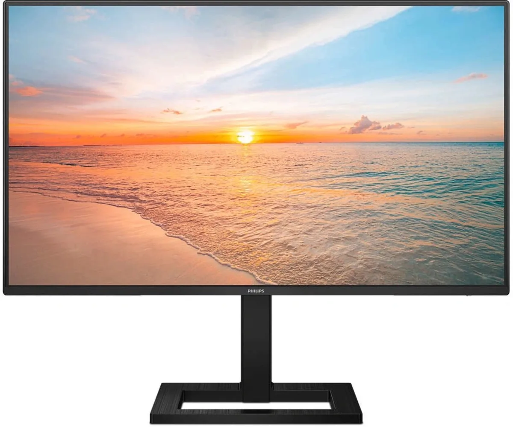
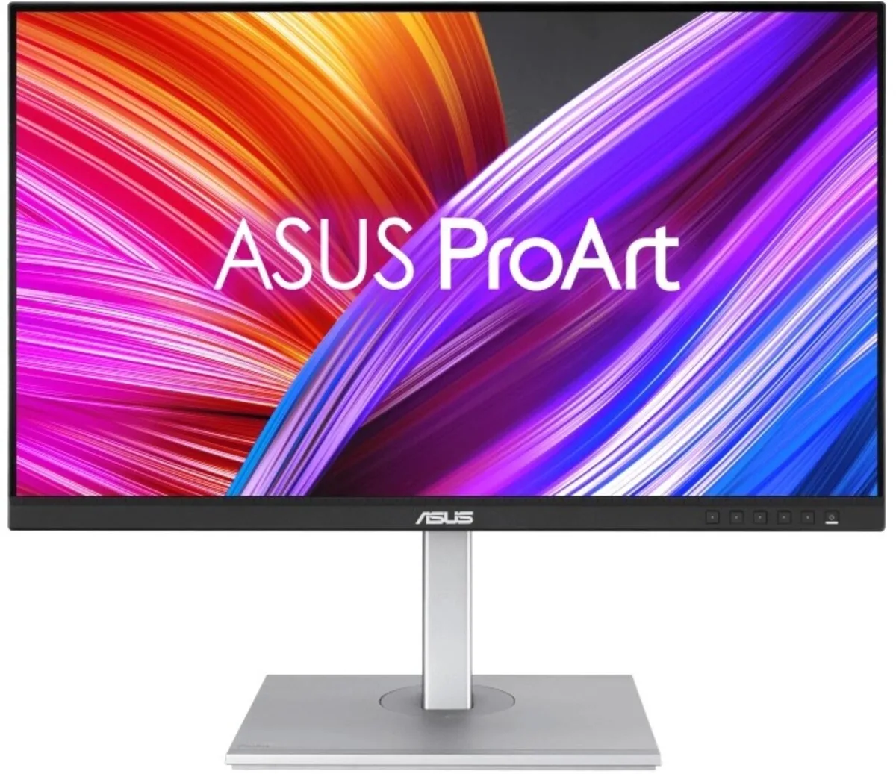
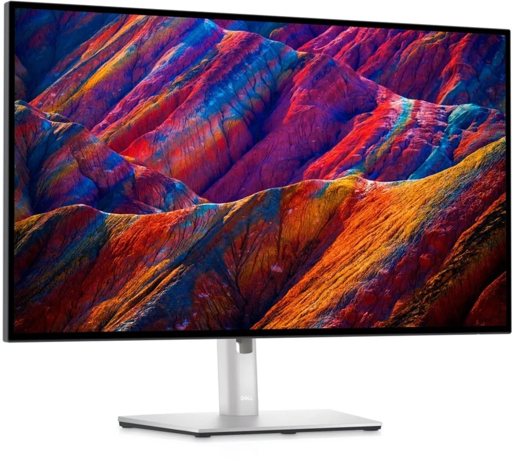

Je kunt proberen op het schermpje van je laptop te werken, maar het is een stuk comfortabeler om naar een groot, hoger geplaatst scherm te kijken. Maar wat is dan de beste monitor die je op dit moment kunt kopen? We zetten het op een rij.

> [!NOTE]
> Deze recensie verscheen eerder op [AD](https://www.ad.nl/tech/nieuwe-monitor-op-je-bureau-nodig-dit-is-de-beste~a00520ec/).

Er zijn veel verschillende specificaties om bij een beeldscherm naar te kijken, maar in dit overzicht maken we vooral onderscheid bij één: de schermresolutie. Deze bepaalt hoeveel pixels er op het scherm zitten en hoe scherp het beeld hierdoor is. Hoe hoger het cijfer, hoe scherper je beeldscherm. Maar een scherper scherm vereist ook krachtigere hardware om al die pixels aan te kunnen sturen.

Daarnaast hebben we niet simpelweg de beste, meest luxe apparaten gekozen. WE hebben gekeken naar een goede prijs-kwaliteit-verhouding, zodat je niet meteen de hoofdprijs hoeft neer te leggen voor een goed scherm.

Onderstaande beeldschermen zijn geselecteerd door de redactie van Tweakers, die het hele jaar door honderden apparaten test om de beste te selecteren. De volledige test vind je op [deze pagina](https://tweakers.net/best-buy-guide/monitors/beste-allround-monitor).

## Het beste full-HD-scherm: Philips 1000-serie 24E1N1300AE

Philips 1000-serie 24E1N1300AE © Philips

Dit scherm van 24 inch groot heeft een resolutie vergelijkbaar met die van een full-hd-televisie. Achterop zit een usb-c-poort waarmee je een laptop rechtstreeks kunt aansluiten om hem tegelijkertijd op te laden met één snoer. Het beeld is goed in hoogte verstelbaar en er zijn ook luidsprekers ingebouwd - en ondanks al dat is hij met 140 euro vrij betaalbaar gebleven.

De kleuren zijn beter dan gemiddeld en ook de kijkhoeken zijn uitstekend. Daar staat tegenover dat het scherm niet erg fel is, dus bij zeer fel zonlicht zul je wellicht de gordijnen eens dicht moeten doen.

## Het beste 1440p-scherm: ASUS ProArt PA278CGV

ASUS ProArt PA278CGV © Asus

Met 27 inch is dit scherm een slagje groter dan bovenstaande Philips-concurrent. Daarnaast is de resolutie iets hoger: met een beeld van 2560 bij 1440p heb je een vrij scherp beeld. ASUS heeft dit scherm gemaakt voor de creatieve sector, wat je ziet aan de verdere specificaties. De kleurweergave is erg netjes en bewegende beelden zijn uitermate soepel. De minimale helderheid is extreem laag en de maximale helderheid erg hoog, zodat je hem in haast iedere ruimte prettig kunt gebruiken

Ook dit beeld heeft een usbc-kabel die zowel je videobeeld laat zien en de laptop van stroom voorziet. Hij laadt ook sneller op dan de Philips-concurrent, maar heeft op zijn beurt ook een dik dubbel zo hoge prijs: op het moment wordt de ProArt verkocht voor rond de 334 euro.

## Het beste 4K-scherm: Dell UltraSharp U2723QE

Dell UltraSharp U2723QE © Dell

Voor wie het scherpste beeld wil is de UltraSharp U2723QE van Dell onze keuze. Dit scherm heeft heeft een resolutie van maar liefst 3840 bij 2160 pixels - hetzelfde als in moderne 4K-televisies. Dat is op een tv al heel scherp, maar op het kleinere 27 inch-scherm van een monitor ziet dat er nog mooier uit. Op een kleiner beeld zijn de individuele pixels namelijk kleiner.

Ook dit scherm heeft een usb-c-poort om tegelijkertijd mee te laden en beeld te tonen. Deze verbindt je laptop ook meteen met de handig geplaatste usb-poorten en internetpoort, zodat je meteen verbonden bent met al je randapparatuur. Het is verder een fijn scherm met goede helderheid en een hoog contrast. Wel is het echt een zakelijk apparaat: met zijn ververssnelheid van 60 beelden per seconde zullen fanatieke gamers soms geen genoegen nemen.

Het is bovendien de duurste in deze reeks, met een prijs van ruim 500 euro.

**Verantwoording**
In deze rubriek schrijven we over technologische apparaten die door Tweakers zijn beoordeeld. Bij Tweakers wordt ieder apparaat onderzocht door het testlab, waar onder andere accuduur, snelheid en andere belangrijke aspecten worden getoetst. De redactie van Tweakers is volledig onafhankelijk. Bedrijven betalen op geen enkele manier om in deze artikelen behandeld te worden.
