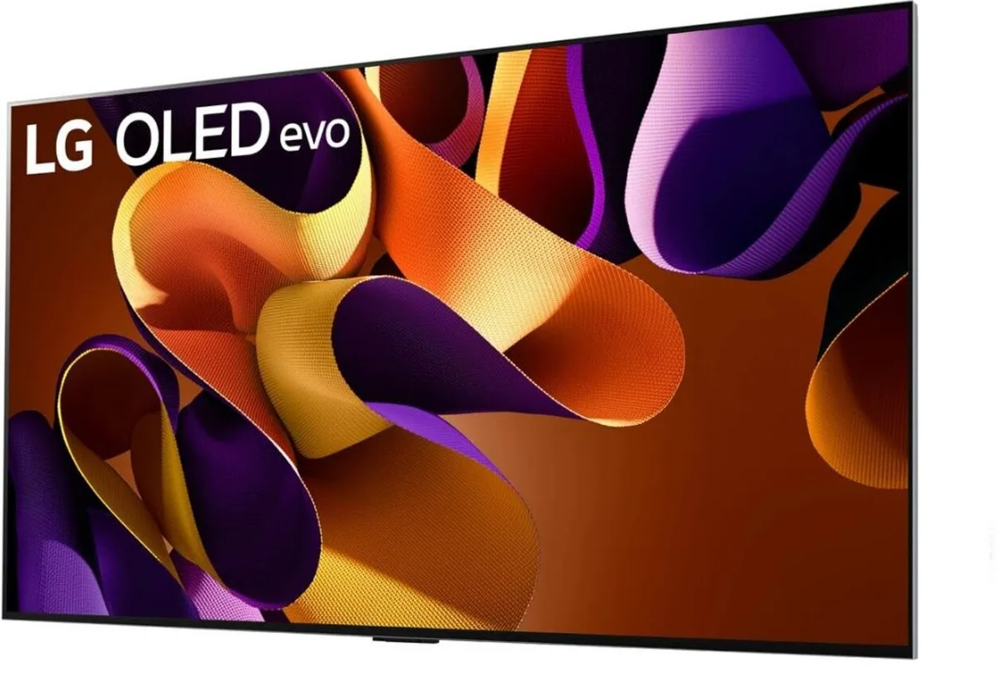
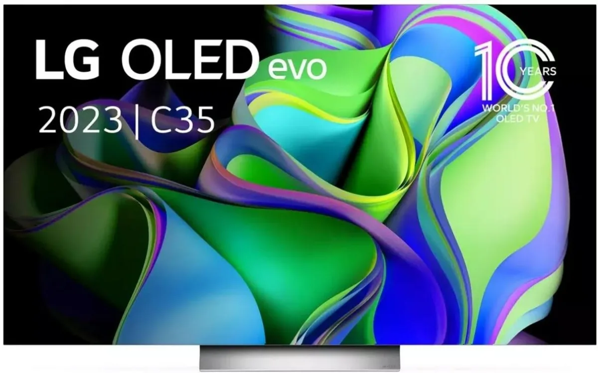

Black Friday nadert en gadgets vliegen de deur uit met flinke kortingen, waaronder oled-televisies. Welke modellen zijn nu echt de moeite waard? Techredacteur Bastiaan Vroegop licht de toppers uit, zodat je voorbereid de aanbiedingen kunt verkennen.

> [!NOTE]
> Deze recensie verscheen eerder op [AD](https://www.ad.nl/tech/oled-tv-s-getest-dit-zijn-de-beste-beeldschermen~a41fa01b/).

Bij de aanschaf van een nieuwe tv moet je vooral letten op de gebruikte beeldtechnologie. De goedkoopste televisies hebben een led-scherm, waarbij een laag pixels bovenop led-verlichting is bevestigd zodat je de kleuren van het scherm goed kunt zien. Wie een mooier scherm wil, kiest voor een oled-tv: hierbij kan iedere gekleurde pixel ook zelf licht geven.

Het lijkt een klein verschil, maar het gevolg op de beeldkwaliteit is groot. Omdat iedere pixel zelf licht kan geven, kan deze bijvoorbeeld ook worden uitgeschakeld om zo een zwart deel van het scherm te laten zien. Je hebt hierdoor niet de donkergrijze waas, maar ziet echt gitzwarte panelen. Het geeft oled-televisies een veel hoger contrast dan bij hun led-broertjes.

De ene oled-tv is echter de andere niet, wat reden voor ons is om de beste modellen van 55 inch van dit moment op een rij te zetten.

Onderstaande televisies zijn geselecteerd door de redactie van Tweakers, die het hele jaar door honderden apparaten test om de beste te selecteren. De volledige test vind je op [deze pagina](https://tweakers.net/best-buy-guide/televisies/beste-oled-tv).

## De beste oled-tv van dit moment: LG OLED evo G4

LG OLED evo G4. © RV

Met een prijskaartje van 1932 euro is dit geen impulsaankoop, maar met wat geluk daalt die prijs rond Black Friday. De prijs van deze tv is afgelopen maanden al wat in prijs gezakt. De OLED evo G4 is het vlaggenschip van LG, een fabrikant die al jaren wordt geprezen als één van de beste makers van oled-schermen. Dit nieuwste model is een stukje helderder, wat vooral HDR-kleuren indrukwekkender maakt. HDR staat voor High Dynamic Range en geeft een groter contrast en kleurbereik van de beelden.

Door zijn hoogwaardige HDMI-poorten is dit ook een uitstekende tv om op te gamen, omdat hij hoge resoluties met snelle _framerates_ ondersteunt.

De geluidskwaliteit van de G4 is goed voor een platte tv. Het scherm wordt geleverd met een speciale muurbeugel zodat je hem boven je tv-meubel kunt ophangen, een poot om hem mee neer te zetten zit niet in de doos.

## Het goedkope alternatief: LG OLED evo C3 (C35)

LG OLED evo C3. © RV

Deze oudere tv in de goedkopere reeks van LG is met een prijs van rond de 1150 euro een stuk goedkoper. Dat terwijl ook de beeldkwaliteit van dit scherm dik in orde is: de kleurweergave is nauwkeurig en de kijkhoek zeer goed. De helderheid is iets lager dan bij het duurste model, waar je vooral last van kan hebben in kamers met veel omgevingslicht.

Net als bij de evo G4 heeft dit model goede HDMI-poorten die hoge resolutie met snelle framerates ondersteunen, wat ideaal is voor gamers.

Dit model heeft geen muurbeugel in de doos zitten, maar wordt wel geleverd met een poot om hem mee neer te zetten. Voor wie liever niet in muren boort, is dat eigenlijk de beste optie.

_Verantwoording_

_In deze rubriek schrijven we over technologische apparaten die door Tweakers zijn beoordeeld. Bij Tweakers wordt ieder apparaat onderzocht door het testlab, waar onder andere accuduur, snelheid en andere belangrijke aspecten worden getoetst._

_De redactie van Tweakers is volledig onafhankelijk. Bedrijven betalen op geen enkele manier om in deze artikelen behandeld te worden._
