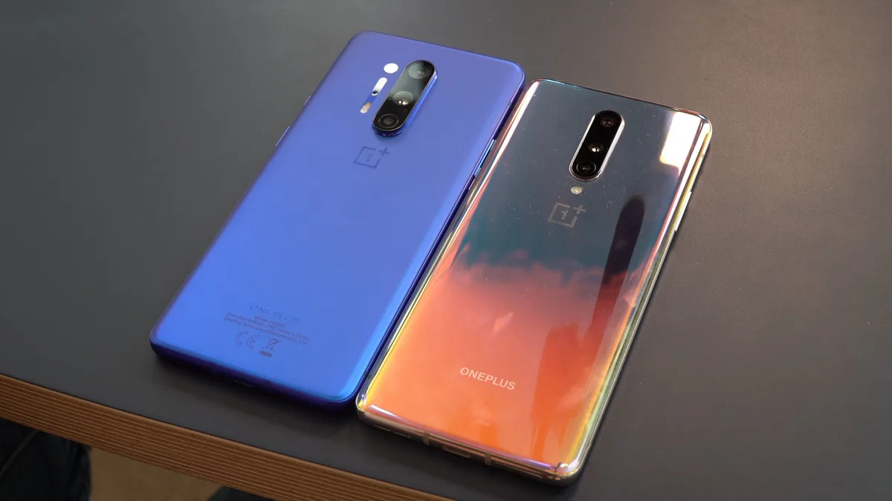

**OnePlus 8 en 8 Pro**

> [!NOTE]
> Deze recensie verscheen eerder op [Bright](https://www.bright.nl/nieuws/1126091/oneplus-onthult-nieuwe-duurdere-oneplus-8-en-8-pro.html).

[Bekijk ingesloten media](https://www.youtube.com/embed/lnRabHU-5_4?autoplay=1&modestbranding=1)

Beide nieuwe OnePlus 8-telefoons werden dinsdagmiddag gepresenteerd. Ze zijn vanaf volgende week in Nederland te koop.

De [OnePlus 8](https://youtu.be/lnRabHU-5_4) heeft een 6,55 inch-scherm, terwijl die van de [OnePlus 8 Pro](https://www.bright.nl/bright-stuff/artikel/5090521/oneplus-8-pro) 6,78 inch groot is. Bij het Pro-toestel is voor het eerst sprake van een scherm met een ververssnelheid van 120 hertz. In de gewone OnePlus 8 zit wederom een scherm dat met 90 beelden per seconde ververst.

Bij beide telefoons zit de vingerafdrukscanner in het scherm geïntegreerd. Gezichtsherkenning wordt ook ondersteund via de gebruikelijke selfiecamera. Bij het Pro-model komt die camera niet meer met een motortje omhoog, maar zit er nu een gat in het scherm. Volgens de fabrikant is de telefoon hierdoor ook iets lichter.

## Draadloos opladen

De [OnePlus 8 Pro](https://www.bright.nl/bright-stuff/artikel/5090521/oneplus-8-pro) kan draadloos worden opgeladen. Het is voor het eerst dat het Chinese bedrijf deze technologie ondersteunt: voorgaande jaren ging alle aandacht naar snellaadfuncties via USB. De smartphones van alle concurrenten ondersteunen draadloos opladen al vele jaren.

Een nieuwe snellaadtechnologie zorgt ervoor dat het OnePlus-toestel met 30 watt draadloos kan worden opgeladen, waardoor hij binnen een half uur met 50 procent vol moet zitten.

## 48 megapixel-camera

Beide toestellen draaien op een Snapdragon 865-chip en hebben achterop een 48 megapixel-camerasensor van Sony. Bij de OnePlus 8 wordt deze vergezeld door een ultra-wide-camera van 16 megapixel en een dieptesensor. De [OnePlus 8 Pro](https://youtu.be/lnRabHU-5_4) heeft een ultra-wide van ook 48 megapixel, een telelens van 8 megapixel en een kleurenfilter.

## Duurder

De prijzen zijn wederom gestegen: de nieuwe OnePlus 8 wordt vanaf 699 euro verkocht, terwijl zijn voorganger vorig jaar voor 569 euro werd aangeboden. De 8 Pro ligt in de winkels voor 899 euro, in plaats van de eerdere 709 euro. Bij beide toestellen zijn er meerdere varianten, waarbij naast de opslag ook de hoeveelheid werkgeheugen verschilt.

**[Kijk op het Bright YouTube-kanaal](https://bit.ly/brighttv) voor meer smartphone-reviews.**
