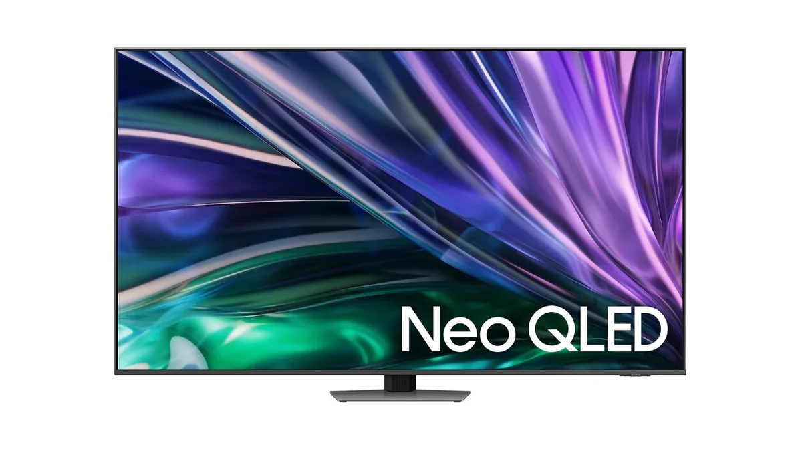
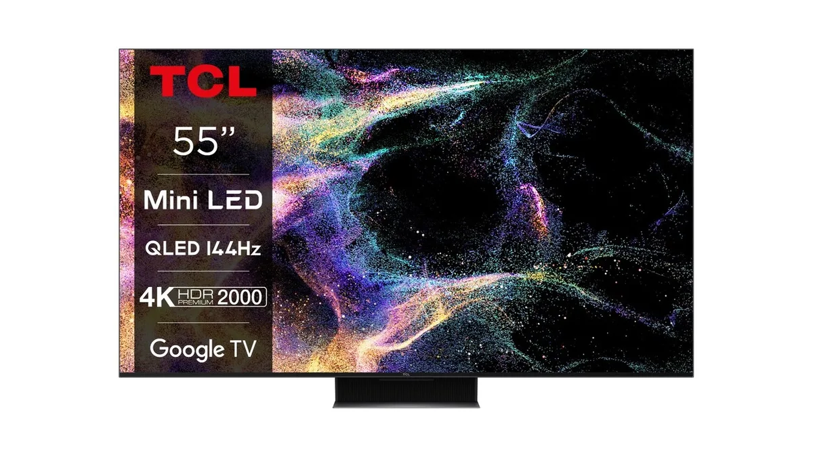

Bij de aanschaf van een nieuwe televisie schieten de prijzen al snel naar boven, met bedragen van soms duizenden euro’s. Maar wat als je het liever bescheiden houdt? We zetten de beste tv’s met een prijskaartje van maximaal 1000 euro op een rij.

> [!NOTE]
> Deze recensie verscheen eerder op [AD](https://www.ad.nl/tech/ook-goedkopere-televisies-kunnen-prima-beeld-hebben-dit-is-de-beste~ac546ed8/).

Bij de aanschaf van een nieuwe tv is het verstandig om op een aantal punten te letten. De gebruikte schermtechnologie maakt bijvoorbeeld een groot verschil: een traditionele LED-televisie heeft bijna altijd een minder hoog contrast dan een OLED-model. Maar OLED is wel weer een stuk duurder. Daarnaast bepaalt de afstand tussen de muur en je bank wat de optimale grootte is voor je tv. Bij een afstand van 2 meter is een scherm van 50 inch perfect, terwijl je bij 3 meter van je muur beter een scherm van 75 inch kunt kopen.

Onderstaande televisies zijn geselecteerd door de redactie van Tweakers, die het hele jaar door honderden apparaten testen om de beste te selecteren. De volledige test vind je op [deze pagina](https://tweakers.net/best-buy-guide/televisies/beste-allround-tv).

## Beste koop: Samsung Neo QLED QN85D

Samsung Neo QLED QN85D. © RV

Deze televisie kost 838 euro voor een 55 inch-model. Het is de opvolger van een eerder, duurder model van Samsung dat een hogere maximale helderheid en betere kijkhoeken had. Toch is ook deze budgetvariant prijzenswaardig: de helderheid is ondanks het lagere niveau nog steeds dik in orde, wat dit een prima televisie maakt om in een kamer met veel omgevingslicht te zetten.

De beeldverwerking is van hoge kwaliteit, wat zorgt voor een net zo mooi plaatje als op Samsungs duurdere variant van deze tv. De zwartwaardes zijn, hoewel prima, niet perfect. Maar eigenlijk geldt dat voor alle televisies binnen dit segment.

Je kunt ook kijken naar de QN86D en QN88D van Samsung. Die zijn technisch min of meer gelijkwaardig, maar hebben doorgaans een iets hogere prijs.

## Alternatief: TCL 55C845

TCL 55C845. © RV

Wie minder wil betalen voor een televisie, kan voor deze TCL kiezen. Het 55 inch-model van dit scherm kost op het moment van schrijven 688 euro. TCL is een vrij onbekend Chinees merk dat goed presterende televisies maakt. Dit specifieke model heeft een miniled-scherm, dat een heel helder en kleurrijk beeld produceert. Daarnaast heeft de tv een redelijk geluid en goede gamefuncties.

Toch lever je door het prijsverschil hier en daar wat in. De beeldverwerking is bijvoorbeeld iets minder goed dan bij Samsung. Maar in de kern is het een prima televisie die het overwegen waard is. Wel kan het even zoeken zijn waar je hem het beste kunt kopen: het aantal winkels dat dit model verkoopt is wat beperkt.

## _Verantwoording_

_In deze rubriek schrijven we over technologische apparaten die door Tweakers zijn beoordeeld. Bij Tweakers wordt ieder apparaat onderzocht door het testlab, waar onder andere accuduur, snelheid en andere belangrijke aspecten worden getoetst._

_De redactie van Tweakers is volledig onafhankelijk. Bedrijven betalen op geen enkele manier om in deze artikelen behandeld te worden._
