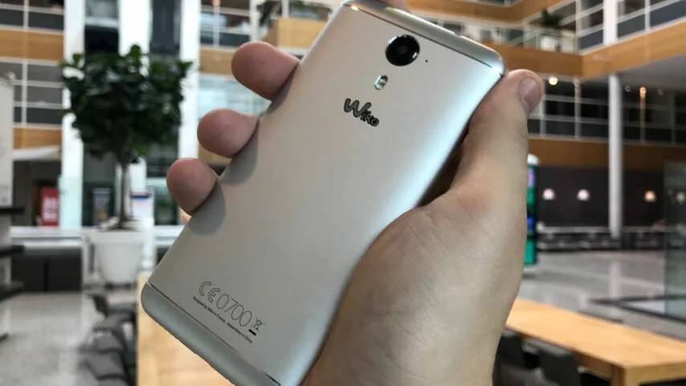
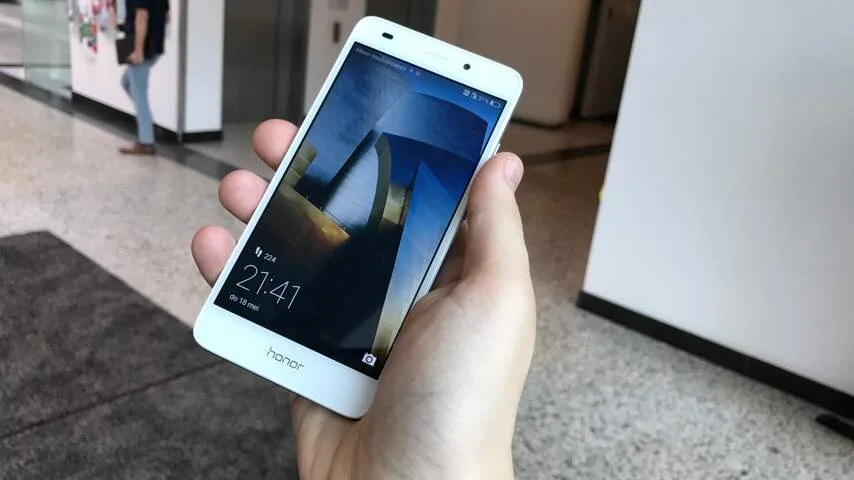
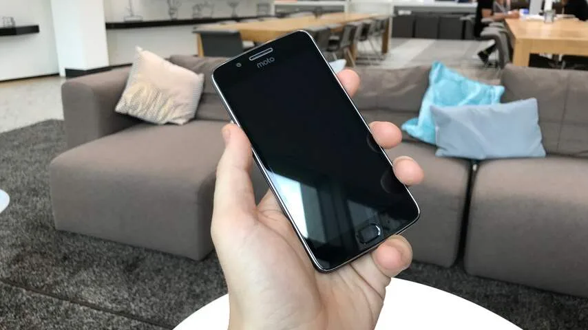

**Een smartphone op afbetaling bij een abonnement wordt sinds 1 mei geregistreerd bij de kredietstatus van Bureau Krediet Registratie (BKR), mits het toestel meer dan 250 euro kost. We zetten daarom vijf smartphones op een rij die niet tot een BKR-registratie leiden.**

> [!NOTE]
> Deze recensie verscheen eerder op [NU.nl](https://www.nu.nl/reviews/4706244/overzicht-vijf-smartphones-onder-de-250-euro.html).

## Alcatel A5 LED (200 euro)

Op telecombeurs Mobile World Congress viel de Alcatel A5 LED op. Niet door zijn technische specificaties, maar door de achterkant met ingebouwde LED-verlichting. Hierdoor kan het toestel licht geven als iemand belt, of als er bijvoorbeeld een WhatsApp-bericht binnenkomt. Ook kan hij op maat van de muziek oplichten tijdens concerten.

De A5 LED zal later dit jaar op de markt komen, maar wij testten alvast een vroege testversie van het toestel. Daarbij kregen we het idee dat de achterliggende software voor de LED-verlichting handiger ingericht kan worden. Zo is het bijvoorbeeld niet mogelijk om de kleur van specifieke notificaties aan te passen. Zonde, want we zouden graag notificaties van bijvoorbeeld WhatsApp en Facebook willen onderscheiden door ze groen en blauw te maken.

Er is een kans dat Alcatel dit in de uiteindelijke versie van het toestel wel mogelijk zal maken. Zowel de soft- als hardware zal mogelijk nog veranderen in aanloop naar de uiteindelijke consumentenversie.

[Bekijk ingesloten media](https://content.jwplatform.com/players/cBwZZIT0-whqXCOFb.html)

In de testversie heeft de A5 LED verder vrij standaard hardware. Het 5,2 inch-scherm heeft een resolutie van 1280 bij 720 pixels - het minimale bij smartphones in dit prijssegment. De 8 megapixel-camera maakt niet heel bijzondere foto’s. We hadden zelfs bij goed licht het idee dat er een soort waas over de beelden hing. Een vingerafdrukscanner ontbreekt.

De 2800mAh-batterij van het toestel was bij onze tests genoeg om het een dag vol te houden - zelfs met de LED-achterkant op halve helderheid. De speciale behuizing maakt het toestel ietsje zwaarder, maar hij ligt desondanks prima in de hand. Een bijgeleverde LED-loze hoes kan het toestel kleiner maken, maar dat is af te raden. Dan verlies je namelijk de ene onderscheidende factor van de A5 LED en kun je net zo goed een concurrerende telefoon met betere specificaties kopen. De A5 LED gaat 200 euro kosten.

_3 / 5 sterren._

## Wiko Ufeel Prime (240 euro)

De Ufeel Prime van Wiko heeft geen gimmicks zoals een achterkant vol LED-lampjes. Daar staat tegenover dat dit toestel in zijn prijssegment bijzonder goede specificaties heeft. Het is in dit overzichtsartikel bijvoorbeeld de enige telefoon met 4GB werkgeheugen. Daarnaast zit in de telefoon een Full HD-scherm.

Hoewel de smartphone met 240 euro in het budgetsegment valt, oogt hij niet zo. De aluminium achterkant doet denken aan de vlaggenschepen van 2015 en 2016. Houd de smartphone vast en het verschil met premiumtelefoons wordt wel meteen duidelijk. Het gebruikte materiaal voelt wat onnodig ruw en de schermranden zijn niet afgebogen, waardoor hij wat scherpe hoeken heeft.

De camera heeft met 13 megapixels indrukwekkende specificaties voor een budgettoestel, maar in de praktijk vallen de prestaties helaas tegen. In de meeste foto’s gemaakt met deze telefoon verschijnt een lichtwaas. Voor de camera kunnen we dit toestel daarom niet aanraden.

De verdere specificaties maken de Ufeel Prime echter een prima toestel. Bij dagelijks gebruik hadden we zelden last van vastlopers of haperingen. Daarnaast starten apps zoals WhatsApp snel genoeg op. De enige klacht hadden we tijdens het installeren van apps: zelfs de simpelste installatie duurde namelijk zeker vijf minuten.

_3,5 / 5 sterren._

_Wiko Ufeel Prime — Beeld: NU.nl/Bastiaan Vroegop_

**Huawei P8 Lite 2017 (240 euro)**

Huawei koos dit jaar voor een wat vreemde aanpak. Het bedrijf bracht niet een nieuwe telefoon in zijn budgetlijn uit, maar gaf in plaats daarvan de P8 Lite een nieuwe 2017-editie. Het toestel biedt een lichte upgrade ten opzichte van het origineel, zodat hij het kan opnemen tegen concurrenten.

Qua specificaties staat de nieuwe P8 Lite net achter de Ufeel Prime die we hierboven bespraken. In deze telefoon vind je 3GB in plaats van 4GB RAM, en een 12 megapixel-camera in plaats van een 13 megapixel-camera.

De processor in de P8 Lite is wel een stuk sneller, wat het voornaamste verschil lijkt te maken. We merken dat apps sneller opstarten en bij het navigeren soepeler reageren.

Van de geteste toestellen heeft de P8 Lite 2017 het meest hoogwaardig ogende ontwerp. De achterkant is gemaakt van glas, waardoor de smartphone iets wegheeft van bijvoorbeeld de iPhone 7 en Galaxy S8. Hij ligt hierdoor ook fijn in de hand, hoewel de onafgeronde schermranden de goedkope prijs verraden.

De camera weet ook prima beelden te schieten, mits de lichtomstandigheden goed zijn. Hoewel gemaakte foto’s over het algemeen scherp zijn, kunnen kleuren soms wel flets worden vastgelegd.

_4 / 5 sterren._

## Honor 5C (200 euro)

Huawei’s submerk Honor heeft met de 5C ook een toestel voor de budgetmarkt. De verschillen tussen de P8 Lite en 5C zijn niet heel erg groot. Dit toestel heeft een iets betere camera, een iets minder goede processor en met 2GB ook minder werkgeheugen. Dat heeft vermoedelijk te maken met de prijs, die met 200 euro iets lager ligt.

Dat prijsverschil brengt ook een praktisch gebrek met zich mee: op de Honor 5C zit geen vingerafdrukscanner. Het toestel kan hierdoor alleen worden ontgrendeld met pincodes en veegpatronen. Geen gigantisch bezwaar, maar veel concurrenten in deze prijsklasse kunnen wel met een vingerlezer worden ontgrendeld.

Het specificatieverschil vergeleken met de P8 Lite is geen heel groot bezwaar. In gebruik voelt deze smartphone ongeveer hetzelfde aan. Hetzelfde geldt voor de iets betere camera, die een vrij beperkt kleurbereik lijkt te hebben.

Hoewel de 5C prima in dagelijks gebruik is, zijn er genoeg toestellen binnen dit prijssgement die iets bijzonderders bieden. Neem de telefoons in dit vergelijkingsoverzicht: ze bieden allemaal wel iets dat boven de 5C uitsteekt. De één heeft betere specificaties, de ander een vingerscanner en weer een ander een interessante gimmick.

_3 / 5 sterren._

_Honor 5C — Beeld: NU.nl/Bastiaan Vroegop_

## Moto G5 (200 euro)

De Moto G5 van Lenovo heeft de specificaties om zich bijna met de Ufeel Prime van Wiko te meten. De smartphone bevat dezelfde Snapdragon 430-chip, een 5 inch 1080p-scherm en een 13 megapixel-camera. Met 3GB ligt alleen het werkgeheugen iets lager.

De achterkant van het toestel bestaat uit een combinatie van plastic en aluminium. Daarmee heeft de telefoon misschien wel het goedkoopste uiterlijk van de telefoons die in dit overzicht worden besproken. Niet alleen omdat er plastic wordt gebruikt, maar ook omdat de achterkant niet uit één aansluitend materiaal bestaat.

Voordeel is de vingerafdrukscanner voorop de smartphone, al is deze door zijn positie wat onhandig in gebruik. Hij zit vlak onder de virtuele homeknop op het toestel, waardoor hij hier vrij snel mee verward kan worden.

We probeerden bij onze tests meermaals terug te gaan naar het beginscherm, maar drukten vervolgens per ongeluk op de vingerlezer. Vervelend, want hierdoor wordt de telefoon helemaal vergrendeld. De Ufeel Prime heeft ook een scanner aan de voorkant, maar die kan wel als gewone homeknop worden ingedrukt.

Het batterijverbruik van de Moto G5 is naar behoren: op een volle accu bij gewoon gebruik, houdt de telefoon het een dag vol. De camera maakt scherpe, maar wat fletse foto’s waarin snel ruis opduikt bij mindere lichtomstandigheden.

_3 / 5 sterren._

_Moto G5 — Beeld: NU.nl/Bastiaan Vroegop_

## Conclusie

De geteste telefoons hebben wellicht geen premiumspecificaties, maar het is opvallend hoeveel van de toestellen wel het uiterlijk van een duurdere concurrent hebben. De Huawei P8 Lite voelt in dagelijks gebruik net iets soepeler dan zijn concurrenten en heeft het meest hoogwaardig ogende ontwerp.

Dat wil niet zeggen dat de andere toestellen in dit overzicht af te raden zijn. Hoewel niet ieder toestel op papier even snel is, zijn de verschillen in de praktijk niet heel erg merkbaar. Ze zijn vooral langzamer dan veel duurdere telefoons, maar dat is niet meer dan logisch. Maar met telefoons die zo dicht op elkaar zitten qua prestaties, kun je binnen dit segment prima kiezen op basis van design.
