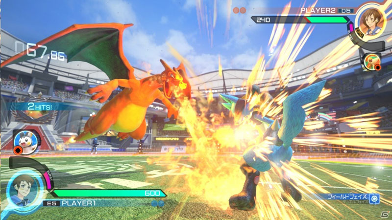

Pokkén Tournament DX is niet heel erg anders dan zijn voorganger op de Wii U, maar heel erg is dat ook niet. We betalen namelijk maar wat graag om deze fighter onderweg te kunnen spelen.

De eerste Pokkén-game was afgelopen jaar vrij bijzonder. Het vechtspel, ontwikkeld door de Tekken-studio van Namco Bandai, laat spelers het één tegen één tegen elkaar opnemen met een kleine selectie pokémon. Dat gebeurt in eerste instantie in een driedimensionale arena, waarbij de knoppen vooral worden gebruikt voor simpele aanvallen die van zowel dichtbij als veraf schade kunnen doen.

Raakt een vijand eenmaal in een combo verstrikt, dan springt de game al snel naar een zij-perspectief. Op dat punt lijkt Pokkén qua besturing en speelstijl ineens verdacht veel op Tekken – totdat iemand de ander weer uit het veld slaat en de game terugspringt naar 3D.

Het is noodzakelijk om de kern van de eerste Pokkén nog eens te benoemen, want Pokkén Tournament DX is in feite exact hetzelfde spel. Er zijn een paar toevoegingen aan het spel gedaan, zoals een extra speelmodus en vijf nieuwe speelbare personages, maar het spel is tot op de menustructuur exact hetzelfde. Het is iets dat we Nintendo al eens eerder zagen doen met Mario Kart Deluxe op de Switch, wat in feite een port is met alle dlc van een eerdere Wii U-game.

Qua gevechtssysteem is nagenoeg niets veranderd – inclusief misschien wel ons voornaamste kritiekpunt. Hoewel gevechten er erg gaaf uitzien, ontbreekt er namelijk nogal wat diepgang. Het spel is net wat te vergeeflijk met het invoeren van bijvoorbeeld combo’s, waardoor het verschil tussen een nieuwe en ervaren speler soms wat marginaal lijkt. Dat is jammer, want het zorgt ervoor dat de game niet motiveert om pixelprecieze vechtsstijlen aan te meten.

## Personages

De kans is bij Pokkén Tournament DX echter vrij groot dat de toegevoegde content je niet bekend voorkomt. Vier van de nieuwe Pokémon (Darkrai, Scizor en Croagunk en Empoleon) waren alleen te vinden in de arcadeversie, die je alleen in Japan kon spelen. De vijfde toevoeging, Decidueye, is speciaal voor de nieuwe Switch-versie gemaakt.

De nieuwe personages zijn over het algemeen prima toevoegingen. Zo is de soms wat lompe speelstijl van Scizor na een paar potjes verrassend leuk, terwijl Decidueye met zijn boog veel manieren biedt om je tegenstander van veraf aan te pakken. Het maakt de game iets gevarieerder, wat ook hard nodig was. In het origineel voelt het aantal personages soms namelijk een beetje mager.
