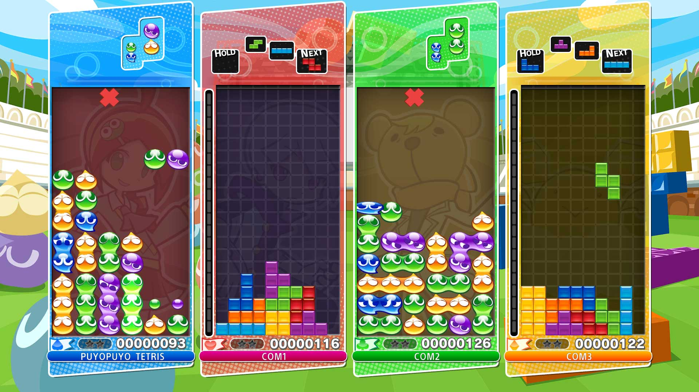
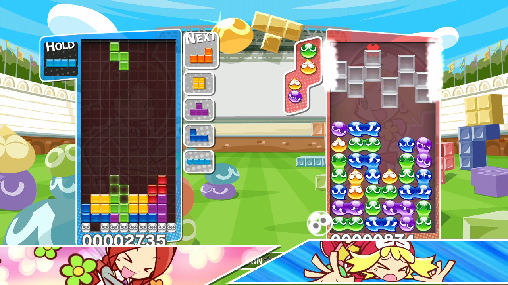

Hoeveel is een puzzelgame in 2017 waard? Toen ik een collega laatst vertelde best 40 euro over te hebben voor het nieuwe Puyo Puyo Tetris, werd ik uitgelachen. We zijn inmiddels gewend dat puzzelspelletjes zoals Threes en 2048 gewoon gratis te downloaden zijn. Zonde, want het ‘hoge’ prijskaartje van de nieuwste Tetris-variant is best te rechtvaardigen.

> [!NOTE]
>
> Deze review verscheen eerder op [Insidegamer](https://inside.gamer.nl/127550-puyo-puyo-tetris-review-als-een-blok-voor-gevallen/?ref=gamepraat.nl).

Heb je alleen Tetris gespeeld, dan is Puyo Puyo Tetris eventjes wennen. Tuurlijk, je kunt binnen deze game het traditionele blokkenspel spelen. Dat gebeurt meestal in een versusmodus, waarbij je door rijen weg te spelen extra blokken in het scherm van je tegenstander gooit. Dit is echter niet het enige dat je zal doen.

De game bevat namelijk een opgevijzelde versie van Puyo Puyo, een puzzelgame van Sega. Ook hierin moet je blokken laten verdwijnen, maar dat doe je niet door rijen te maken, maar door vier blokken van dezelfde kleur naast elkaar te zetten.

Dat klinkt als een klein nuanceverschil vergeleken met Tetris, maar het vereist een totaal andere denkwijze. Wil je in een versuspotje in één keer grote hoeveelheden wegspelen en blokken naar je tegenstander sturen? Dan moet je kleuren op een tactische wijze neerleggen, zodat er pas vier naast elkaar liggen zodra je een kettingreactie start.

**Wennen**
Het zorgde ervoor dat ik als ervaren Tetris-speler toch even een uurtje nodig had om aan deze nieuwe manier van spelen te wennen. In eerste instantie kan dat afschrikken: Puyo Puyo Tetris heeft hierdoor een wat rare, stijle leercurve. Voor mij, en vermoedelijk meer gamers: de kans is immers groot dat je Tetris hebt gespeeld, maar Puyo Puyo is minder algemeen bekend. De game bevat een gidsfunctie om zowel Puyo Puyo als Tetris uit te leggen, maar dat vereist wel dat je op een andere manier leert nadenken.

Wie echter aan Puyo Puyo went, heeft een puzzelgame met ontzettend veel inhoud. Je vindt dan in Puyo Puyo Tetris namelijk maar liefst drie puzzelgames: het traditionele Tetris, het obscuurdere Puyo Puyo en een fusie hiervan, die rijen en kleuren in hetzelfde scherm laat vallen.

Met deze drie speelvarianten is er ontzettend veel te doen. Je kunt het opnemen tegen een andere speler in een versuspotje, maar bijvoorbeeld ook specifiekere uitdagingen aangaan. In een potje Tetris moet je bijvoorbeeld zo snel mogelijk een aantal rijen wegspelen, of een specifieke score halen.

## Smoesje

Er is zelfs een verhaalmodus, die ongeveer net zo gek is als hij klinkt. Je volgt de avonturen van een groep Puyo Puyo-spelende meisjes, die worden getransporteerd naar het ruimteschip van een Tetris-spelende crew. Een compleet willekeurige gebeurtenis, die de hoofdrolspelers niet lang dwarszit. Zij willen vooral bij zelfs de kleinste ruzie een potje Tetris of Puyo Puyo spelen, bij voorkeur door vooraf de gamenamen hard te roepen.

Stiekem is dat verhaal enkel een smoesje om specifieke levels in Tetris en Puyo Puyo te spelen, en daar is niks mis mee. Het spel wisselt af tussen meerdere soorten uitdagingen, waardoor de verhaalmodus alle puzzelopties op creatieve wijze introduceert. Daarbij worden spelmodi wel wat subtiel geïntroduceerd, waardoor je al snel over het hoofd ziet wat er moet gebeuren.

Het verhaal en alle losse puzzelopties maken van Puyo Puyo Tetris een ontzettend complete puzzelgame. Een game die gelukkig ook in zijn meest pure vorm gespeeld kan worden. Op het startscherm heb je namelijk ook de simpele opties ‘Tetris’, ‘Puyo Puyo’ en ‘Fusion’, waarmee je de drie spelmodi zonder specifieke uitdagingen speelt. Gewoon, voor de highscore.

Puyo Puyo Tetris bewijst dat zelfs een ‘simpele’ puzzelgame genoeg inhoud kan bevatten om een hoog prijskaartje goed te praten. Dat gezegd hebbende: dit spel vereist wel een specifieke mindset van spelers. Je moet de drang hebben om een zo hoog mogelijke score te halen, of om een lastige uitdaging naar perfectie te spelen. Wie het liefst een verhaal volgt en zich door een simpele ervaring laat leiden, zal in Puyo Puyo Tetris niet genoeg vinden. Ik zou het cliché “vooral leuk voor de fans” aanhalen, maar de kans zou groot zijn dat de eindredacteur deze uit het artikel sloopt (neuh – red).
