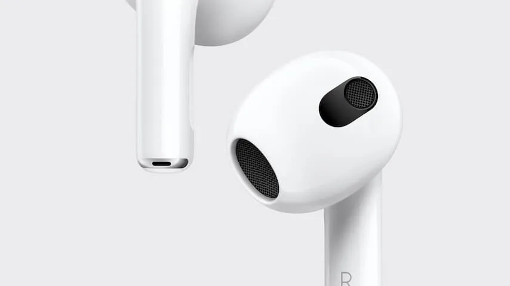
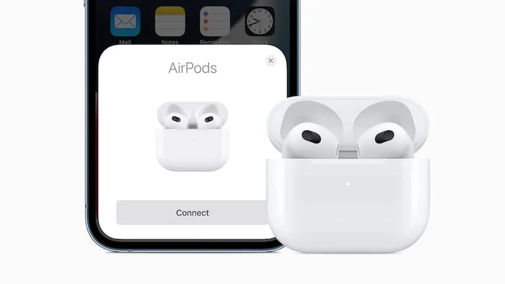

Lange tijd kon je bij Apples draadloze oordopjes kiezen uit twee smaken. Je had de AirPods 2 als instapmodel en daarnaast de duurdere AirPods Pro, in-earoordopjes die beter geluid en ruisonderdrukking bieden.

> [!NOTE]
> Deze recensie verscheen eerder op [NU.nl](https://www.nu.nl/reviews/6165995/review-airpods-3-zijn-goed-nieuws-voor-in-earhaters.html).

Met de komst van de derde generatie AirPods probeert Apple twee varianten te combineren.

Het ontwerp van deze dopjes lijkt haast identiek aan dat van de AirPods Pro: oordopjes met dunnere steeltjes en een pasvorm die iets beter in veel oren blijft hangen. Maar omdat dit geen in-earoordopjes zijn, is hier van ruisonderdrukking geen sprake.

_Review: AirPods 3 zijn goed nieuws voor in-earhaters — Beeld: Apple_

## Blijven iets beter hangen

Om bij die nieuwe pasvorm te beginnen: bij onze tests blijven de nieuwe AirPods beter in oren hangen dan de oude AirPods 2 en ongeveer even goed als de AirPods Pro.

Ze lijken het oor ook beter af te sluiten dan de AirPods 2, waardoor de algehele geluidskwaliteit hoger lijkt. Dat merk je bijvoorbeeld aan de wat dieper klinkende bas.

Het geluid komt alsnog niet in de buurt van dat van de AirPods Pro, ook doordat die dopjes door ruisonderdrukking een stillere luisterervaring bieden. Maar het is een duidelijke upgrade van de vorige edities.

## Bediening is makkelijker dan bij AirPods 2

De oordopjes zijn te bedienen door in de steeltjes te knijpen. Bij de AirPods 2 moest je juist tikken. In onze beleving werkt het knijpen net iets handiger, want bij de AirPods 2 worden aanrakingen niet altijd goed geregistreerd. Wel zijn de knijpsensoren bij de AirPods 3 in een wat gekke hoek geplaatst, waardoor je je vingers op een onnatuurlijke manier moeten krullen om ze te bedienen.

_Review: AirPods 3 zijn goed nieuws voor in-earhaters_

## Nieuwe versie heeft langere accuduur

De accuduur is volgens Apple ook langer: je kunt zes uur lang onafgebroken naar muziek luisteren. Dat komt ongeveer overeen met onze tests. In de praktijk is het net voldoende om een volle werkdag minus wat vergaderingen naar je muziek te luisteren.

Ook nieuw is de mogelijkheid om je dopjes met Apples MagSafe-oplader van stroom te voorzien. Hij blijft dan met magneetjes aan de oplaadkabel hangen, al is de magneetverbinding wat zwak. Er is weinig voor nodig om ze per ongeluk los te maken. Maar de magneten helpen de case goed centraal te houden, zodat die relatief snel draadloos opgeladen kan worden.

## Conclusie

Apple verkoopt de AirPods 3 als goedkoper alternatief voor de AirPods Pro. De techreus biedt ze aan voor 199 euro, tegenover 279 euro voor de Pro-doppen. Op het moment van schrijven verkopen meerdere webwinkels de Pro's echter voor zo'n 200 euro, waardoor je in de praktijk voor beide varianten hetzelfde betaalt.

De keuze komt daarom neer op één simpele vraag: vind je het vervelend om in-earoordopjes te dragen? De rubberen dopjes vallen niet bij iedereen in de smaak. In die gevallen zijn de AirPods 3 een betere keuze en vallen de AirPods Pro automatisch af.

Maar wie het beste geluid van Apple wil hebben, kan beter voor de Pro's kiezen. De toevoeging van ruisonderdrukking maakt ze inherent betere oordoppen voor een prijs die je ook voor de nieuwe AirPods 3 betaalt. Het enige waar je op inlevert, is accuduur. De accu van AirPods Pro gaat 4,5 uur mee. Maar we vermoeden dat dit zelden een probleem is.
