Op vrijdag 8 december verschijnt _Chained Echoes_, een jrpg gemaakt door één Duitse ontwikkelaar. Het is een spel vol liefdevolle verwijzingen naar oude genre-genoten en slimme innovaties om een oude formule leuker te maken. En mogelijk mijn favoriete game van 2022.

_Let op: deze review bevat milde spoilers over het eerste uur van de game._

Deze game stopt zijn inspiratiebronnen niet onder stoelen of banken. In de allereerste minuut word je al wakker gemaakt door je moeder, in een scène bijna identiek aan de start van _Chrono Trigger_:

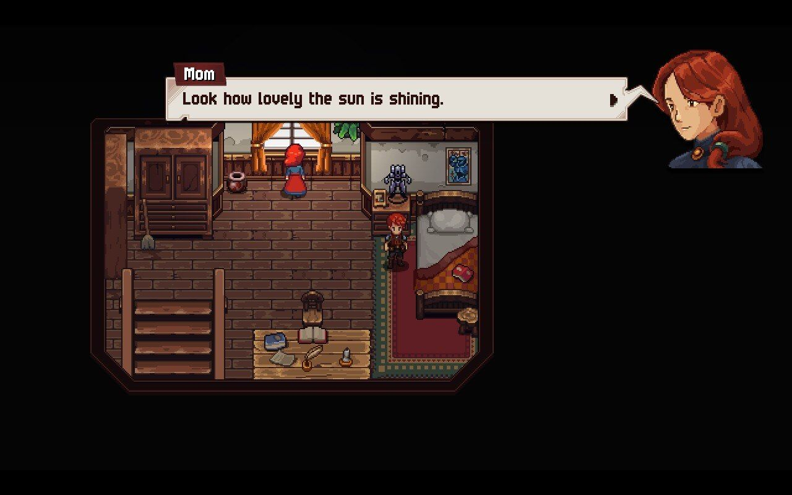

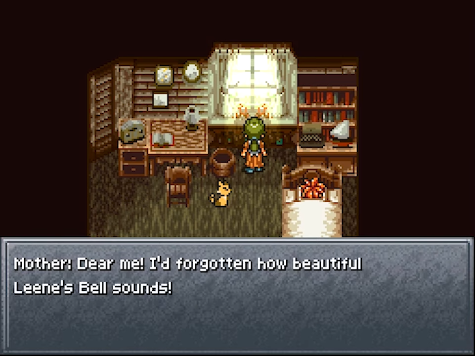

Links Chained Echoes, rechts Chrono Trigger.

Kort daarna geeft ze je een klap in het gezicht en blijkt alles een droom en word je naar een slagveld gesleurd. Dat doe je op een reuzenrobot, vergelijkbaar met die uit Final _Fantasy VI_, al doet de toon ook denken aan die van _Xenogears_.

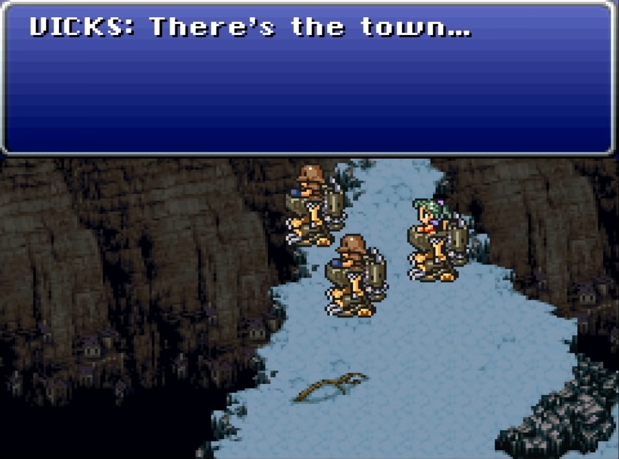

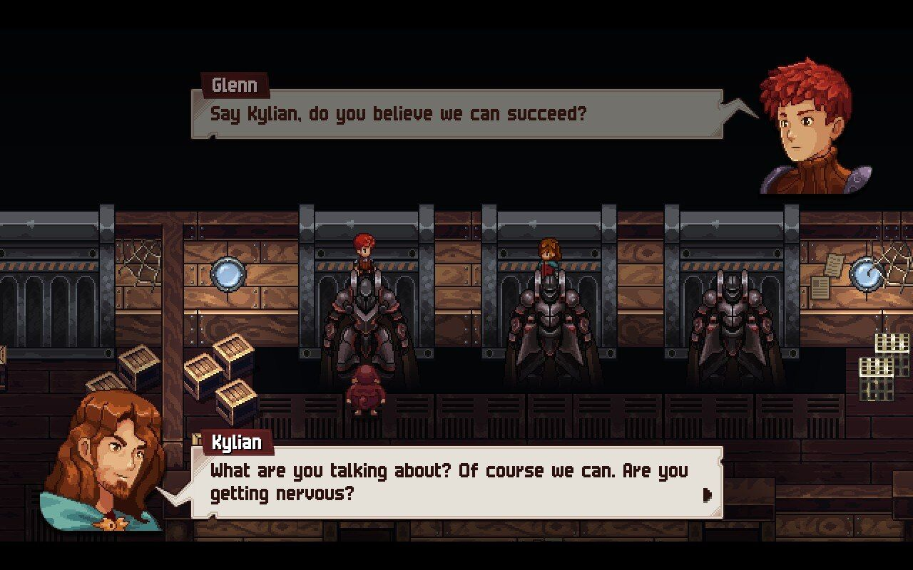

Links de Magitek-pantsers uit Final Fantasy VI, rechts de mechs in Chained Echoes. In beide games bestorm je een stad met de robots.

## Hommage na hommage

Daar ontpopt zich een verhaal over drie landen verwikkeld in een complexe oorlog, dat in zijn opzet veel lijkt op _Final Fantasy Tactics_ en _Final Fantasy XII_. De rol van de hoofdpersonnen daarbinnen wordt verteld vanuit vanuit verschillende perspectieven in een grote stad, net als hoe _Final Fantasy IX_ zijn cast introduceert. De stad zelf lijkt ook sterk geïnspireerd door Alexandria.

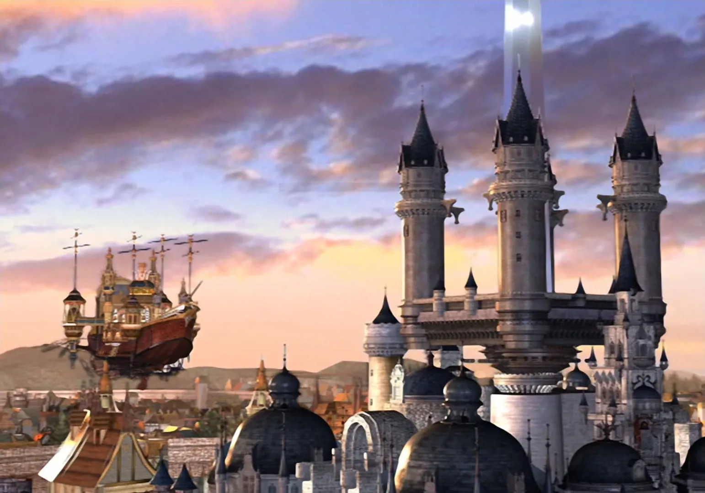

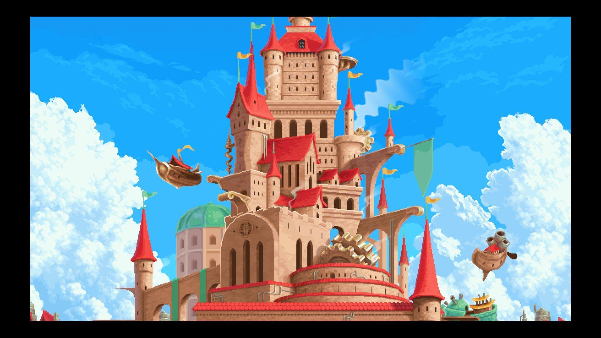

De stad omsingeld met luchtschepen en kasteeltorens voelt als een eerbetoon aan Alexandria uit _Final Fantasy IX_, waar net als in Chained Echoes de hoofdcast los van elkaar speelbaar is tot ze elkaar ontmoeten.

Je vecht nog even tegen een octopus terwijl je op een vlot drijft zoals in Final Fantasy VI en speelt minigames op een kermis zoals in Chrono Trigger.'

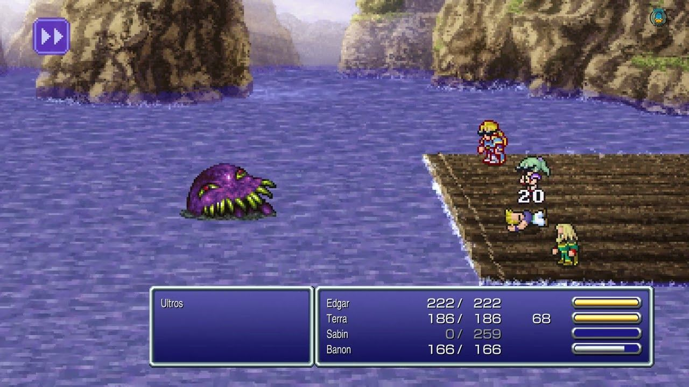

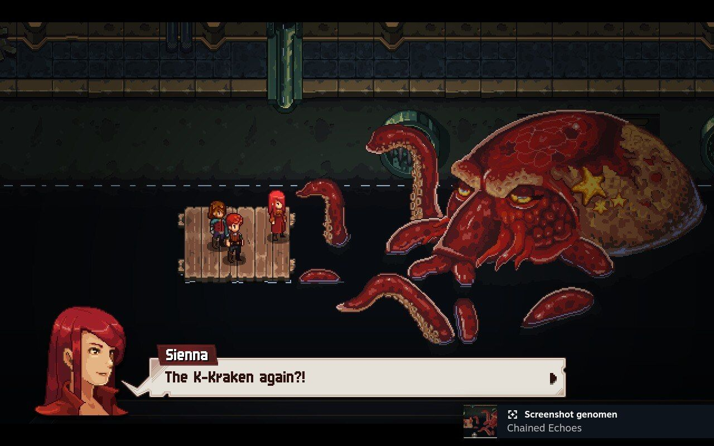

Zelfs het vlot is er!

Dat had allemaal makkelijk kopieerwerk kunnen zijn, maar _Chained Echoes_ maakt duidelijk dat dit vooral een eerbetoon is aan zijn bronmateriaal. Al deze verwijzingen zitten niet voor niks in het eerste uur van de game: ontwikkelaar Matthias Linda grijpt de introductie aan om zijn inspiratiebronnen te citeren, om tegelijkertijd zoveel mogelijk nostalgische gevoelens op te wekken. De boodschap: wie al deze verwijzingen snapt, gaat het naar zijn of haar zin hebben.

## Verkennen wordt aangemoedigd

Na de introductie toont de game wat meer van zijn eigen smoel. De spelwereld breekt open en blijkt vol verborgen schatten te zitten. Ga van de gebaande paden en je vindt geheime bazen, extra subclasses om je personages sterker mee te maken en sterkere uitrusting. Dat verkennen wordt ook extra aangespoord door een raster vol extra opdrachten waar je stempels voor kunt verzamelen. Heb je een lange rij met zijmissies voltooid, dan krijg je nog meer voorwerpen om je team sterker mee te maken.

Gevechten volgen in _Chained Echoes_ een traditionele formule, waarbij je team van vier beurtelings aanvallen kan uitvoeren. Ieder personage is uniek: de één kan je team bijvoorbeeld genezen, terwijl de ander vijanden kan verzwakken. Naarmate je groep avonturiers groeit kun je ook tijdens gevechten teamleden uitwisselen, wat een extra laag complexiteit toevoegt.

En dan is er nog de Overdrive-balk linksboven in het scherm. Met iedere aanval en geleden klap stijgt ie, waarna je hem kunt verlagen door specifieke spreuken en aanvallen te gebruiken. Zit hij in het groene segment? Dan ben je sterker en zijn je vaardigheden en spreuken goedkoper om te gebruiken. Maar wie het rood bereikt, gaat sneller dood. Het betekent dat je constant een balans moet zien te bewaren, terwijl je ook een gevecht naar een goede afloop probeert te brengen.

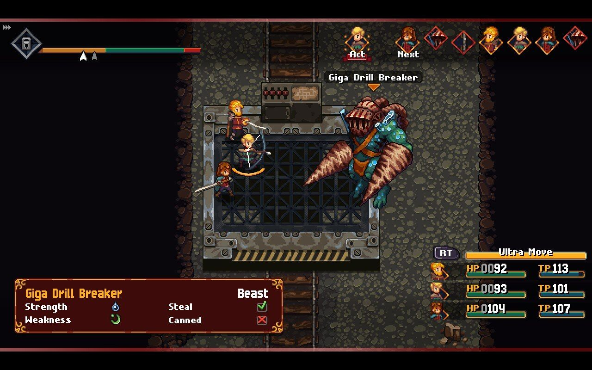

## Ieder gevecht een uitdaging

Er is daarnaast één belangrijk aspect dat gevechten in _Chained Echoes_ uniek maakt: tussen iedere strijd krijg je al je levens- en techniekpunten weer terug. Het betekent dat je steeds weer je sterkste aanvallen en trucs uit de kast kan trekken - maar de game is ook met dit in het achterhoofd ontworpen. Je kunt niet als in andere jrpg's dom op de aanvalsknop drukken om gewone monsters te verslaan, maar moet bij ieder gevecht blijven opletten.

Hoe verder je komt, hoe meer gevechten het uiterste van je vragen. Dat merk je vooral als je een verborgen subclass tegenkomt, die je  kunt ontgrendelen door een moeilijk gevecht te voltooien. Zelf ging ik meermaals dood bij zulke gevechten, maar zelden omdat ik te zwak was: ik moest simpelweg een slimmere strategie aanleren om de gevechten te halen. Dit is een spel dat je vraagt om alle onderliggende systemen meester te maken.

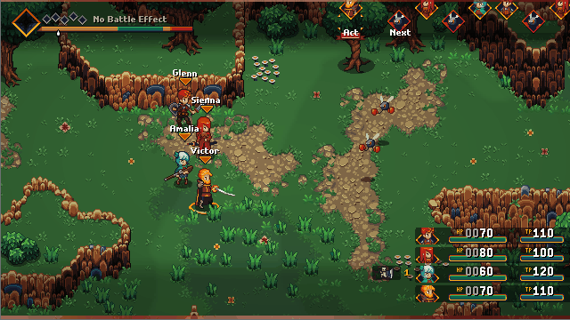

## Sterker worden als in Chrono Cross, maar dan beter

Je wordt niet sterker door ouderwets in level te groeien, zoals in oude _Final Fantasy_\-games. In plaats daarvan krijg je na ieder baasgevecht één upgrade-punt voor ieder personage, waarbij je zelf mag kiezen hoe je die investeert. Je kunt er bijvoorbeeld een nieuwe spreuk mee kopen, maar ook de aanvalskracht of hoeveelheid levenspunten van je personage verhogen.

Het upgradesysteem doet denken aan dat van _Chrono Cross_. Bij die game was het een zwaktebod, omdat je na een baas bij willekeur hogere statistieken kreeg. Maar dat probleem heeft Chained Echoes niet, omdat je zelf kiest hoe je de upgrades investeert. Het zorgt dat je een personage naar eigen smaak kunt groeien en de game tegelijkertijd altijd uitdagend blijft: het is immers onmogelijk om je team veel te sterk te maken voor een baasgevecht.

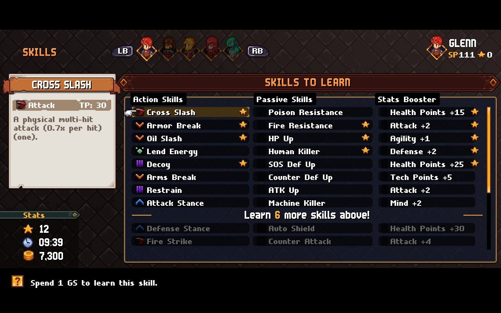

Na ieder baasgevecht krijg je een GS, die je kunt stoppen in een upgrade.

## Een verhaal met een auteur

Linda heeft deze game helemaal zelf gemaakt. Hij heeft geloof ik wel wat contractwerk ingezet om bepaalde assets te maken, maar het spel is volledig zijn eigen visie. Dat is, gezien alle ingebouwde systemen en ideeën, buitengewoon indrukwekkend. Maar het betekent ook dat hij zijn stempel als auteur op de game heeft gedrukt, wat het verhaal een unieke toon geeft. Andere jrpg's zijn vaak gemaakt door grote teams en bij beursgenoteerde bedrijven, die bang zijn te polariseren met politieke boodschappen.

Het zorgt voor een verhaal met duistere ondertonen en bloederige scènes die je niet in een jrpg zou verwachten, waarbij Linda duidelijk een boodschap in zijn game probeert te stoppen. Het maakt _Chained Echoes_ intiemer en memorabeler qua schrijfwerk, al zijn er ook momenten waarop het script ietwat knullig aanvoelt. Het woord 'letterlijk' wordt bijvoorbeeld veelal verkeerd gebruikt. Daarnaast voelt het soms ook alsof Linda net wat te hard zijn best doet om bepaalde dialogen hard over te laten komen. Een kleine smet op een verder briljant spel.

[Bekijk ingesloten media](https://www.youtube.com/embed/2CRib6s-L2k?feature=oembed)

## De beste jrpg van 2022

De kans is klein dat _Chained Echoes_ dit jaar veel 'game van het jaar'-prijzen in de wacht sleept. Dat is grotendeels te wijten aan zijn late verschijning: redacties van gamesites nemen vaak spellen uit december niet meer mee, simpelweg omdat hun selectieproces al bijna klaar is. Daarnaast is het onwaarschijnlijk dat genoeg journalisten het spel nu al hebben gespeeld om er een oordeel over te vellen.

Dat heb ik wel gedaan, dus ik doe het maar gewoon: dit is de beste jrpg die ik in 2022 heb gespeeld. Misschien zelfs de beste game van het jaar, want ik heb een groot zwak voor dit genre. Hij is beter dan _[Xenoblade Chronicles 3](/xenoblade-chronicles-3)_, dat eerder dit jaar ook al eenzame hoogte besteeg. Het is een spel dat me nog jaren zal bijblijven, en één die ik de komende periode waarschijnlijk bij iedereen op de backlog probeer te pushen (alvast sorry daarvoor). Als je bent opgegroeid met jrpg's, ben je het jezelf verplicht om deze game te spelen.

> [!INFO] Details
>
> **Chained Echoes**
>
> Beoordeling: ★★★★★
>
> Ontwikkelaar: Matthias Linda.
> Uitgever: Deck13 Interactive
> Te spelen op Nintendo Switch, PlayStation 4, Xbox One, pc
> Prijs: 24,99 euro, ook op Game Pass
