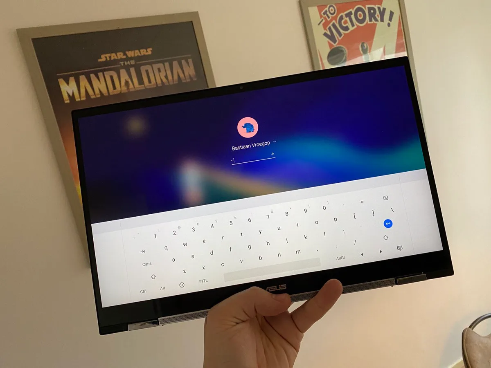
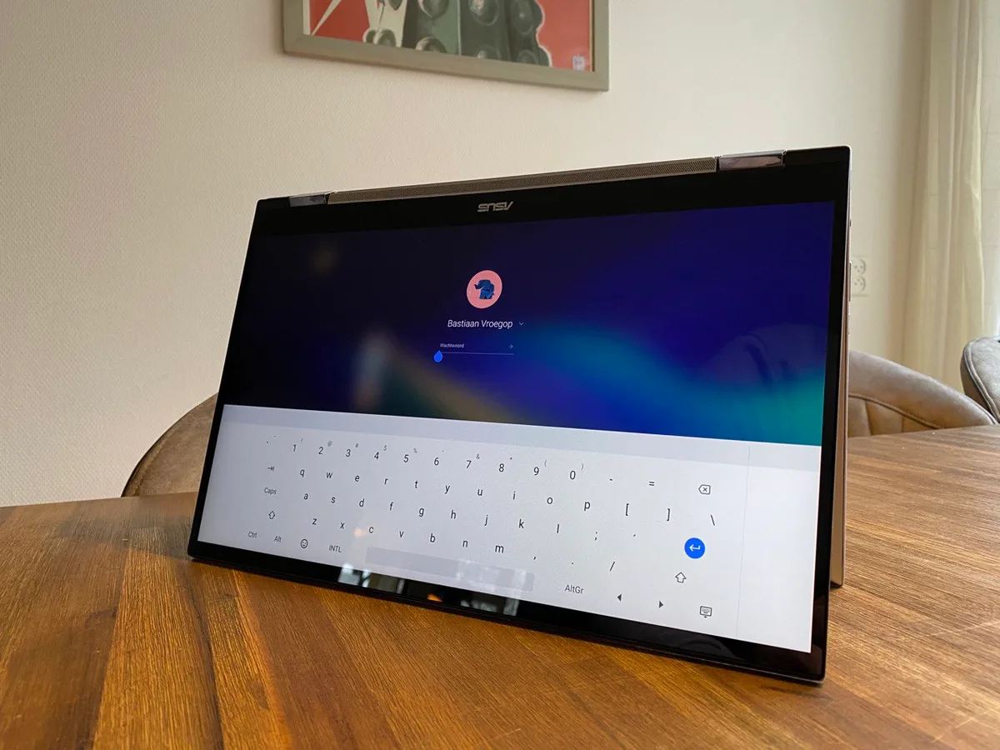

**Maar nuttig?**

> [!NOTE]
> Deze recensie verscheen eerder op [Bright](https://www.bright.nl/nieuws/1125691/review-chromebook-van-asus-krachtiger-dan-je-verwacht.html).

De Flip C436 is misschien wel het dichtst dat we in Nederland bij de Pixelbook komen. Deze laptop gebruikt Google in de Verenigde Staten als paradepaardje voor [Chrome OS](https://www.bright.nl/nieuws/artikel/4993751/nieuwe-chromebooks-krijgen-acht-jaar-lang-updates), om te laten zien wat dit besturingssysteem kan op een krachtige laptop. En dat is ook steeds meer: sinds Chrome OS de Google Play Store ondersteunt, is het mogelijk om Android-apps en zelfs games te draaien op een Chromebook.

Hoewel de Pixelbook niet in Nederland wordt verkocht, is het idee achter de Flip C436 nagenoeg hetzelfde. Ook deze Chromebook heeft een touchscreen dat kan omvouwen, zodat je hem als tablet kan gebruiken. Daarnaast hebben beide laptops een vrij krachtige i5-processor en een hoop ingebouwde extra’s die je niet vindt in goedkopere Chromebooks.

Rechts bovenop zit bijvoorbeeld een vingerafdrukscanner om de laptop mee te ontgrendelen, die overigens wel wat gek in elkaar steekt: het is geen knop zoals andere laptops, maar echt alleen een vingerlezer. Hoewel het 1080p-scherm een mooi hoog contrast heeft, is de backlight niet al te sterk. We konden het scherm bij helder zonlicht eigenlijk amper goed zien.

## 899 euro

Juist dat prijssegment zet de Flip C436 in een bijzondere positie: hij kost 899 euro, ongeveer hetzelfde als veel krachtige Windows-laptops. Hierdoor moet hij zich niet alleen bewijzen als Chromebook, maar ook laten zien of het een waardig alternatief voor Windows is. Dat terwijl Chrome OS ooit op de markt kwam als lichtgewicht besturingssysteem. Het werd in eerste instantie gemaakt om snel te starten en web-apps te draaien met een lange batterijduur.

Op die twee fronten doet de Flip C436 het in elk geval prima. Op een volle batterij hield de laptop het bij ons ruim tien uur vol, een stuk langer dan veel laptops en dezelfde gebruiksduur die we bij de meeste hoogwaardige tablets zien. Na het inschakelen duurt het slechts een seconde of twee tot het inlogscherm verschijnt. Na het invoeren van een wachtwoord kun je vrijwel meteen aan de slag.

Het draaien van die gebruikelijk web-apps gaat de Chromebook ook prima af. Zelfs toen we tientallen tabbladen in Chrome open hadden, bleef de laptop functioneren zoals we zouden verwachten. In de Chrome Web Store staan ook Chrome OS-varianten van de bekende Office-apps, wat de laptop prima maakt voor standaard kantoorbezigheden. Geen wonder ook, gezien de hardware vele malen krachtiger is dan wat je nodig zou hebben voor zo’n taak.

## Android-apps

Die extra rekenkracht van de Flip C436 komt pas echt van pas bij het draaien van Android-apps. Daar kun je losse apps voor bijvoorbeeld Slack of Spotify installeren, al is het aanbod soms wat verwarrend. Van chat-app Telegram zijn bijvoorbeeld twee varianten verkrijgbaar: eentje die er uitziet als mobiele app en een ander die is ingericht op laptopgebruik. WhatsApp is ook te downloaden, maar het bovenste zoekresultaat is de smartphone-versie die je eigenlijk niet op Chrome OS kunt gebruiken. Er is een WhatsApp-app die berichten van je telefoon doorstuurt, maar deze is niet van Facebook zelf.

De Slack-app mist op zijn beurt de handigheidjes van de Windows- en macOS-versie. Op Chrome OS is het bijvoorbeeld veel meer gedoe om tussen chatgroepen te wisselen. Het is bij vrij veel apps duidelijk: ze zijn gemaakt voor luchtig gebruik op een tablet of telefoon, niet om productief op een laptop mee te werken.

## Games afspelen

De Android-ondersteuning zorgt dat zelfs de grafisch intensievere spellen zoals [Call of Duty Mobile](https://www.bright.nl/nieuws/artikel/4877146/honderd-miljoen-downloads-voor-call-duty-mobile) draaien als een zonnetje, hoewel ze lang niet allemaal zijn geoptimaliseerd voor een Chromebook. Een hoop games gaan er van uit dat je alleen het touchscreen wil gebruiken, waardoor je ze niet met de toetsenbord en trackpad kunt bedienen.

Ondersteuning voor al die Android-games is een gave toevoeging, maar op dit vlak verbleekt de Chromebook alsnog vergeleken met Windows-concurrenten. Daarop kun je immers ouderwets pc-games installeren via bijvoorbeeld Steam of de Epic Games Store. Dit soort krachtigere games zou je op een Chromebook via een streamingdienst zoals Stadia kunnen spelen, maar het aanbod hierop is nu nog vrij beperkt. Volgens geruchten kunnen Chromebooks in de toekomst ook Steam-games draaien, maar daar is officieel nog niks over bekendgemaakt.

## Conclusie

Eigenlijk is de nieuwe Chromebook van Asus een wat gek apparaat. Hij heeft de rekenkracht om alles te doen wat er maar mee mogelijk is - maar die lijst aan intensieve mogelijkheden is nog niet zo groot. Chrome OS is vooral gemaakt voor lichte handelingen, waardoor je die extra rekenkracht hooguit eens zult gebruiken om een Android-game te draaien. Laptop-apps zoals Word, Office en Photoshop hebben vaak wel Android-varianten, maar die werken nét niet zo handig als hun ouderwetse equivalenten op andere laptops.

Maar wie al diep in Chrome OS zit, heeft aan de Flip C436 een apparaat dat eigenlijk nooit tegen problemen aanloopt. Voor de meesten is hij vermoedelijk te duur, maar er zijn vast wel een paar verwoede Chromebookgebruikers die op die extra rekenkracht zitten te wachten.

[Bekijk ingesloten media](https://www.youtube.com/embed/pKBE7ecGrak?autoplay=1&modestbranding=1)

[**Volg Bright op YouTube**](https://bit.ly/brighttv)
