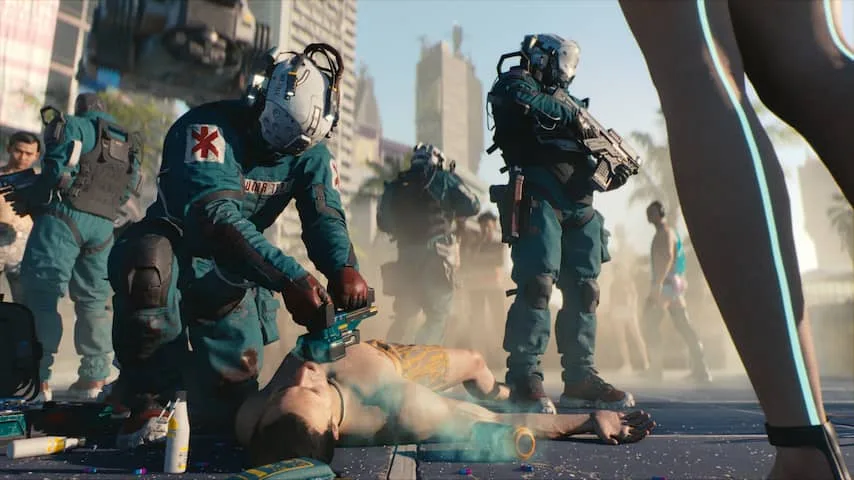

Er zijn weinig games met zo'n lang ontwikkeltraject als _Cyberpunk 2077_. De Poolse ontwikkelaar CD Projekt Red onthulde de nieuwe titel al in 2012, toen de PlayStation 3 en Xbox 360 de belangrijkste spelcomputers waren.

> [!NOTE]
> Deze recensie verscheen eerder op [NU.nl](https://www.nu.nl/reviews/6095134/review-cyberpunk-2077-is-prachtig-maar-nog-niet-af.html).

De game is gebaseerd op het traditionele _Cyberpunk_, een rollenspel dat net als _Dungeons & Dragons_ met pen en papier gespeeld wordt. De eerste editie, over een dystopische stad in de nabije toekomst, verscheen eind jaren tachtig.

CD Projekt Red probeerde jarenlang van _Cyberpunk 2077_ zijn grootste game tot nu toe te maken. De releasedatum werd meermaals uitgesteld, terwijl personeel stelselmatig moest overwerken. Critici vreesden voor een cultuur van burn-outs bij de ontwikkelaar.

_Cyberpunk Keanu — Beeld: CD PROJEKT RED_

## Vol met neonverlichting

Dat neemt niet weg dat de uiteindelijke game er fenomenaal uitziet. Het fictieve Night City hangt vol met neonverlichting dat wordt gereflecteerd door waterplassen en vreemde gassen ontsnappen uit leidingen van gebouwen. Het is een grimmige visie van de toekomst gemengd met de esthetiek van de jaren tachtig.

Het is een stad waar iedere technologische vooruitgang de verkeerde kant op is gegaan. Mensen vervangen lichaamsdelen met artificiële alternatieven om zo sneller, beter en slimmer te worden. Hackers loggen rechtstreeks met hun hersenen in en grote multinationals hebben overheden vervangen als machthebbers.

## Personage kan uitvoerig aangepast worden

Spelers maken aan het begin van de game een eigen personage genaamd V. Deze is visueel tot aan de genitaliën aan te passen, maar ook wordt een achtergrondverhaal en een specialisatie gekozen. V kan een vaardig hacker zijn die ooit voor een megacorporatie werkte, of is juist een pistoolheld die op straat opgroeide.

V begint als simpele huurling, maar raakt bij een missie ernstig gewond en krijgt de geest van een overleden terrorist geïnjecteerd in zijn brein. Wat volgt is een verhaal dat zich anders ontpopt dan in andere games. V is een antiheld die vooral met zichzelf bezig is en steeds dieper verstrikt raakt in criminele organisaties, waardoor _Cyberpunk_ vaak aanvoelt als een misdaadfilm.

_Cyberpunk — Beeld: CD Projekt Red_

## Gamesystemen voelen ouderwets aan

V's vaardigheden worden langzamerhand verfijnd naarmate het spel zich voortzet, wat missies op meerdere manieren benaderbaar maakt. Een kamer vol vijanden kan met wapens worden uitgeschakeld, maar ook door bijvoorbeeld apparatuur te hacken. Daarnaast is iedereen voorbij sluipen vaak ook een optie.

Dat soort keuzes in aanpak zijn gamers niet vreemd: ze vormen de basis in veel andere rollenspellen, zoals CD Projekts eigen _Witcher_\-titels en bijvoorbeeld _Skyrim_. In _Cyberpunk_ voelen ze vaak wel gelikter en zijn ze fraaier in beeld gebracht.

Maar _Cyberpunk_ probeert weinig echt nieuwe dingen. Deze game herpakt wat we al jarenlang bij genregenoten zien, op grotere schaal. Prima voor iedereen die oude games een warm hart toedraagt, maar jammer voor wie hoopte op vernieuwing en innovatie.

[Bekijk ingesloten media](https://content.jwplatform.com/players/9R3tUkR1-whqXCOFb.html)

## Game zit vol met bugs

Daarnaast hangt er één groot pijnpunt boven _Cyberpunk_: het spel zit op dit moment tjokvol met bugs en problemen. We liepen bij onze speelsessies aan tegen buitengewoon veel problemen die de speelervaring belemmerden, zoals onzichtbare personages en gek zwevende objecten.

Sommige andere bugs waren onschuldiger: onze hoofdpersoon raakte af en toe zijn haar kwijt, waardoor hij kaal verder moest. Ook had hij de neiging zijn schoenen ineens te verliezen.

Dat houdt je spelvoortgang niet tegen, maar voelt buitengewoon slordig, alsof je een film kijkt waarin de cameraman de helft van de tijd in beeld staat. Een patch moest afgelopen weekend veel mankementen verhelpen, maar na installatie dook iedere paar minuten wel een foutje op.

## Conclusie

Al die bugs voelen tragisch. Dit is een game waar acht jaar aan gewerkt is, die ook meermaals werd uitgesteld. Leidinggevenden vroegen personeel continu over te werken, ondanks beloftes na kritiek dit niet meer te doen.

Zelfs na dat alles voelt _Cyberpunk_ niet af. Het is een visueel prachtige titel met een wereld die beter is uitgediept dan bij menig concurrent. Maar zet je tegenover die pracht de afwerking en speelstijl, dan is het eindresultaat slechts een goede game. Hopelijk worden de technische problemen in latere updates verder rechtgezet.

_Review: Cyberpunk 2077 is prachtig, maar nog niet af_

_Deze game werd origineel gerecenseerd op basis van de pc-versie. Na uitvoerig testen blijkt de game op spelcomputers veel slechter te presteren, waardoor we niet langer achter de score van 4 sterren kunnen staan._

_Omdat het gros van de Nederlanders vermoedelijk op een spelcomputer gamet, hebben we de waardering daarom verlaagd naar 3 sterren._
