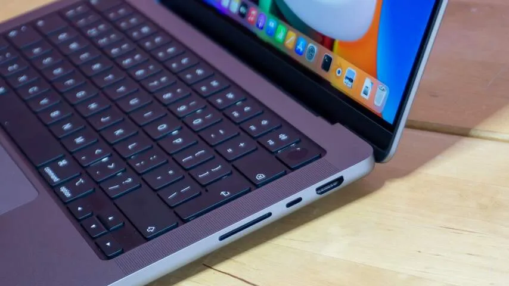

Hoewel Apple zijn MacBook Pro al jarenlang verkoopt als machine voor bijvoorbeeld foto- en videobewerkers, was juist die groep ontevreden over recente edities van de laptop. Dat kwam bijvoorbeeld door het verdwijnen van de poorten aan weerszijden, waardoor je allerlei verloopjes nodig had om bijvoorbeeld een geheugenkaart van je camera aan te sluiten.

> [!NOTE]
> Deze recensie verscheen eerder op [NU.nl](https://www.nu.nl/reviews/6169319/review-de-macbook-pro-is-eindelijk-weer-interessant-voor-pros.html).

Een tweede pijnpunt was het weghalen van de F-knoppen bovenaan het toetsenbord, die werden vervangen door een klein, onhandig aanraakschermpje. En ook het toetsenbord zelf was jarenlang een probleem: als je een boterham aan je bureau at, riskeerde je dat één kruimel een knop onbruikbaar maakte, zonder dat je dit makkelijk zelf kon oplossen.

## Stapje terug voor Apple

Dat toetsenbordprobleem heeft Apple eind 2019 uiteindelijk opgelost, en met de nieuwe MacBook Pro worden dit jaar alle andere grote frustraties van professionals weggenomen. De laptop heeft eindelijk weer verschillende poorten aan weerszijden, waardoor er ruimte is voor een geheugenkaartje of een HDMI-kabel voor een extra scherm. Bovenaan het toetsenbord zitten bovendien weer de vertrouwde F-knoppen, die bij dit nieuwe model een maatje groter zijn gemaakt.

Het zijn bijzondere stappen voor Apple, dat hiermee in feite toegeeft dat eerdere veranderingen bij de laptop niet zo'n goed idee waren. Dat terwijl de techreus vaak juist trendsetter is: de verwijdering van de geluidspoort bij iPhones leidde er bijvoorbeeld juist toe dat Android-fabrikanten die aansluiting ook weghaalden.

_Review: De MacBook Pro is eindelijk weer interessant voor pro's — Beeld: Tweakers_

## Groter scherm en snellere chips

Maar Apple doet bij deze MacBook niet alleen een stapje terug: hardwarematig maakt de MacBook Pro een van de grootste sprongen van de afgelopen jaren. Dat is bijvoorbeeld te zien aan het nieuwe beeldscherm, dat met dunnere randen in hetzelfde formaat past. De oude 13 inch-MacBook is hierdoor ineens 14 inch groot. Het grootste model heeft een scherm van 16 inch. Bovenaan het scherm zit een inkeping voor de webcam, net als bij recente iPhones. Dat betekent een hap uit je beeld, maar doordat hier vaak een leeg deel van de menubalk staat, heb je er amper last van.

De nieuwe MacBook Pro draait op verbeterde varianten van Apples eigen M1-chips. Dat zijn processoren die Apple sinds kort zelf produceert voor zijn computers, waarmee het is afgestapt van de traditionele hardware van Intel. De standaard M1-chips zijn al vrij snel en krachtig, en de M1 Pro en M1 Max in de nieuwe MacBook Pro zijn nog een stapje vooruit. Ze zijn zo'n 60 procent sneller gemaakt.

## Een van de krachtigste in zijn klasse

Dat maakt de laptops buitengewoon krachtig, blijkt uit tests van [Tweakers](https://tweakers.net/reviews/9524/apple-macbook-pro-2021-van-parade-naar-werkpaard.html?utm_source=ad&utm_medium=nieuwsartikel&utm_campaign=byo). Bij het exporteren van video's in een bewerkingsprogramma was de MacBook Pro de op een na snelste in de vergelijking, zowel met de M1 Pro als met de Max. Alleen een Windows-laptop van rond de 2.500 euro was iets sneller klaar.

Bij een algemene benchmark scoorden de laptops het hoogst in de belangrijkste categorieën, en ze stonden hoog op de ranglijsten bij tests met verscheidene professionele software. En bij de meeste zware taken weet de laptop zijn ventilatoren ook vrij stil te houden.

De batterijduur ligt bij de tests wat lager dan die van andere MacBooks met een M1-processor, al hadden we daar in de praktijk weinig last van. Bij niet al te zwaar werk houdt de laptop het makkelijk een hele dag vol op een volle accu. Bij non-stop webbrowsen kun je rekenen op tussen de twaalf en veertien uur stroom.

## Conclusie

Het zijn specificaties die Apples laptop hoog op de ranglijst doen belanden. De nieuwe MacBook Pro is een van de beste laptops in zijn klasse. Het zal voor Apple wellicht pijnlijk zijn geweest om controversiële keuzes bij voorgaande modellen terug te draaien, maar voor gebruikers is de terugkeer van extra poorten en de functieknoppen geweldig. Het maakt het heel makkelijk om deze laptop aan te raden.
