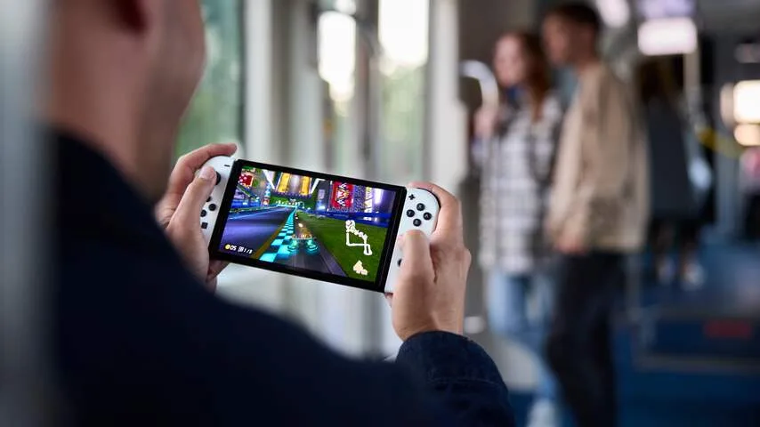
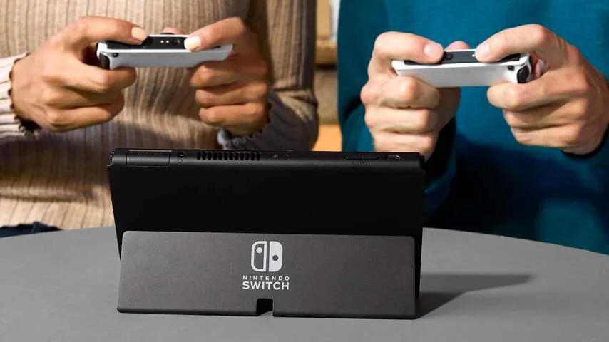

De nieuwe Nintendo Switch moet het vooral van één ding hebben: zijn oleddisplay. Deze schermtechnologie wordt ook in hoogwaardige televisies en smartphones gebruikt en belooft een buitengewoon hoog contrast. Doordat elke pixel individueel kan oplichten, zijn bijvoorbeeld zwarte objecten ook écht gitzwart, want dat deel van het scherm is uitgeschakeld.

> [!NOTE]
> Deze recensie verscheen eerder op [NU.nl](https://www.nu.nl/tech/6160877/review-de-nieuwe-nintendo-switch-moet-het-alleen-van-zijn-scherm-hebben.html).

Het ziet er op de nieuwe Switch prachtig uit. Het viel ons vooral op bij het spelen van de nieuwe scifigame _Metroid Dread_, die met zijn donkere gangen en neonverlichting al bovengemiddeld contrastrijk is. Vergelijk je het display met dat van de eerdere Switch en Switch Lite, dan zijn die twee oude modellen vooral flets, met uitgewassen kleuren en een waas over donkere objecten.

Het beeldscherm is ook groter dan dat van de vorige Switch; namelijk 7 inch in plaats van 6,2 inch (of 5,5 inch in het geval van de Switch Lite). Toch is de spelcomputer zelf even groot. Nintendo heeft de randen om het beeld dunner gemaakt om plaats te maken voor een groter scherm.

## Moderner ontwerp

Die dunnere randen zorgen er meteen voor dat de Switch er moderner uitziet. Bij het eerste model begonnen de jaartjes esthetisch gezien al te tellen, met balken rond het scherm die doen denken aan de eerste tablets van zo'n tien jaar geleden.

Hoewel het scherm groter is, heeft Nintendo niets gedaan aan de resolutie: de Switch heeft wederom een 720p-display. Dat betekent in theorie dat de pixels iets groter zijn, en het beeld dus onscherper. In de praktijk merken we daar echter niets van: 7 inch is nog steeds klein genoeg om haarscherp te ogen bij deze hoeveelheid pixels.

_Review: De nieuwe Nintendo Switch moet het alleen van zijn scherm hebben — Beeld: Nintendo_

## Beter klinkende speakers

Verder is de oled-Switch op slechts een paar kleine punten aangepakt. De speakers zitten op iets andere plekken, waardoor geluid ruimtelijker klinkt dan voorheen. Bij onze tests was het verschil vrij goed op te merken, hoewel er geen sprake is van bijvoorbeeld diepere basgeluiden.

Het voetje achterop, om het apparaat weg te zetten, is steviger en breekt niet zomaar meer af - een veelgehoord probleem bij de eerste Switch. Ook kan het in meer posities worden gebogen, zodat je de Switch beter op tafel kunt neerzetten. De bijgeleverde dock heeft nu een internetpoort, maar een USB-aansluiting minder.

_Review: De nieuwe Nintendo Switch moet het alleen van zijn scherm hebben — Beeld: Nintendo_

## Van binnen gelijk gebleven

Verder is het apparaat aan de binnenkant eigenlijk gelijk gebleven. Nintendo gebruikt dezelfde processor als voorheen, waardoor games ook precies even snel laden en even soepel lopen. Dat is bij een upgrade na vier jaar toch wat karig: we hadden op een snellere chip met wellicht ondersteuning voor 4K-beelden gehoopt. In plaats daarvan probeert Nintendo de grenzen op te zoeken met deze ouder wordende technologie.

De kinderziektes bij Nintendo's Joy-Con-controllers zijn ook ongewijzigd. Bij een afstand van slechts 3 meter had onze gamepad al verbindingsproblemen, een klacht die velen in 2017 ook al hadden. Van de zogeheten 'driftproblemen', waarbij je pookje ongevraagd beweegt, hebben we nog niets gemerkt, maar we vrezen er wel voor.

## Conclusie

Het oledmodel van de Nintendo Switch is simpelweg een schermupgrade. Dat maakt upgraden vanaf een 2017-model niet voor iedereen interessant - wie vooral op een tv speelt, merkt zelfs niets van die verandering.

Maar het is tegelijkertijd de meest geavanceerde variant van de Nintendo-spelcomputer, en tijdens handheldsessies konden we het nieuwe display absoluut waarderen. Wie nog geen Switch heeft en er na vier jaar alsnog een wil kopen, kan het best voor deze nieuwe gaan. Heb je de oude? Dan is een upgrade voor zo'n 350 euro wel heel veel geld voor die minimale upgrade.
