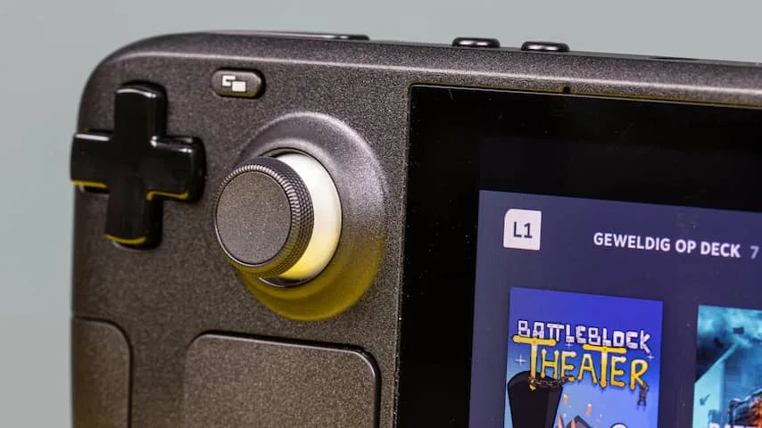
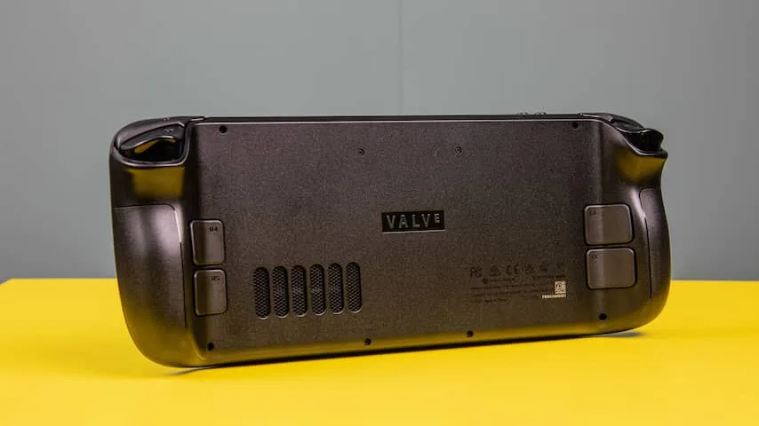

De onthulling van de Steam Deck vorig jaar kwam op het perfecte moment. Net toen alle geruchten over een betere, krachtigere Nintendo Switch doorgeprikt waren, beloofde Valve een gaminghandheld met een razendsnelle processor die veel moderne games goed kan afspelen.

> [!NOTE]
> Deze recensie verscheen eerder op [NU.nl](https://www.nu.nl/reviews/6186022/review-de-steam-deck-kan-geweldig-worden-maar-is-nog-niet-af.html).

De eerste reserveringen konden eind 2021 worden geplaatst, waarvan op vrijdag 25 februari de eerste bestellingen gemaakt kunnen worden. Wij kregen een vroeg testexemplaar van Valve toegestuurd om alvast te proberen.

Wat als eerste opvalt bij de Steam Deck is het formaat: hij is een flinke slag groter dan de al forse Nintendo Switch. De handgrepen achterop zorgen er echter voor dat hij comfortabel vast te houden is.

Met 670 gram is hij zwaar, maar in de praktijk zorgt dat voor minder problemen dan vooraf gedacht. Vooral als je een stoel met een armleuning hebt, is het makkelijk om een houding te vinden waarbij je de spelcomputer makkelijk urenlang kunt vasthouden.

## Veel knoppen binnen handbereik

Alle knoppen zitten bij gebruik comfortabel binnen handbereik. Handig zijn de vier actieknoppen achterop. Die voelen wel wat stroef, net als de knoppen waarmee je menu's tevoorschijn haalt.

Je hebt ook twee kleine trackpads die je met een duim bedient. Dat werkt verrassend accuraat, waardoor bijvoorbeeld simulatiegames bedoeld om met een muis te spelen goed te bedienen zijn op een Steam Deck.

_Review: De Steam Deck kan geweldig worden, maar is nog niet af — Beeld: Tweakers_

## Beeldscherm

Het beeldscherm heeft een resolutie van 1280 bij 800 pixels, wat scherp genoeg oogt op zijn 7 inchscherm. Deze relatief lage resolutie zorgt er ook voor dat de processor minder hard hoeft te werken om games mooi weer te geven. Het zorgt voor spellen die bij onze tests prachtig oogden.

Een mankement waar we tegenaan liepen is dat het scherm van ons testexemplaar wat licht lijkt te lekken, wat vooral zichtbaar is in donkere games of bij bijvoorbeeld laadschermen. Bij ons was vooral in de linkerbovenhoek dan een lichte waas te zien. We hebben Valve gevraagd of dit een veel voorkomend probleem is, maar op het moment van schrijven nog niets teruggehoord.

## De games

Valve trapte de introductie van de Steam Deck ambitieus af door te zeggen dat de meeste pc-games erop zullen werken. In de kern is het een gaming-pc die draait op Linux, met bijbehorende software die Windows-games werkend krijgt.

Dat bleek bij onze tests lang niet altijd moeiteloos te verlopen. Sommige games starten moeiteloos op, maar veel andere titels crashen tijdens het opstarten of lopen vast als je net aan een level begonnen bent. Op de site van Valve staat inmiddels een lijst van geverifieerde games. Wie verwacht al zijn of haar pc-games op de Deck te draaien, zal worden teleurgesteld.

## Maar als het werkt

Start een game op die goed op de Steam Deck werkt, en je hebt wel een geweldige ervaring. Uit tests gedaan samen met het [testlab van Tweakers](https://tweakers.net/reviews/9820/steam-deck-een-handheld-voor-de-tweaker.html?utm_source=nu&utm_medium=nieuwsartikel&utm_campaign=byo) blijkt dat bijvoorbeeld _Civilization VI_ prima draait op medium-instellingen. _F1 2021_ werkt zelfs op hogere instellingen uitstekend.

_Grand Theft Auto V_ haalt op de hoogste instellingen ook een framesnelheid van 75 frames per seconde. Niet zo hoog als bij vergelijkbare gaming-pc's, maar meer dan genoeg om er lol aan te beleven. _Shadow of the Tomb Raider_ deed het ook goed, al moet je de instellingen ietwat verlagen als je met zestig frames per seconde wil gamen.

_Review: De Steam Deck kan geweldig worden, maar is nog niet af — Beeld: Tweakers_

## Lange accuduur nog langer maken

Valve belooft een batterijduur van tussen de twee en acht uur. Bij onze tests werd dat grotendeels waargemaakt. Je gebruikstijd hangt af van hoe geavanceerd je game is: een oude retrogame kun je met gemak zeven tot acht uur spelen, terwijl _GTA V_ het minder lang volhoudt.

Het is prijzenswaardig hoeveel opties Valve biedt om die batterijduur te verlengen. Vanuit een speciaal instellingenmenu kun je bijvoorbeeld de hoeveel frames per seconde in een game beperken tot dertig. Dan oogt een spel minder vloeiend, maar wordt ook minder stroom verbruikt.

## Software is het nog net niet

De Steam Deck draait op een nieuwe versie van SteamOS, dat op zijn beurt is gebouwd op het besturingssysteem Linux. Dat ziet er allemaal strak uit, maar tijdens onze tests hadden we nog wel vaak last van bugs en vastlopers.

Wel brengt Valve bijna iedere dag een nieuwe update uit met probleemoplossingen, en we merken dat de hoeveelheid mankementen gestaag afneemt.

## Conclusie

Dat maakt de Steam Deck een apparaat met onwijs veel potentie. Toen wij ons testexemplaar binnenkregen, waren er veel ruwe randjes te zien: de software liep vaak vast en veel games bleken niet of slecht te werken. Maar naarmate er nieuwe updates verschijnen, wordt het apparaat steeds stabieler en uitgebreider.

Dat maakt het ook lastig om een eenduidig koopadvies te geven. Blijft Valve zulke grote stappen maken met het verbeteren van de software, dan wordt dit in de komende maanden al een fenomenaal apparaat. Maar het is afwachten hoe dat proces precies zal verlopen.
