De telefoonmaker zet alles op alles om zijn positie op de smartphonemarkt te bewijzen. Dat is in elk geval terug te zien aan de voorkant van de S8. De randen van het scherm zijn ontzettend klein gemaakt, waardoor het display nagenoeg het gehele toestel bedekt.

> [!NOTE]
> Deze recensie verscheen eerder op [NU.nl](https://www.nu.nl/reviews/4628370/review-galaxy-s8-voelt-als-sciencefiction.html).

Zo’n dekkend scherm zit ook in de nieuwe LG G6, maar de Galaxy S8 heeft ook afgeronde zijkanten links en rechts op de telefoon. Het maakt van de S8 een minimalistisch ogend stuk glas, met enkel wat camera’s en een luidspreker bovenop.

De thuisknop op het toestel is ingeruild voor een virtuele variant die op de onderkant van het beeldscherm wordt getoond. Hoewel deze knop af en toe verdwijnt in schermvullende applicaties, kan hij altijd worden geactiveerd door stevig op die plek op het scherm te drukken of omhoog te vegen.

[Bekijk ingesloten media](https://content.jwplatform.com/players/V3r4L5Tc-whqXCOFb.html)

Het maakt van de S8 de meest in het oog springende smartphone die Samsung tot nu toe heeft gemaakt. De virtuele knop oogt eleganter dan zijn fysieke voorganger. Het wat dominerende logo aan de voorkant is bovendien verdwenen, simpelweg omdat deze niet meer op de dunnere bovenrand past.

Je moet maar net van de glimmende achterkant van de telefoon houden, maar het gehele toestel voelt hoogwaardig. Door het gebogen scherm loopt de voorkant ook over in de aluminium zijkant, waardoor er geen scherpe hoek op de S8 te vinden is.

Omdat beide varianten van de S8 ditmaal gebogen randen hebben, zit het enige verschil nog in het schermformaat. De Galaxy S8 gaat voor 799 euro over de toonbank, terwijl de S8+ wordt verkocht voor 899 euro.

Door de schermranden te verkleinen heeft Samsung het scherm van de S8 in feite langwerpiger gemaakt, met een verhouding van 18 bij 9. Veel apps binnen Android zijn hier ook al voor aangepast, maar een aantal is hier nog niet op voorbereid. Hetzelfde geldt voor video’s, die vaak in een verhouding van 16 bij 9 zijn gefilmd.

## Schermen

De schermen zijn best groot. De Galaxy S8 heeft een 5,8 inch-display, terwijl de S8+ een display van 6,2 inch bevat. Door de smalle randen blijven de toestellen zelf echter vrij acceptabel qua grootte. Ter illustratie: de Galaxy S8+ is met zijn 6,2 inch ongeveer even groot als de iPhone 7 Plus, waar een 5,5 inch-beeldscherm in zit.

Dat is misschien wel de grootste mijlpaal van de S8. Samsung is er in geslaagd om ons een nog groter beeldscherm te geven, zonder een grotere telefoon te maken. Het maakt de telefoon bruikbaarder, zonder je te dwingen een phablet aan te schaffen.

## Snel

Op papier is de Galaxy S8 een krachtpatser. De ingebouwde octacore-chip heeft een snelheid van vier keer 2,3 GHz en vier keer 1,7 GHz. In het toestel zit 64GB interne opslag en 4GB RAM-geheugen verwerkt. De opslag kan met een microSD-kaart worden uitgebreid.

In benchmarktests met Geekbench scoort de S8 goed. Met een testscore van 6570 presteert de processor aanzienlijk beter dan de Galaxy S7, die gemiddeld een score van 5213 heeft neergezet.

In de praktijk betekent het dat de S8 razendsnel is. In het gebruik is er nagenoeg nooit sprake van haperingen of lange laadtijden. Daar hebben we op de S7 of andere iets oudere smartphones binnen deze klasse echter ook geen last van. High-end-toestellen zitten al langer op het punt dat snellere hardware een luxe is, in plaats van een vereiste.

De processorkracht van de S8 lijkt de smartphone vooral toekomstbestendig te maken, voor apps die ooit alles uit deze hardware gaan halen.

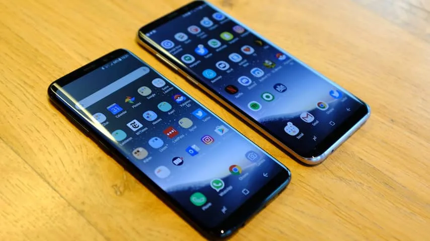

_Galaxy S8 — Beeld: NU.nl/Floris Poort_

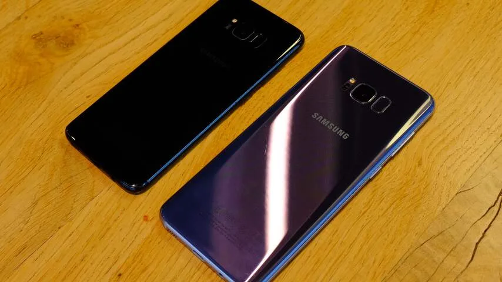

_Galaxy S8 — Beeld: NU.nl_

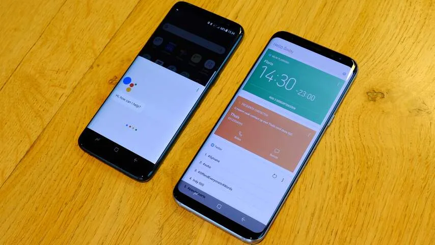

_Galaxy S8 — Beeld: NU.nl/Floris Poort_

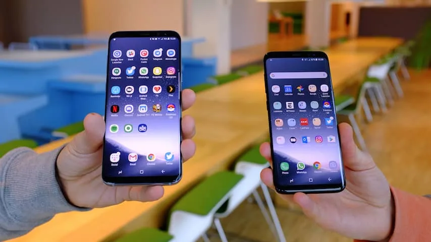

_Galaxy S8 — Beeld: NU.nl/Floris Poort_

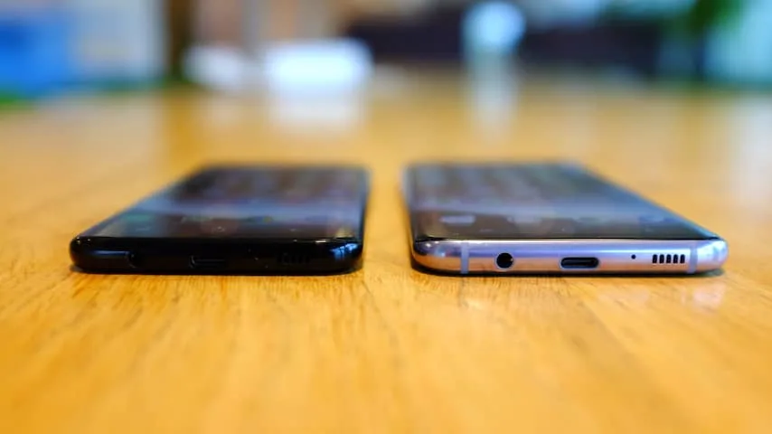

_Galaxy S8 — Beeld: NU.nl/Floris Poort_

De accu van de S8 weet het op een dag prima vol te houden. Aan het einde van een dag met vrij intensief gebruik zat er meestal nog tussen de 10 en 20 procent lading in de telefoon. In een reviewperiode van ongeveer twee weken moesten we slechts één keer in de middag al de stekker erbij pakken, omdat drie uur lang Google Maps was gebruikt om te navigeren.

## Assistent Bixby

Op de zijkant van de Galaxy S8 zit een speciale knop om virtuele assistent Bixby te activeren. De telefoonfabrikant wil hiermee de concurrentie aan met Siri en de nieuwe Assistant van Google.

De uitvoering van Bixby valt op het moment wat tegen. Met de knop wordt een scherm met informatie afkomstig uit apps geopend. Deze informatie wordt net als bij Google Now in kaarten getoond, maar in veel gevallen gaat het om algemene data. Zo toont Bixby informatie van Twitter, maar betreft het enkel trending topics.

De assistent probeert af en toe te voorspellen wat je graag wil doen, door bijvoorbeeld telefoonnummers te tonen die je vaak om de huidige tijd belt. Leuk, maar tot op heden was dit nooit handig. Het voelt als een gimmick.

Daarmee is de S8 voorzien van een fysieke knop die weinig meerwaarde heeft. Een knop waar je niet zomaar een andere functie aan kunt koppelen: een methode om de Google-assistent toe te wijzen, is in een software-update geblokkeerd.

Op een later moment moet Bixby ondersteuning krijgen voor stemcommando’s, maar dit zal eerst in alleen het Engels en Koreaans werken.

## Biometrie

Er zijn drie manieren om de Galaxy S8 te ontgrendelen naast de gebruikelijke ontgrendelcode: met een vingerafdruk, een gezichtsscan of een irisscan. Van deze drie is de gezichtsscan in de meeste gevallen effectief. Bij goed licht word je vrijwel meteen herkend, waarna je binnen een seconde in de telefooninterface zit.

’s Avonds zijn de lichtomstandigheden vaak te ongunstig om gezichtsherkenning te gebruiken. In die situaties komt de vingerlezer voornamelijk van pas, al is deze verre van ideaal op de S8. Hij zit naast de camera achterop het toestel - een vrij lastig te bereiken plek hoog op de telefoon. Omdat de vingerscanner naast de camera zit, drukten we ook net wat vaak op de lens in plaats van op de lezer. Vervelend, maar niet een grote ramp. Daarnaast werkt een pincode op ieder moment.

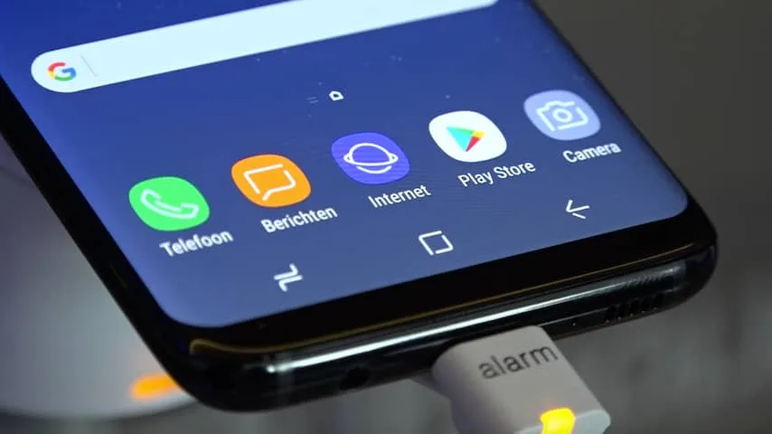

_Galaxy S8 — Beeld: NU.nl_

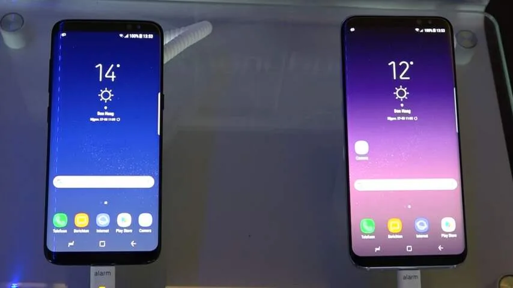

_Galaxy S8 — Beeld: NU.nl_

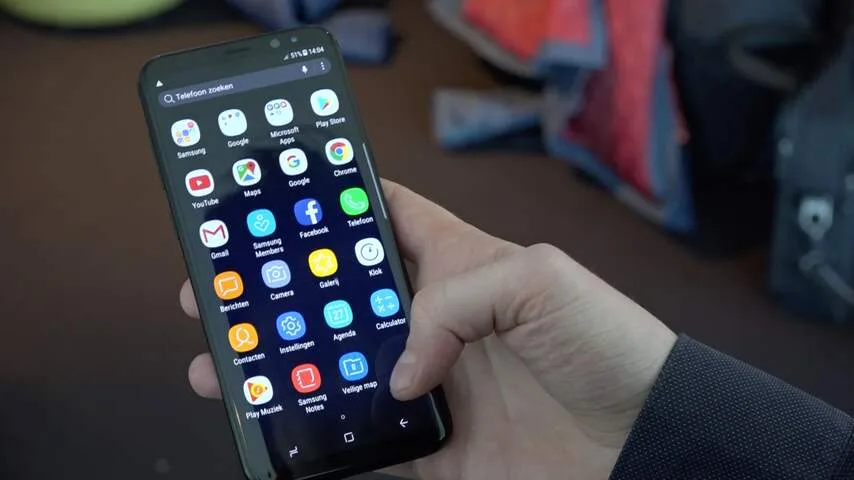

_Galaxy S8 — Beeld: NU.nl_

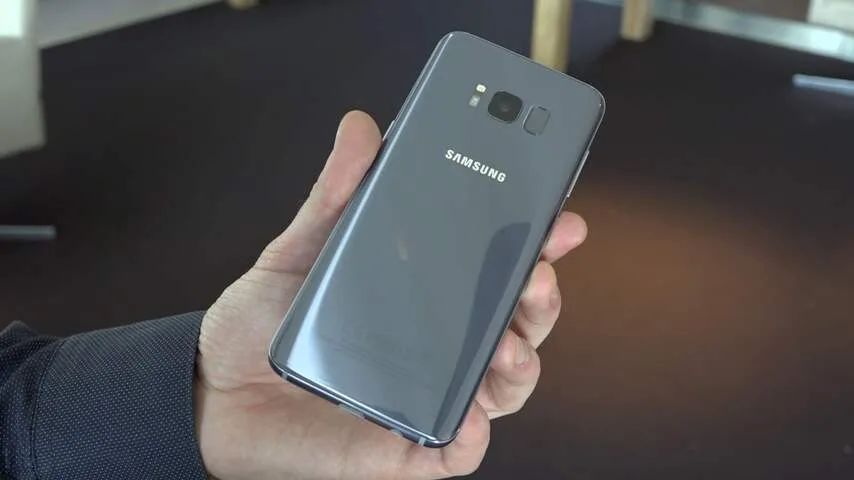

_Galaxy S8 — Beeld: NU.nl_

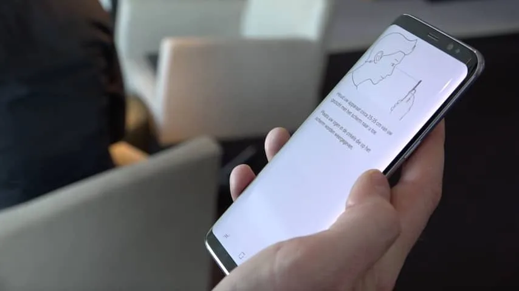

_Galaxy S8 — Beeld: NU.nl_

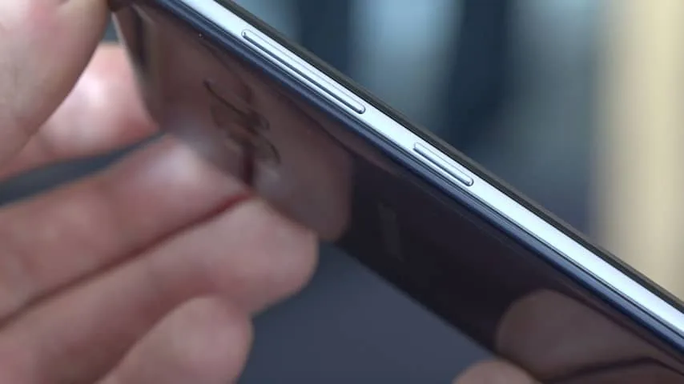

_Galaxy S8 — Beeld: NU.nl_

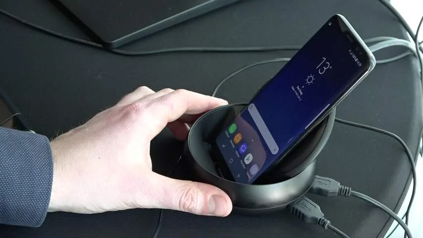

_Galaxy S8 — Beeld: NU.nl_

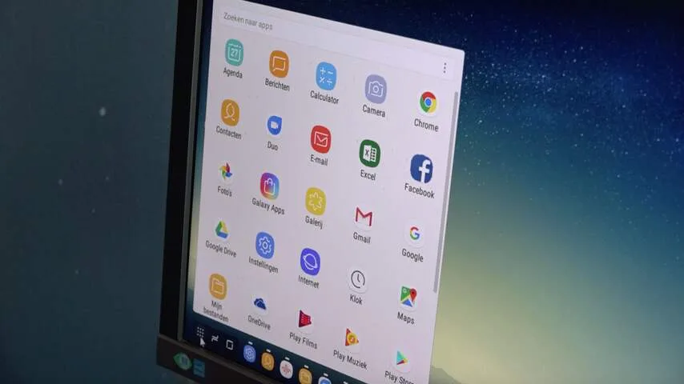

_Galaxy S8 — Beeld: NU.nl_

## Foto’s

De 12 megapixel-camera in de S8 is grotendeels identiek aan die in de S7. De grootte van het diafragma is gelijk gebleven en ook aan het formaat van de sensor is niks veranderd. Enkel de frontcamera voor selfies is iets opgeschroefd, van 5 megapixels naar 8 megapixels.

De conservatieve aanpak voor de camera is geen heel groot bezwaar. Afgelopen jaar wist de Galaxy S7 met zijn foto’s al te imponeren, en bij de S8 is dat eigenlijk nog steeds het geval. Het contrast in foto’s is bijna altijd fraai om te zien, al helemaal op het mooie scherm van de S8.

Bij lage lichtomstandigheden weet de S8 er ook iets moois van te maken. Van korrels in de foto’s is zelden sprake. Daarnaast moet het wel héél donker zijn om last te hebben van bewegingsonscherpte.

## Conclusie

Laat je niet afschrikken door onze kritiekpuntjes op de biometrie van de S8 en Bixby. Het zijn allemaal relatief kleine nadelen aan wat volgens ons de beste smartphone van dit moment is. De basis van de Galaxy S8 staat namelijk als een huis: het bijna randloze scherm voelt aan als sciencefiction en de ingebouwde hardware haalt flink wat uit de kast. Ondanks dat houdt de accu het prima een dag lang vol.
