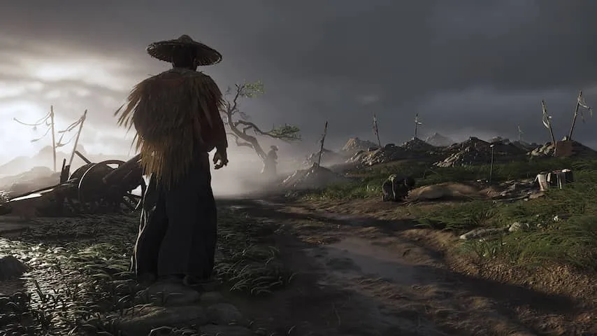
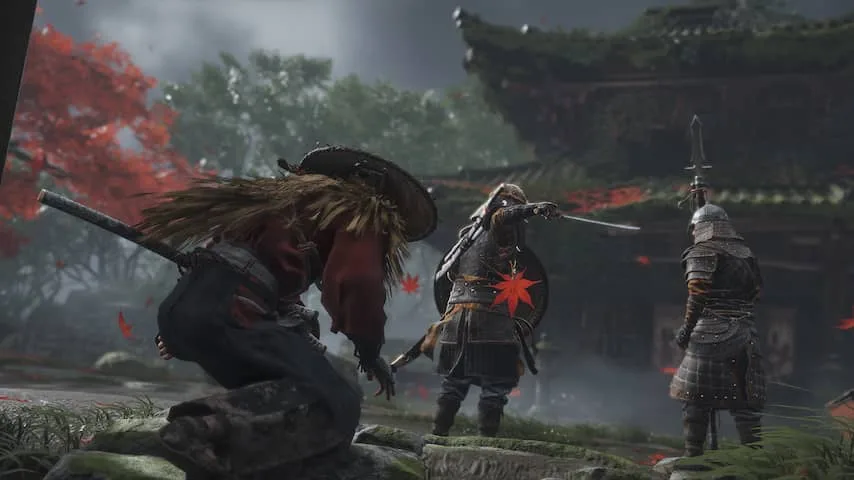
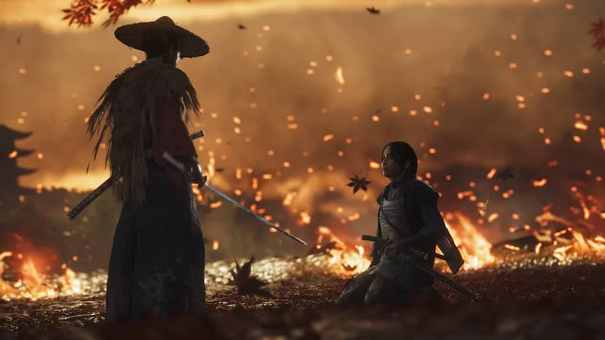

Na jaren gewerkt te hebben aan de superheldengamereeks _Infamous_, heeft ontwikkelaar Sucker Punch met _Ghost of Tsushima_ iets heel anders neergezet. Spelers gaan aan de slag als Jin Sakai, een samoerai die in 1274 de invasie van de Mongolen in Japan overleeft.

> [!NOTE]
> Deze recensie verscheen eerder op [NU.nl](https://www.nu.nl/reviews/6064356/review-ghost-of-tsushima-is-prachtig-maar-valt-in-herhaling.html).

Jin zweert om het invasieleger terug te dringen, zelfs als hij daar zijn erecode voor moet laten vieren. Voor de jonge samoerai een lastig besluit, ook omdat hij is opgevoed door zijn oom die het eiland Tsushima regeert.

Het is te merken dat Sucker Punch een westerse ontwikkelaar is die een game over Japan maakt. De game doet zijn best om tot op de letter uit te leggen wat een samoerai is en hoe hun code werkt. Enerzijds lijkt dat versimpelend te werken, maar het maakt een verhaal over oosterse culturen ook toegankelijker voor een westerse doelgroep.

_Ghost of Tsushima — Beeld: Sucker Punch_

_In Ghost of Tsushima speel je een samoerai in 1274. Bron: Sucker Punch._

## Vechten als in oude samoeraifilms

Jins nieuwe filosofie betekent in de praktijk dat hij conflicten in de game op twee manieren kan benaderen. De eerste manier is om vijanden één op één te lijf te gaan. Hij daagt zijn vijanden luid uit, waarna je door middel van een kleine minigame een vijand uitschakelt door op het juiste moment op de aanvalsknop te drukken. Dat is vormgegeven zoals een 'showdown' in een oude samoeraifilm of western.

Bij het hierop volgende gevecht is _Ghost of Tsushima_ een solide actiegame. Vijanden blokkeren standaard al je klappen, waardoor het belangrijk is om binnenkomende slagen te pareren en een opening te vinden. Zowel jij als je vijanden zijn in een paar klappen al uitgeschakeld, waardoor je altijd op het puntje van je stoel blijft zitten.

_Ghost of Tsushima — Beeld: Sucker Punch_

_Je kunt op vijanden af sluipen om ze uit te schakelen. Bron: Sucker Punch._

## Sluipen en stilletjes moorden

Een tweede manier van spelen is door langs vijanden te sluipen en ze vervolgens in de rug te steken. Gaandeweg krijg je steeds meer hulpmiddelen, zoals windgongs die ter afleiding geluid maken. Door op een knop te drukken kan Jin ook goed 'luisteren', waardoor alle nabijgelegen vijanden door muren heen te zien zijn. Handig als je ze wil vermijden.

De eerste paar keer dat Jin iemand vanuit de schaduwen vermoordt, springt de game naar flashbacks waarin zijn oom hem leert altijd het eervolle te doen. Jin zou zich moeten schamen voor wat hij heeft gedaan, wat ook de suggestie wekt dat jij als speler eervoller te werk moet gaan.

In werkelijkheid maakt het allemaal niet uit: probeer je zo eervol mogelijk door de game te gaan en vijanden alleen in eerlijke duels te verslaan, dan wordt Jin in filmpjes nog steeds geportretteerd als een eerloos figuur. In feite ontmoedigt de game je om op bepaalde manieren te spelen, zonder je te belonen als je het juiste doet.

_Ghost of Tsushima — Beeld: Sucker Punch_

_Ghost of Tsushima ziet er fenomenaal uit. Bron: Sucker Punch._

## Valt in herhaling

Het eiland Tsushima is groots en volledig te verkennen. Verspreid over de kaart zijn vraagtekens die je kunt bezoeken om iets in de wereld te vinden, zoals een altaar voor de vossengod Inari. Hoe meer je vindt, hoe meer upgrades je voor Jin vrijspeelt.

Deze verkenbare plekken vallen wel al snel in herhaling. In de game is slechts een handjevol dingen te vinden die je kunt doen en die worden vervolgens op meerdere plekken hergebruikt.

Hierdoor verliest de spelwereld wat persoonlijkheid en kan het verzamelen tergend aanvoelen. Je moet tientallen keren achter dezelfde dieren aanrennen, dezelfde vuurtorens beklimmen en haast identieke dorpjes bevrijden van Mongolen.

## Visueel prachtig

Daar staat tegenover dat de wereld er fenomenaal uitziet. Sucker Punch maakt gebruik van geavanceerde lichteffecten waardoor de zon op hoogwaardige televisies haast verblindend kan overkomen.

De game maakt ook bovengemiddeld gebruik van kleur, door bijvoorbeeld gele en rode bloesems in bossen te laten bloeien. Een fotomodus maakt het makkelijk om screenshots te maken.

Wie oude samoeraifilms een warm hart toedraagt kan ook de zwart-witmodus activeren. Hierdoor ziet de game eruit als de oude films van regisseur Akira Kurosawa (_Seven Samurai_). De stemmen kunnen ook worden omgeschakeld van Engels naar Japans om de ervaring nog authentieker te maken.

## Conclusie

_Ghost of Tsushima_ is een visueel prachtige actiegame waarin een hoop te doen valt. Het is alleen jammer dat de suggestie wordt gewekt dat je in het verhaal keuzes kunt maken, terwijl het spel in werkelijkheid vrij lineair is. In combinatie met de snel herhalende extra's zorgt het ervoor dat het spel niet fantastisch is, maar simpelweg goed.

_3,5 van de 5 sterren_
