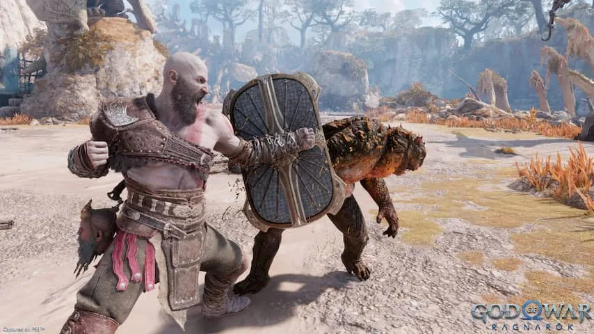

Jarenlang was _God of War_ de grote actiegamereeks van PlayStation. De Spartaan Kratos vocht zich langs alle goden op de berg Olympus en werd op termijn zelf de god van de oorlog. Het waren popcorntitels: vechtpartijen van Kratos werden flink uitvergroot, met ruim baan voor veel bloed, adrenaline en hier en daar wat gedachteloze seks.

> [!NOTE]
> Deze recensie verscheen eerder op [NU.nl](https://www.nu.nl/reviews/6233861/review-god-of-war-ragnarok-is-een-game-over-de-puberteit.html).

Daar kwam verandering in toen in 2018 een vervolg, simpelweg getiteld _God of War_, verscheen voor de PlayStation 4. In die game was een stillere, bedachtzame Kratos verhuisd naar de Scandinavische godenwereld Midgaard.

De bloeddorstige Kratos was vader geworden en worstelde daardoor met een strijd op veel kleinere schaal: het leven als alleenstaande vader. Hij probeerde zijn zoon te behoeden van de woede die hij zelf ooit voelde, terwijl hij ook worstelde om zijn oorlogsverleden een plek te geven.

## Strijd tussen vader en puber

Het nieuwe _God of War Ragnarök_ bouwt daar direct op voort. Kratos' zoon Atreus is inmiddels een puber en begint net het impulsieve gedrag te vertonen dat de vader uit zijn eigen jeugd herkent. Daarmee lijkt Kratos' grootste angst iets dichterbij: dat zijn zoon dezelfde jonge strijder wordt die in de eerste games Olympus uitmoordde. Maar Kratos heeft moeite zijn zorgen goed te verwoorden naar zijn zoon.

Ondertussen dreigt er ook een nieuw kwaad: de Noorse god Odin valt het huis van Kratos en Atreus binnen en begint daarmee een strijd die de hele game voortduurt. Maar dat grootse, mythische spektakel woedt op de achtergrond, terwijl juist de verhouding tussen Kratos en Atreus centraal staat.

Het is een intiem, persoonlijk verhaal. Zoals in veel moderne games is alles in _God of War_ uitgespeeld door acteurs in speciale pakken. In dit geval resulteert het in een game die voelt als een goede film of tv-serie.

## In de kern net als in 2018

Speltechnisch is er niet veel veranderd sinds 2018. Kratos speelt nog grotendeels hetzelfde als in het vorige deel en hakt met onder meer een bijl vijanden aan gort. Hoewel er weinig nieuws is aan het vechtsysteem, zit het vier jaar later nog steeds geweldig in elkaar. Gevechten voelen spannend en vergen opperste concentratie. Blind op de knoppen rammen loont zelden en winst voelt altijd verdiend.

Tussen de gevechten door verken je mythische Scandinavische gebieden door te lopen, springen en puzzels op te lossen. Hoewel je de gamewereld later wat vrijer kunt verkennen, bewandel je het merendeel van je tijd één groot lineair pad.

## Puzzels soms frustrerend en soms geweldig

De puzzels die je daarbij aantreft, voelen sfeervol aan. Maar als je even niet weet wat je moet doen, leiden ze snel tot frustratie. De makers willen dat je alles op een specifieke manier oplost, en als je die manier niet hebt ontdekt is het alsof je tegen een stenen muur aanloopt.

Maar als je wel op dezelfde golflengte met de gameontwerpers zit, pakken die puzzels vaak geweldig uit. Het voelt dan alsof je een groot mysterie ontdekt in een tempel uit een Indiana Jones-film. Omdat de game een lineair pad bewandelt, is ook bijna iedere puzzel uniek, wat voorkomt dat de verveling toeslaat.

_Review: God of War Ragnarök is een game over de puberteit — Beeld: Sony_

## Conclusie

_God of War Ragnarök_ is meer van wat we in 2018 zagen bij _God of War_. Dat ook dit vervolg spannend en meeslepend is, laat vooral zien dat die vorige game uit 2018 zijn tijd vooruit was.

Net als in de voorganger vertelt _Ragnarök_ een openhartig verhaal, ditmaal over hoe tijdens de puberteit de relatie tussen ouder en kind onder druk komt te staan. Het is buitengewoon bijzonder dat actiegames als deze, die lang geleden bekendstonden om hun overdreven geweld, zo'n intiem portret kunnen schilderen.
