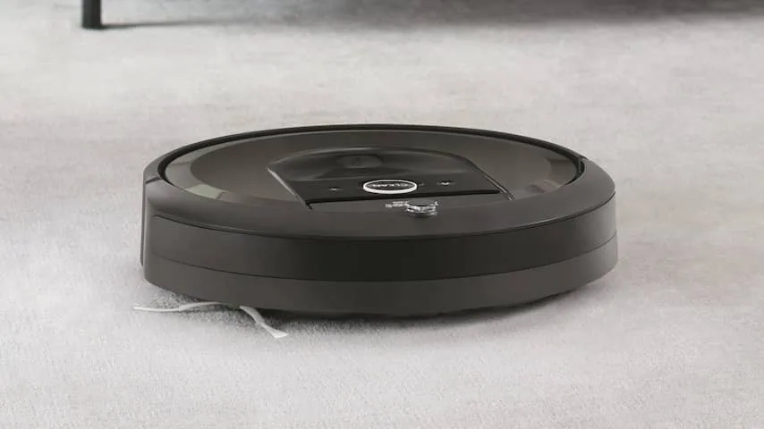
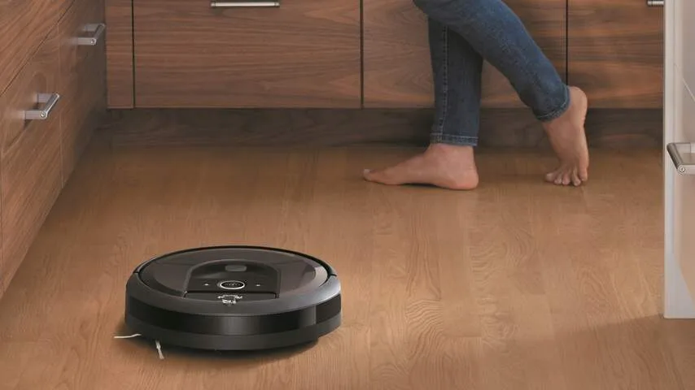
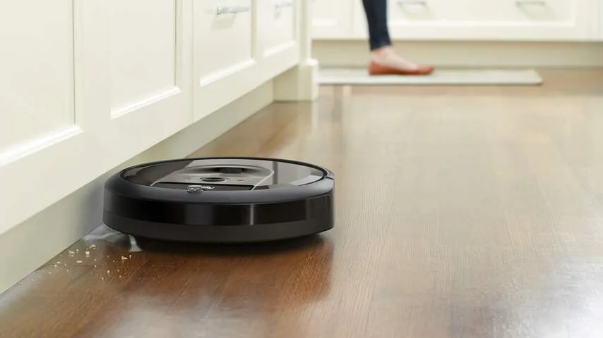
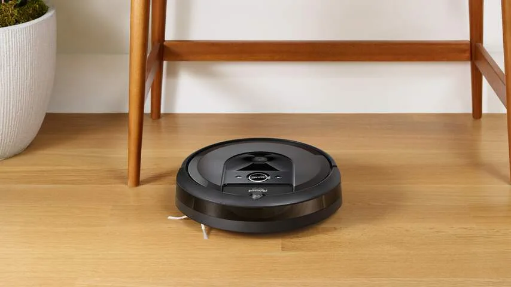
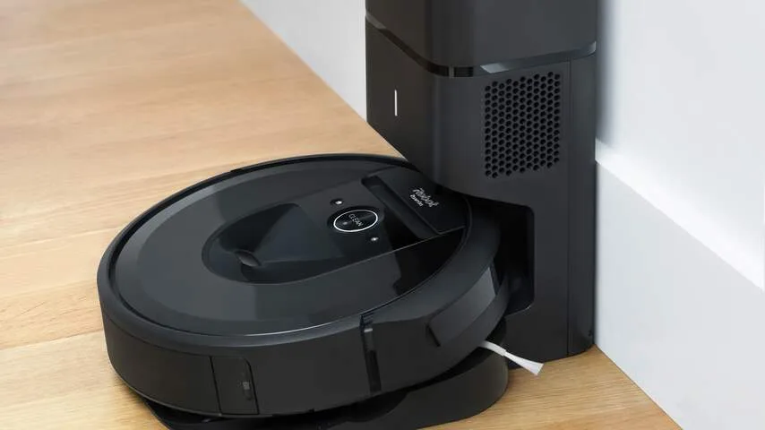

Roomba’s proberen de afgelopen jaren een idee te krijgen van hoe je huis er precies uitziet. Dat gebeurde tijdens een schoonmaakbeurt, zodat ze niet per ongeluk tegen bijvoorbeeld een tafelpoot aanreden. Achteraf werd deze geïmproviseerde kaart van het huis weer verwijderd.

> [!NOTE]
> Deze recensie verscheen eerder op [NU.nl](https://www.nu.nl/gadgets/5827920/review-hoe-slim-is-een-roomba-stofzuiger-die-je-huis-in-kaart-brengt.html).

Bij de nieuwe Roomba i7 wordt die huisinformatie voor het eerst opgeslagen, zodat de robot bij een volgend rondje in huis meteen weet hoe hij het beste kan rondrijden. Bij iedere rit leert hij de kamer iets beter kennen en wordt de kaart van het huis aangevuld.

Bij een reviewperiode van ongeveer een maand hebben we gekeken hoe dat leerproces precies in zijn werk gaat. Hoeveel slimmer wordt de i7 naarmate je hem langer gebruikt? En zorgt die kaart van je huis ook voor een flinke tijdswinst tijdens het stofzuigen?

## Drie ritten om slimmer te worden

Bij een eerste rit door de kamer begint de i7 meteen al met het maken van een plattegrond. In de bijbehorende smartphone-app krijg je een ruwe indicatie te zien van waar de muren zich bevinden, die na meerdere ritten langzaamaan duidelijker wordt.

Bij de eerste kaartloze rit door een woonkamer deed de i7 er bij ons ongeveer een uur over om de gehele vloer te reinigen. Daarmee is het apparaat ongeveer even snel als de wat oudere 'domme' Roomba-robot die we hebben, die zonder kaart probeert om alle hoeken van de kamer te bereiken met behulp van een schoonmaakalgoritme.

_Roomba i7 — Beeld: iRobot_

_Roomba i7 — Beeld: iRobot_

_Roomba i7 — Beeld: iRobot_

_Roomba i7 — Beeld: iRobot_

_Roomba i7 — Beeld: iRobot_

Nog eens twee ritten later begon de kaart van de woonkamer duidelijker te worden - en beweerde de smartphone-app ook dat hij met 100 procent zekerheid weet hoe de kamer er precies uitziet. Vanaf dat punt nam de tijd om de vloer schoon te maken ook af, naar ongeveer drie kwartier.

Na die eerste drie ritten is er eigenlijk weinig veranderd. De i7 gebruikte alleen de eerste paar ritten om een plattegrond te tekenen, die hij in de rest van onze testperiode ongewijzigd bleef gebruiken. De schoonmaaktijd van rond de 45 minuten is sindsdien ook niet significant afgenomen. Het lijkt er dus niet op dat de i7 naarmate je hem langer gebruikt ook veel slimmer gaat schoonmaken.

## Mist minder snel een hoekje van de kamer

We merkten wel dat de i7 aanzienlijk beter schoonmaakt dan zijn oudere, goedkopere broertje. Oude Roomba’s rijden met enige willekeur door het huis heen, waarbij een algoritme bepaalt welke kant hij de volgende keer op moet gaan. Daarbij wordt soms wel een hoekje van de kamer gemist. Dat is bij de i7 niet het geval.

De i7 weet daarnaast zonder uitzondering goed zijn thuisstation weer te bereiken na een schoonmaakbeurt. Bij goedkopere Roomba’s is dat vaak niet het geval, omdat ze na het stofzuigen verdwaald lijken te zijn of net niet goed op het station weten te rijden.

## Kamers individueel schoonmaken

Er is één manier waarop je het schoonmaakproces alsnog kunt versnellen. De plattegronden van de stofzuiger kunnen in de app worden opgedeeld in meerdere kamers. Is het vaak alleen een rotzooi in de keuken? Dan kun je de i7 vragen om alleen die ruimte schoon te maken, wat significant minder tijd in beslag neemt.

In de app is het mogelijk om op die manier complexe routines te maken. De Roomba kan bijvoorbeeld op maandag, woensdag en vrijdag de woonkamer schoonmaken, op dinsdag en donderdag de keuken stofzuigen en zaterdag de hal nog eens doorkammen.

Dat zorgt voor een aardige tijdswinst, al is het eentje om diep voor in de buidel te tasten. De i7 wordt verkocht vanaf 899 euro, terwijl de ouderwetsere stofzuiger die iets langzamer is voor ongeveer een derde van die prijs wordt aangeboden.

Een model waarbij het oplaadstation achteraf het vuil in een stofzuigerzak opslaat, kost 1.199 euro. Een relatief hoog bedrag voor een stofzuiger, waarmee je wel beperkt hoeveel onderhoud de Roomba tussentijds nodig heeft. De stofzuigerzak heeft namelijk genoeg plek voor vuil om in ons geval na een maand nog niet vervangen te hoeven worden.

## Conclusie

De i7 is sneller en efficiënter door zijn slimme kaartsysteem, en vereist in combinatie met het speciale basisstation haast geen onderhoud. Je kunt hem zonder zorgen vragen om een paar keer per week door het huis te rijden, waarbij je hem hooguit eens per maand moet onderhouden. Dat voelt deels door zijn prijs wel als een luxe: simpelere Roomba’s kosten immers een stuk minder en vereisen ook niet extreem veel werk. De voordelen moeten je wel heel veel aanspreken als je dit apparaat in huis wil halen.

_4 sterren — Beeld: NU.nl_
