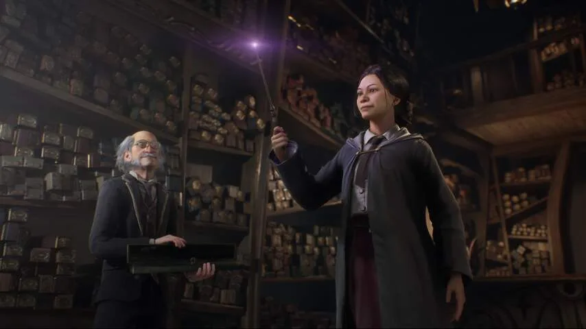

In _Hogwarts Legacy_ speel je een student op de befaamde toverschool rond het einde van de 19e eeuw. Het betekent dat personages als Harry Potter, Albus Perkamentus en Voldemort nergens te bekennen zijn.

> [!NOTE]
> Deze recensie verscheen eerder op [NU.nl](https://www.nu.nl/reviews/6250059/review-hogwarts-legacy-is-net-zo-sfeervol-als-de-harry-potter-films.html).

Het verhaal wordt in een zogeheten sandbox verteld - een grote, open gamewereld die je vrij kunt verkennen. Je kunt van missie naar missie wandelen, maar je bent ook vrij om het schoolterrein, het dorpje Hogsmeade en de omliggende bossen, bergen en velden te verkennen.

De gamewereld zit vol met verborgen schatten. Soms vind je die letterlijk in schatkisten, maar meestal moet je met je toverspreuken een kleine puzzel oplossen. Iedere gevonden schat maakt je personage iets sterker.

## Transgender-personage maken mogelijk

De game ligt al maandenlang onder een vergrootglas bij gamers. Dat komt deels door boekenschrijver J.K. Rowling, die volgens critici transfobe uitspraken heeft gedaan. Eén van de grootste gamefora ter wereld [boycot](https://www.resetera.com/threads/concerning-hogwarts-legacy-and-jk-rowling.678517/) het spel, omdat ze denken dat een deel van de omzet door Rowling wordt geïnvesteerd in het bestrijden van transrechten.

Het begin van de game laat een duidelijk tegengeluid horen. Je mag je eigen personage ontwerpen, maar _Hogwarts Legacy_ maakt een punt door je niet te laten tussen een mannelijk of vrouwelijk spelfiguur. In plaats daarvan kies je een lichaamsbouw en kapsel en bepaal je zelf of je bij de tovenaars of heksen in de slaapzaal komt te liggen.

Daar wordt later ook aan vastgehouden: je personage wordt bijvoorbeeld niet aangesproken als hij of hem, maar met het Engelse 'they'. Daarmee word je niet expliciet een genderidentiteit toegewezen.

## Net als in de films en boeken

De omgevingen rond Zweinstein zien er allemaal prachtig uit. De zalen en lokalen zijn nagenoeg identiek aan de filmvarianten. Loop je door de slaapzaal van je afdeling, dan zorgen details als opgestapelde boeken, een stomende theepot en gezellig kletsende studenten ervoor dat het warm en gezellig aanvoelt. De sfeer van Harry Potter is perfect nagemaakt.

Dialogen met studenten en leraren geven dat gevoel ook, al is het schrijfwerk van de game hier en daar wat saai. De meeste personages hebben geen duidelijke karaktereigenschappen en doen gewoon vriendelijk tegen je. Een gevoel van spanning ontbreekt wat.

Daarnaast vinden de schrijvers het lastig om het bronmateriaal los te laten. De game vind dik honderd jaar vóór het eerste boek plaats, maar de belangrijkste personages zijn meestal voorouders van de originele boekencast. Dat zijn leuke referenties, maar het zorgt dat de wereld ook wat klein voelt. Alsof al honderd jaar alles alleen om die mensen draait.

_Review: Hogwarts Legacy is net zo sfeervol als de Harry Potter-films_

## Doet niet echt iets nieuws

Speltechnisch doet _Hogwarts Legacy_ weinig echt nieuws. De manieren waarop je verkent, sterker wordt en schatten zoekt, zaten allemaal al in eerdere spellen binnen hetzelfde genre.

Daarnaast voelt het soms zelfs alsof er te veel te doen is. Je moet geheimen ontdekken, betere kleding vinden, spreuken maken en ondertussen ook door het verhaal heen spelen. De game verveelt hierdoor nooit, maar door een gebrek aan focus heeft het spel niet echt een duidelijke identiteit.

## Conclusie

De sfeer van _Hogwarts Legacy_ is perfect. De gebieden uit de films en boeken zijn nauwlettend nagemaakt en voelen ook net zo sfeervol aan. Voor fans is dat alleen al goed nieuws, want het voelt hierdoor alsof je echt door de lokalen van Zweinstein zwerft.

Inhoudelijk is de game iets minder spannend. Slecht wordt het nooit, maar het schrijfwerk blijft wat op de vlakte en speltechnisch gebeurt er niks dat we de afgelopen tien jaar niet veel vaker hebben gezien.

_Rating 3,5_
