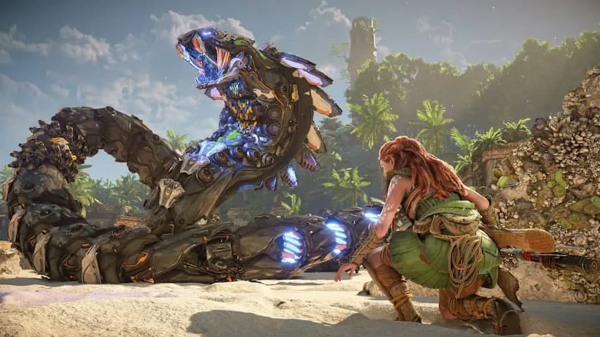

Er zijn weinig mediaproducties in ons land zo groot als die van Guerrilla Games. Het 360 man tellende bedrijf bracht in 2017 de PlayStation 4-game _Horizon Zero Dawn_ uit, waarin je als de jonge jager Aloy in een wereld vol robotdinosaurussen probeert te ontdekken waarom de gewone wereld ooit ten onder is gegaan.

> [!NOTE]
> Deze recensie verscheen eerder op [NU.nl](https://www.nu.nl/reviews/6183973/review-horizon-forbidden-west-is-de-ambitieuste-nederlandse-game-ooit.html).

_Zero Dawn_ was niet alleen de grootste game afkomstig uit Nederland, maar telt internationaal ook flink mee: inmiddels is het spel meer dan 20 miljoen keer verscheept, wat het één van de grotere hits voor de PlayStation 4 maakt.

Met _Horizon Forbidden West_ verschijnt vijf jaar na dato een volwaardig vervolg. Het is een game die vrij direct voortborduurt op wat _Zero Dawn_ zo goed maakte, waarin je moet sluipen, klimmen en vechten. Aloy moet ditmaal naar het verre westen, op jacht naar een kunstmatige intelligentie die dreigt de gehele wereld te verwoesten.

Gevechten zijn wederom een vrij riskante activiteit. Er gedachteloos op los rammen werkt zelden: in plaats daarvan moet je valstrikken zetten en uitzoeken welke zwakke plekken je precies moet raken. Het maakt de game bedachtzamer dan veel andere actietitels.

## Verticaler door de enterhaak

Dat sluipen en vechten voelt erg als in _Zero Dawn_, maar het verkennen van de spelwereld is verder uitgediept. Aloy heeft nu een enterhaak die ze kan gebruiken om bijvoorbeeld muren omver te trekken en zichzelf omhoog te torpederen.

Die enterhaak zorgt dat de gamewereld verticaler is geworden, al kun je daar slechts selectief gebruik van maken. Hij werkt alleen op bepaalde vastgrijppunten die spaarzaam over de wereld verspreid zijn. Nuttiger is een vlieger waarmee Aloy naar beneden kan zweven, zodat ze makkelijker veilig van hoge punten kan komen.

## Mooiste PlayStation 5-game

We hebben de game op de PlayStation 5 getest - er is ook een editie voor PlayStation 4 - en op deze nieuwe spelcomputer ziet de wereld er prachtig uit. Kleurrijke velden, vervallen gebouwen en complexe mist- en lichteffecten brengen een wereld tot leven die je normaal alleen in dure Hollywoodfilms verwacht. Het is de mooiste game die we tot nu toe op de PlayStation 5 hebben gezien.

Dat is ook goed te zien als je nieuwe personages ontmoet. Die zijn net als bij veel andere PlayStation-games door acteurs in pakken gespeeld, waardoor ze realistischer overkomen. Hoogwaardige texturen en gedetailleerde ogen zorgen dat ze er allemaal erg menselijk uitzien.

_Review: Horizon Forbidden West is de ambitieuste Nederlandse game ooit_

## Zijmissies zijn belangrijk

Hoewel je kan kiezen alleen het hoofdverhaal van de game te spelen, is het haast zonde om enkel dit te doen. _Forbidden West_ zit vol met zijmissies die extra glans geven aan de fictieve spelwereld: je leert meer over de belangrijkste personages en over hoe de volkeren van _Horizon_ overleven.

Dat geldt voor veel games, maar _Horizon_ zet met de postapocalyptische omgevingen en robotdino's iets unieks neer. De wereld zelf is haast interessanter dan het verhaal van de game, met alle verwijzingen naar hoe de mensheid probeerde te overleven nadat de moderne wereld ten onder was gegaan.

## Slim om eerst Zero Dawn uit te spelen

Het verhaal van _Forbidden West_ volgt zeer direct de gebeurtenissen uit _Zero Dawn_ op. Dat is goed nieuws voor fans van die eerste game: je ontdekt precies wat er na het einde is gebeurd en treft ook veel van Aloy's vrienden, die haar uitgebreid vertellen wat zij hebben gedaan.

Daar staat tegenover dat de game ontoegankelijk is voor nieuwkomers. Guerrilla heeft een filmpje gemaakt dat poogt om alle gebeurtenissen van _Zero Dawn_ samen te vatten, maar het verhaal vol apocalyptische kunstmatige intelligenties en oorlogvoerende facties is haast niet op die manier samen te vatten. Geïnteresseerden kunnen daarom beter eerst deel één spelen.

Het verhaal van _Forbidden West_ omarmt de scifi van _Zero Dawn_ nog verder en voelt over het algemeen aan als een goede actiefilm. De twists en onthullingen zijn leuk, maar zie je in de meeste gevallen al vrij snel aankomen. Hoofdrolspeler Aloy is het minst sterke element - je merkt dat haar verhaal in _Zero Dawn_ al rond was en dat de schrijvers niet weten wat ze precies met haar moeten - maar dat is slechts een klein kritiekpunt in een verder fenomenale game.

## Conclusie

_Horizon Forbidden West_ lijkt in de kern op de voorganger, maar is grootser en meeslepender. Daarnaast is het de mooiste game die we op de PlayStation 5 gespeeld hebben. Daarmee is _Forbidden West_ een prestatie op wereldniveau van deze Amsterdamse studio.

_4,5 sterren_
