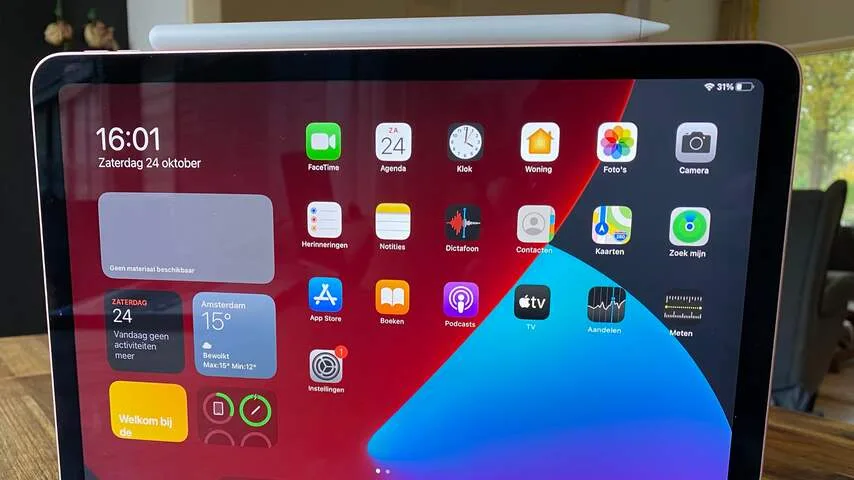
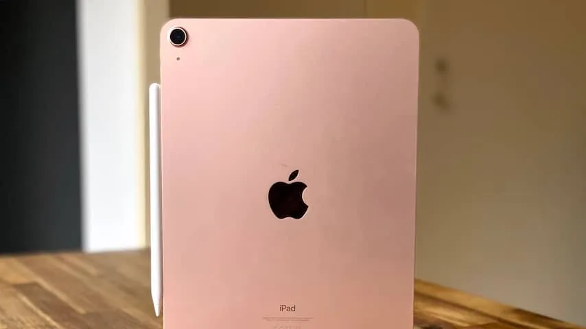
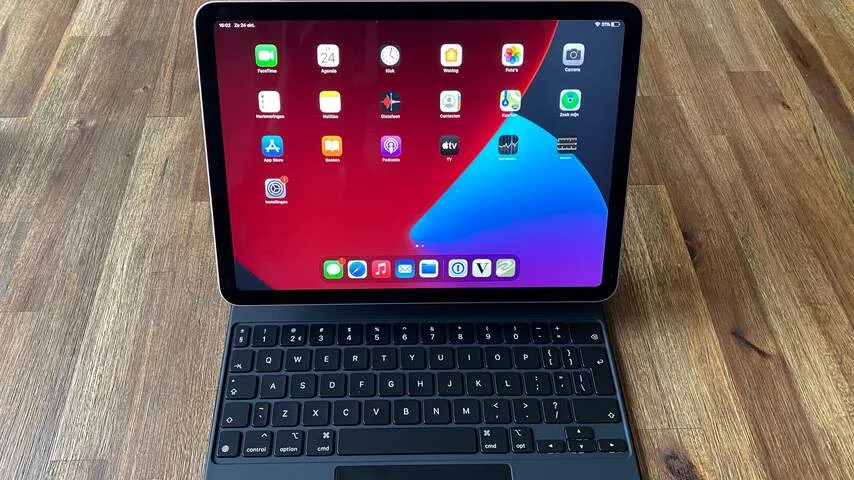

In de afgelopen tien jaar is het uiterlijk van de iPad zelden significant veranderd. De tablet had altijd dezelfde dikke randen aan de boven- en onderkant van het scherm, met aan de onderzijde een thuisknop.

> [!NOTE]
> Deze recensie verscheen eerder op [NU.nl](https://www.nu.nl/tech/6086068/review-ipad-air-2020-maakt-apples-beste-tablet-iets-betaalbaarder.html).

Met de iPad Pro in 2018 kwam daar voor het eerst verandering in. De dikke randen werden ingeruild voor een dunner alternatief. De knop onder het scherm verdween. Met de komst van een nieuwe iPad Air is dat herontwerp nu ook beschikbaar voor de wat minder dure tablets.

De nieuwe iPad Air lijkt namelijk buitengewoon veel op het duurdere Pro-model. De randen en behuizing zijn nagenoeg hetzelfde, met een scherm dat slechts 0,1 inch kleiner is. Aan de zijkanten zit een metalen band, zoals ook bij de recente iPhones 12.

_iPad Air (2020) — Beeld: NU.nl/Bastiaan Vroegop_

## Magneten voor de stylus

Aan één van de weerszijden van de tablet zitten magneten verwerkt, waar Apples los verkochte stylus kan worden gekoppeld. De pen wordt dan ook automatisch opgeladen. De aansluiting achterop de tablet kan verbinden met Apples toetsenbordhoezen.

De nieuwe Air draait op Apples A14-chip, die ook in de recent aangekondigde iPhones 12 zit. Bij alledaags gebruik draait deze all apps en games die je opent vloeiend. De ingebouwde accu houdt het volgens Apple 10 uur lang vol, wij konden op een acculading met gemak dagenlang af en toe browsen en gamen.

De vernieuwde tablet heeft ondanks het verdwijnen van de thuisknop nog steeds een vingerafdrukscanner. Die zit ditmaal verwerkt in de knop bovenop de tablet. De nieuwe Air heeft geen gezichtsherkenning zoals op de iPads Pro en recente iPhones.

_iPad Air (2020) — Beeld: NU.nl/Bastiaan Vroegop_

## Onhandige plek voor vingerlezer

De positie van de vingerlezer is wel wat onhandig. De iPad is gemaakt om in vier verschillende draaihoeken vast te houden, waardoor die knop ook op vier plekken kan zitten. Soms moet je daarom een vinger gek draaien, waardoor hij niet goed op de scanner komt.

De iPad Air heeft geen scherm met een ververssnelheid van 120 hertz, zoals wel in de iPad Pro te vinden is. Daarnaast zit op deze tablet slechts één 12 megapixel-camera achterop, terwijl de recente Pro-modellen zijn voorzien van twee lenzen. En omdat de sensoren voor gezichtsherkenning ontbreken, zit er ook geen dieptecamera aan de voorkant.

## iPad Air is geen budgettablet

Het zijn functies die alleen de meest fanatieke gebruikers zouden missen. En tegenover het gebrek hiervan staat een lagere prijs: de iPad Air wordt verkocht vanaf 669 euro, terwijl een vergelijkbare iPad Pro minstens 899 euro kost.

Onthoud wel: dat is slechts de prijs voor de iPad zelf. De bijbehorende stylus kost 135 euro, het nieuwste iPad-toetsenbord met ingebouwde trackpad kost 339 euro. Een volledig aangeklede iPad Air kost bij elkaar opgeteld dus 1.143 euro - hoewel niet al die accessoires vereist zijn.

_Review: iPad Air (2020) maakt Apples beste tablet iets betaalbaarder_

Het maakt de nieuwe iPad Air absoluut geen prijsvechter - Apple verkoopt zelf ook goedkopere tablets vanaf 389 euro. Maar het bedrijf maakt de basisprincipes achter de veel duurdere iPad Pro iets betaalbaarder - een trend die vermoedelijk op termijn doorzet naar alle modellen die de techreus verkoopt.

## Conclusie

De iPad Air pakt de belangrijkste onderdelen van de duurdere Pro en steekt ze in een iets betaalbaarder jasje. Geavanceerde extraatjes ontbreken bij deze tablet, maar zullen slechts door een kleine club mensen worden gemist. Deze nieuwe iPad Air is voor velen pro genoeg.
