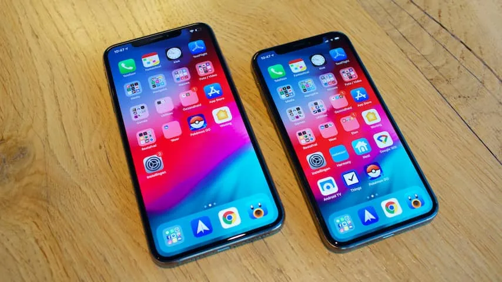
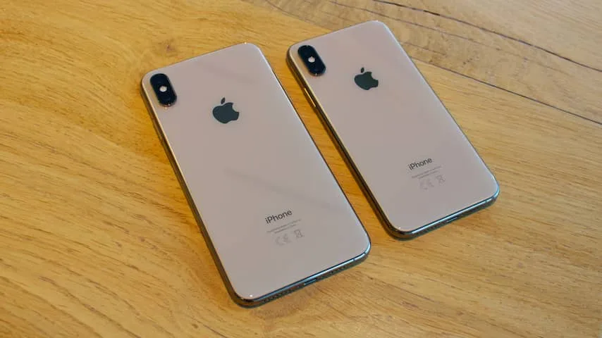
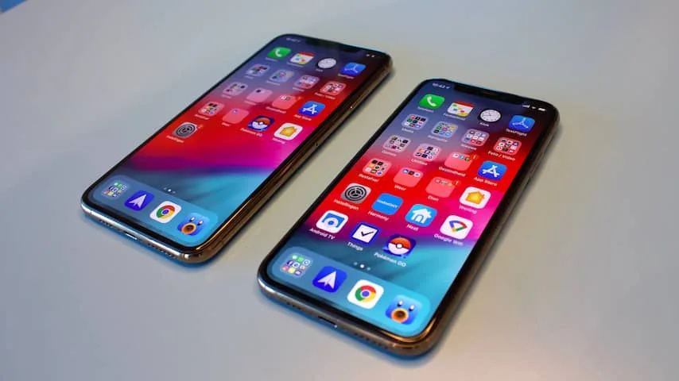
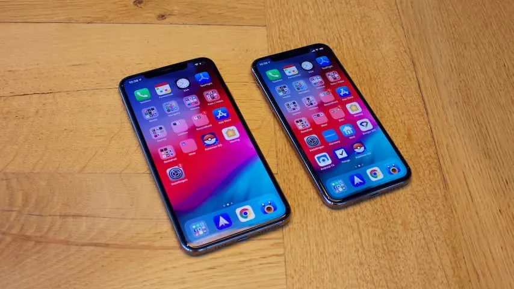
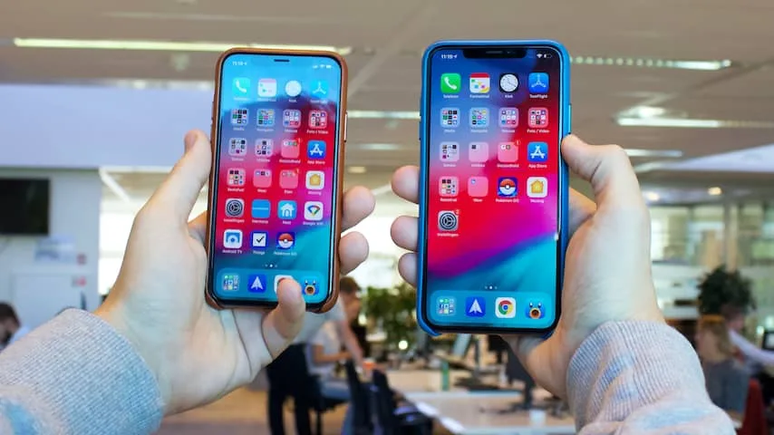

Toen Apple vorig jaar de iPhone X uitbracht, noemden we het een duur voorproefje van de toekomst. De techgigant had zijn iPhone voorzien van de grootste vernieuwing in jaren, door onder andere de schermranden weg te halen en de vingerafdrukscanner te vervangen met gezichtsherkenning.

> [!NOTE]
> Deze recensie verscheen eerder op [NU.nl](https://www.nu.nl/reviews/5467721/review-iphone-xs-verfijnt-een-goede-dure-telefoon.html).

Inmiddels zijn we een jaar verder en heeft Apple deze iPhone van een update voorzien. De iPhone XS ziet er vanbuiten haast hetzelfde uit als zijn voorganger. Het toestel is omringd met een roestvrijstalen band, terwijl de achterkant van glas is gemaakt. Van een metalen behuizing zoals bij eerdere iPhones is wederom geen sprake, omdat dit materiaal slecht werkt in combinatie met draadloos opladen.

Het scherm bedekt haast de volledige voorkant van de telefoon. Alleen aan de bovenkant zit een inkeping in het scherm, om plek te maken voor de frontcamera en sensoren voor gezichtsherkenning. De grootte van die inkeping is ook identiek aan die van de iPhone X vorig jaar.

Voor de tweede keer op rij gebruikt Apple een hoogwaardig oled-scherm dat ook prachtige beelden produceert. Zwarttinten op de iPhone zijn ook echt gitzwart, terwijl kleuren uitstekend worden weergegeven. HDR-video’s zien er fantastisch uit op het scherm. Dat moet ook wel, want het oled-scherm is het voornaamste onderscheidende punt tussen de iPhone XS en de goedkopere XR, die in oktober op de markt komt.

Apple verkoopt dit jaar wel een gouden kleuroptie naast de spacegrijze en zilveren varianten. De antenneband oogt dan wat koperachtig, terwijl de achterkant een lichtgouden tint heeft. Dat is het meest opvallende verschil: leg je een zilveren iPhone XS naast een zilveren iPhone X, dan ogen ze gelijk.

[Bekijk ingesloten media](https://content.jwplatform.com/players/2Mtp9OxQ-whqXCOFb.html)

## Een nog grotere iPhone

Dat geldt althans voor de versie van 5,8 inch. Apple heeft voor het eerst een iPhone met een scherm van maar liefst 6,5 inch gemaakt. Die is qua omvang even groot als de iPhone 8 Plus van afgelopen jaar, maar dan zonder de schermranden van dat toestel.

Je zou denken dat deze iPhone XS Max minder lomp zou aanvoelen dan de 8 Plus, maar het tegendeel is waar. Omdat de smartphone geen schermranden heeft, heb je hem vaak iets lager vast. Je moet immers ook de onderkant van het scherm bereiken. Tegelijkertijd is het scherm hoger omdat de bovenrand mist.

Het betekent in de praktijk dat je slechts een klein gedeelte van het scherm met je duim kan bereiken. Dat was bij de 8 Plus ook al het geval, maar was bij dit toestel minder extreem, omdat je de boven- en onderranden nooit hoefde aan te raken.

De XS Max voelt als een telefoon die je haast nooit met slechts één hand kunt bedienen - waardoor de handzaamheid van een smartphone verdwijnt. Bovendien voelt hij een stuk zwaarder dan de XS, omdat er hoger in de telefoon meer gewicht zit door het grote formaat.

De iPhone XS en XS Max zijn voorzien van een snellere A12-chip, al is de rauwe snelheidsverhoging niet heel erg merkbaar in vergelijking met zijn voorganger. De telefoon start apps en games razendsnel op - maar dat doet de iPhone X ook nog steeds.

## Neurale processor moet functies versnellen

Een groot deel van Apples onderzoek lijkt echter te zijn gegaan naar de neurale processor, die berekeningen maakt voor kunstmatige intelligenties (AI's). De nieuwe neurale chip is volgens Apple negen keer sneller dan de chip in de iPhone X.

Die AI-technologie wordt onder andere ingezet voor de gezichtsherkenning van de iPhone, die volgens de techgigant aanzienlijk sneller is. Bij onze tests is het verschil nog niet gigantisch groot: de telefoon ontgrendelt gemiddeld in iets minder dan een tiende van een seconde, en een kwart van een seconde in het donker.

Die snelheid kan op termijn verbeteren, naarmate de kunstmatige intelligentie meer kansen krijgt om je gezicht te bekijken. Elke keer als de telefoon je niet herkent en je succesvol een codeslot invoert, wordt je interne gezichtsprofiel namelijk aangepast. De effecten hiervan zijn pas na weken of zelfs maanden echt duidelijk.

Die versnelling is een heel klein beetje voelbaar. Het ontgrendelen van de iPhone voelt soepeler, en we hadden het idee dat we minder vaak last hadden van foutmeldingen. Het is een stap in de goede richting: weet Apple een punt te bereiken waarop Face ID nog sneller en foutloos werkt, dan kan je telefoon ooit zichzelf ontgrendelen zonder dat je dat überhaupt merkt.

_Review: iPhone XS verfijnt een goede, dure telefoon — Beeld: NU.nl/Floris Poort_

_Review: iPhone XS verfijnt een goede, dure telefoon — Beeld: NU.nl/Floris Poort_

_Review: iPhone XS verfijnt een goede, dure telefoon — Beeld: NU.nl/Floris Poort_

_Review: iPhone XS verfijnt een goede, dure telefoon — Beeld: NU.nl/Floris Poort_

_iPhone XS — Beeld: NU.nl/Floris Poort_

## Een HDR-functie met kunstmatige intelligentie

De 12-megapixelcamera van de iPhone XS is qua specificaties grotendeels gelijk gebleven aan die van de iPhone X, al is de onderliggende sensor iets gegroeid. De verbeteringen bij deze camera zitten vooral op softwareniveau, grotendeels door de eerder genoemde AI-chip. De HDR-functie is bijvoorbeeld verbeterd, waarbij nog meer foto's met verschillende belichtingen tegelijkertijd worden gemaakt. Deze beelden worden gefuseerd, om één foto samen te stellen met de optimale lichtomstandigheden.

Bij onze tests komt dat vaak bijzonder goed uit de verf. Foto's genomen vanuit beschaduwde hoeken met de felle zon op de achtergrond, zien er op alle punten goed belicht uit. Dat terwijl dezelfde foto's op de iPhone X vaak een onderbelichte voorgrond hadden, of een overbelichte achtergrond. Indrukwekkend, gezien de iPhone X al een 'gewone' HDR-functie had.

## Zelf bepaalde scherptediepte in portretten

De portretfunctie van eerdere iPhones keert terug, maar nu met de mogelijkheid om de scherptediepte achteraf aan te passen. Een achtergrond kan volledig onscherp of slechts een beetje wazig worden gemaakt. Een leuke toevoeging, gezien de scherptediepte juist de grootste meerwaarde van de portretfunctie is.

Bij het opnemen van video's gebruikt de camera voortaan de stereomicrofoons. Hierdoor ontstaat een overwegend voller geluid - en we hadden bij het afspelen van gemaakte beelden zelfs het idee dat er diepte te bespeuren was. De iPhone X nam op zijn beurt ‘gewoon’ in mono op.

Eén punt waarop de iPhone XS zich echt weet te onderscheiden, is de dualsimoptie. Hierdoor kan je twee telefoonnummers en abonnementen in één telefoon gebruiken. Maar: één van die twee simkaarten moet wel een zogeheten eSIM zijn, een digitale simkaart die op het moment nog niet in Nederland wordt aangeboden. Hier hadden we bij onze tests dus nog niks aan.

Apple belooft langere batterijduur - en zowel de iPhone X als XS Max wisten die belofte grotendeels waar te maken. We konden de XS Max een dag lang normaal gebruiken, waarbij we vooral sociale media gebruikten, video’s bekeken en mails beantwoordden. Zelfs aan het einde van zo’n dag hing de batterij rond de 50 procent. We vermoeden dat je zelfs bij intensiever gebruik niet snel in de problemen zult komen.

## Conclusie

De vernieuwingen bij de iPhone XS en XS Max zitten echt in de details. De telefoon is ietsje sneller, maakt iets mooiere HDR-foto's en biedt een licht verbeterde gebruiksduur. Het zijn verschillen die je pas echt opmerkt als je 'm actief met de iPhone X gaat vergelijken. De versnelde gezichtsherkenning is wel veelbelovend: het laat zien dat Apple deze technologie wil versoepelen, waardoor deze op termijn echt feilloos kan gaan aanvoelen.

De prijs ligt voor een smartphone nog wel bijzonder hoog: je koopt de iPhone XS vanaf 1.159 euro. Dat terwijl de duurste Android-concurrentie rond de duizend euro blijft kleven. Vorig jaar was dat al duur bij de iPhone X, en een jaar later is deze prijs nog iets lastiger te verkroppen. Dat is deels ook door de iPhone XR, die in oktober verschijnt voor 300 euro minder en functies zoals de gezichtsherkenning biedt.

Dat maakt de iPhone XS een telefoon voor de fijnproever. Voor de telefoongebruiker die koste wat kost een oled-scherm met diepere zwartwaarden wil hebben in een telefoon. Voor die persoon is dit een uitstekende telefoon die zich nog weet te meten met de beste toestellen op de markt - maar een koopje is het niet.

_4 sterren — Beeld: NU.nl_
