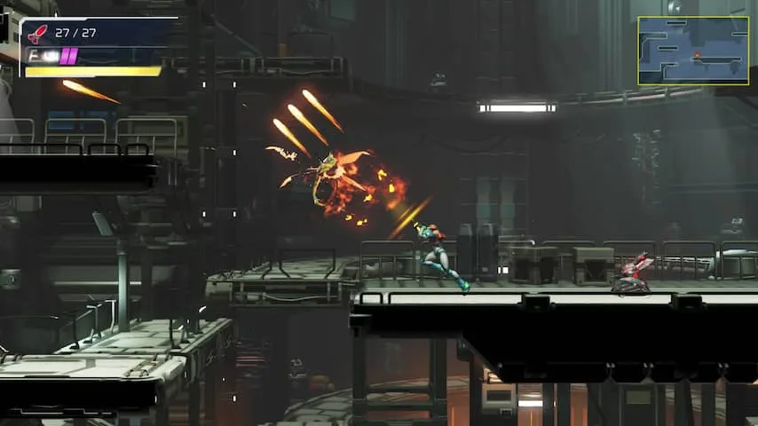

De eerste _Metroid_ verscheen eind jaren tachtig. Het spel was spraakmakend, omdat dit een van de eerste actiespellen met een vrouwelijke hoofdrolspeler was. Het derde deel _Super Metroid_ zette de serie op de kaart met een gamewereld die vrijer aanvoelde. Spelers konden verdwalen, maar ook afwijken van de gebruikelijke route.

> [!NOTE]
> Deze recensie verscheen eerder op [NU.nl](https://www.nu.nl/reviews/6160894/review-metroid-dread-is-een-van-de-beste-2d-actiegames-in-jaren.html).

Na de release van _Metroid Fusion_ in 2002 (op de Game Boy Advance) kreeg de gamereeks relatief weinig liefde van Nintendo. Er verschenen enkel spin-offs, zoals de _Prime_\-games op de GameCube en Wii, maar het overkoepelende verhaal werd niet voortgezet. Dat verandert nu met het verschijnen van _Metroid Dread_.

Het verhaal in _Dread_ gaat direct na de gebeurtenissen van _Fusion_ verder. Daarmee vereist het spel nogal wat voorkennis. Een introductiefilmpje probeert de eerste drie games zo kort mogelijk samen te vatten, maar de video is overdonderend door de vele scifitermen en plotwendingen.

Samus wordt aan het begin van _Dread_ wakker. Het personage zit diep in een groot gangenstelsel van een planeet waar ze een missie probeerde te voltooien. Samus raakte zowel haar krachten als geheugen kwijt toen ze probeerde een mysterieuze vijand uit te schakelen. Nu moet ze weer de weg naar haar schip vinden.

## Minder vrij dan een oude Metroid-game

_Dread_ lijkt op het eerste gezicht op de vorige games. Je verkent een grote 2D-spelwereld, waarin sommige locaties alleen te bereiken zijn door een speciale power-up te halen. Zo moet Samus leren om in een bal te transformeren om in nauwe paden te passen. Ook kan ze met raketten deuren kapotschieten om speciale kamers te betreden.

In eerdere games raakte je vaak verdwaald, totdat je een nieuwe kracht tegenkwam waarmee je wellicht een nieuwe plek kon bereiken. _Dread_ is meer afgekaderd: vaak is er maar één route naar een upgrade te volgen, waarna er weer een specifieke route is naar de plek waar je die kunt gebruiken.

Dat is goed nieuws voor gamers met een slecht richtingsgevoel, maar daarmee is de vrijheid ook verloren gegaan. Afwijken van de gebaande paden doe je hooguit als je wat optionele upgrades wil vinden.

_Review: Metroid Dread is een van de beste 2D-actiegames in jaren — Beeld: Nintendo_

## Het tegenoverstelde van een Nintendo-game

Samus komt in haar ondergrondse trektocht bijna niemand tegen. Af en toe spreekt ze met de computer die in haar schip geïnstalleerd is. Die herinnert haar er continu aan dat haar overlevingskansen gering zijn.

Vroeg in de game loopt Samus de E.M.M.I tegen het lijf: onoverwinnelijke robotjagers die haar met één klap kunnen vermoorden. Die moet ze dus vermijden en dat is de eerste keer zelfs een beetje eng.

Het maakt de sfeer kil en onvriendelijk, het tegenovergestelde van wat we bij Nintendo gewend zijn. Het voelt alsof iedereen je dood wil hebben.

[Bekijk ingesloten media](https://content.jwplatform.com/players/JMaoACrt-whqXCOFb.html)

## Blijft altijd spannend

Gaandeweg vindt Samus haar arsenaal terug en krijgt de speler meer ademruimte. Met steeds krachtigere raketten schakel je monsters makkelijker uit en kun je eerder dodelijke gebieden probleemloos verkennen.

Je voelt je steeds een beetje onsterfelijker, totdat je een supermoeilijke eindbaas tegen het lijf loopt. Bij sommige vijanden waren we tientallen minuten bezig voordat we ze wisten te verslaan. Het zorgt dat de game altijd, ongeacht hoe sterk Samus is, spannend blijft.

## E.M.M.I worden saai

Die eerder genoemde E.M.M.I worden op termijn minder intens. In het begin van de game zijn het enge Terminators, maar al vrij snel leert Samus om onzichtbaar te worden. Vanaf dat punt is het vermijden van de jagers slechts een beetje gedoe.

Later leer je om de E.M.M.I met een speciale laserstraal uit te schakelen, maar dit proces gaat gepaard met een wat irritant schietspelletje. Verreweg het minst leuke deel van het spel, maar gelukkig zijn er slechts zeven van deze robots om te vermijden en doden.

Daarmee is dat slechts een klein deel van een verder prima actiegame. De besturing van _Metroid Dread_ zit ook ijzersterk in elkaar, waardoor verkennen en vechten altijd fijn aanvoelt.

## Conclusie

_Metroid Dread_ is een uitstekend actiespel, dat wel wat lineairder is dan we bij de klassieke Nintendo-serie hadden gehoopt. Maar zodra je accepteert dat _Dread_ simpelweg een ander soort game is dan zijn voorgangers, heb je één van de beste 2D-titels van de afgelopen jaren in handen.

_4,5 sterren_
