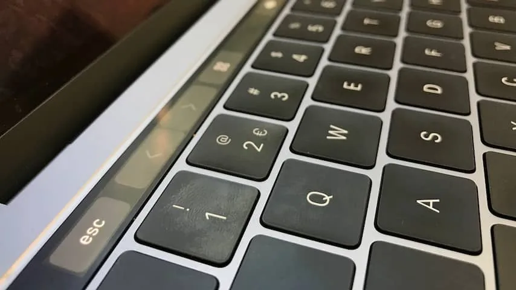
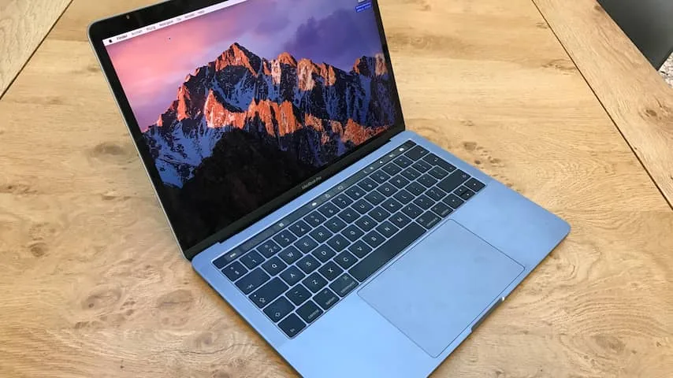
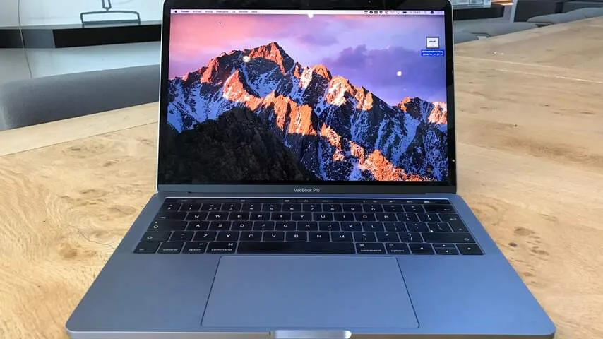

Apple heeft zijn nieuwste MacBook van de gebruikelijke vernieuwingen voorzien. De laptop is dunner en lichter dan zijn voorganger, met onder het toetsenbord een grotere trackpad.

> [!NOTE]
> Deze recensie verscheen eerder op [NU.nl](https://www.nu.nl/reviews/4356299/review-nieuwe-macbook-pro-met-touch-bar-is-nog-wat-rommelig.html).

De Mac heeft een retinascherm en wordt bij het Touch Bar-model geleverd met minstens een 2,9 GHz-dualcoreprocessor en 8GB werkgeheugen. Dat maakt de laptop krachtig genoeg voor het meeste zware werk zoals video’s bewerken.

Bij onze tests konden we zelfs een paar spellen redelijk draaien, waaronder _BioShock Infinite_. Nieuwere of mooiere titels deden het minder vaak goed, waardoor de laptop niet lijkt voorbereid op toekomstige games. Net als bij eerdere MacBooks geldt: dit is niet een apparaat om te kopen voor gaming.

## Touch Bar

De ouderwetse F-knoppen bovenaan het toetsenbord zijn verouderd, aldus Apple. Het bedrijf heeft zijn nieuwste MacBook-reeks daarom voorzien van de Touch Bar: een langwerpig aanraakscherm waarop contextgevoelige knoppen verschijnen.

De aanraakknoppen vervangen de oude functieknoppen van de MacBook. Zo is het mogelijk om met schuifbalken de schermhelderheid en het volume aan te passen, of met een enkele knopdruk het geluid uit te zetten.

Vanuit de instellingen van macOS kunnen de getoonde knoppen worden veranderd. Er kan bijvoorbeeld een cameraknop worden toegevoegd om snel screenshots mee te maken, of een slot om de schermvergrendeling snel mee te starten.

Het langwerpige scherm komt echter pas tot zijn recht binnen andere apps. De linkerzijde van de balk verandert namelijk op basis van het geopende programma. In tekstverwerker Pages duiken snelle knoppen op om de opmaak van tekst te veranderen. Wie in de Berichten-app een iMessage schrijft, krijgt een knop om snel emoji tevoorschijn te halen.

**_Video: Zo werkt de Touch Bar van de MacBook Pro_**

[Bekijk ingesloten media](https://content.jwplatform.com/players/nYJsfMaf-whqXCOFb.html)

## Onhandig

Helaas is de implementatie van de Touch Bar vaak wat onhandig. Veel apps tonen simpele knoppen op de Touch Bar, waarvan de functies makkelijker met een knop op het normale toetsenbord te gebruiken zijn.

Iedere app kan de Touch Bar op een net wat andere manier gebruiken, waardoor de balk wat verwarrend wordt. Je weet nooit precies wat je kunt verwachten bij het wisselen tussen apps. Zelfs na een week moest ik nog constant naar beneden kijken, om te zien welke knoppen er nu weer waren verschenen.

Sommige functies komen wel geregeld voorbij, zoals de woordsuggesties bij het schrijven van Engelse teksten. Een functie die rechtstreeks van het iPhone-toetsenbord voorbijkomt, met één wezenlijk verschil: wie blind typt op een laptop, zal nooit bewust naar het toetsenbord kijken en de suggesties gebruiken.

Wel handig is de tijdlijn die bij sommige video-apps en bij webfilmpjes in Safari wordt getoond. Hiermee kan er door de tijdlijn van een video worden gesprongen door over de aanraakbalk te schuiven. Er verschijnen daarom geen knoppen in beeld als een video in volledig scherm wordt afgespeeld.

## Vingerafdruk

De Touch ID-vingerafdruklezer aan de rechterzijde van de aanraakbalk kwam vaker van pas. Met deze knop kan net als op een iPhone een vingertop worden gescand, die in plaats van een wachtwoord benut kan worden. Hiermee kan de Mac worden ontgrendeld of met Apple Pay worden betaald, als die betaaldienst ooit in Nederland beschikbaar komt.

Andere apps mogen ook de vingerlezer gebruiken - wat het gebruik van een wachtwoordmanager zoals 1Password gemakkelijker maakt. Daarnaast is het ontgrendelen van de Mac hierdoor simpeler. Door de vinger op de scanner te leggen terwijl hij ontwaakt, wordt het apparaat gestart zonder dat er tussendoor actief een wachtwoord ingevoerd hoeft te worden. Hierdoor hoeft er niet meer gewacht te worden op het moment dat een wachtwoord ingetikt kan worden.

_MacBook Pro (2016) — Beeld: NU.nl/Bastiaan Vroegop_

_MacBook Pro (2016) — Beeld: NU.nl/Bastiaan Vroegop_

_MacBook Pro (2016) — Beeld: NU.nl/Bastiaan Vroegop_

## Vier keer USB-C

Aan iedere zijkant van de nieuwe MacBook zitten twee USB-C-poorten, waar zowel de oplader als apparaten op aangesloten kunnen worden.

De bezwaren die bestonden bij de 12-inch MacBook ([review](http://www.nu.nl/reviews/4048430/review-peperdure-en-compacte-macbook-met-nieuw-toetsenbord.html)) zijn bij de Pro nog steeds aanwezig. Door de aansluitingen terug te brengen naar enkel USB-C, is voor veel gangbare apparatuur zoals beeldschermen en USB-sticks een speciale adapter nodig.

Apple investeert daarmee in de toekomst. Het bedrijf lijkt te geloven dat USB-C op een dag de dominante aansluittechnologie is, waardoor andere poorten zoals HDMI en traditionele USB 3.0 niet langer nodig zijn. Die toekomst lijkt echter ver weg. Anderhalf jaar nadat de kleine broer van deze MacBook hetzelfde initiatief nam, heeft het gros van onze apparaten nog geen USB-C-kabel.

Het ontbreken van HDMI en een SD-kaartlezer is op een 'Pro'-apparaat daarom ook moeilijk te accepteren. Met een prijs van minstens tweeduizend euro richt deze laptop zich voornamelijk op professionals die bijvoorbeeld video’s monteren. Professionals die nu nog eens honderden euro’s kwijt kunnen zijn aan een verzameling aansluitkabels, om hun bestaande apparatuur te laten werken.

Het gebruik van USB-C kan op termijn fijn zijn. Zo maakt Apple bijvoorbeeld samen met LG een speciaal 5K-scherm, die via USB-C meteen ook de laptop van stroom kan voorzien. Hierdoor is er slechts één aansluitkabel nodig. Voor de meeste gebruikers is dit soort gestroomlijnd gebruik echter toekomstmuziek. USB-C is nog lang niet de norm.

## Conclusie

Het idee achter de Touch Bar is veelbelovend: een contextgevoelig aanraakscherm kan bepaalde snelkoppelingen immers makkelijk bereikbaar maken. De huidige uitvoering van de nieuwste MacBook-functionaliteit is echter wat rommelig. Apps maken allemaal net wat anders gebruik van het aanraakscherm en het display biedt geen fysieke feedback, waardoor er altijd naar beneden gekeken moet worden bij gebruik ervan.

Voeg daar de onhandige USB-C-poorten en hogere prijskaart aan toe en je hebt een laptop die niet voor iedereen is weggelegd. Het is wachten totdat softwareontwikkelaars goede toepassingen voor de Touch Bar vinden en USB-C meer is ingeburgerd, voordat we de waarde van de aanpassingen en toevoegingen gaan zien.

Wie amper USB-apparatuur gebruikt en simpelweg een nieuwe, snellere MacBook wilde, zal wel genoeg reden hebben om snel de overstap te maken.
